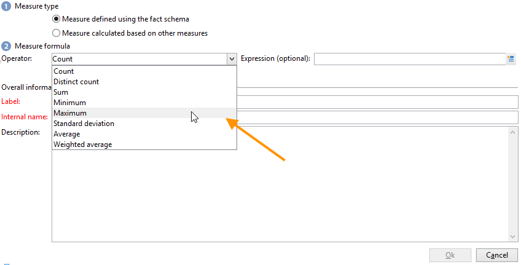
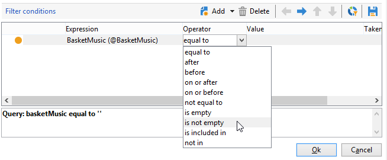

# 自訂立方體{#cube-custom}

## 資料綁定 {#data-binning}

使用資料捆綁，根據條件將值分組以簡化資料顯示。 根據您可用的資訊，您可以定義年齡群組、將電子郵件網域群組在一起、限制為值列舉、明確限制資料以顯示，以及將所有其他資料分組在專用的行或欄中等。

總的來說，有三種類型的捆綁：

1. 使用手動定義的值範圍。 例如年齡、平均購物車、已開啟的傳送數量等)。 有關詳細資訊，請參閱 [定義每個儲存箱](#defining-each-bin).
1. 動態，視列舉的值而定：只顯示枚舉中包含的值，所有其他值將分組到「其他」中。 有關詳細資訊，請參閱 [動態管理Bin](#dynamically-managing-bins).
1. 使用值範圍，將所有其他項目分組在一起。 例如，18到25歲，26到59歲，以及其他。 有關詳細資訊，請參閱 [建立值範圍](#creating-value-ranges).

要啟用綁定，請在建立維時選中相應的框。

您可以手動建立Bin，或將其連結至現有的分項清單。

Adobe Campaign也提供自動二進位助理：值可以劃分為N個群組，或根據資料庫中最頻繁的值分組。

### 定義每個Bin {#define-each-bin}

若要個別建立每個儲存箱，請選取 **[!UICONTROL Define each bin]** 選項，然後使用表格建立各種框。

按一下 **[!UICONTROL Add]** 按鈕建立新的框，並列出將分組到框中的值。

在以下範例中，語言分為三個類別：英文/德文/荷蘭文、法文/義大利文/西班牙文和其他文字。

您可以使用SQL掩碼將多個值合併到篩選器中。 要執行此操作，請檢查 **[!UICONTROL Yes]** 在 **[!UICONTROL Use an SQL mask]** 欄，並輸入要在 **[!UICONTROL Value or expression]** 欄。

<!--In the example below, all email domains that start with **yahoo** (yahoo.fr, yahoo.com, yahoo.be, etc.), or with **ymail** (ymail.com, ymail.eu, etc.) will be grouped under the label **YAHOO!**, as well as addresses with the **rocketmail.com** domain.-->

### 動態管理Bin {#dynamically-manage-bins}

值可透過列舉來動態管理。 這表示只會顯示分項清單中包含的值。 當枚舉值更改時，立方的內容會自動調整。

要建立此類型的值綁定，請應用以下步驟：

1. 建立新維並啟用綁定。
1. 選取 **[!UICONTROL Dynamically link the values to an enumeration]** 選項，然後選取相符的分項清單。

   

   每當枚舉值更新時，匹配框都自動調整。

### 建立值範圍 {#create-value-ranges}

您可以根據所需的間隔將值分組為範圍。

若要手動定義範圍，請按一下 **[!UICONTROL Add]** 按鈕並選取 **[!UICONTROL Define a range]** :

然後指定上下限，然後按一下 **[!UICONTROL Ok]** 確認。

### 自動生成箱 {#generate-bins-automatically}

還可以自動生成垃圾箱。 若要這麼做，請按一下 **[!UICONTROL Generate bins...]** 連結。

您可以：

* **[!UICONTROL Recover the most frequently used values]**

   如果您產生4個垃圾桶，則會顯示4個最常使用的值，而其他值則會計入「其他」類別並分組。

* **[!UICONTROL Generate bins in the form of slots]**

   對於相同範例，Adobe Campaign會自動建立4個相同大小的值槽，以顯示資料庫中的值。

在這種情況下，會忽略事實架構中選取的篩選器。

### 分項清單 {#enumerations}

為了改善報表的相關性和可讀性，Adobe Campaign可讓您建立特定列舉，將不同的值重新分組至相同的資料夾。 這些枚舉保留用於綁定，在多維資料集中引用，然後顯示在報告中。

Adobe Campaign也提供網域分項清單，讓您顯示資料庫中所有連絡人的電子郵件網域清單（依ISP重新分組），如下列範例所示：

使用下列範本建立：

若要使用此列舉建立報表，請使用 **[!UICONTROL Email domain]** 維度。 選擇 **[!UICONTROL Enable binning]** 選項，然後 **[!UICONTROL Dynamically link the values to an enumeration]**. 然後選取 **網域** 列舉，如上所示。 所有沒有指定別名的值將在 **其他** 標籤。

接下來，根據此多維資料集建立報告以顯示值。

您只需要修改列舉即可更新相關報表。 例如，建立 **Adobe** 值並新增 **adobe.com** 別名，則報表會以分項清單層級的Adobe值自動更新。

此 **[!UICONTROL Domains]** 分項清單可用來產生內建報表，以顯示網域清單。 若要調整這些報表的內容，您可以編輯此清單。

您可以建立保留用於綁定的其他枚舉，並在其他多維資料集中使用這些枚舉：所有別名值將在第一個枚舉標籤中指定的bin中重新分組。

## 立方體中的匯總 {#calculate-and-use-aggregates}

可以在聚合中計算最大的資料卷。

在處理大量資料時，聚合很有用。 系統會根據專用工作流程方塊中定義的設定自動更新這些資料，以將最近收集的資料整合至指標中

匯總會在每個多維資料集的相關索引標籤中定義。

>[!NOTE]
>
>用於更新聚合計算的工作流可以在聚合本身中配置，或者可以通過連結到相關多維資料集的外部工作流來更新聚合。

要建立新聚合，請應用以下步驟：

1. 按一下 **[!UICONTROL Aggregates]** 索引標籤，然後按一下 **[!UICONTROL Add]** 按鈕。
1. 輸入匯總的標籤，然後新增要計算的維度。
1. 選取維度和層級。 對每個維度和每個層級重複執行此程式。
1. 按一下 **[!UICONTROL Workflow]** 頁簽，以建立匯總工作流。

   * 此 **[!UICONTROL Scheduler]** 活動可讓您定義計算更新的頻率。 排程器在 [本節](../../automation/workflow/scheduler.md).
   * 此 **[!UICONTROL Aggregate update]** 活動可讓您選取要套用的更新模式：完整或部分。

      依預設，會在每次計算期間執行完整更新。 要啟用部分更新，請選擇相關選項並定義更新條件。

## 定義測量 {#define-measures}

測量類型定義於 **[!UICONTROL Measures]** 多維資料集的頁簽。 您可以計算和、平均值、偏差等。

您可以視需要建立任意數量的測量：然後，選擇要在表中顯示或隱藏的度量。 如需詳細資訊，請參閱[本章節](#displaying-measures)。

要定義新測量，請應用以下步驟：

1. 按一下 **[!UICONTROL Add]** 按鈕（位於度量清單上），並選擇要計算的度量類型和公式。

   

1. 如有必要，並根據運算子，選擇操作所關注的運算式。

   此 **[!UICONTROL Advanced selection]** 按鈕可讓您建立複雜的計算公式。 如需詳細資訊，請參閱[本章節](../../automation/workflow/query.md)。

1. 此 **[!UICONTROL Filter the measure data...]** 連結可讓您限制計算欄位，並僅將其套用至資料庫中的特定資料。

   

1. 輸入度量的標籤並添加說明，然後按一下 **[!UICONTROL Finish]** 來建立。

## 自訂測量 {#display-measures}

您可以視需要設定表格中測量的顯示：

* 度量的顯示順序。 [了解更多](#display-sequence)
* 要在報表中顯示/隱藏的資訊。 [了解更多](#configuring-the-display)
* 顯示哪些度量：百分比、總計、小數位數等。 [了解更多](#changing-the-type-of-measure-displayed)

### 顯示順序 {#display-sequence}

多維資料集中計算的度量會透過 **[!UICONTROL Measures]** 按鈕。

移動行以更改顯示順序。 在下列範例中，法文資料會移至清單底部：這表示它會顯示在最後一欄中。

### 設定顯示 {#configuring-the-display}

可針對每個測量或整體分別執行測量、行和列的配置。 特定圖示可讓您存取顯示模式選取視窗。

* 按一下 **[!UICONTROL Edit the configuration of the pivot table]** 圖示來存取設定視窗。

   您可以選擇是否顯示度量的標籤並配置其佈局（行或列）。

顏色選項可讓您反白標示重要值，以方便閱讀。

### 更改顯示的測量類型 {#changing-the-type-of-measure-displayed}

在每個度量內，您可以定義要應用的單位和格式。

## 共用您的報表 {#share-a-report}

設定報表後，您就可以儲存報表，並與其他運算子共用。

若要這麼做，請按一下 **[!UICONTROL Show the report properties]** 圖示並啟用 **[!UICONTROL Share this report]** 選項。

指定報表所屬的類別及其相關性。 <!--For more on this, refer in [this page](../../reporting/using/configuring-access-to-the-report.md#report-display-context) to the **Display sequence** and **Defining the filtering options** sections.-->

若要確認這些變更，您需要儲存報表。

## 建立篩選器 {#create-filters}

您可以建立篩選器來檢視資料的區段。

操作步驟：

1. 按一下 **[!UICONTROL Add a filter]** 表徵圖。

   

1. 選取篩選器所關注的維度

1. 選取篩選類型及其精度等級。

   

1. 建立篩選器後，篩選器會顯示在報表上方。

   按一下篩選器加以編輯。 按一下交叉點將其刪除。

   您可以視需要結合多個篩選器：這些都會在這個區域里顯示。

   

每次修改篩選器（新增、移除、變更）時，都必須重新計算報表。

您也可以根據選取項目來建立篩選。 若要這麼做，請選取來源儲存格、行和欄，然後按一下 **[!UICONTROL Add a filter]** 表徵圖。

要選擇行、列或單元格，請按一下左鍵。 若要取消選取，請再按一下。

篩選器會自動套用，並新增至報表上方的篩選區域。

