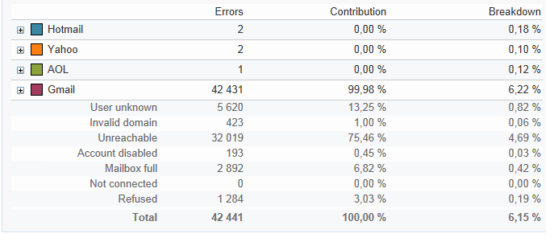

# 全域報告 {#global-reports}

這些報告涉及整個資料庫中資料的活動。 要查看報表儀表板，請轉至 **[!UICONTROL Reports]** 頁籤。

要顯示報告，請按一下其名稱。 預設情況下，以下報告可用：

>[!NOTE]
>
>此部分僅顯示連結到交貨的報表。

* **[!UICONTROL Delivery throughput]** :參考 [交付吞吐量](#delivery-throughput)。
* **[!UICONTROL Browsers]** :參考 [瀏覽器](#browsers)。
* **[!UICONTROL Sharing to social networks]** :參考 [共用到社交網路](#sharing-to-social-networks)。
* **[!UICONTROL Statistics on sharing activities]** :參考 [關於共用活動的統計](#statistics-on-sharing-activities)。
* **[!UICONTROL Operating systems]** :參考 [作業系統](#operating-systems)。
* **[!UICONTROL URLs and click streams]** :參考 [URL並按一下流](delivery-reports.md#urls-and-click-streams)。
* **[!UICONTROL Tracking indicators]** :參考 [跟蹤指標](delivery-reports.md#tracking-indicators)。
* **[!UICONTROL Non-deliverables and bounces]** :參考 [非交付項和回饋](#non-deliverables-and-bounces)。
* **[!UICONTROL User activities]** :參考 [用戶活動](#user-activities)。
* **[!UICONTROL Subscription tracking]** :參考 [訂閱跟蹤](#subscription-tracking)。
* **[!UICONTROL Delivery summary]** :參考 [交貨摘要](delivery-reports.md#delivery-summary)。
* **[!UICONTROL Delivery statistics]** :參考 [傳遞統計](#delivery-statistics)。
* **[!UICONTROL Breakdown of opens]** :參考 [開啟的細目](#breakdown-of-opens)。

## 傳遞總處理能力 {#delivery-throughput}

此報表包含給定時段內整個平台的交付吞吐量資訊。 若要測量訊息傳遞的速度，標準是每小時傳送的訊息數和訊息的大小 (以位元/秒為單位)。在下面的範例中，第一個圖表以藍色顯示成功傳遞，以橘色顯示錯誤傳遞的數量。

可以通過更改時間刻度來配置顯示的值：1小時視圖、3小時視圖、24小時視圖等。 按一下 **[!UICONTROL Refresh]** 以確認您的選取。

>[!NOTE]
>
>您還可以使用 [控制面板](https://experienceleague.adobe.com/docs/control-panel/using/sftp-management/sftp-storage-management.html)。
>
>所有管理員使用者都可存取控制面板。 授予使用者管理員存取權限的步驟已詳載於[本頁](https://experienceleague.adobe.com/docs/control-panel/using/discover-control-panel/managing-permissions.html?lang=zh-Hant#discover-control-panel)中。

## 使用者活動 {#user-activities}

此報告以圖表形式顯示每半小時、小時或每天開啟、按一下和事務的細目。

可以使用以下選項：

* **[!UICONTROL Opens]** :開啟的郵件總數。 不考慮文本格式的電子郵件。 [了解更多](metrics-calculation.md#tracking-opens-)。
* **[!UICONTROL Clicks]** :交貨中連結的點擊總數。 未考慮取消訂閱連結和鏡像頁的按一下。
<!--
* **[!UICONTROL Transactions]** : Total number of transactions after a message is received. In order for a transaction to be taken into account, a transaction type webtracking tag must be inserted into the matching web page. Webtracking configuration is presented in [this section](../../configuration/using/about-web-tracking.md).
-->

## 傳遞失敗和退回次數 {#non-deliverables-and-bounces}

此報表顯示未交付項的細分以及每個Internet域的邊界的細分。

的 **[!UICONTROL Number of messages processed]** 表示傳遞伺服器處理的消息總數。 此值低於當某些傳送已停止或暫停（在伺服器處理之前）時要傳送的消息數。

**[!UICONTROL Breakdown of errors by type]**

>[!NOTE]
>
>此報告中顯示的錯誤會觸發隔離進程。 有關隔離管理的詳細資訊，請參閱 [隔離管理](../send/quarantines.md)。

此報告的第一部分以值表和圖表的形式顯示未交付項的細分。

對於每種錯誤類型，我們有：

* 此類型的錯誤消息數，
* 與出錯的消息總數相比，此類錯誤的消息的百分比，
* 此類型的錯誤消息與已處理消息總數的百分比。

使用以下指標：

* **[!UICONTROL User unknown]** :在傳遞期間生成錯誤類型，以指示電子郵件地址無效。
* **[!UICONTROL Invalid domain]** :在發送傳遞時生成錯誤類型，以指示電子郵件地址的域錯誤或不存在。
* **[!UICONTROL Inbox full]** :在嘗試五次傳遞以指示收件人的收件箱包含過多郵件後生成的錯誤類型。
* **[!UICONTROL Account disabled]** :在發送傳遞以指示地址不再存在時生成的錯誤類型。
* **[!UICONTROL Rejected]** :IAP（Internet訪問提供程式）拒絕地址時生成的錯誤類型，例如在應用安全規則（反垃圾郵件軟體）後生成。
* **[!UICONTROL Unreachable]** :消息分發字串中出現的錯誤類型：SMTP中繼上的事件、臨時無法訪問的域等
* **[!UICONTROL Not connected]** :錯誤類型，指示發送時收件人的行動電話已關閉或斷開與網路的連接。

   >[!NOTE]
   >
   >此指標與 [移動通道](../send/send.md) 只是。

   通過按一下 `[+]` 的雙曲餘切值。 對於每種錯誤類型，可以按域顯示錯誤消息的細分。

**[!UICONTROL Breakdown of errors per domain]**

本報告的第二部分以值表和圖表的形式顯示每個Internet域的錯誤細目。

對於每個域名，我們有：

* 此域中出錯的消息數，
* 與為此域處理的消息總數相比，此域有錯誤的消息的百分比，
* 此域的錯誤消息與錯誤消息總數之比的百分比。

通過按一下 [+] 的雙曲餘切值。 對於每個域類型，可以按錯誤類型顯示錯誤消息的細分。

>[!NOTE]
>
>此報告中顯示的域名是在多維資料集級別定義的。 要更改這些值，請編輯 **[!UICONTROL Delivery logs (broadlogrcp)]** 立方。 如需詳細資訊，請參閱[本章節](gs-cubes.md)。的 **[!UICONTROL Others]** 類別包括不屬於特定類的域名。

## 瀏覽器 {#browsers}

此報告顯示傳送收件人在有關期間使用的網際網路瀏覽器的細目。

>[!NOTE]
>
>本報告中顯示的值為估計值：只考慮按一下遞送的收件人。

**全局統計**

瀏覽器使用的全局統計資訊以值表和圖表的形式顯示。

使用以下指標：

* **[!UICONTROL Visitors]** :目標收件人總數（每個Internet瀏覽器），並且至少按一下一次傳遞。
* **[!UICONTROL Pages viewed]** :所有遞送中在遞送中（每個Internet瀏覽器）的連結上的點擊總數。
* **[!UICONTROL Usage rate]** :該比率表示訪問者（按網際網路瀏覽器）與訪問者總數的關係。

**每個瀏覽器的統計資訊**

在全局統計資訊值表中，可以按一下每個瀏覽器名稱以查看其使用情況統計資訊。

統計以曲線、圖表和值表的形式顯示。

的 **[!UICONTROL History]** 曲線表示此瀏覽器每天的出勤率。 此比率是每天（在此瀏覽器上）訪問者數與當天以最高出席率衡量的訪問者數之比。

的 **[!UICONTROL Breakdown per version]** 圖表表示每個版本的訪問者數與訪問者總數（在此瀏覽器上）的比較。

值表使用以下指示符：

* **[!UICONTROL Global rate]** :此比率表示訪問者與訪問者總數（在所有瀏覽器上）之比，按版本列出的訪問者數。
* **[!UICONTROL Relative rate]** :此比率表示每個版本的訪問者與訪問者總數（在此瀏覽器上）的比較。

<!--
### Sharing to social networks {#sharing-to-social-networks}

Viral marketing lets delivery recipients share information with their contact network: they can add a link to their profile (Facebook, Twitter, etc.) or send a message to a friend. Each share and each access to shared information is tracked within the delivery. For more information on viral marketing, refer to [this section](../../delivery/using/viral-and-social-marketing.md).

This report shows the breakdown of shared and opened messages per social network (Facebook, Twitter, etc.) and/or per email.

**[!UICONTROL Email delivery statistics]**

In the email delivery statistics, two values are displayed:

* **[!UICONTROL Number of messages to be delivered]** : Total number of messages processed during delivery analysis.
* **[!UICONTROL Number of successful deliveries]** : Number of messages processed successfully.

**[!UICONTROL Sharing activities and mail open statistics]**

The central table shows the statistics on email shares and opens.

In the **[!UICONTROL Shares]** column, we have the following indicators:

* **[!UICONTROL No. of sharing activities]** : Total number of messages shared on each social network. This value equals the total number of clicks on the icon of the matching **[!UICONTROL Links for sharing to social networks]** personalization block.
* **[!UICONTROL Breakdown]** : This rate represents the breakdown of shares per social network, in relation to the total number of shares.
* **[!UICONTROL Sharing rate]** : This rate represents the breakdown of shares per social network, in relation to the number of messages to be delivered.

In the **[!UICONTROL Opens]** column, we have the following indicators:

* **[!UICONTROL No. of opens]** : Total number of messages opened by people whom the message was forwarded to (via the **[!UICONTROL Links for sharing to social networks]** personalization block). This value equals the number of times the mirror page was displayed. Opens by delivery recipients are not taken into account.
* **[!UICONTROL Breakdown]** : This rate represents the breakdown of opens per social network, in relation to the total number of opens.
* **[!UICONTROL Rate of opens]** : This rate represents the breakdown of opens per social network, in relation to the total number of shares.

**[!UICONTROL Breakdown of sharing activities and opens]**

This section includes two charts which represent the breakdown of sharing activities and opens per social network.

## Statistics on sharing activities {#statistics-on-sharing-activities}

This report shows the evolution of shares to social media in time.

For more information on viral marketing, refer to [this section](../../delivery/using/viral-and-social-marketing.md).

Statistics are presented in the form of a table of values and a chart.

The following indicators are used:

* **[!UICONTROL New contacts]** : Number of new subscriptions following the reception of a message shared via email. This value matches the number of people who received a message shared via email, clicked the **[!UICONTROL Subscription link]** and filled in the subscription form. 
* **[!UICONTROL Opens]** : Total number of messages opened by people whom the message was transferred to (via the **[!UICONTROL Link for sharing to social networks]** personalization block). This value equals the number of times the mirror page was displayed. Opens by delivery recipients are not taken into account.
* **[!UICONTROL Sharing activities]** : Total number of messages shared via social networks. This value matches the total number of clicks on the icon of the **[!UICONTROL Links for sharing to social networks]** personalization block.
-->

## 作業系統 {#operating-systems}

此報告顯示交付接收方在有關期間使用的作業系統的細目。

>[!NOTE]
>
>本報告中顯示的值為估計值：只考慮按一下遞送的收件人。

**全局統計**

作業系統的全局使用統計資訊以值表和圖表的形式顯示。

使用以下指標：

* **[!UICONTROL Visitors]** :在傳遞中按一下至少一次的目標收件人總數（每個作業系統）的每日平均數。
* **[!UICONTROL Pages viewed]** :所有交貨的交貨連結（每個作業系統）的每日點擊總數平均值。
* **[!UICONTROL Rate of use]** :該比率表示訪問者（按作業系統）與訪問者總數之比。

**每個作業系統的統計資訊**

在全局統計資訊值表中，按一下每個作業系統的名稱以查看每個作業系統的統計資訊。

統計以曲線、圖表和值表的形式顯示。

的 **[!UICONTROL History]** 曲線表示每天使用此作業系統的速率。 此比率是每天（在此作業系統上）訪問者人數與當天考勤率最高的訪問者人數之比。

的 **[!UICONTROL Breakdown by version]** 圖表表示每個版本的訪問者相對於此作業系統上訪問者總數的細分。

值表使用以下指示符：

* **[!UICONTROL Global rate]** :此比率表示訪問者（按版本）與整個作業系統訪問者總數的比例。
* **[!UICONTROL Relative rate]** :此比率表示訪問者（每個版本）與此作業系統訪問者總數的關係。

## 訂閱跟蹤 {#subscription-tracking}

此報告用於監視資訊服務的訂閱。 它顯示預訂和取消預訂。

通過按一下 **[!UICONTROL Profiles and targets > Services and subscriptions]** 的子目錄。 選擇所需的訂閱，然後按一下 **[!UICONTROL Reports]** 頁籤。 的 **[!UICONTROL Subscriptions tracking]** 預設情況下，報告可用。 它允許您查看一段時間內的訂閱和取消訂閱趨勢以及會員率。 您可以通過下拉清單配置此資料的表示形式。 按一下 **[!UICONTROL Refresh]** 驗證選定的配置。

如需詳細資訊，請參閱[本頁面](../start/subscriptions.md)。

的 **[!UICONTROL Number subscribed to date]** 表示當前訂閱的總人數。

**[!UICONTROL Overall evolution of subscriptions]**

值表使用以下指示符：

* **[!UICONTROL Subscribers]** :有關期間訂戶總數。
* **[!UICONTROL Subscriptions]** :有關期間的訂閱數。
* **[!UICONTROL Unsubscriptions]** :有關期間的未訂閱數。
* **[!UICONTROL Evolution]** :未訂閱數減去訂閱數。 該速率根據訂戶總數計算。
* **[!UICONTROL Loyalty]** :相關期間訂戶的忠誠度率。

**[!UICONTROL Subscription evolution curves]**

此圖顯示了相關期間訂閱和未訂閱的演變。

## 傳遞統計資料 {#delivery-statistics}

此報告按Internet域、處理和發送的所有郵件、硬邊界和軟邊界、開啟、按一下和取消訂閱顯示細分。

使用以下指標：

* **[!UICONTROL Emails processed]** :傳遞伺服器處理的郵件總數。
* **[!UICONTROL Delivered]** :與已處理郵件總數相比，成功處理的郵件數的百分比。
* **[!UICONTROL Hard bounces]** :「硬」回報數與已處理郵件總數的百分比。
* **[!UICONTROL Soft bounces]** :「軟」邊界數與已處理郵件總數的百分比。

   >[!NOTE]
   >
   >有關硬邊界和軟邊界的詳細資訊，請參閱 [此頁](../send/quarantines.md)。

* **[!UICONTROL Opens]** :至少開啟一次郵件的目標收件人數與成功處理的郵件數的百分比。
* **[!UICONTROL Clicks]** :與成功處理的郵件數相比，在傳遞中至少按一下一次的人數的百分比。
* **[!UICONTROL Unsubscription]** :未訂閱連結上的按一下次數與成功處理的消息數的百分比。

## 開啟次數的劃分 {#breakdown-of-opens}

此報告按作業系統、設備和瀏覽器顯示有關期間開啟的細目。 每個類別有兩個圖表。第一個圖表顯示在電腦和行動裝置上的開啟數統計資料。第二個圖表僅顯示在行動裝置上的開啟數統計資料。

開啟的數目與開啟的消息總數相對應。 不計算文本格式電子郵件。 有關「跟蹤」(Tracking)開啟的詳細資訊，請參閱 [此部分](metrics-calculation.md#tracking-opens-)。

>[!NOTE]
>
>瀏覽器和作業系統名稱是瀏覽器用戶代理髮送的資訊的一部分，該資訊已開啟。 Adobe Campaign利用其設備資訊來推斷設備類型。
