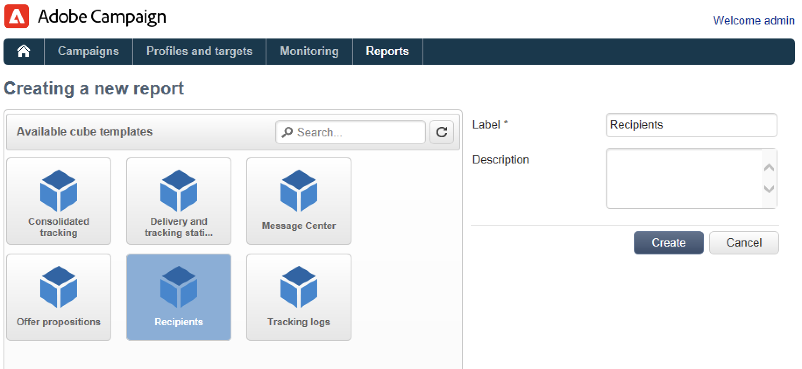

# 開始使用報告功能{#gs-ac-reports}

Adobe Campaign提供本頁面所列的一組報表工具。

* **立方體**

  Adobe Campaign隨附直覺式資料探索工具，可用來建立動態報表。

  使用行銷分析功能來分析和測量資料、計算統計資料、簡化和最佳化報告建立和計算。 您可以建立報告並建置目標母體，然後將它們儲存到清單中，以便用於Adobe Campaign中的目標定位或細分任務。

  

  根據查詢、計算和磁碟區的複雜性，這些報告中分析的資料可透過查詢來收集，並預先彙總在清單（資料管理型別工作流程）或多維度資料集（使用Marketing Analytics）中。 它會以樞紐分析表或群組清單的形式顯示。

  如需詳細資訊，請參閱[本章節](gs-cubes.md)。

* **內建報告**

  Adobe Campaign隨附傳遞、行銷活動、平台活動、選用功能等報表。 這些報告可透過其相關的各種功能取得。 可依您的特定需求進行調整。

  使用 **報表** 標籤以存取這些報表。

  

  如需詳細資訊，請參閱[本章節](built-in-reports.md)。

* **描述性資料分析**

  Adobe Campaign提供視覺化工具，可針對資料庫中的資料產生統計資料。 您可以使用專用的助理建立描述性分析報告，並根據需要調整其內容和版面。

  使用 **[!UICONTROL Tools > Descriptive analysis...]** 功能表以建立新報表。

  

  行銷活動描述性分析報表顯示於 [Campaign Classic v7檔案](https://experienceleague.adobe.com/docs/campaign-classic/using/reporting/analyzing-populations/about-descriptive-analysis.html?lang=zh-Hant){target="_blank"}.

* **自訂報表**

  使用Adobe Campaign建立有關資料庫中資料的報告。 建立後，可在適當的前後關聯中加以存取。

  建立報告的步驟詳見 [Campaign Classic v7檔案](https://experienceleague.adobe.com/docs/campaign-classic/using/reporting/creating-new-reports/about-reports-creation-in-campaign.html){target="_blank"}. 「個人化報表」建立作業已保留給進階使用者。
