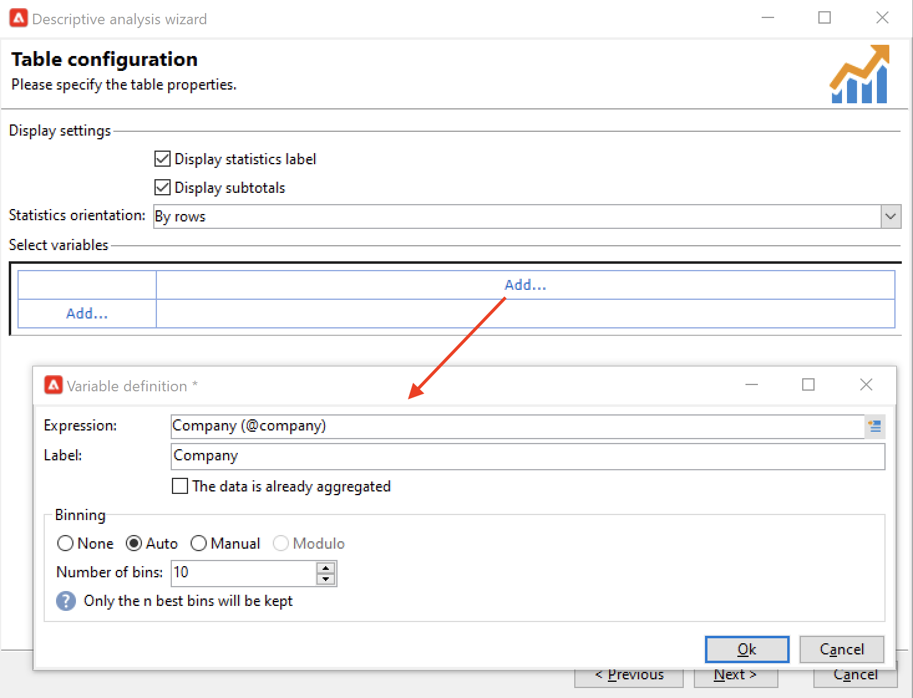

# 開始報告{#gs-ac-reports}

Adobe Campaign提供了本頁中列出的一組報告工具。

* **Cube**

   Adobe Campaign提供了一個直觀的資料探測工具，可建立動態報告。

   使用市場營銷分析功能來分析和測量資料、計算統計、簡化和優化報表建立和計算。 您可以建立報告並構建目標群集，並將它們儲存到清單中，這些清單可用於Adobe Campaign的目標或分段任務。

   

   根據查詢、計算和卷的複雜性，這些報告中分析的資料可以通過查詢來收集，並在清單（資料管理類型工作流）或多維資料集（使用市場營銷分析）中預聚合。 它將以透視表或組清單的形式顯示。

   如需詳細資訊，請參閱[本章節](gs-cubes.md)。

* **內建報告**

   Adobe Campaign提供了有關交付、活動、平台活動、可選功能等的報告。 這些報告可通過它們相關的各種功能獲得。 它們可以適應你的特定需求。

   使用 **報告** 的子菜單。

   

   如需詳細資訊，請參閱[本章節](built-in-reports.md)。

* **描述性資料分析**

   Adobe Campaign提供了一個可視化工具，用於對資料庫中的資料進行統計。 您可以使用專用助理建立描述性分析報告，並根據您的需要調整其內容和佈局。

   使用 **[!UICONTROL Tools > Descriptive analysis...]** 的子菜單。

   

    市場活動描述性分析報告在 [Campaign Classicv7文檔](https://experienceleague.adobe.com/docs/campaign-classic/using/reporting/analyzing-populations/about-descriptive-analysis.html){target="_blank"}

* **自訂報告**

   使用Adobe Campaign建立資料庫中資料的報告。 一旦建立了這些內容，就可以在相應的上下文中訪問它們。

    建立報告的步驟詳見 [Campaign Classicv7文檔](https://experienceleague.adobe.com/docs/campaign-classic/using/reporting/creating-new-reports/about-reports-creation-in-campaign.html){target="_blank"}。 個性化報表建立保留給高級用戶。
