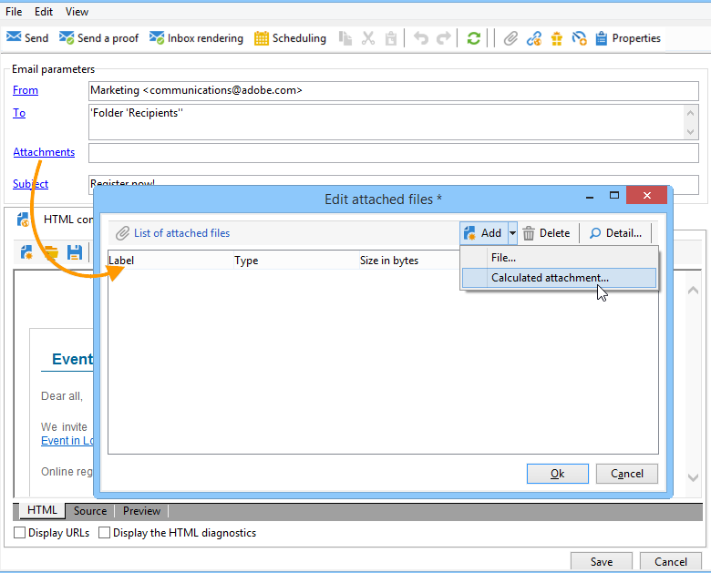
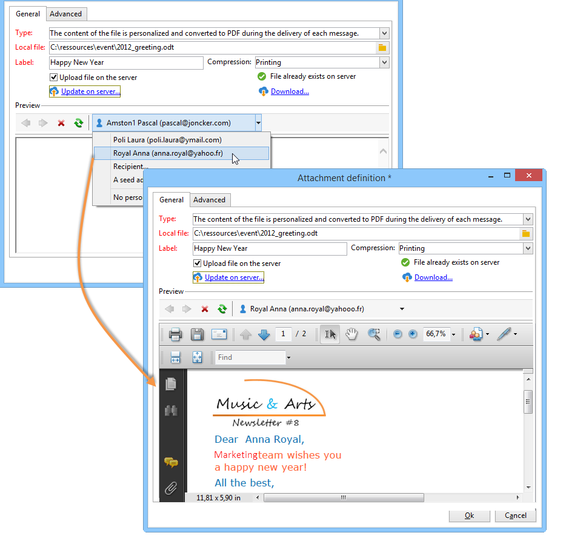
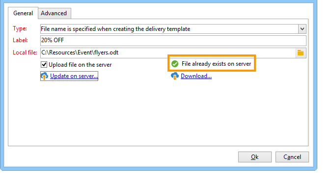

# 將檔案附加到電子郵件{#attaching-files}

## 關於電子郵件附件 {#about-email-attachments}

您可以將一或多個檔案附加至電子郵件傳遞。

>[!NOTE]
>
>為避免效能問題，建議不要在每封電子郵件中包含多個附件。 您可以從Campaign選項清單設定建議的臨界值。 請參閱[Campaign Classic檔案](https://experienceleague.adobe.com/docs/campaign-classic/using/installing-campaign-classic/appendices/configuring-campaign-options.html?lang=zh-Hant#delivery)。

有兩種可能的情況：

* 選取檔案並按原樣將其附加至傳送。
* 為每位收件者個人化附件內容。 在此情況下，您需要建立&#x200B;**計算的附件**：根據收件者，會在每封郵件傳遞時計算附件的名稱。 如果您有&#x200B;**可變數位列印**&#x200B;選項，內容也可以在傳遞時個人化並轉換為PDF格式。

>[!NOTE]
>
>這類設定通常會在傳遞範本中執行。 如需關於此項目的詳細資訊，請參閱此[頁面](../send/create-templates.md)。

## 護欄 {#attachments-guardrails}

為避免效能問題，電子郵件中包含的影像不能超過100 KB。 預設設定的此限制可以從`NmsDelivery_MaxDownloadedImageSize`選項變更。 不過，Adobe強烈建議您在電子郵件傳送中避免大型影像。

Adobe也建議限制附加檔案的大小和數量。 依預設，您只能新增一個檔案作為電子郵件的附件。 此臨界值可從`NmsDelivery_MaxRecommendedAttachments`選項設定。

在[Campaign Classic檔案](https://experienceleague.adobe.com/docs/campaign-classic/using/installing-campaign-classic/appendices/configuring-campaign-options.html?lang=zh-Hant#delivery)的Campaign選項清單中瞭解更多。

## 附加本機檔案 {#attaching-a-local-file}

若要將本機檔案附加至傳遞，請遵循下列步驟。

>[!NOTE]
>
>您可以將多個檔案附加至傳遞。 附件可以是任何格式，包括壓縮格式。

1. 按一下&#x200B;**[!UICONTROL Attachments]**&#x200B;連結。
1. 按一下 **[!UICONTROL Add]** 按鈕。
1. 按一下&#x200B;**[!UICONTROL File...]**&#x200B;以選取要附加至傳遞的檔案。

   

您也可以直接將檔案拖放至傳遞&#x200B;**[!UICONTROL Attachments]**&#x200B;欄位，或使用傳遞助理工具列的&#x200B;**[!UICONTROL Attach]**&#x200B;圖示，

選取檔案後，會立即將其上傳至伺服器，以便在傳送時可用。 它列在&#x200B;**[!UICONTROL Attachments]**&#x200B;欄位中。

## 建立計算附件 {#creating-a-calculated-attachment}

當您建立已計算的附件時，可在分析或傳遞每封郵件期間計算附件的名稱，並可視收件者而定。 您也可以將其個人化並轉換至PDF。

若要建立個人化附件，請遵循下列步驟：

1. 按一下&#x200B;**[!UICONTROL Attachments]**&#x200B;連結。
1. 按一下&#x200B;**[!UICONTROL Add]**&#x200B;按鈕，然後選取&#x200B;**[!UICONTROL Calculated attachment]**。
1. 從&#x200B;**[!UICONTROL Type]**&#x200B;下拉式清單中選取計算型別：

可以使用以下選項：

* 建立傳遞範本時指定了&#x200B;**檔案名稱**
* **檔案的內容已個人化，並在每則訊息傳遞期間轉換至PDF**
* **檔案名稱是在傳遞分析期間計算的（它不能依賴收件者設定檔）**
* **檔案名稱是在每個收件者的傳遞時計算的（可以取決於收件者）**

### 附加本機檔案 {#attach-a-local-file}

如果附件是本機檔案，請選取選項： **[!UICONTROL File name is specified when creating the delivery template]**。 檔案會在本機選取並上傳至伺服器。 請遵循以下步驟：

1. 在&#x200B;**[!UICONTROL Local file]**&#x200B;欄位中選取要上傳的檔案。
1. 必要時指定標籤。 在傳訊系統中檢視時，標籤會取代檔案名稱。 如果未指定任何專案，預設會使用檔案名稱。

   

1. 必要時，請選取&#x200B;**[!UICONTROL Upload file on the server]**，然後按一下&#x200B;**[!UICONTROL Update on server]**&#x200B;以開始傳輸。

   

然後，伺服器上便可使用檔案，將其附加至從此範本建立的不同傳送。

### 附加個人化訊息 {#attach-a-personalized-message}

選項&#x200B;**[!UICONTROL The file content is personalized and converted into PDF format at the time of delivery for each message]**&#x200B;可讓您選取包含個人化欄位的檔案，例如預期收件者的姓氏和名字。

對於此類附件，請套用下列設定步驟：

1. 選取要上傳的檔案。
1. 必要時指定標籤。
1. 選取&#x200B;**[!UICONTROL Upload file on the server]**，然後按一下&#x200B;**[!UICONTROL Update on server]**&#x200B;開始傳輸。
1. 您可以顯示預覽。 若要這麼做，請選取收件者。

   

1. 分析您的傳遞，然後開始進行。

   每位收件者都會收到附加至傳遞的個人化PDF。

   

### 附加計算檔案 {#attach-a-calculated-file}

您可以在準備傳遞期間計算附件名稱。 若要這麼做，請選取選項&#x200B;**[!UICONTROL The file name is calculated during delivery analysis (it cannot depend on the recipient)]**。

>[!NOTE]
>
>只有在外部程式或工作流程傳送傳遞時，才會使用此選項。

1. 指定您要套用至附件的標籤。
1. 在定義視窗中指定檔案的存取路徑及其確切名稱。

   >[!IMPORTANT]
   >
   >伺服器上必須有檔案。

   

1. 分析，然後開始您的傳遞。

   可以在分析記錄檔中看到檔案名稱計算。

   

### 附加個人化檔案 {#attach-a-personalized-file}

選取附件時，您可以選擇選項&#x200B;**[!UICONTROL The file name is calculated during delivery for each recipient (it can depend on the recipient)]**。 然後，您可以使用要傳送的檔案名稱來對應收件者個人化資料。

>[!NOTE]
>
>只有在外部程式或工作流程傳送傳遞時，才會使用此選項。

1. 指定您要套用至附件的標籤。
1. 在定義視窗中指定檔案的存取路徑及其確切名稱。 如果檔案名稱已個人化，您可以使用相關值的個人化欄位。

   

   >[!IMPORTANT]
   >
   >伺服器上必須有檔案。

1. 分析，然後開始您的傳遞。

   在以下範例中，附加檔案是根據名稱選擇的，其定義使用合併欄位。

   

### 附件設定 {#attachment-settings}

對於前兩個選項，您可以選取適當的選項來選擇&#x200B;**[!UICONTROL Upload file on the server]**。 **[!UICONTROL Update the file on the server]**&#x200B;連結可讓您開始上傳。

系統會顯示一則訊息，告知您檔案已上傳至伺服器：

對於檔案的變更，會顯示警告訊息：

**[!UICONTROL Advanced]**&#x200B;索引標籤可讓您定義附加檔案的進階選項：

* 您可以定義篩選選項，以避免將附加檔案傳送給所有收件者。 選項&#x200B;**[!UICONTROL Enable filtering of recipients who will receive the attachment]**&#x200B;會啟動用來定義收件者選擇指令碼的輸入欄位，必須在JavaScript中輸入該指令碼。
* 您可以編寫檔案名稱的指令碼，以便進行個人化。

  在視窗中輸入文字，並使用下拉式清單中可用的個人化欄位。 在以下範例中，檔案名稱經過個人化，包含今天的日期和收件者名稱。

  
