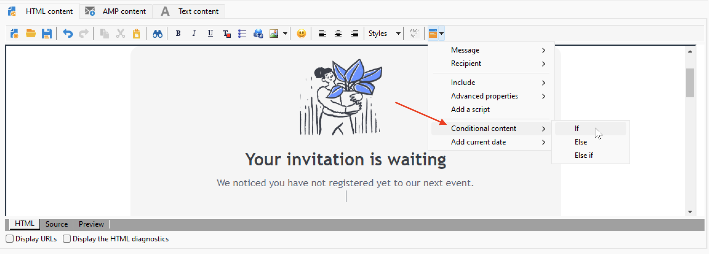
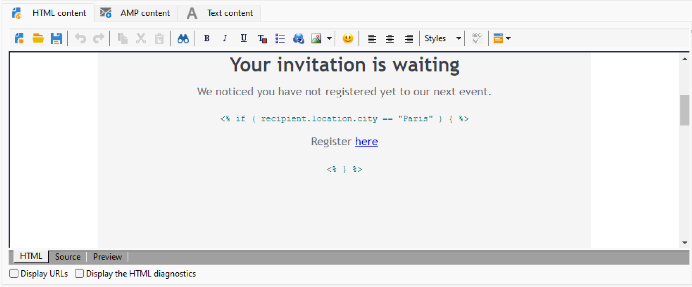

# 建立條件式內容{#conditional-content}

透過設定條件式內容欄位，您可以建立進階的個人化。滿足特定條件時，便可以取代完整的文字區塊及/或影像。


## 在電子郵件中使用條件 {#conditions-in-an-email}

在以下範例中，瞭解如何建立訊息，並根據收件者的城市和興趣以動態方式個人化。

* 根據收件者的城市變更訊息
* 根據收件者的興趣個人化優惠內容。

若要根據欄位的值建立條件式內容，請套用下列步驟：

1. 開啟現有傳遞或建立新的電子郵件傳遞。
1. 在電子郵件內容編輯器中，按一下個人化圖示並選取 **[!UICONTROL Conditional content > If]**.

   

   個人化元素會插入訊息內文中。 您現在必須加以設定。

1. 填入 **如果** 運算式。

   * 選取運算式的第一個元素， **`<FIELD>`**，然後按一下個人化圖示，以測試欄位取代。
   * Replace **`<VALUE>`** ，其中包含將滿足條件的欄位值。 此值必須在引號中。
   * 指定滿足條件時要插入的內容。 可以是文字、影像、表單、超文字連結等。

   

1. 按一下 **[!UICONTROL Preview]** 索引標籤來根據傳遞收件者檢視訊息內容。 選取條件為true的收件者以檢查內容。 然後選取其他為false的收件者，並再次檢查。

您可以新增其他案例，並根據一或多個欄位的值定義不同的內容。 若要這麼做，請使用 **[!UICONTROL Conditional content > Else]** 和 **[!UICONTROL Conditional content > Else if]**. 這些運算式的設定方式與 **如果** 運算式。

>[!CAUTION]
>
>此 **%> &lt;%** 新增後必須刪除字元 **否則** 和 **否則，如果** 條件。


## 使用案例：建立多語言電子郵件 {#creating-multilingual-email}

在以下範例中，瞭解如何建立多語言電子郵件。 內容會根據收件者偏好的語言，以一種或另一種語言顯示。

1. 建立電子郵件並選取目標母體。 在此範例中，顯示一個版本或另一個版本的條件將以 **語言** 收件者設定檔的值。 這些值設定為 **EN**， **FR**， **ES**.
1. 在電子郵件HTML內容中，按一下 **[!UICONTROL Source]** 定位並貼上下列程式碼：

   ```
   <% if (language == "EN" ) { %>
   <DIV id=en-version>Hello <%= recipient.firstName %>,</DIV>
   <DIV>Discover your new offers!</DIV>
   <DIV><a href="https://www.adobe.com/products/en">www.adobe.com/products/en</A></FONT></DIV><%
    } %>
   <% if (language == "FR" ) { %>
   <DIV id=fr-version>Bonjour <%= recipient.firstName %>,</DIV>
   <DIV>Découvrez nos nouvelles offres !</DIV>
   <DIV><a href="https://www.adobe.com/products/fr">www.adobe.com/products/fr</A></DIV><%
    } %>
    <% if (language == "ES" ) { %>
   <DIV id=es-version><FONT face=Arial>
   <DIV>Olà <%= recipient.firstName %>,</DIV>
   <DIV>Descubra nuestros nuevas ofertas !</DIV>
   <DIV><a href="https://www.adobe.com/products/es">www.adobe.com/products/es</A></DIV>
   <% } %>
   ```

1. 在中測試電子郵件內容 **[!UICONTROL Preview]** 索引標籤中，選取具有不同偏好語言的收件者。

   >[!NOTE]
   >
   >由於電子郵件內容中未定義替代版本，因此請務必在傳送電子郵件前篩選目標母體。

## 教學課程影片 {#conditionnal-content-video}

此影片以多語言電子報為範例，示範如何新增條件式內容至傳遞。

>[!VIDEO](https://video.tv.adobe.com/v/335682?quality=12)
