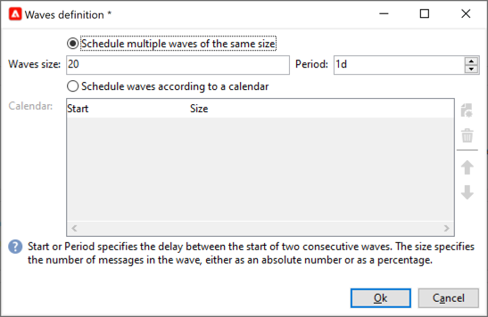

# 設定並傳送傳遞 {#configure-delivery}

## 設定其他引數 {#delivery-additional-parameters}

在傳送傳送前，您可以透過在傳送屬性中定義傳送引數 **[!UICONTROL Delivery]** 標籤。

* **[!UICONTROL Delivery priority]**：此選項可透過設定傳送的優先順序層級，變更傳送的順序，從 **[!UICONTROL Very low]** 至 **[!UICONTROL Very high]** (預設值為 **[!UICONTROL Normal]**)。

* **[!UICONTROL Message batch quantity]**：使用此選項可定義在同一XML傳遞套件中分組的訊息數。 如果引數設為0，訊息會自動分組。 封裝大小由計算定義 `<delivery size>/1024`，每個套件最少8則訊息，最多256則訊息。

  >[!IMPORTANT]
  >
  >當透過複製現有傳遞建立傳遞時，此引數會重設。

* **[!UICONTROL Send using multiple waves]**：使用此選項可批次傳送訊息，而非一次傳送給整個對象。 [了解更多](#sending-using-multiple-waves)。

* **[!UICONTROL Test SMTP delivery]**：使用此選項來測試透過SMTP的傳送。 處理傳遞直到連線到 SMTP 伺服器，但不傳送：對於傳遞的每個收件者，Campaign 會連線到 SMTP 提供者伺服器，執行 SMTP RCPT TO 命令，並在 SMTP DATA 命令之前關閉連線。

  >[!NOTE]
  >
  >* 此選項不得在中間來源中設定。
  >
  >* 瞭解有關SMTP伺服器設定的詳細資訊，請參閱 [Campaign Classic v7檔案](https://experienceleague.adobe.com/docs/campaign-classic/using/installing-campaign-classic/additional-configurations/configure-delivery-settings.html#smtp-relay){target="_blank"}.

* **[!UICONTROL Email BCC]**：使用此選項可透過密件副本將電子郵件儲存在外部系統上，只需將密件副本電子郵件地址新增至您的訊息目標即可。 [了解更多](email-parameters.md)。

## 使用多個波段傳送 {#sending-using-multiple-waves}

若要平衡負載，您可以將傳送劃分為幾個批次。 設定批次數量及其相對於整個傳送的比例。

>[!NOTE]
>
>您只能定義兩個連續波段之間的大小和延遲。 無法設定每個波次的收件者選取條件。

1. 開啟傳送屬性視窗，然後按一下 **[!UICONTROL Delivery]** 標籤。
1. 選取 **[!UICONTROL Send using multiple waves]** 選項，然後按一下 **[!UICONTROL Define waves...]** 連結。

   

1. 若要設定波段，您可以：

   * 定義每個波段的大小。 例如，如果您輸入 **[!UICONTROL 30%]** 在對應欄位中，每個波段將代表傳送中所包含訊息的30%，但最後一個波段除外，這將代表訊息的10%。

     在 **[!UICONTROL Period]** 欄位，指定兩個連續波段開始之間的延遲。 例如，如果您輸入 **[!UICONTROL 2d]**，第一波會立即開始，第二波會在兩天內開始，第三波會在四天內開始，以此類推。

     

   * 定義傳送每個波次的行事曆。

     在 **[!UICONTROL Start]** 欄，指定兩個連續波段開始之間的延遲。 在 **[!UICONTROL Size]** 欄，輸入固定數字或百分比。

     在以下範例中，第一個波段代表傳遞中包含之訊息總數的25%，並會立即開始。 接下來的兩個批次會完成傳遞，並設定為每六小時開始一次。

     

   特定的型別規則， **[!UICONTROL Wave scheduling check]**，確保最後一個波段是在傳遞效度限制之前計畫。 行銷活動型別及其規則，設定於 **[!UICONTROL Typology]** 傳遞屬性的索引標籤，顯示在 [本節](../../automation/campaign-opt/campaign-typologies.md#typology-rules)<!--ref TBC-->.

   >[!IMPORTANT]
   >
   >請確定最後一個批次沒有超過傳遞期限，該期限定義於 **[!UICONTROL Validity]** 標籤。 否則，部分訊息可能不會傳送。
   >
   >在設定最後一個波段時，您也必須允許足夠的重試時間。 <!--See [this section]().-->

1. 若要監視您的傳送，請前往傳送記錄檔。 請參閱[此頁面](send.md)<!--ref TBC-->。

   您可以檢視已在處理批次中傳送的傳遞(**[!UICONTROL Sent]** 狀態)和在剩餘波段中要傳送的傳遞(**[!UICONTROL Pending]** 狀態)。

以下兩個範例是使用多個波段的最常見使用案例。

* **啟動處理期間**

  使用新平台傳送電子郵件時，網際網路服務提供者(ISP)會懷疑無法辨識的IP位址。 如果突然傳送大量電子郵件，ISP通常會將其標籤為垃圾郵件。

  為避免被標籤為垃圾訊息，您可以逐步增加使用波段傳送的數量。 這應該可以確保啟動階段的順利發展，並且讓您降低無效的位址的整體比率。

  若要這麼做，請使用 **[!UICONTROL Schedule waves according to a calendar]** 選項。 例如，將第一個波段設為10%，將第二個波段設為15%，以此類推。

  

* **涉及客服中心的行銷活動**

  管理電話忠誠度行銷活動時，貴組織處理聯絡訂閱者之通話次數的能力有限。

  使用波段時，您可以將每天的訊息數量限製為20，這是客服中心的每日處理能力。

  若要這麼做，請選取 **[!UICONTROL Schedule multiple waves of the same size]** 選項。 輸入 **[!UICONTROL 20]** 作為波浪的大小和 **[!UICONTROL 1d]** 在 **[!UICONTROL Period]** 欄位。

  

## 確認傳遞 {#confirm-delivery}

當傳遞已設定好並準備好傳送時，在確認傳送之前，請確定您已執行傳遞分析。

請依照下列步驟以執行此操作。

1. 按一下 **[!UICONTROL Send]**，選取所需的動作。

   * 若要立即傳送傳遞，請選取 [**儘快傳遞**].
   * 若要排程傳送至之後的日期，請選取 **[!UICONTROL Postpone the delivery]**. [了解更多](#schedule-delivery-sending)

1. 按一下 **[!UICONTROL Analyze]**。如需詳細資訊，請參閱[本節](delivery-analysis.md)。

   

1. 完成後，按一下 **[!UICONTROL Confirm delivery]** 以啟動訊息的傳遞。

   

1. 您可以關閉傳遞精靈，並從 **[!UICONTROL Delivery]** 索引標籤，可透過此傳送的詳細資訊或傳送清單存取。

   如需詳細資訊，請參閱以下章節：

   * [監視傳遞](send.md)
   * [瞭解傳遞故障](delivery-failures.md)

<!--About message tracking-->

## 排程傳遞傳送 {#schedule-delivery-sending}

為了排程傳遞，管理銷售壓力以及避免過度行銷，您可以推延郵件的傳遞。

1. 按一下 **[!UICONTROL Send]** 按鈕並選取 **[!UICONTROL Postpone delivery]** 選項。

1. 在中指定開始日期 **[!UICONTROL Contact date]** 欄位。

   

1. 開始傳遞分析並確認傳遞傳送。 不過，傳送要等到中指定的日期才會開始 **[!UICONTROL Contact date]** 欄位。

   >[!IMPORTANT]
   >
   >開始分析後，您定義的聯絡日期即已固定。 如果您修改此日期，則必須重新啟動分析，以便將您的修改納入考量。

   

在傳遞清單中，傳遞會顯示 **[!UICONTROL Pending]** 狀態。

您也可以透過以下方式設定上游 **[!UICONTROL Scheduling]** 傳遞的按鈕。

這可讓您將傳送延遲到較晚日期，或將傳送儲存在臨時行事曆中。

* 此 **[!UICONTROL Schedule delivery (no automatic execution)]** 選項可讓您排程傳遞的臨時分析。

  儲存此設定時，傳送會變更為 **[!UICONTROL Targeting pending]** 狀態。 分析將會在指定的日期啟動。

* 此 **[!UICONTROL Schedule delivery (automatic execution on planned date)]** 選項可讓您指定傳送日期。

  按一下 **[!UICONTROL Send]** 並選取 **[!UICONTROL Postpone delivery]** 然後啟動分析並確認傳送。 分析完成後，傳遞目標已準備就緒，訊息將於指定日期自動傳送。

日期和時間會以目前運運算元的時區表示。 此 **[!UICONTROL Time zone]** 位於聯絡資料輸入欄位下方的下拉式清單，可讓您自動將輸入的日期和時間轉換為所選的時區。

例如，如果您排程在倫敦時間8點自動執行傳遞，則時間會自動轉換為所選的時區：

<!--
## Adjust delivery failure management {#delivery-failure-management}

### Configure retries {#configure-retries}

Temporarily undelivered messages due to a **Soft** or **Ignored** error are subject to an automatic retry. The delivery failure types and reasons are presented in this [section](../../delivery/using/understanding-delivery-failures.md#delivery-failure-types-and-reasons).

>[!IMPORTANT]
>
>For hosted or hybrid installations, if you have upgraded to the [Enhanced MTA](../../delivery/using/sending-with-enhanced-mta.md), the retry settings in the delivery are no longer used by Campaign. Soft bounce retries and the length of time between them are determined by the Enhanced MTA based on the type and severity of the bounce responses coming back from the message's email domain.

For on-premise installations and hosted/hybrid installations using the legacy Campaign MTA, the central section of the **[!UICONTROL Delivery]** tab for delivery parameters indicates how many retries should be performed the day after the delivery and the minimum delay between retries.

By default, five retries are scheduled for the first day of the delivery with a minimum interval of one hour spread out over the 24 hours of the day. One retry per day is programmed after that and until the delivery deadline, which is defined in the **[!UICONTROL Validity]** tab (see [Defining validity period](#defining-validity-period)).

### Define the validity period {#define-validity-period}

When the delivery has been launched, the messages (and any retries) can be sent until the delivery deadline. This is indicated in the delivery properties, via the **[!UICONTROL Validity]** tab.

* The **[!UICONTROL Delivery duration]** field lets you enter the limit for global delivery retries. This means that Adobe Campaign sends the messages beginning on the start date, and then, for messages returning an error only, regular, configurable retries are performed until the validity limit is reached.

  You can also choose to specify dates. To do this, select **[!UICONTROL Explicitly set validity dates]**. In this case, the delivery and validity limit dates also let you specify the time. The current time is used by default, but you can modify this directly in the input field.

  >[!IMPORTANT]
  >
  >For hosted or hybrid installations, if you have upgraded to the [Enhanced MTA](../../delivery/using/sending-with-enhanced-mta.md), the **[!UICONTROL Delivery duration]** setting in your Campaign email deliveries will be used only if set to **3.5 days or less**. If you define a value higher than 3.5 days, it will not be taken into account.

* **Validity limit of resources**: The **[!UICONTROL Validity limit]** field is used for uploaded resources, mainly for the mirror page and images. The resources on this page are valid for a limited time (to save disk space).

  The values in this field can be expressed in the units listed in [this section](../../platform/using/adobe-campaign-workspace.md#default-units).
-->
