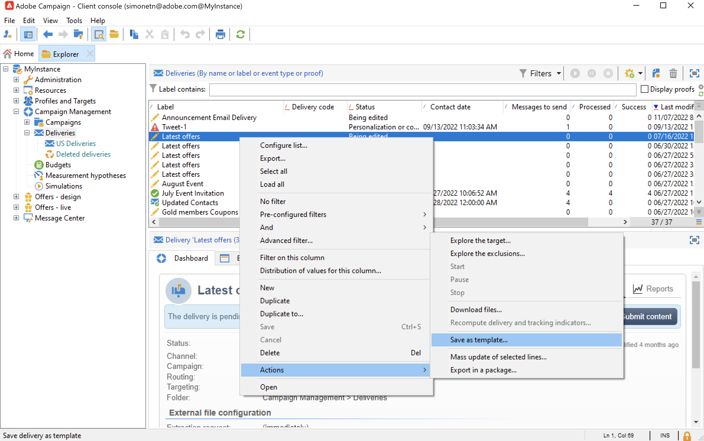

# 使用傳遞範本{#work-with-delivery-template}

使用傳遞範本來標準化創意外觀和風格，以便更快速地執行和啟動行銷活動。

範本可包含：

* 類型
* 寄件者和回覆地址
* 基本 [個人化區塊](../send/personalization-blocks.md)
* 連結至 [映象頁面](../send/mirror-page.md) 和取消訂閱連結
* 內容、公司標誌或簽名
* 其他傳遞屬性，例如資源有效性、重試引數或隔離設定。

 [在影片中探索此功能](#delivery-template-video)

## 建立範本{#create-a-delivery-template}

若要建立傳遞範本，您可以複製內建範本、將現有傳遞轉換為範本或從頭開始建立傳遞範本。

### 複製現有範本{#copy-an-existing-template}

Campaign為每個頻道提供一組內建範本：電子郵件、推播、簡訊、直接郵件等。

建立傳遞範本的最簡單方法是複製和自訂內建範本。

若要複製傳遞範本，請遵循下列步驟：

1. 瀏覽至 **[!UICONTROL Resources > Templates > Delivery templates]** 在Adobe Campaign explorer中。
1. 選取內建傳遞範本。 清單中會以粗體顯示內建範本。
1. 按一下右鍵並選取 **[!UICONTROL Duplicate]**.

   

1. 定義範本設定並儲存新範本。

   

範本會新增至傳遞範本清單。 您現在可以在建立新傳送時選取它。

### 將現有傳遞轉換為範本 {#convert-an-existing-delivery}

傳遞可以轉換為範本以供新的重複傳遞動作使用。

若要將傳送轉換為範本，請遵循下列步驟：

1. 從傳遞清單中選取傳遞，可透過以下網址存取： **[!UICONTROL Campaign management]** Campaign總管的節點。

1. 按一下右鍵並選取 **[!UICONTROL Actions > Save as template...]**.

   

1. 編輯傳遞屬性，並選取必須儲存新範本的資料夾(在 **[!UICONTROL Folder]** 欄位)，以及必須建立根據此範本建立的傳遞的資料夾(在 **[!UICONTROL Execution folder]** 欄位)。

   

### 建立新範本 {#create-a-new-template}

>[!NOTE]
>
>為避免設定錯誤，Adobe建議您 [複製內建範本](#copy-an-existing-template) 並自訂其屬性，而非建立新範本。

若要從頭開始設定傳送範本，請遵循下列步驟：

1. 瀏覽至 **資源** Campaign檔案總管中的資料夾，並選取 **範本** 則 **傳遞範本**.
1. 按一下 **新增** ，以建立新的傳遞範本。
1. 設定 **標籤** 和 **內部名稱** 檔案夾的。
1. 儲存範本並重新開啟。
1. 從 **屬性** 按鈕，調整設定。
1. 在 **一般** 標籤，確認或變更在 **執行資料夾**， **資料夾**、和 **路由** 下拉式功能表。
1. 完成 **電子郵件引數** 類別，以及您的電子郵件主題和目標母體。
1. 新增您的 **HTML內容** 若要個人化您的範本，您可以顯示 [映象頁面連結](../send/mirror-page.md) 和取消訂閱連結。
1. 選取 **預覽** 標籤。 在 **測試個人化** 下拉式功能表，選取 **收件者** 以預覽範本為選取的設定檔。
1. 按一下「**儲存**」。您的範本現在已準備好用於傳遞。

## 使用範本{#use-a-delivery-template}

### 使用範本建立傳遞{#create-a-delivery-from-a-template}

若要根據現有範本建立傳遞，請從可用傳遞範本清單中選取範本。

如果您看不到範本，請按一下 **[!UICONTROL Select link]** 欄位右側的資料夾以瀏覽Campaign資料夾。

從中選擇所需的目錄 **[!UICONTROL Folder]** 欄位，或按一下 **[!UICONTROL Display sub-levels]** 圖示來顯示目前目錄之子樹狀結構中的目錄內容。

選取要使用的傳遞範本，然後按一下 **[!UICONTROL Ok]**.

### 執行範本 {#execute-a-template}

您可以直接從範本清單啟動範本執行，而不需要先建立傳送。

若要這麼做，請選取要執行的範本，然後按一下滑鼠右鍵。 選取 **[!UICONTROL Actions>Execute the delivery template...]**。

您也可以使用 **[!UICONTROL File>Actions>Execute the delivery template...]**.

輸入傳遞引數並按一下 **[!UICONTROL Send]**.

此動作會在與範本關聯的資料夾中產生傳遞。 此傳遞的名稱是從中建立該傳遞的傳遞範本的名稱。

## 教學課程影片 {#delivery-template-video}

### 如何設定傳遞範本

下列影片示範如何設定隨選傳遞的範本。

>[!VIDEO](https://video.tv.adobe.com/v/342082?quality=12)

### 如何設定傳遞範本屬性

以下影片說明如何設定傳遞範本屬性，並詳細說明每個屬性。

>[!VIDEO](https://video.tv.adobe.com/v/338969?quality=12)

### 如何部署隨選傳遞範本

此影片說明如何部署隨選電子郵件傳遞範本，並說明電子郵件傳遞與傳遞工作流程之間的差異。

>[!VIDEO](https://video.tv.adobe.com/v/338965?quality=12)

有其他Campaign操作說明影片可供使用 [此處](https://experienceleague.adobe.com/docs/campaign-learn/tutorials/getting-started/introduction-to-adobe-campaign.html){target="_blank"}.
