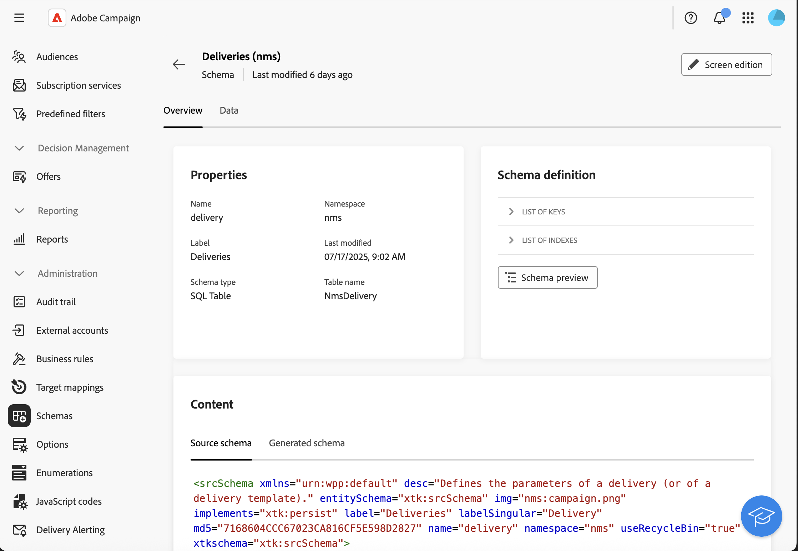

# 開始使用自訂頻道 {#gs-custom-channel}

Adobe Campaign可讓您建立與協力廠商整合的自訂外部或API管道。 然後，您可以根據這些通道來協調和執行傳送。

傳遞的建立和傳送可在使用者端主控台和網頁UI中執行。 不過，自訂通道設定只能在使用者端主控台中執行。

若要瞭解如何根據自訂頻道建立及傳送傳遞，請參閱此[頁面](https://experienceleague.adobe.com/docs/campaign-web/v8/msg/gs-custom-channel.html){target="_blank"}。

以下是在使用者端主控台中設定新自訂頻道的步驟。 自訂外部和API管道共用以下步驟：

1. 設定結構描述，[瞭解詳情](#configure-schema)
1. 建立新的外部帳戶，[瞭解詳情](#create-ext-account)
1. 建立新的傳遞範本，[瞭解詳情](#create-template)

自訂API通道需要其他設定。 [閱讀更多](#api-additional)

## 設定結構{#configure-schema}

首先，您需要設定結構，將新頻道新增至可用頻道清單。

1. 在Campaign Explorer中，選取&#x200B;**管理** > **組態** > **資料結構描述**。

1. 建立結構描述延伸以使用新通道延伸&#x200B;**messageType** [列舉](../config/enumerations.md)。

   例如：

   ```
   <enumeration basetype="byte" default="mail" label="Channel" name="messageType">
   <value desc="My Webpush" img="ncm:channels.png" label="My Webpush" name="webpush"
          value="122"/>
   </enumeration>
   ```

   {zoomable="yes"}

## 建立新的外部帳戶{#create-ext-account}

然後，您需要建立新的路由外部帳戶。

1. 在Campaign Explorer中，選取&#x200B;**管理** > **平台** > **外部帳戶**。

1. 建立新的外部帳戶。

1. 選取通道並變更傳送模式。 針對自訂外部管道選擇&#x200B;**外部**，針對自訂API管道選擇&#x200B;**大量**。

   {zoomable="yes"}

## 建立新的傳遞範本{#create-template}

現在，讓我們建立與新頻道關聯的新範本。

1. 在Campaign Explorer中，選取&#x200B;**資源** > **範本** > **傳遞範本**。

1. 建立新範本。

1. 按一下&#x200B;**屬性**&#x200B;並選取正確的資料夾和路由。

   {zoomable="yes"}

新頻道現已推出。 您可以根據此管道來建立及執行傳送。

## 自訂API額外設定{#api-additional}

以下是設定自訂API通道的主要其他步驟。

### 擴充方案{#api-additional-schema}

從使用者端主控台，使用自訂通道所需的所有額外屬性來擴充&#x200B;**傳遞**&#x200B;綱要。

如需結構描述擴充功能的詳細資訊，請參閱此[頁面](../dev/extend-schema.md)。

### 設定自訂畫面定義{#api-additional-screen}

從Campaign Web UI，設定自訂畫面定義：

1. 開啟&#x200B;**傳遞**&#x200B;結構描述，然後按一下&#x200B;**熒幕版本**。

   {zoomable="yes"}

1. 選取與您的頻道對應的標籤，並定義欄位在傳送內容畫面中的顯示方式。 如需熒幕版本的詳細資訊，請參閱此[頁面](https://experienceleague.adobe.com/docs/campaign-web/v8/conf/schemas.html#fields){target="_blank"}。

   {zoomable="yes"}

1. 在模擬內容的&#x200B;**預覽**&#x200B;區段中，選取專用的JSPP。 這是選擇性的。 這會在傳遞模擬畫面中啟動預覽。 [閱讀更多](#api-additional-preview)

### 設定預覽{#api-additional-preview}

此設定是選用的。 如果您想在Web UI的傳送模擬畫面中啟動預覽，您需要在使用者端主控台中設定專用的JSSP。

當您在Web UI的傳遞模擬畫面中按一下&#x200B;**開啟預覽**&#x200B;時，下列引數會在URL中傳遞：

`https://adobe.campaign.adobe.com/cus/webPushMessagePreview.jssp?deliveryId=%40ToPzTurO9aGzQxYcMArBbA%3D%3D&id=%40oF8Fi17txuLmtiOFj4OIjQ%3D%3D`

* `deliveryId`：傳遞識別碼
* `id`：設定檔識別碼

在使用者端主控台中，選取&#x200B;**管理** > **設定** > **動態JavaScript頁面**，並建立新的JSSP。 以下是需要擷取之引數的範例。

```
<%@ page import="xtk:shared/nl.js"
%><%
  NL.require("/nl/core/shared/core.js")
    .require('/nl/core/jsspcontext.js')
    .require('/nl/core/shared/dataTypes.js')
    .require('/nl/core/schema.js');
    
  //response.setContentType("text/plain");
  var parameters = request.parameters;
  var deliveryId = decryptString(parameters.deliveryId);
  var oldUserContext = logonEscalation("neolane")
  
   var delivery = xtk.queryDef.create(<queryDef schema="nms:delivery" operation="getIfExists">
                                         <select>
                                           <node expr="[WebpushParameters/@richMediaOptions]" alias="@richMediaOptions"/>
                                           <node expr="[WebpushParameters/@mediaUrlInfo]" alias="@mediaUrlInfo"/>
                                           <node expr="[WebpushParameters/@WebpushMessageType]"/>
                                         </select>
                                         <where>
                                           <condition expr={"@id = " + NL.XTK.toXTKString(deliveryId)}/>
                                         </where>
                                       </queryDef>).ExecuteQuery();

  // Restore previous context
  logonWithContext(oldUserContext)
%>

<!DOCTYPE html ...
```

### 技術實作{#api-additional-technical}

根據您的自訂頻道，您將需要設定應用程式的其他部分，例如：外部帳戶、目標對應、API的Javascript程式碼等。

