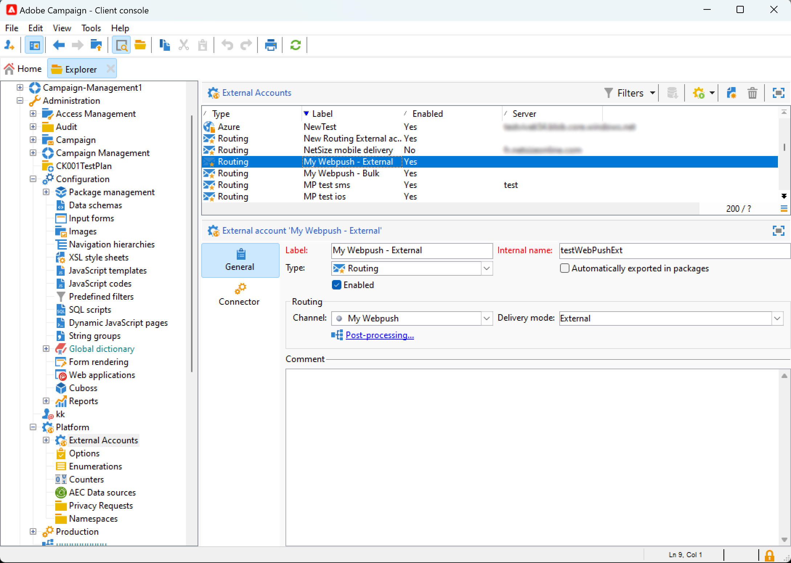

# 開始使用自訂外部管道 {#gs-custom-channel}

Adobe Campaign可讓您建立與第三方整合的自訂外部管道。 然後，您可以根據這些通道來協調和執行傳送。

傳遞的建立和傳送可在使用者端主控台和網頁UI中執行。 不過，自訂外部通道只能在使用者端主控台中執行。

若要瞭解如何根據自訂外部通道建立及傳送傳遞，請參閱此[頁面](https://experienceleague.adobe.com/docs/campaign-web/v8/msg/gs-custom-channel.html?lang=zh-Hant)。

以下是在使用者端主控台中建立新外部自訂頻道的步驟：

1. 設定結構描述，[瞭解詳情](#configure-schema)
1. 建立新的外部帳戶，[瞭解詳情](#create-ext-account)
1. 建立新的傳遞範本，[瞭解詳情](#create-template)

## 設定結構{#configure-schema}

首先，您需要設定結構，將新頻道新增至可用頻道清單。

1. 在Campaign Explorer中，選取&#x200B;**管理** > **組態** > **資料結構描述**。

1. 建立結構描述擴充功能，以使用新通道擴充messageType列舉。

   例如：

   ```
   <enumeration basetype="byte" default="mail" label="Channel" name="messageType">
   <value desc="My Webpush" img="ncm:channels.png" label="My Webpush" name="webpush"
          value="122"/>
   </enumeration>
   ```

   {zoomable="yes"}

## 建立新的外部帳戶{#create-ext-account}

然後，您需要建立新的路由外部帳戶。

1. 在Campaign Explorer中，選取&#x200B;**管理** > **平台** > **外部帳戶**。

1. 建立新的外部帳戶。

1. 選取通道並將傳遞模式變更為&#x200B;**外部**。

   {zoomable="yes"}

## 建立新的傳遞範本{#create-template}

現在，讓我們建立與新頻道關聯的新範本。

1. 在Campaign Explorer中，選取&#x200B;**資源** > **範本** > **傳遞範本**。

1. 建立新範本。

1. 按一下&#x200B;**屬性**&#x200B;並選取正確的資料夾和路由。

   {zoomable="yes"}

新頻道現已推出。 您可以根據此管道來建立及執行傳送。
