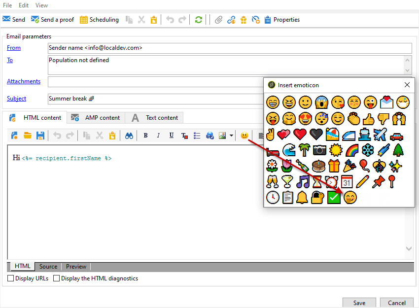
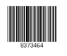

# 定義電子郵件內容 {#defining-the-email-content}

## 寄件者 {#sender}

若要定義會出現在已傳送郵件標題中的寄件者名稱與地址，請按一下&#x200B;**[!UICONTROL From]**&#x200B;連結。

此視窗可讓您輸入建立電子郵件標頭所需的所有資訊。 此資訊可個人化。 若要這麼做，請使用輸入欄位右側的按鈕，插入個人化欄位。

若要瞭解如何插入及使用個人化欄位，請參閱[本節](personalize.md)。

>[!NOTE]
>
>* 預設會使用寄件者的地址來回覆。
>* 標頭引數不得為空白。 依預設，它們包含設定部署精靈時輸入的值。
>* 必須提供寄件者的地址，才能傳送電子郵件（RFC標準）。
>* Adobe Campaign會檢查所輸入電子郵件地址的語法。

>[!CAUTION]
>
>為了避免傳遞問題，與指定給傳遞和回覆的地址相對應的電子郵件帳戶必須存在，而且必須受到監視。 請洽詢您的系統管理員。

## 訊息主旨 {#message-subject}

訊息的主旨會在對應欄位中設定。 您可以直接在欄位中輸入它，或按一下&#x200B;**[!UICONTROL Subject]**&#x200B;連結以輸入指令碼。 個人化連結可讓您在主旨中插入資料庫欄位。

>[!IMPORTANT]
>
>訊息主旨為必填。

傳送訊息時，欄位內容將由收件者設定檔中的值取代。

例如，在上面的訊息中，會使用每位收件者設定檔中的資料，針對每位收件者將訊息主旨個人化。

>[!NOTE]
>
>個人化欄位的使用在[此區段](personalize.md)中顯示。

您也可以使用&#x200B;**[!UICONTROL Insert emoticon]**&#x200B;快顯視窗將表情符號插入主旨列。

## 訊息內容 {#message-content}

>[!IMPORTANT]
>
>基於隱私權原因，我們建議對所有外部資源使用HTTPS。

訊息的內容會在傳遞設定視窗的下半部分中定義。

預設會根據收件者偏好設定，以HTML或文字格式傳送訊息。 建議您以兩種格式建立內容，以確保在任何郵件系統中都能正確顯示訊息。 如需詳細資訊，請參閱[選取訊息格式](email-parameters.md#selecting-message-formats)。

* 若要匯入HTML內容，請使用&#x200B;**[!UICONTROL Open]**&#x200B;按鈕。 您也可以將原始程式碼直接貼到&#x200B;**[!UICONTROL Source]**&#x200B;子索引標籤中。

  如果您使用數位內容編輯器(DCE)，請參閱[Campaign Classic檔案](https://experienceleague.adobe.com/docs/campaign-classic/using/designing-content/editing-html-content/use-case-creating-an-email-delivery.html#step-3---selecting-a-content)。

  >[!IMPORTANT]
  >
  >HTML內容必須預先建立，然後匯入Adobe Campaign中。 HTML編輯器並非專為內容建立而設計。

  **[!UICONTROL Preview]**&#x200B;子索引標籤可讓您檢視每個收件者的內容轉譯。 個人化欄位和內容的條件元素會取代為所選設定檔的對應資訊。

  工具列按鈕可讓您存取HTML頁面的標準動作和格式化引數。

  

  您可以從本機檔案或Adobe Campaign的影像資料庫將影像插入訊息中。 若要這麼做，請按一下&#x200B;**[!UICONTROL Image]**&#x200B;圖示並選取適當的選項。

  

  您可以透過資料夾樹狀結構中的&#x200B;**[!UICONTROL Resources>Online>Public resources]**&#x200B;資料夾存取媒體櫃影像。 另請參閱[新增影像](#adding-images)。

  工具列中的最後一個按鈕可讓您插入個人化欄位。

  >[!NOTE]
  >
  >個人化欄位的使用在[此區段](personalize.md)中顯示。

  頁面底部的標籤可讓您顯示正在建立之頁面的HTML程式碼，並檢視訊息的呈現及其個人化。 若要啟動這個顯示，請按一下&#x200B;**[!UICONTROL Preview]**，並使用工具列中的&#x200B;**[!UICONTROL Test personalization]**&#x200B;按鈕選取收件者。 您可以從定義的目標中選取收件者，或選擇其他收件者。

  

  您可以驗證HTML訊息。 您也可以檢視電子郵件標頭的內容。

  

* 若要匯入文字內容，請使用&#x200B;**[!UICONTROL Open]**&#x200B;按鈕或&#x200B;**[!UICONTROL Text Content]**&#x200B;索引標籤，在文字格式顯示時輸入訊息的內容。 使用工具列按鈕存取內容的動作。 最後一個按鈕可讓您插入個人化欄位。

  

  至於HTML格式，請按一下頁面底部的&#x200B;**[!UICONTROL Preview]**&#x200B;索引標籤，以檢視訊息的演算及其個人化。

  

## 定義互動式內容 {#amp-for-email-format}

Adobe Campaign可讓您嘗試新的互動式[AMP for Email](https://amp.dev/about/email/)格式，在特定條件下傳送動態電子郵件。

如需詳細資訊，請參閱[本節](defining-interactive-content.md)。

## 使用內容管理 {#using-content-management}

您可以使用內容管理表單，直接在傳送助理中定義傳送的內容。 若要這麼做，您必須在傳遞屬性的&#x200B;**[!UICONTROL Advanced]**&#x200B;索引標籤中，參考要使用的內容管理的發佈範本。

另一個索引標籤可讓您輸入將根據內容管理規則自動整合及格式化的內容。

>[!NOTE]
>
>如需Adobe Campaign中內容管理的詳細資訊，請參閱[Campaign Classic檔案](https://experienceleague.adobe.com/docs/campaign-classic/using/sending-messages/content-management/about-content-management.html?lang=zh-Hant)。

## 插入表情符號 {#inserting-emoticons}

您可以將表情符號插入電子郵件內容。

1. 按一下&#x200B;**[!UICONTROL Insert emoticon]**&#x200B;圖示。
1. 從快顯視窗中選取表情符號。

   

1. 完成時，按一下&#x200B;**[!UICONTROL Close]**&#x200B;按鈕。

若要自訂表情符號清單，請參閱[Campaign Classic檔案](https://experienceleague.adobe.com/docs/campaign-classic/using/sending-messages/personalizing-deliveries/customizing-emoticon-list.html)。

## 新增影像 {#adding-images}

HTML格式電子郵件傳遞可包含影像。 從傳遞小幫手，您可以匯入包含影像的HTML頁面，或透過&#x200B;**[!UICONTROL Image]**&#x200B;圖示直接使用HTML編輯器插入影像。

### 護欄 {#img-guardrails}

為避免效能問題，電子郵件中包含的影像不能超過100 KB。 預設設定的此限制可以從`NmsDelivery_MaxDownloadedImageSize`選項變更。 不過，Adobe強烈建議您在電子郵件傳送中避免大型影像。

在[Campaign Classic檔案](https://experienceleague.adobe.com/docs/campaign-classic/using/installing-campaign-classic/appendices/configuring-campaign-options.html#delivery)的Campaign選項清單中瞭解更多。

### 影像型別 {#img-types}

影像可以是：

* 本機影像或從伺服器呼叫的影像
* 儲存在Adobe Campaign公共資源庫中的影像

  可透過Adobe Campaign階層的&#x200B;**[!UICONTROL Resources > Online]**&#x200B;節點存取公用資源。 它們會分組在程式庫中，並可包含在電子郵件訊息中，但也可用於行銷活動或任務，或用於內容管理。

* 與Adobe Experience Cloud共用的資產。 請參閱[Campaign Classic檔案](https://experienceleague.adobe.com/docs/campaign-classic/using/integrating-with-adobe-experience-cloud/asset-sharing/sharing-assets-with-adobe-experience-cloud.html)。

### 插入和管理影像 {#manage-images}

傳遞助理可以讓您新增本機影像，或資料庫中儲存的影像至訊息內容。 若要這麼做，請按一下HTML內容工具列中的&#x200B;**[!UICONTROL Image]**&#x200B;按鈕。

>[!IMPORTANT]
>
>為了讓收件者能夠檢視其收到之郵件中包含的影像，這些郵件必須在可從外部存取的伺服器上可用。

若要透過傳送助理管理影像：

1. 按一下工具列中的&#x200B;**[!UICONTROL Tracking & Images]**&#x200B;圖示。
   

1. 在&#x200B;**[!UICONTROL Images]**&#x200B;索引標籤中選取&#x200B;**[!UICONTROL Upload images]**。
1. 然後，您可以選擇是否要將這些影像納入電子郵件中。
   

* 您可以手動上傳影像，而不需要等候傳遞分析階段。 若要這麼做，請按一下&#x200B;**[!UICONTROL Upload the images straightaway...]**&#x200B;連結。
* 您可以指定另一個路徑來存取追蹤伺服器上的影像。 若要這麼做，請在&#x200B;**[!UICONTROL Images URL]**&#x200B;欄位中輸入。 此值會覆寫安裝輔助程式引數中定義的值。

當您開啟傳送助理中包含影像的HTML內容時，訊息會根據傳送引數，提供您立即上傳影像的選項。

>[!IMPORTANT]
>
> 影像URL會在手動上傳或傳送訊息時修改。
> 

### 使用案例：傳送包含影像的訊息 {#uc-images}

以下是包含四個影像的傳送範例：

這些影像來自本機目錄或網站，您可以從&#x200B;**[!UICONTROL Source]**&#x200B;索引標籤進行驗證。

按一下&#x200B;**[!UICONTROL Tracking & Images]**&#x200B;圖示，然後按&#x200B;**[!UICONTROL Images]**&#x200B;標籤，開始偵測訊息中的影像。

對於偵測到的每個影像，您可以檢視其狀態：

* 如果影像儲存在本機或位於其他伺服器上，即使從外部可以看到此伺服器（例如在網際網路網站上），也會偵測到&#x200B;**[!UICONTROL Not yet online]**。
* 如果影像在建立另一個傳遞時較早上傳，則會偵測到&#x200B;**[!UICONTROL Already online]**。
* 在部署精靈中，您可以定義未啟用影像偵測的URL：上傳這些影像將為&#x200B;**[!UICONTROL Skipped]**。

>[!NOTE]
>
>影像是以其內容識別，而非以存取路徑識別。 這表示先前以不同名稱或不同目錄上傳的影像將會偵測為&#x200B;**[!UICONTROL Already online]**。

在分析階段，影像會自動上傳至伺服器，以便從外部存取，但必須預先上傳的本機影像除外。

您可以繼續操作並上傳影像，以便其他Adobe Campaign操作者檢視這些影像。 如果您能共同作業，這項功能可能會相當實用。 若要這麼做，請按一下&#x200B;**[!UICONTROL Upload the images straightaway...]**&#x200B;將影像上傳到伺服器。

>[!NOTE]
>
>接著會修改電子郵件中影像的URL，尤其是其名稱。

一旦影像上線，您就可以從訊息的&#x200B;**[!UICONTROL Source]**&#x200B;索引標籤檢視其名稱和路徑的變更。

如果您選取&#x200B;**[!UICONTROL Include the images in the email]**，則可以選擇要包含在對應欄中的影像。

>[!NOTE]
>
>如果訊息中包含本機影像，您必須確認訊息原始碼的變更。

## 插入個人化條碼{#insert-a-barcode}

條碼產生模組可讓您建立符合許多常見標準的幾種條碼，包括2D條碼。

您可以使用使用客戶條件定義的值，動態產生條碼做為點陣圖。 電子郵件行銷活動中可包含個人化條碼。 收件者可以列印訊息，並展示給發行公司以供掃描（例如結帳時）。

若要將條碼插入電子郵件中，請將游標置於您要顯示它的內容中，然後按一下個人化按鈕。 選取 **[!UICONTROL Include > Barcode...]**。

然後設定以下元素以符合您的需求：

1. 選取條碼型別。

   * 對於1D格式，Adobe Campaign提供下列型別：Codabar、代碼128、GS1-128 （先前稱為EAN-128）、UPC-A、UPC-E、ISBN、EAN-8、代碼39、交錯式2 （共5個）、POSTNET和皇家郵件(RM4SCC)。

     1D條碼範例：

     

   * DataMatrix和PDF417型別涉及2D格式。

     2D條碼範例：

     

   * 若要插入QR碼，請選取此型態並輸入要套用的錯誤更正率。 此比率定義重複資訊的數量以及劣化的容許度。

     

     QR碼範例：

     

1. 輸入您要插入電子郵件中的條碼大小：設定比例可讓您增加或減少條碼大小，從x1到x10。
1. **[!UICONTROL Value]**&#x200B;欄位可讓您定義條碼的值。 值可以比對特殊優惠方案，也可以是條件的函式，也可以是連結至客戶的資料庫欄位的值。

   此範例顯示EAN-8型別條碼，收件者的帳號已加入條碼。 若要新增此帳號，請按一下&#x200B;**[!UICONTROL Value]**&#x200B;欄位右側的個人化按鈕，然後選取&#x200B;**[!UICONTROL Recipient > Account number]**。

   

1. **[!UICONTROL Height]**&#x200B;欄位可讓您設定條碼的高度，而不變更條碼的寬度，方法是變更每個條之間的間距量。

   根據條碼型別，沒有限制性的進入控制。 如果條碼值不正確，它將只會在&#x200B;**預覽**&#x200B;模式中顯示，其中條碼會以紅色劃掉。

   >[!NOTE]
   >
   >指定給條碼的值取決於其型別。 例如，EAN-8型別應該有8個數字。
   >
   >**[!UICONTROL Value]**&#x200B;欄位右側的個人化按鈕可讓您在值本身之外新增資料。 只要條碼標準接受，這就能豐富條碼。
   >
   >例如，如果您使用GS1-128型別條碼，並且除了輸入值外，還想輸入收件者的帳號，請按一下個人化按鈕，然後選取&#x200B;**[!UICONTROL Recipient > Account number]**。 如果所選取收件者的帳號輸入正確，條碼會將其列入考量。

設定這些元素後，您就可以完成電子郵件並加以傳送。 若要避免發生錯誤，請一律按一下&#x200B;**[!UICONTROL Preview]**&#x200B;索引標籤，在執行傳遞前確定內容已正確顯示。

>[!NOTE]
>
>如果條碼的值不正確，其點陣圖會以紅色劃掉。

