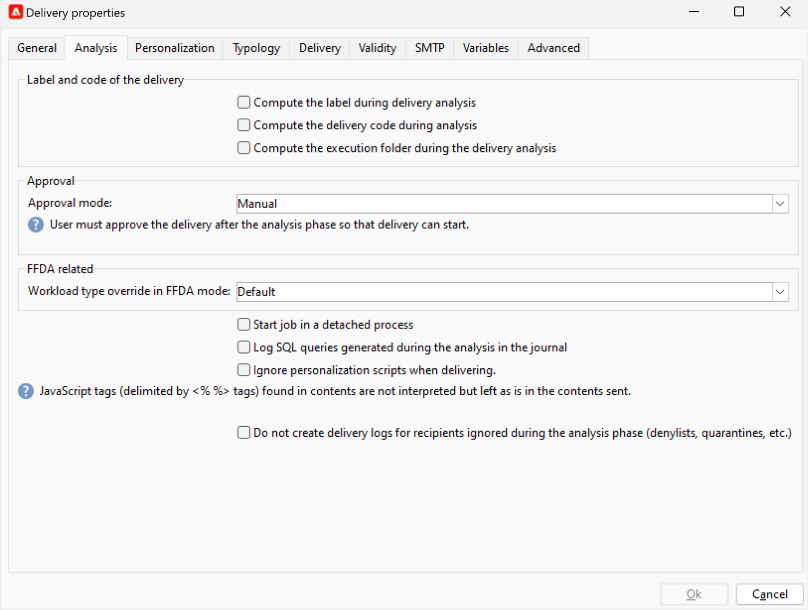

# 傳遞分析 {#analyze-delivery}

分析是傳送準備步驟。 一旦定義目標對象，且訊息內容已準備就緒並進行測試後，即可啟動它。 在傳遞分析期間，會計算目標母體並準備傳遞內容。 完成後，即可傳送傳遞。

## 開始分析 {#start-the-analysis}

若要準備傳遞，請確定已定義傳遞內容和目標，然後遵循下列步驟：

1. 在傳送視窗中，按一下 **[!UICONTROL Send]** 按鈕。
1. 選取 **[!UICONTROL Deliver as soon as possible]** 執行對象計算以及為立即傳送所做的內容準備。 您也可以將傳送延遲到較晚的日期，或是在未準備內容的情況下取得母體預估值。

   

1. 按一下 **[!UICONTROL Analyze]** 以手動啟動分析。 進度列會顯示分析的進度。

   傳遞分析期間會套用一組檢查規則。 這些規則定義於 **型別**，此專案會於 **[!UICONTROL Typology]** 索引標籤中的「傳送」屬性。 進一步瞭解中的型別 [本節](../../automation/campaign-opt/campaign-typologies.md).

   根據預設，針對電子郵件，分析會涵蓋下列幾點：

   * 核准物件
   * 核准URL和影像
   * 核准URL標籤
   * 核准取消訂閱連結
   * 檢查校訂的大小
   * 檢查有效期
   * 檢查波段排程

1. 您可以隨時按一下 **[!UICONTROL Stop]** 按鈕。

   在準備階段期間不會傳送任何訊息。 因此，您可以開始或取消分析而不會有風險。

   >[!IMPORTANT]
   >
   >執行時，分析會凍結傳送（或證明）。 對傳送（或證明）所做的任何變更都必須先進行其他分析，才能適用。

   分析完成後，視窗的上半部會指出傳遞準備是否已完成，或是否有任何錯誤發生。 會列出所有驗證步驟、警告和錯誤。彩色圖示顯示訊息類型：

   * 藍色圖示表示資訊訊息。
   * 黃色圖示表示非關鍵性處理錯誤。
   * 紅色圖示表示嚴重錯誤，無法傳送傳遞。

   {width="800" align="left"}

1. 按一下 **[!UICONTROL Close]** 以更正錯誤（若有的話）。 進行變更後，按一下以重新啟動分析 **[!UICONTROL Analyze]**.

   >[!NOTE]
   >
   >按一下 **[!UICONTROL Change the main delivery target]** 如果要傳送的訊息數目不符合您的預期時連結。 此選項可讓您變更目標母體的定義，並重新開始分析。

1. 檢查分析結果後，按一下 **[!UICONTROL Confirm delivery]** 將訊息傳送至主要目標。

## 分析設定 {#analysis-settings}

瀏覽至 **[!UICONTROL Analysis]** 傳遞屬性的索引標籤，以定義分析階段中訊息準備的設定。

{width="800" align="left"}

此索引標籤可讓您存取下列選項：

* **[!UICONTROL Label and code of the delivery]** ：此區段中的選項用於在傳送分析階段期間計算這些欄位的值。 此 **[!UICONTROL Compute the execution folder during the delivery analysis]** 欄位會計算分析階段將包含此傳遞動作的資料夾名稱。

* **[!UICONTROL Approval mode]** ：此欄位可讓您定義分析完成時的手動或自動傳送。

   如果在分析期間產生警告（例如，如果傳送的主題中強調某些字元，等等），您可以設定傳送以定義是否仍應執行。 依預設，使用者必須在分析階段結束時確認傳送訊息：這是&#x200B;**手動**&#x200B;驗證。

   從適當欄位的下拉式清單中選取其他核准模式。

   可使用下列核准模式：

   * **[!UICONTROL Manual]**：在分析階段結束時，使用者必須確認傳送才能開始傳送。 若要這麼做，請按一下 **[!UICONTROL Start]** 按鈕以啟動傳遞。
   * **[!UICONTROL Semi-automatic]**：如果分析階段未產生警告訊息，則會自動開始傳送。
   * **[!UICONTROL Automatic]**：傳送會在分析階段結束時自動開始，無論結果為何。

* **[!UICONTROL Start job in a detached process]** ：此選項可讓您透過個別程式開始傳送分析。 依預設，分析函式會使用Adobe Campaign應用程式伺服器處理序(web nlserver)。 選取此選項可確保即使在應用程式伺服器發生故障時，也能完成分析。
* **[!UICONTROL Log SQL queries generated during the analysis in the journal]** ：此選項會在分析階段將SQL查詢記錄檔新增至傳遞日誌。
* **[!UICONTROL Ignore personalization scripts during sending]** ：此選項可讓您略過HTML內容中JavaScript指示詞的解譯。 它們將顯示為已傳送內容中的原樣。 這些指示詞是隨 `<%=` 標籤之間。
