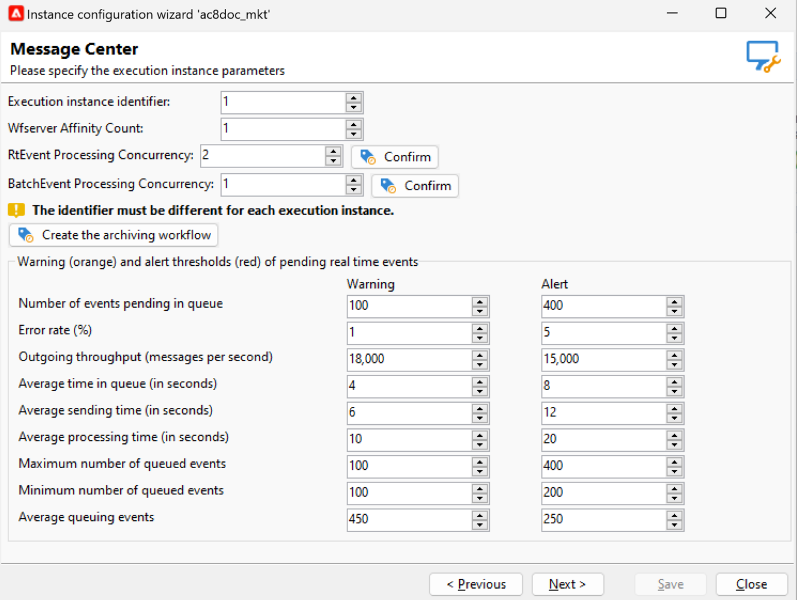

# 傳送及監控異動訊息 {#delivery-execution}

## 傳送訊息{#send-transactional-msg}

擴充完成且傳遞範本已連結至事件後，就會從執行例項傳送傳遞。

>[!NOTE]
>
>交易式訊息的優先順序高於任何其他傳送。

所有傳遞都會分組在 **[!UICONTROL Administration > Production > Message Center > Default > Deliveries]** 資料夾。

依預設，它們會依傳送月份排序為子資料夾。 可在訊息範本屬性中變更此設定。

## 監視訊息 {#monitor-transactional-msg}

若要監視異動訊息，請檢查 [傳遞記錄](send.md).

從執行例項傳送的交易式傳遞會透過技術工作流程(**[!UICONTROL Message Center execution instance]**)每小時執行一次。

>[!NOTE]
>
>傳遞每週會根據最新的事件更新累積事件，而不是根據事件建立日期累積事件。 因此，從控制執行個體擷取異動訊息傳送記錄時，與每個傳送記錄ID相關聯的傳送ID可能會隨著記錄更新的時間（例如，當收到事件的入站退回時）而變更。

<!--
To monitor the activity and running of the execution instance(s), see [Transactional messaging reports](transactional-messaging-reports.md).-->

## 報告{#reporting-transactional-msg}

Adobe Campaign提供數個報表，可讓您控制活動並順利執行執行執行個體。

這些訊息中心報告可從以下位置存取： **[!UICONTROL Reports]** 的標籤 **控制例項**.

### 訊息中心事件歷史記錄 {#history-events}

此 **[!UICONTROL Message Center event history]** 報表會顯示訊息中心模組活動的概覽，也就是以交易式訊息的形式處理和傳送的事件數量。

開啟報告時，預設顯示的資訊與成功傳送異動訊息的速率一致。 若要檢視更多層級，您可以開啟各種節點，並將游標放在適當的層級上加以選取。

您可以檢視每個時段每個事件型別的特定資料。 此 **[!UICONTROL Events]** 欄對應於每個控制項執行個體收到的事件數。 轉換為個人化交易式訊息的事件數會在 **[!UICONTROL Sent]** 欄。

### 訊息中心處理時間 {#processing-time}

此 **[!UICONTROL Message Center processing time]** 報表會顯示與即時佇列相關的主要指標。 此報表也可透過 **[!UICONTROL Monitoring]** 索引標籤上的控制項執行個體。

您可以選擇顯示全域統計資料或特定執行例項的相關統計資料。 您也可以依管道和特定期間篩選資料。

顯示在以下位置的指示器： **[!UICONTROL Indicators over the period]** 區段會在所選的時段內計算：

* **[!UICONTROL Average queuing time]**：成功處理在訊息中心所花費之事件的平均時間。 僅考慮處理時間。
* **[!UICONTROL Average message sending time (s)]**：成功處理在訊息中心所花費之事件的平均時間。 只考慮MTA傳送時間。
* **[!UICONTROL Average processing time (s)]**：成功處理在訊息中心所花費之事件的平均時間。 該計算會將處理時間和郵件傳送時間納入考量。
* **[!UICONTROL Maximum number of queued events]**：在任何指定時刻存在於訊息中心佇列中的最大事件數。
* **[!UICONTROL Minimum number of queued events]**：在任何指定時刻出現在訊息中心佇列中的最小事件數。
* **[!UICONTROL Average number of queued events]**：在任何指定時刻出現在訊息中心佇列中的平均事件數。

>[!NOTE]
>
>可以在Adobe Campaign部署精靈中設定警告（橘色）和警示（紅色）指標臨界值。 請參閱 [監視臨界值](#thresholds).

### 訊息中心服務層級 {#service-level}

此 **[!UICONTROL Message Center service level]** 報告會顯示與交易式訊息相關的傳送統計資料，以及錯誤的劃分。 您可以按一下錯誤型別以顯示其詳細資料。

此報表也可透過 **[!UICONTROL Monitoring]** 索引標籤上的控制項執行個體。

您可以選擇顯示全域統計資料或特定執行例項的相關統計資料。 您也可以依管道和特定期間篩選資料。

顯示在以下位置的指示器： **[!UICONTROL Indicators over the period]** 區段會在所選的時段內計算：

* **[!UICONTROL Incoming (throughput event/h)]**：在訊息中心佇列中輸入的平均每小時事件數。
* **[!UICONTROL Incoming (event vol)]**：在訊息中心佇列中輸入的事件數。
* **[!UICONTROL Outgoing (throughput msg/h)]**：每小時成功的傳出訊息中心事件平均數（由傳遞傳送）。
* **[!UICONTROL Outgoing (msg vol)]**：成功的傳出訊息中心事件數（由傳遞傳送）。
* **[!UICONTROL Average sending time (seconds)]**：成功處理事件的平均訊息中心逗留時間。 該計算會將處理時間和郵件傳送時間納入考量。
* **[!UICONTROL Error rate]**：發生錯誤的事件數，與已進入訊息中心佇列的事件數比較。 考慮以下錯誤：路由錯誤、過期事件（佇列中的事件太長）、傳送錯誤、由傳送忽略（隔離等）。

>[!NOTE]
>
>可以在Adobe Campaign部署精靈中設定警告（橘色）和警示（紅色）指標臨界值。 請參閱 [監視臨界值](#thresholds).

### 監視臨界值 {#thresholds}

您可以設定出現在以下位置的指示器的警告（橘色）和警示（紅色）臨界值： **訊息中心服務層級** 和 **訊息中心處理時間** 報表。

要執行此操作，請遵循下列步驟：

1. 在上開啟部署精靈 **執行例項**，並瀏覽至 **[!UICONTROL Message Center]** 頁面。
1. 使用箭頭來變更臨界值。

   
