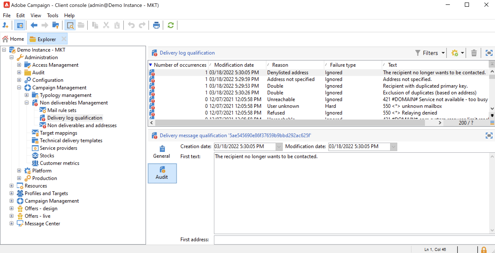

# 瞭解傳遞失敗 {#delivery-failures}

ISP提供返回故障通知時，發送嘗試和失敗的結果。 彈跳處理是清單衛生的關鍵部分。 在給定電子郵件已連續多次跳轉後，此進程會將其標籤為要抑制。

此過程阻止系統繼續發送無效的電子郵件地址。 Bounces是ISP用來確定IP信譽的關鍵資料之一。 關注這一指標很重要。 「已交付」與「已退出」可能是衡量營銷資訊傳遞情況的最常見方式：交付的百分比越高越好。

如果無法將消息發送到配置檔案，遠程伺服器將自動向Adobe Campaign發送錯誤消息。 此錯誤被限定用於確定是否應隔離電子郵件地址、電話號碼或設備。 請參閱 [彈出郵件管理](#bounce-mail-qualification)。

發送消息後，您可以查看每個配置檔案的傳遞狀態以及傳遞日誌中關聯的失敗類型和原因。

當隔離電子郵件地址或配置檔案在密碼清單中時，收件人將在傳遞準備步驟中排除。 已排除的消息列在傳遞儀表板中。

## 為什麼郵件傳遞失敗 {#delivery-failure-reasons}

消息失敗時有兩種錯誤類型。 每個傳遞失敗類型都確定地址是否發送到 [隔離](quarantines.md#quarantine-reason) 或者不是。

* **硬邊界**
硬門禁是ISP確定無法送達訂閱者地址的郵寄嘗試後產生的永久故障。 在Adobe Campaign，被歸類為無法送達的硬回報會被添加到隔離清單中，這意味著不會重試。 有些情況下，如果故障原因未知，則會忽略硬反彈。

   以下是一些常見的硬邊界例子：地址不存在，帳戶已禁用，語法錯誤，域錯誤

* **軟邊界**
軟邊界是ISP在發送郵件時產生的臨時故障。 軟故障將 [重試](#retries) 多次（差異取決於使用自定義或開箱交貨設定）以嘗試成功交貨。 在嘗試最大重試次數（這種重試次數取決於設定）之前，不會將持續軟彈回的地址添加到隔離中。

   軟邊界的一些常見原因包括：郵箱已滿，正在關閉接收電子郵件伺服器，發件人信譽問題

的  **已忽略** 錯誤類型已知為臨時錯誤，例如「外出」或技術錯誤，例如，如果發件人類型為「postmaster」。

反饋循環的運行方式與反饋電子郵件類似：當用戶將電子郵件定義為垃圾郵件時，您可以在Adobe Campaign配置電子郵件規則以阻止向此用戶發送的所有郵件。 即使這些用戶的地址未按一下取消訂閱連結，也會拒絕列出。 地址將添加到(**NMS地址**)隔離表，而不是(**Nms收件人**)收件人表 **[!UICONTROL Denylisted]** 狀態。 瞭解有關中反饋循環機制的詳細資訊 [Adobe可交付性最佳實踐指南](https://experienceleague.adobe.com/docs/deliverability-learn/deliverability-best-practice-guide/transition-process/infrastructure.html#feedback-loops)。

## 同步與非同步錯誤 {#synchronous-and-asynchronous-errors}

消息傳遞可能立即失敗，在這種情況下，我們將其定義為同步錯誤。 如果消息發送失敗或更晚，則在發送後，錯誤為非同步。

這些類型的錯誤管理如下：

* **同步錯誤**:Adobe Campaign傳遞伺服器聯繫的遠程伺服器立即返回錯誤消息。 不允許將傳遞發送到配置檔案的伺服器。 增強型MTA確定退回類型並確認錯誤，並將該資訊發回市場活動，以確定是否應隔離相關電子郵件地址。 請參閱[退信資格](#bounce-mail-qualification)。

* **非同步錯誤**:接收伺服器稍後會重新發送反彈郵件或SR。 此錯誤用與錯誤相關的標籤限定。 傳送後一週內，可能會發生非同步錯誤。

>[!NOTE]
>
>作為Managed Services用戶，彈出郵箱的配置由Adobe執行。

## 退回郵件資格 {#bounce-mail-qualification}

<!--NO LONGER WITH MOMENTUM - Rules used by Campaign to qualify delivery failures are listed in the **[!UICONTROL Administration > Campaign Management > Non deliverables Management > Delivery log qualification]** node. It is non-exhaustive, and is regularly updated by Adobe Campaign and can also be managed by the user.

-->

目前，Adobe Campaign處理反彈郵件資格的方式取決於錯誤類型：

* **同步錯誤**:「增強的MTA」確定退貨類型和資格，並將該資訊發回市場活動。 在 **[!UICONTROL Delivery log qualification]** 表不用於 **同步** 傳遞失敗錯誤消息。

* **非同步錯誤**:市場活動用於限定非同步傳遞失敗的規則列在 **[!UICONTROL Administration > Campaign Management > Non deliverables Management > Delivery log qualification]** 的下界。 非同步綁定由inMail進程通過 **[!UICONTROL Inbound email]** 規則。 有關此內容的詳細資訊，請參閱 [Adobe Campaign Classicv7文檔](https://experienceleague.adobe.com/docs/campaign-classic/using/sending-messages/monitoring-deliveries/understanding-delivery-failures.html#bounce-mail-qualification){target=&quot;_blank&quot;}。

<!--NO LONGER WITH MOMENTUM - The message returned by the remote server on the first occurrence of this error type is displayed in the **[!UICONTROL First text]** column of the **[!UICONTROL Audit]** tab.



Adobe Campaign filters this message to delete the variable content (such as IDs, dates, email addresses, phone numbers, etc.) and displays the filtered result in the **[!UICONTROL Text]** column. The variables are replaced with **`#xxx#`**, except addresses that are replaced with **`*`**.

This process allows to bring together all failures of the same type and avoid multiple entries for similar errors in the Delivery log qualification table.
  
>[!NOTE]
>
>The **[!UICONTROL Number of occurrences]** field displays the number of occurrences of the message in the list. It is limited to 100 000 occurrences. You can edit the field, if you want, for example, to reset it.

Bounce mails can have the following qualification status:

* **[!UICONTROL To qualify]** : the bounce mail could not be qualified. Qualification must be assigned to the Deliverability team to guarantee efficient platform deliverability. As long as it is not qualified, the bounce mail is not used to enrich the list of email management rules.
* **[!UICONTROL Keep]** : the bounce mail was qualified and will be used by the **Refresh for deliverability** workflow to be compared to existing email management rules and enrich the list.
* **[!UICONTROL Ignore]** : the bounce mail is ignored, meaning that this bounce will never cause the recipient's address to be quarantined. It will not be used by the **Refresh for deliverability** workflow and it will not be sent to client instances.


>[!NOTE]
>
>In case of an outage of an ISP, emails sent through Campaign will be wrongly marked as bounces. To correct this, you need to update bounce qualification.-->


## 重試管理 {#retries}

如果在出現臨時錯誤後郵件傳遞失敗(**軟** 或 **已忽略**)，發送市場活動重試次數。 這些重試可以執行到交貨期限結束為止。

重試次數和重試頻率由增強型MTA根據消息的ISP返回的反彈響應的類型和嚴重性設定。

<!--NO LONGER WITH MOMENTUM - The default configuration defines five retries at one-hour intervals, followed by one retry per day for four days. The number of retries can be changed globally or for each delivery or delivery template. If you need to adapt delivery duration and retries, contact Adobe Support.-->

## 電子郵件錯誤類型 {#email-error-types}

對於電子郵件渠道，以下列出了交付失敗的可能原因。

<table> 
 <tbody> 
  <tr> 
   <td> 錯誤標籤 </td> 
   <td> 錯誤類型 </td> 
   <td> 技術價值 </td> 
   <td> 說明 </td> 
  </tr> 
  <tr> 
   <td> 帳戶已停用 </td> 
   <td> 軟/硬 </td> 
   <td> 4 </td> 
   <td> 連結到地址的帳戶不再處於活動狀態。 當Internet訪問提供程式(IAP)檢測到長時間不活動時，它可以關閉用戶帳戶。 然後，無法向用戶地址交付。 如果帳戶由於六個月的不活動狀態而暫時禁用，並且仍然可以激活，則將分配「有錯誤」狀態，並重試帳戶，直到錯誤計數器達到5。 如果錯誤表明帳戶已永久停用，則它將直接設定為「隔離」。<br /> </td> 
  </tr> 
  <tr> 
   <td> 隔離中的地址 </td> 
   <td> 硬 </td> 
   <td> 9 </td> 
   <td> 地址已置於隔離狀態。<br /> </td> 
  </tr> 
  <tr> 
   <td> 未指定地址 </td> 
   <td> 硬 </td> 
   <td> 7 </td> 
   <td> 未為收件人提供地址。<br /> </td> 
  </tr> 
  <tr> 
   <td> 不良地址 </td> 
   <td> 已忽略 </td> 
   <td> 14 </td> 
   <td> 此地址的質量評級太低。<br /> </td> 
  </tr> 
  <tr> 
   <td> 登錄地址 </td> 
   <td> 硬 </td> 
   <td> 8 </td> 
   <td> 發送時已將地址添加到denylist。 此狀態用於將資料從外部清單和外部系統導入Adobe Campaign隔離清單。<br /> </td> 
  </tr> 
  <tr> 
   <td> 控制地址 </td> 
   <td> 已忽略 </td> 
   <td> 127 </td> 
   <td> 收件人的地址是控制組的一部分。<br /> </td> 
  </tr> 
  <tr> 
   <td> 雙線 </td> 
   <td> 已忽略 </td> 
   <td> 10 </td> 
   <td> 收件人的地址已在此傳遞中。<br /> </td> 
  </tr> 
  <tr> 
   <td> 忽略錯誤 </td> 
   <td> 已忽略 </td> 
   <td> 25 </td> 
   <td> 地址在允許清單中。 因此，將忽略該錯誤，併發送電子郵件。<br /> </td> 
  </tr> 
  <tr> 
   <td> 仲裁後排除 </td> 
   <td> 已忽略 </td> 
   <td> 12 </td> 
   <td> 收件人被「仲裁」類型的市場活動類型規則排除。<br /> </td> 
  </tr> 
  <tr> 
   <td> 由SQL規則排除 </td> 
   <td> 已忽略 </td> 
   <td> 11 </td> 
   <td> 收件人被「SQL」類型的市場活動類型規則排除。<br /> </td> 
  </tr> 
  <tr> 
   <td> 無效域 </td> 
   <td> 軟 </td> 
   <td> 2 </td> 
   <td> 電子郵件地址的域不正確或不再存在。 此設定檔將再次定位，直到錯誤計數達到5。之後，記錄將設定為「隔離」狀態，不會再重試。<br /> </td> 
  </tr> 
  <tr> 
   <td> 郵箱已滿 </td> 
   <td> 軟 </td> 
   <td> 5 </td> 
   <td> 此用戶的郵箱已滿，無法接受更多郵件。 此設定檔將再次定位，直到錯誤計數達到5。之後，記錄將設定為「隔離」狀態，不會再重試。<br /> 此類錯誤由清除進程管理，地址在30天後設定為有效狀態。<br /> 警告：要自動從隔離地址清單中刪除地址，必須啟動資料庫清理技術工作流。<br /> </td> 
  </tr> 
  <tr> 
   <td> 未連接 </td> 
   <td> 已忽略 </td> 
   <td> 6 </td> 
   <td> 當發送消息時，收件人的行動電話關閉或未連接到網路。<br /> </td> 
  </tr> 
  <tr> 
   <td> 未定義 </td> 
   <td> 未定義 </td> 
   <td> 0 </td> 
   <td> 該地址處於限定狀態，因為錯誤尚未遞增。 當伺服器傳送新錯誤訊息時，會發生此類錯誤：它可能是孤立的錯誤，但如果再次發生，錯誤計數器會增加，這會提醒技術團隊。然後，他們可以通過 <span class="uicontrol">管理</span> / <span class="uicontrol">市場活動管理</span> / <span class="uicontrol">非交付項管理</span> 樹結構中的節點。<br /> </td> 
  </tr> 
  <tr> 
   <td> 無資格獲得優惠 </td> 
   <td> 已忽略 </td> 
   <td> 16 </td> 
   <td> 收件人無資格在交貨中獲得優惠。<br /> </td> 
  </tr> 
  <tr> 
   <td> 拒絕 </td> 
   <td> 軟/硬 </td> 
   <td> 20 </td> 
   <td> 由於作為垃圾郵件報告的安全反饋，該地址已被隔離。 根據錯誤，將重試該地址，直到錯誤計數器達到5，或直接將其發送到隔離。<br /> </td> 
  </tr> 
  <tr> 
   <td> 目標大小受限 </td> 
   <td> 已忽略 </td> 
   <td> 17 </td> 
   <td> 已達到收件人的最大交貨大小。<br /> </td> 
  </tr> 
  <tr> 
   <td> 未限定地址 </td> 
   <td> 已忽略 </td> 
   <td> 15 </td> 
   <td> 郵政地址未被限定。<br /> </td> 
  </tr> 
  <tr> 
   <td> 無法訪問 </td> 
   <td> 軟/硬 </td> 
   <td> 3 </td> 
   <td> 消息傳遞鏈中出錯。 可能是SMTP中繼上的事件、臨時無法訪問的域等。 根據錯誤，將重試該地址，直到錯誤計數器達到5，或直接將其發送到隔離。<br /> </td> 
  </tr> 
  <tr> 
   <td> 用戶未知 </td> 
   <td> 硬 </td> 
   <td> 1 </td> 
   <td> 地址不存在。 此設定檔不會再嘗試傳送。<br /> </td> 
  </tr> 
 </tbody> 
</table>


## 推送通知錯誤類型 {#push-error-types}

對於移動應用渠道，下面列出了交付失敗的可能原因。

### iOS {#ios-quarantine}

HTTP/V2協定允許對每個推送傳遞提供直接反饋和狀態。 如果使用HTTP/V2協定連接器，則反饋服務不再由 **[!UICONTROL mobileAppOptOutMgt]** 工作流。 卸載或重新安裝移動應用程式時，令牌被視為未註冊。

同時，如果APN返回消息的「未註冊」狀態，則目標令牌將立即被隔離。

<table> 
 <tbody> 
  <tr> 
   <td> <strong>方案</strong><br /> </td> 
   <td> <strong>狀態</strong><br /> </td> 
   <td> <strong>錯誤消息</strong><br /> </td> 
   <td> <strong>失敗類型</strong><br /> </td> 
   <td> <strong>失敗原因</strong><br /> </td> 
   <td> <strong>重試</strong><br /> </td> 
  </tr> 
  <tr> 
   <td> 已開啟目標設備<br /> </td> 
   <td> 確定<br /> </td> 
   <td> </td> 
   <td> </td> 
   <td> </td> 
   <td> </td> 
  </tr> 
  <tr> 
   <td> 關閉目標設備<br /> </td> 
   <td> 確定<br /> </td> 
   <td> </td> 
   <td> </td> 
   <td> </td> 
   <td> </td> 
  </tr> 
  <tr> 
   <td> 用戶禁用應用程式的通知<br /> </td> 
   <td> 確定<br /> </td> 
   <td> </td> 
   <td> </td> 
   <td> </td> 
   <td> </td> 
  </tr> 
  <tr> 
   <td> 消息建立/分析階段 — 負載太大<br /> </td> 
   <td> 失敗<br /> </td> 
   <td> 負載過長<br /> </td> 
   <td> 軟<br /> </td> 
   <td> 拒絕<br /> </td> 
   <td> 否<br /> </td> 
  </tr> 
  <tr> 
   <td> 消息建立/分析階段 — 意外的內容格式問題<br /> </td> 
   <td> 失敗<br /> </td> 
   <td> 根據錯誤顯示的各種錯誤消息<br /> </td> 
   <td> 軟<br /> </td> 
   <td> 未定義<br /> </td> 
   <td> 否<br /> </td> 
  </tr> 
  <tr> 
   <td> 證書頒發（密碼、損壞等） 與APNs問題的test連接<br /> </td> 
   <td> 失敗<br /> </td> 
   <td> 根據錯誤顯示的各種錯誤消息<br /> </td> 
   <td> 軟<br /> </td> 
   <td> 拒絕<br /> </td> 
   <td> 否<br /> </td> 
  </tr> 
  <tr> 
   <td> 發送過程中網路連接丟失<br /> </td> 
   <td> 失敗<br /> </td> 
   <td> 連接錯誤<br /> </td> 
   <td> 未定義<br /> </td> 
   <td> 無法訪問<br /> </td> 
   <td> 是<br /> </td> 
  </tr> 
  <tr> 
   <td> APN消息拒絕：取消註冊<br /> 用戶已刪除應用程式或令牌已過期<br /> </td> 
   <td> 失敗<br /> </td> 
   <td> 未註冊<br /> </td> 
   <td> 硬<br /> </td> 
   <td> 用戶未知<br /> </td> 
   <td> 否<br /> </td> 
  </tr> 
  <tr> 
   <td> APN消息拒絕：所有其他錯誤<br /> </td> 
   <td> 失敗<br /> </td> 
   <td> 錯誤拒絕原因將出現在錯誤消息中<br /> </td> 
   <td> 軟<br /> </td> 
   <td> 拒絕<br /> </td> 
   <td> 否<br /> </td> 
  </tr> 
 </tbody> 
</table>

### Android隔離 {#android-quarantine}

**對於Android V1**

對於每個通知，Adobe Campaign直接從FCM伺服器接收同步錯誤。 Adobe Campaign會根據錯誤的嚴重性即時處理這些錯誤並生成硬錯誤或軟錯誤，並且可以執行重試：

* 超出負載長度、連接問題、服務可用性問題：重試執行，軟錯誤，失敗原因 **[!UICONTROL Refused]**。
* 超過設備配額：無重試，軟錯誤，失敗原因 **[!UICONTROL Refused]**。
* 無效或未註冊的令牌，意外錯誤，發件人帳戶問題：無重試，硬錯誤，失敗原因 **[!UICONTROL Refused]**。

的 **[!UICONTROL mobileAppOptOutMgt]** 工作流每6小時運行一次以更新 **AppSubscriptionRcp** 的子菜單。 對於聲明為未註冊或不再有效的令牌，該欄位 **已禁用** 設定為 **真** 連結到該設備令牌的訂閱將自動排除在將來的交付之外。

在傳遞分析期間，從目標中排除的所有設備將自動添加到 **排除LogAppSubRcp** 的子菜單。

>[!NOTE]
>
>對於使用百度連接器的客戶，以下是不同類型的錯誤：
>
>* 交付開始時的連接問題：故障類型 **[!UICONTROL Undefined]**&#x200B;故障原因 **[!UICONTROL Unreachable]**，重試。
>* 傳遞過程中連接丟失：軟錯誤，故障原因 **[!UICONTROL Refused]**，重試。
>* 百度在發送過程中返回的同步錯誤：硬錯誤，故障原因 **[!UICONTROL Refused]**，未執行重試。
>
>Adobe Campaign每隔10分鐘與百度伺服器聯繫，檢索發送消息的狀態，並更新廣播。 如果消息被聲明為已發送，則廣播中消息的狀態將設定為 **[!UICONTROL Received]**。 如果百度聲明錯誤，則狀態設定為 **[!UICONTROL Failed]**。

**對於Android V2**

Android V2隔離機制使用與Android V1相同的過程，同樣適用於訂閱和排除更新。 有關詳情，請參閱 [Android V1](#android-quarantine) 的子菜單。

<table> 
 <tbody> 
  <tr> 
   <td> <strong>方案</strong><br /> </td> 
   <td> <strong>狀態</strong><br /> </td> 
   <td> <strong>錯誤消息</strong><br /> </td> 
   <td> <strong>失敗類型</strong><br /> </td> 
   <td> <strong>失敗原因</strong><br /> </td> 
   <td> <strong>重試</strong><br /> </td> 
  </tr> 
  <tr> 
   <td> 消息建立/分析階段：自定義域中使用的非法關鍵字<br /> </td> 
   <td> 失敗<br /> </td> 
   <td> 無法使用以下關鍵字：{1}<br /> </td> 
   <td> 軟<br /> </td> 
   <td> </td> 
   <td> 否<br /> </td> 
  </tr> 
  <tr> 
   <td> 消息建立/分析階段：負載太大<br /> </td> 
   <td> 失敗<br /> </td> 
   <td> 通知太重：{1}位，而僅授權{2}位<br /> </td> 
   <td> 軟<br /> </td> 
   <td> 拒絕<br /> </td> 
   <td> 否<br /> </td> 
  </tr> 
  <tr> 
   <td> 發送過程中網路連接丟失<br /> </td> 
   <td> 失敗<br /> </td> 
   <td> 地址上沒有來自Firebase雲消息服務的響應：{1}<br /> </td> 
   <td> 軟<br /> </td> 
   <td> 無法訪問<br /> </td> 
   <td> 是<br /> </td> 
  </tr> 
  <tr> 
   <td> FCM消息拒絕：FCM伺服器暫時不可用（例如超時）。 <br /> </td> 
   <td> 失敗<br /> </td> 
   <td> Firebase雲消息服務暫時不可用<br /> </td> 
   <td> 軟<br /> </td> 
   <td> 無法訪問<br /> </td> 
   <td> 是<br /> </td> 
  </tr> 
  <tr> 
   <td> FCM消息拒絕：驗證發件人帳戶時出錯<br /> </td> 
   <td> 失敗<br /> </td> 
   <td> 無法識別開發人員帳戶，請檢查您的ID和密碼<br /> </td> 
   <td> 軟<br /> </td> 
   <td> 拒絕<br /> </td> 
   <td> 否<br /> </td> 
  </tr> 
  <tr> 
   <td> FCM消息拒絕：超過設備配額<br /> </td> 
   <td> 失敗<br /> </td> 
   <td> </td> 
   <td> 軟<br /> </td> 
   <td> 拒絕<br /> </td> 
   <td> 是<br /> </td> 
  </tr> 
  <tr> 
   <td> FCM消息拒絕：註冊無效/未註冊<br /> </td> 
   <td> 失敗<br /> </td> 
   <td> </td> 
   <td> 硬<br /> </td> 
   <td> 用戶未知<br /> </td> 
   <td> 否<br /> </td> 
  </tr> 
  <tr> 
   <td> FCM消息拒絕：所有其他錯誤<br /> </td> 
   <td> 失敗<br /> </td> 
   <td> Firebase雲消息伺服器返回了意外錯誤代碼：{1} </td> 
   <td> </td> 
   <td> 拒絕<br /> </td> 
   <td> 否<br /> </td> 
  </tr> 
    <tr> 
   <td> FCM消息拒絕：參數無效<br /> </td> 
   <td> 失敗<br /> </td> 
   <td> 無效_參數 </td> 
   <td> 已忽略</td> 
   <td> 未定義<br /> </td> 
   <td> 否<br /> </td> 
  </tr>
    <tr> 
   <td> FCM消息拒絕：第三方身份驗證錯誤<br /> </td> 
   <td> 失敗<br /> </td> 
   <td> 第三方身份驗證錯誤 </td> 
   <td> 已忽略</td>
   <td> 拒絕<br /> </td> 
   <td> 是<br /> </td> 
  </tr>
    <tr> 
   <td> FCM消息拒絕：發件人ID不匹配<br /> </td> 
   <td> 失敗<br /> </td> 
   <td> SENDER_ID_MISMATCH </td> 
   <td> 軟</td>
   <td> 用戶未知<br /> </td> 
   <td> 否<br /> </td> 
  </tr>
    <tr> 
   <td> FCM消息拒絕：未註冊<br /> </td> 
   <td> 失敗<br /> </td>
   <td> 未註冊 </td> 
   <td> 硬</td> 
   <td> 用戶未知<br /> </td> 
   <td> 否<br /> </td> 
  </tr>
    <tr> 
   <td> FCM消息拒絕：內部<br /> </td> 
   <td> 失敗<br /> </td> 
   <td> 內部 </td> 
   <td> 已忽略</td> 
   <td> 拒絕<br /> </td> 
   <td> 是<br /> </td> 
  </tr>
    <tr> 
   <td> FCM消息拒絕：不可用<br /> </td> 
   <td> 失敗<br /> </td> 
   <td> 不可用</td> 
   <td> 已忽略</td> 
   <td> 拒絕<br /> </td> 
   <td> 是<br /> </td> 
  </tr>
    <tr> 
   <td> FCM消息拒絕：意外錯誤代碼<br /> </td> 
   <td> 失敗<br /> </td> 
   <td> 意外錯誤代碼</td> 
   <td> 已忽略</td> 
   <td> 拒絕<br /> </td> 
   <td> 否<br /> </td> 
  </tr>
  <tr> 
   <td> 身份驗證：連接問題<br /> </td> 
   <td> 失敗<br /> </td> 
   <td> 無法連接到身份驗證伺服器 </td> 
   <td> 已忽略</td>
   <td> 拒絕<br /> </td> 
   <td> 是<br /> </td> 
  </tr>
    <tr> 
   <td> 身份驗證：請求中的未授權客戶端或作用域。<br /> </td> 
   <td> 失敗<br /> </td> 
   <td> 未經授權的客戶端 </td> 
   <td> 已忽略</td>
   <td> 拒絕<br /> </td> 
   <td> 否<br /> </td> 
  </tr>
    <tr> 
   <td> 身份驗證：客戶端未授權使用此方法檢索訪問令牌，或客戶端未授權請求的任何作用域。<br /> </td> 
   <td> 失敗<br /> </td> 
   <td> 未經授權的客戶端 </td> 
   <td> 已忽略</td>
   <td> 拒絕<br /> </td> 
   <td> 否<br /> </td> 
  </tr>
    <tr> 
   <td> 身份驗證：拒絕訪問<br /> </td> 
   <td> 失敗<br /> </td>
   <td> 拒絕訪問</td> 
   <td> 已忽略</td>
   <td> 拒絕<br /> </td> 
   <td> 否<br /> </td> 
  </tr>
    <tr> 
   <td> 身份驗證：無效電子郵件<br /> </td> 
   <td> 失敗<br /> </td> 
   <td> 無效授予 </td> 
   <td> 已忽略</td> 
   <td> 拒絕<br /> </td> 
   <td> 否<br /> </td> 
  </tr>
    <tr> 
   <td> 身份驗證：JWT無效<br /> </td> 
   <td> 失敗<br /> </td> 
   <td> 無效授予 </td> 
   <td> 已忽略</td> 
   <td> 拒絕<br /> </td> 
   <td> 否<br /> </td> 
  </tr>
    <tr> 
   <td> 身份驗證：JWT簽名無效<br /> </td> 
   <td> 失敗<br /> </td> 
   <td> 無效授予 </td> 
   <td> 已忽略</td> 
   <td> 拒絕<br /> </td> 
   <td> 否<br /> </td> 
  </tr>
    <tr> 
   <td> 身份驗證：提供的OAuth作用域或ID令牌訪問群無效<br /> </td> 
   <td> 失敗<br /> </td> 
   <td> 未經授權的客戶端</td> 
   <td> 已忽略</td> 
   <td> 拒絕<br /> </td> 
   <td> 否<br /> </td> 
  </tr>
    <tr> 
   <td> 身份驗證：已禁用OAuth客戶端<br /> </td> 
   <td> 失敗<br /> </td> 
   <td> 已禁用客戶端</td> 
   <td> 已忽略</td> 
   <td> 拒絕<br /> </td> 
   <td> 否<br /> </td> 
  </tr>
 </tbody> 
</table>

## SMS隔離 {#sms-quarantines}

**對於標準連接器**

下面列出了SMS通道的特性。

>[!NOTE]
>
>的 **[!UICONTROL Delivery log qualification]** 表不適用於 **擴展通用SMPP** 連接器。

<table> 
 <tbody> 
  <tr> 
   <td> <strong>方案</strong><br /> </td> 
   <td> <strong>狀態</strong><br /> </td> 
   <td> <strong>錯誤消息</strong><br /> </td> 
   <td> <strong>失敗類型</strong><br /> </td> 
   <td> <strong>失敗原因</strong><br /> </td> 
  </tr> 
  <tr> 
   <td> 發送到提供程式<br /> </td> 
   <td> 已傳送<br /> </td> 
   <td> </td> 
   <td> </td> 
   <td> </td> 
  </tr> 
  <tr> 
   <td> 在移動設備上接收<br /> </td> 
   <td> 已接收<br /> </td> 
   <td> </td> 
   <td> </td> 
   <td> </td> 
  </tr> 
  <tr> 
   <td> 提供程式返回的錯誤<br /> </td> 
   <td> 失敗<br /> </td> 
   <td> 接收資料時出錯（SR或MO）<br /> </td> 
   <td> 軟<br /> </td> 
   <td> 無法訪問<br /> </td> 
  </tr> 
  <tr> 
   <td> 無效的MT確認<br /> </td> 
   <td> 失敗<br /> </td> 
   <td> 處理髮送查詢的確認幀時出錯「{1}」<br /> </td> 
   <td> 軟<br /> </td> 
   <td> 無法訪問<br /> </td> 
  </tr> 
  <tr> 
   <td> 發送MT時出錯<br /> </td> 
   <td> 失敗<br /> </td> 
   <td> 發送消息時出錯<br /> </td> 
   <td> 軟<br /> </td> 
   <td> 無法訪問<br /> </td> 
  </tr> 
 </tbody> 
</table>

**對於擴展通用SMPP連接器**

當使用SMPP協定發送SMS消息時，錯誤管理被以不同方式處理。

SMPP連接器從SR（狀態報告）消息中檢索資料，該消息使用規則運算式(regexes)返回以過濾其內容。 然後，將此資料與在 **[!UICONTROL Delivery log qualification]** 表(通過 **[!UICONTROL Administration]** > **[!UICONTROL Campaign Management]** > **[!UICONTROL Non deliverables Management]** )的正平方根。

在限定新類型的錯誤之前，故障原因始終設定為 **拒絕** 預設值。

>[!NOTE]
>
>故障類型和故障原因與電子郵件相同。
>
>請向提供商咨詢狀態和錯誤代碼清單，以便在「交付日誌」限定表中設定正確的故障類型和故障原因。

生成的消息示例：

```
SR Generic DELIVRD 000|#MESSAGE#
```

* 所有錯誤消息以開頭 **SR** 將SMS錯誤代碼與電子郵件錯誤代碼區分開。
* 第二部分(**泛型** 在本示例中)的錯誤消息是指SMSC實現的名稱，如 **[!UICONTROL SMSC implementation name]** SMS外部帳戶的欄位。

   由於同一錯誤代碼可能對每個提供程式具有不同的含義，因此此欄位允許您知道生成錯誤代碼的提供程式。 然後，您可以在相關提供商的文檔中找到錯誤。

* 第三部分(**德利夫德** 在此示例中)，錯誤消息與使用SMS外部帳戶中定義的狀態提取規則運算式從SR檢索到的狀態代碼相對應。

   此規則運算式在 **[!UICONTROL SMSC specificities]** 的子菜單。
預設情況下，regex將提取 **stat:** 定義的欄位 **附錄B** 的下界 **SMPP 3.4規範**。

* 第四部分(**000** 在本示例中)，錯誤消息與使用SMS外部帳戶中定義的錯誤代碼提取規則運算式從SR提取的錯誤代碼相對應。

   此規則運算式在 **[!UICONTROL SMSC specificities]** 的子菜單。

   預設情況下，regex將提取 **錯誤：** 定義的欄位 **附錄B** 的下界 **SMPP 3.4規範**。

* 管道符號(|)之後的所有內容僅顯示在 **[!UICONTROL First text]** 列 **[!UICONTROL Delivery log qualification]** 的子菜單。 此內容始終替換為 **#MESSAGE#** 在消息規範化後。 此過程避免出現多個類似錯誤條目，與電子郵件條目相同。

擴展通用SMPP連接器應用啟發式來查找明顯預設值：如果狀態以 **德利夫**，它被認為是成功的，因為它與常用狀態匹配 **德利夫德** 或 **已交付** 供大多數提供商使用。 任何其他狀態都會導致硬故障。
