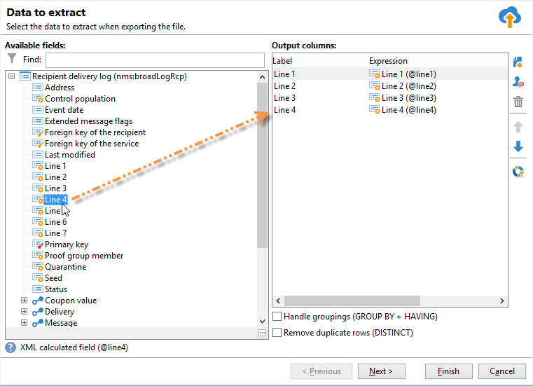

# 建立直接郵件傳遞

直接郵件傳遞可讓您產生擷取檔案，其中包含目標群體的資料。 然後，您可以與將傳送訊息給目標母體的提供者共用此檔案。

產生檔案的步驟如下：

1. [建立傳遞](#creating-a-direct-mail-delivery)
1. [定義客群](#defining-the-direct-mail-audience)
1. [定義檔案的內容](#defining-the-direct-mail-content)
1. [驗證傳遞](#validating)
1. [開始傳遞](#start-delivery)

## 建立傳遞{#creating-a-direct-mail-delivery}

根據範本建立直接郵件傳遞。 您可以複製並設定&#x200B;**[!UICONTROL Deliver by direct mail (paper)]**&#x200B;內建範本。

若要建立新的直接郵件傳送，請遵循下列步驟：

>[!NOTE]
>
>在[本節](../start/create-message.md)中介紹了傳遞建立的全域概念。

1. 例如，從「傳遞」控制面板建立新傳遞。
1. 選取傳遞範本&#x200B;**透過直接郵件（紙張）傳遞**。

   

1. 使用標籤、程式碼和說明來識別您的傳遞。 如需詳細資訊，請參閱[本章節](../start/create-message.md#create-the-delivery)。
1. 按一下&#x200B;**繼續**&#x200B;以確認此資訊並顯示訊息設定視窗。

## 定義客群{#defining-the-direct-mail-audience}

收件者設定檔必須至少包含其名稱和郵寄地址。

郵寄地址為計算欄位。 依預設，地址最多可包含6行：第一行包含名字和姓氏，下一行包含郵遞區號（道路等），而最後一行包含郵遞區號和城鎮。 可在nms:recipient結構描述中檢閱預設計算postalAddress欄位的定義。

如果名稱、郵遞區號欄位和城鎮/城市欄位並非空白，則會將地址視為完整。 所有位址不完整的收件者都會從直接郵件傳遞中排除。

若要了解更多資訊，請參閱[此區段](../start/create-message.md#target-population)。

## 定義檔案的內容{#defining-the-direct-mail-content}

使用擷取精靈來定義要匯出至輸出檔案的資訊（欄）。

在&#x200B;**[!UICONTROL File]**&#x200B;欄位中定義了包含已擷取資料的檔案名稱。 欄位右側的按鈕可讓您使用個人化欄位來建立檔案名稱。

依照預設，擷取檔案會建立並儲存在伺服器上。 您可以將它儲存在電腦上。 若要這麼做，請核取&#x200B;**[!UICONTROL Download the generated file after the analysis of the delivery]**。 在此情況下，您需要指出本機儲存目錄的存取路徑以及檔案名稱。

對於直接郵件傳遞，擷取的內容定義在&#x200B;**[!UICONTROL Edit the extraction file format...]**&#x200B;連結中。

此連結可讓您存取擷取小幫手，並定義要匯出至輸出檔案的資訊（欄）。

您可以將個人化URL插入解壓縮檔案中。 如需詳細資訊，請參閱Adobe Campaign Classic [檔案](https://experienceleague.adobe.com/docs/campaign-classic/using/designing-content/web-forms/publishing-a-web-form.html){target="_blank"}。

>[!NOTE]
>
>此助理包含匯出助理的步驟以詳細說明Adobe Campaign Classic [檔案](https://experienceleague.adobe.com/docs/campaign-classic/using/getting-started/importing-and-exporting-data/generic-imports-exports/executing-export-jobs.html){target="_blank"}。

## 驗證傳遞{#validating}

檢查分析結果和輸出檔案的內容。

在行銷活動的內容中，於解壓縮日期建立解壓縮檔案。 您可以檢視擷取的檔案內容、核准該檔案，或視需要變更格式並重新啟動擷取。 一旦檔案獲得核准，您就可以將通知電子郵件傳送給路由器。 在[本頁](https://experienceleague.adobe.com/docs/campaign/automation/campaign-orchestration/marketing-campaign-approval.html?lang=zh-Hant){target="_blank"}中瞭解更多。

驗證傳遞時的全域概念顯示在[本節](../start/create-message.md#validate-the-delivery)中。

直接郵件傳遞的輸出檔案會在傳遞分析期間產生。 檔案的內容取決於選取的輸出欄（請參閱此[區段檔案](#defining-the-direct-mail-content)）。

>[!NOTE]
>
>分析階段在此[區段](delivery-analysis.md)中有詳細說明。

在分析階段會產生檔案，但未更新收件者的相關資訊（即傳遞記錄）。 因此，您可以取消此工作而不執行任何風險。

按一下&#x200B;**[!UICONTROL Confirm delivery]**&#x200B;之前，請先檢查分析結果和輸出檔案的內容。 確認訊息可讓您啟動傳送。

傳送確認會從指定的檔案中開始資料擷取。

接著，您可以關閉小幫手，並透過&#x200B;**[!UICONTROL Delivery]**&#x200B;索引標籤檢視傳送記錄檔（可透過傳送詳細資料存取）。

您可以從傳遞屬性的&#x200B;**[!UICONTROL Analysis]**&#x200B;索引標籤設定傳遞記錄擷取模式。

有兩種模式：

* **[!UICONTROL Messages are considered sent after validation]** （預設模式）：在此函式模式中，當操作員確認傳送（其狀態從「擱置的傳遞」傳遞到「已傳送」）且傳送自動設定為&#x200B;**[!UICONTROL Finished]**&#x200B;時，會更新所有broadlog。
* **[!UICONTROL A file of results determines the messages that are sent and those that have failed]** ：此模式可讓您透過服務提供者傳送的外部檔案更新broadlog。 在這種情況下，需要使用處理此資訊的工作流程來更新broadlog狀態。

  >[!NOTE]
  >
  >在此情況下，一旦更新broadlog，使用者的傳送狀態也需要變更為&#x200B;**[!UICONTROL Finished]**。

## 開始傳遞{#start-delivery}

驗證解壓縮檔案後，按一下&#x200B;**確認傳遞**&#x200B;確認訊息可讓您啟動傳遞。

確認會在指定的檔案中開始資料擷取。

在行銷活動的內容中，當所有核准都獲得授權時，擷取檔案會透過特殊工作流程建立，在預設設定中，當直接郵件傳送擱置擷取時，會自動開始。 若要了解更多資訊，請參閱[此區段](https://experienceleague.adobe.com/docs/campaign/automation/campaign-orchestration/marketing-campaign-deliveries.html?lang=zh-Hant){target="_blank"}。
