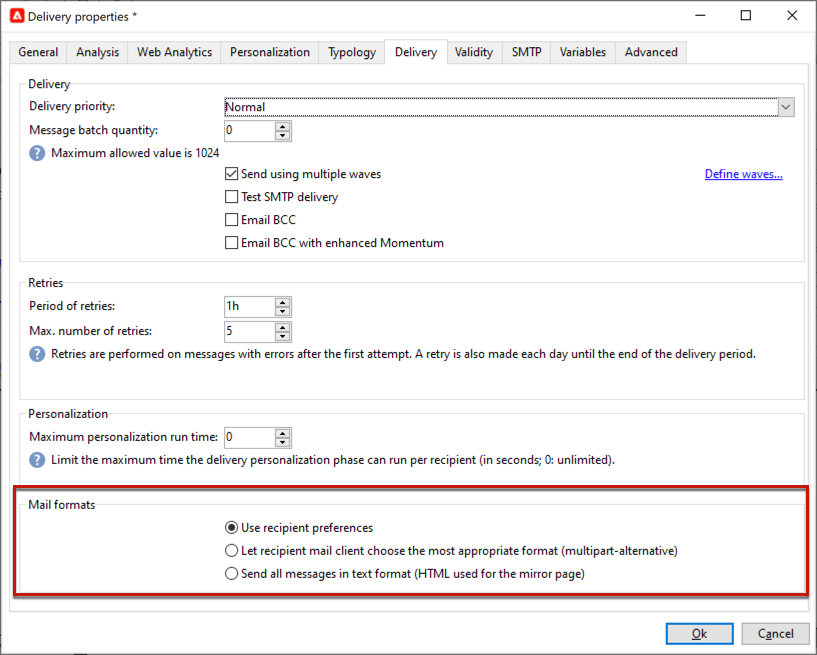

# 電子郵件參數 {#email-parameters}

本節介紹專屬於電子郵件傳送的傳送屬性中可用的選項和引數。

## 使用電子郵件密件副本 {#email-bcc}

您可以設定Adobe Campaign以保留從您的平台傳送的電子郵件副本。 此選項在[此頁面](email-bcc.md)中有詳細說明。

## 選取訊息格式 {#selecting-message-formats}

您可以變更已傳送電子郵件訊息的格式。 若要這麼做，請編輯傳遞屬性，然後按一下&#x200B;**[!UICONTROL Delivery]**&#x200B;標籤。

在視窗的下半部分選取電子郵件的格式：

* **[!UICONTROL Use recipient preferences]** （預設模式）

  訊息格式是根據儲存在收件者設定檔中的資料定義，並預設儲存在&#x200B;**[!UICONTROL email format]**&#x200B;欄位(@emailFormat)中。 如果收件者希望以特定格式接收郵件，則此格式為傳送的格式。如果未填入欄位，則會傳送替代的多重部分訊息（請參閱下文）。

* **[!UICONTROL Let recipient mail client choose the most appropriate format]**

  此訊息包含兩種格式：文字和HTML。 接收時顯示的格式取決於收件者郵件軟體的設定（替代的多重部分）。

  >[!IMPORTANT]
  >
  >此選項包含檔案的兩個版本。 因此，這會減少傳送輸送量，因為郵件大小較大。

* **[!UICONTROL Send all messages in text format]**

  訊息會以文字格式傳送。 不會傳送HTML格式，但只有當收件者按一下郵件時，才會用於映象頁面。

<!--
>[!NOTE]
>
>For more on defining the email content, see [this section]().-->

## 設定字元編碼 {#character-encoding}

在傳遞引數的&#x200B;**[!UICONTROL SMTP]**&#x200B;標籤中，**[!UICONTROL Character encoding]**&#x200B;區段可讓您設定特定編碼。

預設編碼為UTF-8。 如果部分收件者的電子郵件提供者不支援UTF-8標準編碼，您可能想要設定特定編碼，以正確向電子郵件的收件者顯示特殊字元。

例如，您想要傳送包含日文字元的電子郵件。 為確保所有字元都能正確顯示給在日本的收件者，您可能想要使用可支援日文字元的編碼，而非標準UTF-8。

若要這麼做，請選取「**[!UICONTROL Force the encoding used for messages]**」區段中的「**[!UICONTROL Character encoding]**」選項，然後從顯示的下拉式清單中選擇編碼。

## 管理退信電子郵件 {#managing-bounce-emails}

傳遞屬性的&#x200B;**[!UICONTROL SMTP]**&#x200B;標籤可讓您設定退回郵件的管理。

* **[!UICONTROL Errors-to-address]**：依預設，會在平台的預設錯誤方塊中接收退信電子郵件，但您可以定義傳遞的特定錯誤位址。

* **[!UICONTROL Bounce address]**：您也可以定義其他未處理退信電子郵件轉寄到的地址。 此位址可讓您在應用程式無法自動限定電子郵件時，調查退回的原因。

每個欄位都可以使用專用圖示進行個人化。 在[本節](personalization-fields.md)中進一步瞭解個人化欄位。

有關退回郵件管理的詳細資訊，請參閱[本節](delivery-failures.md#bounce-mail-management)。

## 啟用一鍵式清單取消訂閱 {#one-click-list-unsubscribe}

一鍵式清單取消訂閱URL是顯示在電子郵件寄件者資訊旁邊的連結或按鈕，可讓收件者只要按一下即可立即選擇退出您的郵寄清單。<!--[Learn more](https://experienceleague.adobe.com/docs/deliverability-learn/deliverability-best-practice-guide/additional-resources/campaign/acc-technical-recommendations.html#list-unsubscribe){target="_blank"}-->

它在ISP的電子郵件介面中顯示為&#x200B;**取消訂閱**&#x200B;連結。 例如：

必須新增名為List-Unsubscribe的SMTP標頭，以確保最佳傳遞能力管理，並可用作「回報為垃圾郵件」圖示的替代方案。 事實上，使用此功能可降低投訴率，並有助於保護您的聲譽。

>[!IMPORTANT]
>
>若要在電子郵件標題中顯示一鍵式取消訂閱URL，收件者的電子郵件使用者端必須支援此功能。

若要啟用此功能，請在傳遞屬性的&#x200B;**[!UICONTROL Addition of One-click List-Unsubscription Header]**&#x200B;索引標籤中選取&#x200B;**[!UICONTROL SMTP]**&#x200B;選項。

>[!NOTE]
>
>依預設，會啟用此選項。

<!--
>[!WARNING]
>
>If you uncheck this option in the delivery template, it will still be enabled by default in the deliveries created from this template. You need to enable the option again at the delivery level.-->

根據電子郵件使用者端及其用來執行選擇退出的方法，按一下電子郵件標頭中的&#x200B;**取消訂閱**&#x200B;連結可能會產生下列影響：

* 如果電子郵件使用者端使用&#x200B;**One-Click** List-Unsubscribe方法，收件者會直接選擇退出。

  >[!NOTE]
  >
  >Google和Yahoo！等主要ISP 要求寄件者遵守&#x200B;**一鍵式清單取消訂閱**。

* 如果電子郵件使用者端不支援One-Click List-Unsubscribe，他們仍可使用&#x200B;**&quot;mailto&quot;** List-Unsubscribe方法，此方法會將預先填入的電子郵件傳送至電子郵件標頭中指定的取消訂閱位址。

  您可以在標頭中明確設定地址，或使用動態地址（例如，使用&lt;%=errorAddress%>或選項&#39;NmsEmail_DefaultErrorAddr&#39;），這些地址可透過部署精靈設定。

>[!NOTE]
>
>您也可以手動設定[One-Click List-Unsubscribe](https://experienceleague.adobe.com/en/docs/deliverability-learn/deliverability-best-practice-guide/additional-resources/campaign/acc-technical-recommendations?lang=en#one-click-list-unsubscribe){target="_blank"}和[&quot;mailto&quot; List-Unsubscribe](https://experienceleague.adobe.com/en/docs/deliverability-learn/deliverability-best-practice-guide/additional-resources/campaign/acc-technical-recommendations?lang=en#mailto-list-unsubscribe){target="_blank"}方法。 Experience Cloud [傳遞能力最佳實務指南](https://experienceleague.adobe.com/docs/deliverability-learn/deliverability-best-practice-guide/additional-resources/campaign/acc-technical-recommendations.html#list-unsubscribe){target="_blank"}中會說明詳細步驟。

## 新增SMTP標頭 {#adding-smtp-headers}

您可以新增SMTP標頭至您的傳遞。 若要這麼做，請使用傳送中&#x200B;**[!UICONTROL SMTP]**&#x200B;索引標籤的相關區段。

在此視窗中輸入的指令碼必須參考以下格式的每行一個標題： **名稱:value**。

如有必要，會自動對值編碼。

>[!IMPORTANT]
>
>系統會為進階使用者保留新增指令碼，以便插入其他SMTP標題。
>
>此指令碼的語法必須符合以下內容類型的要求：沒有未使用的空間，沒有空行等。

## 產生映象頁面 {#generating-mirror-page}

鏡像頁面是可透過網頁瀏覽器線上存取的 HTML 頁面。其內容與電子郵件相同。如果您的收件者嘗試在收件匣中檢視您的電子郵件時遇到轉譯問題或影像損毀，此功能會很有用。

瞭解如何在[本節](mirror-page.md)中插入映象頁面的連結
