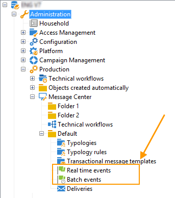

# 事件處理 {#event-processing}

在交易式訊息的情境下，事件會由外部資訊系統產生，並透過傳送至Adobe Campaign **[!UICONTROL PushEvent]** 和 **[!UICONTROL PushEvents]** 方法。 這些方法的說明請參閱 [本節](event-description.md).

此事件包含連結至事件的資料，例如：

* 其 [type](transactional.md#create-event-types)：訂單確認、網站上的帳戶建立等，
* 電子郵件地址或電話號碼，
* 在傳送之前擴充及個人化交易式訊息的任何其他資訊：客戶聯絡資訊、訊息語言、電子郵件格式等。

事件資料的範例：

若要處理異動訊息事件，下列步驟將套用至執行例項：

1. [事件集合](#event-collection)
1. [事件轉移至訊息範本](#routing-towards-a-template)
1. 使用個人化資料擴充事件
1. [傳遞執行](delivery-execution.md)
1. [事件回收](#event-recycling) 其連結傳遞失敗(透過Adobe Campaign工作流程)

完成所有步驟後，每個目標收件者都會收到個人化訊息。

## 收集事件 {#event-collection}

資訊系統產生的事件可使用兩種模式收集：

* 對SOAP方法的呼叫可讓您在Adobe Campaign中推送事件：PushEvent方法可讓您一次傳送一個事件，PushEvents方法則可讓您一次傳送多個事件。 [了解更多](event-description.md)。

* 建立工作流程可讓您透過匯入檔案或透過SQL閘道來復原事件，使用 [同盟資料存取](../connect/fda.md) 模組。

收集事件後，系統會根據技術工作流程，在執行個體的即時和批次佇列之間，同時等待連結至執行個體， [訊息範本](transactional-template.md).

>[!NOTE]
>
>在執行例項上， **[!UICONTROL Real time events]** 或 **[!UICONTROL Batch events]** 資料夾不得設定為檢視，因為這可能會導致存取許可權問題。 有關將資料夾設定為檢視的詳細資訊，請參閱 [本節](../audiences/folders-and-views.md#turn-a-folder-to-a-view).

## 將事件轉移至範本 {#event-to-template}

在執行例項上發佈訊息範本後，就會自動產生兩個範本：一個會連結至即時事件，另一個則會連結至批次事件。

路由步驟是將事件連結至適當的訊息範本，依據為：

* 在事件本身的屬性中指定的事件型別：

  

* 訊息範本屬性中指定的事件型別：

  

依預設，路由依賴下列資訊：

* 事件型別
* 要使用的頻道（預設：電子郵件）
* 根據發佈日期的最新傳遞範本

## 檢查事件狀態 {#event-statuses}

所有已處理的事件會分組到單一檢視中，位於 **事件歷史記錄** 資料夾或檔案總管。 它們可以依事件型別或依下列專案分類： **狀態**.

可能的狀態包括：

* **待處理**

   * 擱置事件可以是剛剛收集且尚未處理的事件。 此 **[!UICONTROL Number of errors]** 欄會顯示值0。 尚未連結電子郵件範本。
   * 擱置事件也可以是已處理但其確認錯誤的事件。 此 **[!UICONTROL Number of errors]** 欄會顯示不為0的值。 若要瞭解何時再次處理此事件，請參閱 **[!UICONTROL Process requested on]** 欄。

* **待處理的傳遞**
已處理事件，且已連結傳遞範本。 電子郵件正在等候傳遞，且已套用傳統傳遞程式。 如需詳細資訊，您可以開啟傳遞。
* **已傳送**， **已忽略** 和 **傳遞錯誤**
這些傳遞狀態是透過 **updateEventsStatus** 工作流程。 如需詳細資訊，您可以開啟相關的傳送。
* **未涵蓋的事件**
異動訊息路由階段失敗。 例如，Adobe Campaign找不到當作事件範本的電子郵件。
* **事件已過期**
已達到最大傳送嘗試次數。 該事件會視為Null。

## 回收事件 {#event-recycling}

如果特定頻道上的訊息傳送失敗，Adobe Campaign可以使用其他頻道重新傳送訊息。 例如，如果簡訊頻道上的傳遞失敗，則使用電子郵件頻道重新傳送訊息。

為此，您需要設定一個工作流程，使用重新建立所有事件 **傳遞錯誤** 狀態，並為他們指派不同的管道。

>[!CAUTION]
>
>此步驟只能使用工作流程執行，因此保留給專家使用者。 如需詳細資訊，請聯絡您的Adobe客戶主管。
