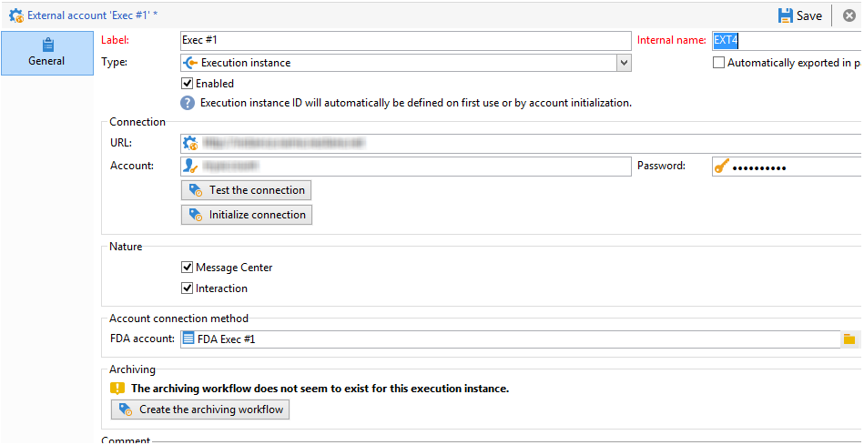

# 了解Campaign互動環境和架構

## 環境 {#environments}

管理選件時，每個目標維度會使用兩個環境：

* A **設計** 優惠方案管理員負責建立和分類優惠方案、編輯優惠方案，以及開始核准程式以便使用的環境。 此環境中也會定義每個類別的規則、可呈現優惠方案的優惠方案空間，以及用來定義優惠方案資格的預先定義篩選器。

   您也可以線上上環境中手動發佈類別。

   核准優惠方案的程式會詳細說明 [在本節](interaction-offer.md#approve-offers).

* A **live** 可在其中找到設計環境中已核准選件，以及設計環境中已設定的各種選件空間、篩選器、類別和規則。 在呼叫優惠方案引擎期間，引擎將一律使用即時環境中的優惠方案。

優惠方案只會部署在核准程式期間選取的優惠方案空間上。 因此，選件可能是即時的，但在同樣即時的選件空間上則無法使用。

## 入站和出站互動 {#interaction-types}

Adobe Campaign互動模組提出兩種互動：

* **傳入** 互動，由聯絡人啟動。 [了解更多](interaction-present-offers.md)
* **傳出** 互動，由促銷活動傳送管理員啟動。 [了解更多](interaction-send-offers.md)

這兩種互動可在 **統一模式** （針對單一連絡計算選件），或 **批次模式** （系統會為一組連絡人計算選件）。 通常，入站互動以統一模式執行，而出站互動以批次模式執行。 然而，可能有一些例外， [異動訊息](transactional.md) 例如，其中以單一模式執行出站交互。

一旦能夠或必須呈現優惠方案（根據執行的設定），優惠方案引擎就會扮演中介角色：它通過組合接收的關於聯繫人的資料和可以應用應用程式中指定的不同規則，自動計算可用聯繫人中的最佳可能選件。


## 分佈式架構

為了能夠支援可擴充性，並在入站通道上提供24/7服務， **互動** 模組是在分佈式架構中實現的。 此類架構已與 [訊息中心](../dev/architecture.md#transac-msg-archi) 和由數個例項組成：

* 一或多個專用於傳出頻道且包含行銷和環境設計基礎的控制執行個體
* 專用於入站通道的一個或多個執行實例


控制執行個體專用於入站通道，並包含目錄的線上版本。 每個執行例項都是獨立的，專屬於一個連絡人區段（例如，每個國家/地區一個執行例項）。 必須直接在執行時執行對選件引擎的呼叫（每個執行例項一個特定URL）。 由於執行個體之間的同步並非自動，因此來自相同聯絡人的互動必須透過相同執行個體傳送。

### 同步 {#synchronization}

選件同步是透過套件執行。 在執行例項上，所有目錄物件都會加上外部帳戶名稱的前置詞。 這表示同一個執行例項可支援數個控制例項（例如開發和生產例項）。

>[!CAUTION]
>
>使用簡短且明確的內部名稱。

選件會自動部署，然後在執行和控制執行個體時發佈。

在設計環境中刪除的選件在所有線上執行個體上都會停用。 清除期（在每個實例的部署助理中指定）和滑動期（在傳入命題的類型規則中指定）之後，所有實例上都會自動刪除過時的命題和選件。


系統會為每個環境和外部帳戶建立工作流程，以進行命題同步。 可針對每個環境和外部帳戶調整同步頻率。

您必須注意下列同步機制：

* 如果您使用從匿名環境到已識別環境的回傳功能，這兩個環境必須位於相同的執行例項上。
* 多個執行實例之間的同步不會即時執行。 同一聯絡人的互動必須傳送至相同例項。 控制實例必須專用於出站通道（非即時）。
* 行銷資料庫不會自動同步。 加權和適用性規則中使用的行銷資料必須在執行例項上重複。 此程式不是標準程式，您必須在整合期間進行開發。
* 命題同步只由FDA連線執行。
* 若您在相同例項上使用互動和訊息中心，這兩種情況都會透過FDA通訊協定進行同步。

### 包配置 {#packages-configuration}

任何直接連結至的結構擴充功能 **互動** （優惠方案、主張、收件者等） 必須部署在執行執行個體上。

此 **互動** 套件會安裝在所有執行個體（控制和執行）上。 另外提供兩個套件：一個包用於控制實例，另一個包用於每個執行實例。

>[!NOTE]
>
>安裝套件時， **long** 類型欄位 **nms：主張** 表格（例如命題ID）, **int64** 類型欄位。 此類資料在 [Campaign Classicv7檔案](https://experienceleague.adobe.com/docs/campaign-classic/using/configuring-campaign-classic/schema-reference/schema-structure.html?lang=en#mapping-the-types-of-adobe-campaign-dbms-data){target=&quot;_blank&quot;}。

資料保留期間是在每個執行個體上設定(透過 **[!UICONTROL Data purge]** )。 在執行例項上，此期間必須對應至類型規則（滑動期間）和要計算的適用性規則所需的歷史深度。

在控制執行個體上：

1. 為每個執行實例建立一個外部帳戶：

   

   * 填妥標籤，並新增簡短且明確的內部名稱。
   * 選取 **[!UICONTROL Execution instance]**。
   * 核取 **[!UICONTROL Enabled]** 選項。
   * 完成執行實例的連接參數。
   * 每個執行例項都必須連結至ID。 此ID會在您按一下 **[!UICONTROL Initialize connection]** 按鈕。
   * 檢查所使用的應用程式類型： **[!UICONTROL Message Center]**, **[!UICONTROL Interaction]**，或兩者皆有。
   * 輸入使用的FDA帳戶。 必須在執行實例上建立運算子，並且必須在有關實例的資料庫上具有以下讀寫權限：

      ```
      grant SELECT ON nmspropositionrcp, nmsoffer, nmsofferspace, xtkoption, xtkfolder TO user;
      grant DELETE, INSERT, UPDATE ON nmspropositionrcp TO user;
      ```
   >[!NOTE]
   >
   >必須在執行實例上授權控制實例的IP地址。

1. 設定環境：

   

   * 新增執行例項清單。
   * 對於每個，指定同步期間和篩選條件（例如，依國家/地區）。

      >[!NOTE]
      >
      >如果您遇到錯誤，可以查閱同步工作流程和優惠方案通知。 您可以在應用程式的技術工作流程中找到。

基於最佳化原因，如果執行例項上僅複製了部分行銷資料庫，則您可以指定連結至環境的受限架構，以允許使用者僅使用執行例項上可用的資料。 您可以使用執行例項上無法使用的資料來建立選件。 若要這麼做，您必須限制出站管道(**[!UICONTROL Taken into account if]** 欄位)。


### 維護選項 {#maintenance-options}

以下是控制實例上可用的維護選項清單：

>[!CAUTION]
>
>這些選項只能用於特定的維護案例。

* **`NmsInteraction_LastOfferEnvSynch_<offerEnvId>_<executionInstanceId>`**:環境在指定執行個體上同步的最後日期。
* **`NmsInteraction_LastPropositionSynch_<propositionSchema>_<executionInstanceIdSource>_<executionInstanceIdTarget>`**:指定架構的主張從一個實例同步到另一個實例的最後日期。
* **`NmsInteraction_MapWorkflowId`**:包含所有同步工作流生成的清單的選項。

下列選項適用於執行例項：

**NmsExecutionInstanceId**:包含例項ID的選項。

### 軟體包安裝 {#packages-installation}

如果您的例項先前沒有 **互動** 包，無需遷移。 預設情況下，主張表將在安裝軟體包後以64位元顯示。

>[!CAUTION]
>
>根據您實例中現有命題的數量，此操作可能需要一些時間。

* 如果您的實例很少或沒有命題，則不需要手動修改命題表。 安裝軟體包時將進行修改。
* 如果您的實例有很多建議，則最好先更改建議表的結構，然後安裝控制包並運行它們。 建議您在低活動期間執行查詢。

>[!NOTE]
>
>如果您已在主張表格中執行特定設定，請據以調整查詢。


有兩種方法：

**工作表** （建議）

```
CREATE TABLE NmsPropositionRcp_tmp AS SELECT * FROM nmspropositionrcp WHERE 0=1;
ALTER TABLE nmspropositionrcp_tmp
  ALTER COLUMN ipropositionid TYPE bigint,
  ALTER COLUMN iinteractionid TYPE bigint;
INSERT INTO nmspropositionrcp_tmp SELECT * FROM nmspropositionrcp;
DROP TABLE nmspropositionrcp;
CREATE INDEX proposition_id ON NmsPropositionRcp (ipropositionid);
CREATE INDEX nmspropositionrcp_deliveryid ON NmsPropositionRcp (ideliveryid);
CREATE INDEX nmspropositionrcp_lastmodified ON NmsPropositionRcp (tslastmodified);
CREATE INDEX nmspropositionrcp_offerid ON NmsPropositionRcp (iofferid);
CREATE INDEX nmspropositionrcp_offerspaceid ON NmsPropositionRcp (iofferspaceid);
CREATE INDEX nmspropositionrcp_recipientidid ON NmsPropositionRcp (irecipientid);
ALTER TABLE nmspropositionrcp_tmp RENAME TO nmspropositionrcp;
```

**更改表**

```
ALTER TABLE nmspropositionrcp
  ALTER COLUMN ipropositionid TYPE bigint,
  ALTER COLUMN iinteractionid TYPE bigint;
```
