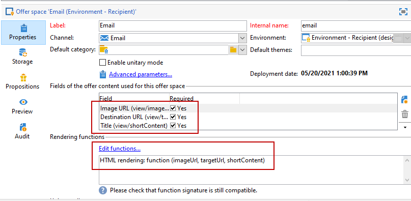
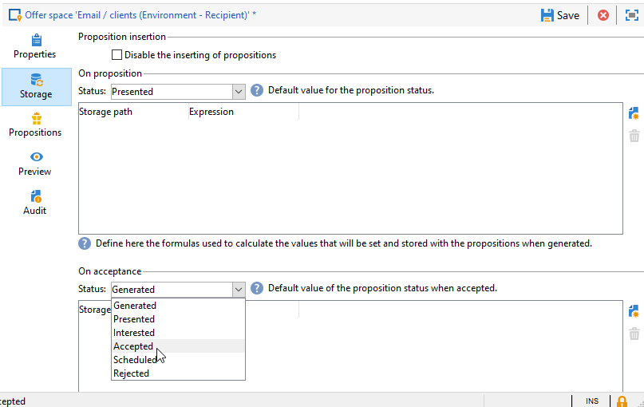

# 建立優惠方案空間{#creating-offer-spaces}

選件目錄的內容是在選件空間中設定。 依預設，內容可包含下列欄位：**[!UICONTROL Title]**、**[!UICONTROL Destination URL]**、**[!UICONTROL Image URL]**、**[!UICONTROL HTML content]**&#x200B;和&#x200B;**[!UICONTROL Text content]**。 欄位順序是在選件空間中設定。

身為&#x200B;**技術管理員**，您可以在設計環境中建立選件空間。 您必須擁有選件空間子資料夾的存取權。 建立完成後，這些選件空間會在選件核准期間自動複製到即時環境中。

HTML演算是透過演算功能建立。 呈現函式中定義的欄位順序必須與內容中設定的順序相同。



若要建立新的選件空間，請遵循下列步驟：

1. 從選件空間清單中，按一下&#x200B;**[!UICONTROL New]**。

   

1. 選取您要使用的渠道，並變更選件空間的標籤。

   

1. 選中&#x200B;**[!UICONTROL Enable unitary mode]**&#x200B;選項

1. 轉至&#x200B;**[!UICONTROL Content field]**&#x200B;窗口，然後按一下&#x200B;**[!UICONTROL Add]**。

   

1. 轉至&#x200B;**[!UICONTROL Content]**&#x200B;節點，然後按以下順序選擇欄位：**[!UICONTROL Title]**、**[!UICONTROL Image URL]**、**[!UICONTROL HTML content]**、**[!UICONTROL Destination URL]**。

   

1. 勾選&#x200B;**[!UICONTROL Required]**&#x200B;選項，將每個欄位設為必填。

   >[!NOTE]
   >
   >此選項用於預覽，如果選件中遺失其中一個必填欄位，則會在發佈時使選件空間無效。 不過，如果選件已在選件空間上存在，則不會考慮這些條件。

   

1. 按一下&#x200B;**[!UICONTROL Edit functions]**&#x200B;建立渲染函式。

   這些函式用於在選件空間上產生選件表示法。 有幾種可能的格式：HTML或文字。

   **注意** - XML格式僅限於暫時無法使用的傳入互動。[了解更多](../start/capability-matrix.md#gs-unavailable-features)

   _

1. 轉到&#x200B;**[!UICONTROL HTML rendering]**&#x200B;頁籤並選擇&#x200B;**[!UICONTROL Overload the HTML rendering function]**。
1. 插入您的演算功能。

   

## 選件提案狀態{#offer-proposition-statuses}

選件提案狀態會視與目標群體的互動而有所不同。 「促銷活動互動」模組隨附一組值，可在整個生命週期中套用至選件提案。 您必須設定平台，以便在建立並接受選件提案時，狀態會變更。

>[!NOTE]
>
>狀態更新是非同步程式。 它由每小時觸發的追蹤工作流程執行。

### 選件狀態清單{#status-list}

可用的選件狀態包括：

* **[!UICONTROL Accepted]**
* **[!UICONTROL Scheduled]**
* **[!UICONTROL Generated]**
* **[!UICONTROL Interested]**
* **[!UICONTROL Presented]**
* **[!UICONTROL Rejected]**

這些值預設不會套用：必須進行配置。

>[!NOTE]
>
>如果選件連結至具有「已傳送」狀態的傳送，則選件提案的狀態會自動變更為「已呈現」。

### 建立提案時的選件狀態{#configuring-the-status-when-the-proposition-is-created}

當選件提案為&#x200B;**created**&#x200B;時，其狀態會更新。

在&#x200B;**[!UICONTROL Design]**&#x200B;環境中，針對每個選件空間，根據您要在選件報表中顯示的資訊，設定在建立提案時套用的狀態。

要執行此操作，請遵循下列步驟：

1. 轉到所需空間的&#x200B;**[!UICONTROL Storage]**&#x200B;頁籤。
1. 選擇建立提案時要應用於提案的狀態。

   

### 接受提案時的要約狀態{#configuring-the-status-when-the-proposition-is-accepted}

一旦選件提案已&#x200B;**接受**，請使用預設值之一來設定提案的新狀態。 當收件者按一下選件中的連結時，就會套用更新。

要執行此操作，請遵循下列步驟：

1. 轉到所需空間的&#x200B;**[!UICONTROL Storage]**&#x200B;頁籤。
1. 選擇接受提案時要套用至提案的狀態。

   

<!--
**Inbound interaction**

The **[!UICONTROL Storage]** tab lets you define statuses for **proposed** and **accepted** offer propositions only. For inbound interaction, the status of offer propositions should be specified directly in the URL for calling the offer engine, rather than through the interface. This way, you will be able to specify which status to apply in other cases, for example if an offer proposition is rejected.

```
<BASE_URL>?a=UpdateStatus&p=<PRIMARY_KEY_OF_THE_PROPOSITION>&st=<NEW_STATUS_OF_THE_PROPOSITION>&r=<REDIRECT_URL>
```

For instance, the proposition (identifier **40004**) that matches the **Home insurance** offer displayed on the **Neobank** site contains the following URL:

```
<BASE_URL>?a=UpdateStatus&p=<40004>&st=<3>&r=<"http://www.neobank.com/insurance/subscribe.html">
```

As soon as a visitor clicks the offer, and therefore the URL, the **[!UICONTROL Accepted]** status (value **3**) is applied to the proposition and the visitor is redirected to a new page of the **Neobank** site to take out the insurance contract.

>[!NOTE]
>
>If you want to specify another status in the url (for example if an offer proposition is rejected), use the value corresponding to the desired status. Example: **[!UICONTROL Rejected]** = "5", **[!UICONTROL Presented]** = "1" and so on.
>
>Statuses and their values can be retrieved in the **[!UICONTROL Offer propositions (nms)]** data schema. For more on this, refer to [this page](../../configuration/using/data-schemas.md).

**Outbound interaction**
-->

當傳送包含連結時，您可以自動將&#x200B;**[!UICONTROL Interested]**&#x200B;狀態套用至選件提案。 只需將&#x200B;**_urlType=&quot;11&quot;**&#x200B;值新增至連結：

```
<a _urlType="11" href="<DEST_URL>">Link inserted into the delivery</a>
```

## 每個空間的選件預覽{#offer-preview-per-space}

在&#x200B;**[!UICONTROL Preview]**&#x200B;標籤中，您可以透過選擇的方法檢視收件者符合資格的選件。 在下列範例中，收件者可透過郵件取得三份提案。


如果收件者不符合任何選件的資格，這會顯示在預覽中。


<!--
The preview can ignore contexts when they are restricted to a space. This is the case when the interaction schema has been extended to add fields referenced in a space using an inbound channel (for more on this, refer to Extension example.
-->
