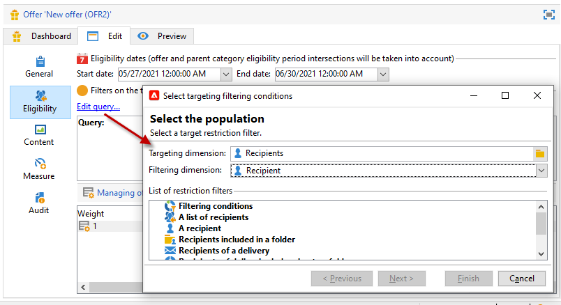
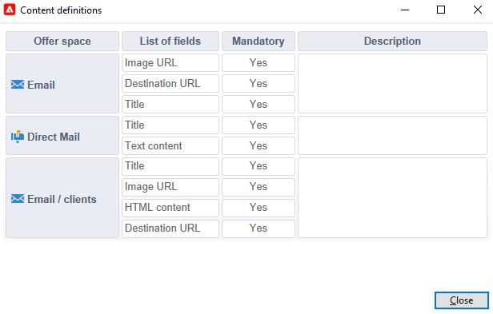

# 建立優惠優惠方案

若要建立優惠方案，請遵循下列步驟：

1. 瀏覽至 **[!UICONTROL Campaigns]** ，然後按一下 **[!UICONTROL Offers]** 連結。

1. 按一下 **[!UICONTROL Create]** 按鈕。

1. 變更標籤，並選取選件應屬於的類別。

1. 按一下 **[!UICONTROL Save]** 來建立選件。

   此選件可在平台中使用，且可設定其內容。

## 資格設定

您現在可以使用 **[!UICONTROL Eligibility]** 標籤來定義：

* 優惠方案的資格期。 [了解更多](#eligibility-period)
* 選件目標母體的篩選。 [了解更多](#filters-on-the-target)
* 選件權重。 [了解更多](#offer-weight)

### 優惠方案資格期間{#eligibility-period}

在 **[!UICONTROL Eligibility]** 標籤，定義優惠方案的資格期間。 使用下拉式清單來選取日曆中的開始和結束日期。


在此期間之外，將不會選取優惠方案。 如果您也已設定優惠方案類別的資格日期，則會套用限制最嚴格的期間。

### 在目標上新增篩選器 {#filters-on-the-target}

在 **[!UICONTROL Eligibility]** 標籤，將篩選器套用至選件目標。

若要這麼做，請按一下 **[!UICONTROL Edit query]** 連結，然後選取您要套用的篩選器。



如果已建立預先定義的篩選器，您可以從使用者篩選器清單中選取這些篩選器。 [了解更多](interaction-predefined-filters.md)


### 設定優惠方案權重 {#offer-weight}

若要讓引擎在目標符合資格的多個選件之間做出決定，您需要為選件指派一或多個加權。 您也可以視需要將篩選器套用至目標，或限制權數要套用的選件空間。 較重量較輕的優惠方案，更偏好權重較重的優惠方案。

您可以為相同選件設定多個加權，例如區分特定期間、特定目標甚至選件空間。

例如，對於年齡在18到25歲的接觸，選件可以具有A的重量，對於超過該範圍的接觸，可以具有B的重量。 如果優惠方案在整個夏天都符合資格，在7月也可以有A的權重，在8月有B的權重。

>[!NOTE]
>
>您可以根據選件所屬類別的參數來暫時修改指派的加權。 [了解更多](interaction-offer-catalog.md#creating-offer-categories)

若要在選件中建立權重，請套用下列步驟：

1. 在 **[!UICONTROL Eligibility]** ，按一下 **[!UICONTROL Add]**.

   

1. 變更標籤並指派權數。 預設值為 1。

   

   >[!CAUTION]
   >
   >如果未輸入權重(0)，則目標將不被視為符合優惠方案的資格。

1. 如果要將權重應用於指定期間，請定義資格日期。

   

1. 如有必要，請限制特定優惠方案空間的權重。

   

1. 將篩選器套用至目標。

   

1. 按一下 **[!UICONTROL OK]** 以節省重量。

   

   >[!NOTE]
   >
   >如果目標符合所選選件的多個加權，引擎會保留最佳（最高）加權。 呼叫優惠方案引擎時，每個連絡最多會選取一次優惠方案。

### 優惠方案適用性規則摘要 {#a-summary-of-offer-eligibility-rules}

完成設定後，優惠方案控制面板就會提供資格規則的摘要。

若要檢視，請按一下 **[!UICONTROL Schedule and eligibility rules]** 連結。


## 建立優惠方案內容 {#creating-the-offer-content}

使用 **[!UICONTROL Content]** 標籤來定義選件內容。


1. 定義選件內容的各種參數。

   * **[!UICONTROL Title]** :指定您要在選件中顯示的標題。 警告：這並非指選件的標籤，此標籤定義於 **[!UICONTROL General]** 標籤。
   * **[!UICONTROL Destination URL]** :指定您選件的URL。 它必須以&quot;http://&quot;或&quot;https://&quot;開頭。
   * **[!UICONTROL Image URL]** :指定選件影像的URL或存取路徑。
   * **[!UICONTROL HTML content]** / **[!UICONTROL Text content]** :在您想要的索引標籤中輸入優惠方案的內文。 若要產生追蹤，請 **[!UICONTROL HTML content]** 必須由可封入 `<div>` 類型元素。 例如， `<table>` 「HTML」頁面中的元素將如下所示：

   ```
      <div> 
       <table>
        <tr>
         <th>Month</th>
         <th>Savings</th>   
        </tr>   
        <tr>    
         <td>January</td>
         <td>$100</td>   
        </tr> 
       </table> 
      </div>
   ```

   了解如何在中定義接受URL [本節](interaction-offer-spaces.md#configuring-the-status-when-the-proposition-is-accepted).

   

   若要尋找在優惠方案空間設定期間所定義的必要欄位，請按一下 **[!UICONTROL Content definitions]** 連結以顯示清單。 [了解更多](interaction-offer-spaces.md)

   

   在此範例中，選件必須包含標題、影像、HTML內容和目的地URL。

## 預覽選件 {#previewing-the-offer}

設定優惠方案內容後，您就可以預覽優惠方案在收件者看見時的顯示效果。

操作步驟：

1. 按一下 **[!UICONTROL Preview]** 標籤。

   

1. 選取您要檢視之選件的表示法。

   

1. 如果您已個人化優惠方案內容，請選取優惠方案目標以檢視個人化。

<!--

## Create a hypothesis on an offer {#creating-a-hypothesis-on-an-offer}

You can create hypotheses on your offer propositions. This lets you determine the impact of your offers on purchases carried out for the product concerned.

>[!NOTE]
>
>These hypotheses are carried out via Response Manager. Please check your license agreement.

Hypotheses carried out on an offer proposition are referenced in their **[!UICONTROL Measure]** tab.

Creating hypotheses is detailed in [this page](../../campaign/using/about-response-manager.md).

-->

## 核准並啟用優惠方案{#approve-offers}

您現在可以核准和啟用優惠方案，以便在 **即時** 環境。

 如需詳細資訊，請參閱 [Campaign Classic v7 文件](https://experienceleague.adobe.com/docs/campaign-classic/using/managing-offers/managing-an-offer-catalog/approving-and-activating-an-offer.html?lang=en#approving-offer-content)

## 管理優惠方案簡報{#offer-presentation}

Campaign可讓您使用簡報規則來控制優惠方案的流程。 這些是「促銷活動互動」專屬的規則 **類型規則**. 它們可讓您根據已向收件者提出的主張的歷史，排除優惠方案。 環境會參考這些參數。

 如需詳細資訊，請參閱 [Campaign Classic v7 文件](https://experienceleague.adobe.com/docs/campaign-classic/using/managing-offers/managing-an-offer-catalog/managing-offer-presentation.html?lang=en#managing-offers)

## 優惠方案模擬

此 **模擬** 模組可讓您在將您的主張傳送給收件者之前，先測試屬於類別或環境的優惠方案分佈。

模擬會考慮先前套用至優惠方案的內容和適用性規則及其呈現規則。 這可讓您測試和調整優惠方案主張的各種版本，而不實際使用優惠方案或過度/不斷索取目標，因為模擬對目標收件者沒有影響。

 如需優惠方案模擬的詳細資訊，請參閱 [Campaign Classicv7檔案](https://experienceleague.adobe.com/docs/campaign-classic/using/managing-offers/simulating-offers/about-offers-simulation.html?lang=en)
