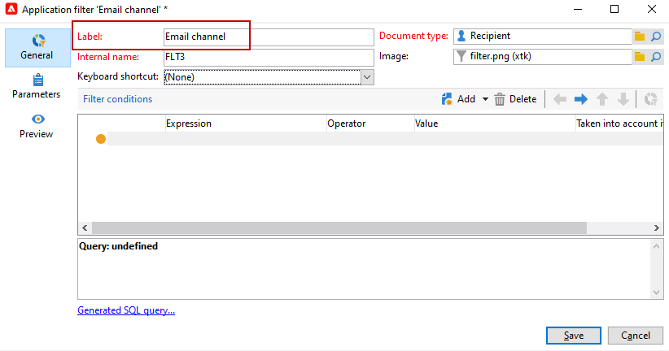

# 建立預先定義的篩選器{#creating-pre-defined-filters}

建立預先定義的篩選器，為目標母體定義適用性規則，以便在建立優惠方案時輕鬆重複使用。 它們是每個環境專屬的，且會將優惠方案參數納入考量。

若要建立預先定義的篩選，請套用下列程式：

1. 瀏覽至 **[!UICONTROL Administration]** 資料夾和選取 **[!UICONTROL Pre-defined offer filters]**.

   

1. 按一下&#x200B;**[!UICONTROL New]**。

   

1. 變更標籤以便稍後識別篩選器。

   

1. 選取篩選條件將關注的欄位。

   

1. 視需要選取運算子和值，然後儲存查詢。

   

1. 按一下 **[!UICONTROL Preview]** 來檢視篩選結果。

   
