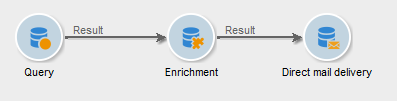
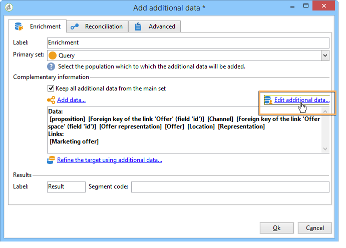

# 傳送優惠方案

為了讓優惠方案引擎選取優惠方案，優惠方案已獲得核准，並可在&#x200B;**Live**&#x200B;環境中使用。 [了解更多](interaction-offer.md#approve-offers)

透過傳出通訊通道，透過直接郵件、電子郵件或行動傳送來進行優惠方案簡報。 您也可以搭配交易式訊息（訊息中心）使用統一模式。

## 在傳送中插入選件 {#offer-into-a-delivery}

若要將優惠方案主張插入傳送中，請遵循下列步驟：

1. 在傳送視窗中，按一下&#x200B;**選件**&#x200B;圖示。

   

1. 選取符合優惠方案環境的空間。

   

1. 若要調整引擎選擇的選件，請選取要呈現選件所屬的類別，或選取一/多個主題。 我們建議一次只使用其中一個欄位，以避免超出限制。

   

   

1. 指定您要插入至傳遞內文的選件數。

   

1. 視需要選取&#x200B;**[!UICONTROL Exclude non-eligible recipients]**&#x200B;選項。 [了解更多](#parameters-for-calling-offer-engine)

   

1. 如果需要，請選取&#x200B;**[!UICONTROL Do not display anything if no offers are selected]**&#x200B;選項。 [了解更多](#parameters-for-calling-offer-engine)

   

1. 使用合併欄位將屬性插入傳遞內容。 可用的命題數取決於引擎呼叫的配置方式，其順序取決於選件的優先順序。

   

1. 完成內容、測試並傳送您的傳送。

   

### 優惠方案引擎的參數 {#parameters-for-calling-offer-engine}

* **[!UICONTROL Space]** :選件環境的空間，必須選取該空間才能啟用選件引擎。
* **[!UICONTROL Category]** :選件排序的特定資料夾。如果未指定類別，除非選取主題，否則選件引擎會考量環境中包含的所有選件。
* **[!UICONTROL Themes]** :類別中定義上游的關鍵字。這些功能可作為篩選器，讓您透過在一組類別中選取來調整要顯示的選件數量。
* **[!UICONTROL Number of propositions]** :引擎傳回可插入傳遞內文的選件數。如果未將選件插入訊息中，選件仍會產生，但不會顯示。
* **[!UICONTROL Exclude non-eligible recipients]** :此選項可讓您啟用或停用排除沒有足夠合格優惠方案的收件者。合格命題的數量可能低於請求的命題數量。 如果選中此框，則沒有足夠建議的收件者將被排除在傳遞之外。 如果您未選擇此選項，則這些收件者將不會被排除，但他們將沒有請求的數量的建議。
* **[!UICONTROL Do not display anything if no offer is selected]** :此選項可讓您選擇在其中一個命題不存在時如何處理訊息。核取此方塊時，不會顯示遺漏主張的表示，且此主張的訊息中不會顯示任何內容。 如果未核取方塊，則訊息本身會在傳送期間取消，而收件者將不會再收到任何訊息。

## 在工作流程中傳送優惠方案

數個工作流程活動可讓您定義顯示選件的方式：

* 擴充
* 優惠引擎
* 依儲存格列出的優惠

### 擴充 {#enrichment}

**擴充**&#x200B;活動可讓您將選件或連結新增至傳遞收件者的選件。

 如需擴充活動的詳細資訊，請參閱 [Campaign Classicv7檔案](https://experienceleague.adobe.com/docs/campaign-classic/using/automating-with-workflows/targeting-activities/enrichment.html)

例如，您可以在傳送前讓收件者查詢的資料更豐富。

有兩種方法可指定優惠方案。

* 指定優惠方案或優惠方案引擎呼叫。
* 參考選件的連結。

#### 指定優惠方案或對優惠方案引擎的呼叫 {#specifying-an-offer-or-a-call-to-the-offer-engine}

設定&#x200B;**Query**&#x200B;活動後：

1. 新增並開啟&#x200B;**Excrent**&#x200B;活動。
1. 在 **[!UICONTROL Enrichment]** 索引標籤中，選取 **[!UICONTROL Add data]**。
1. 在要添加的資料類型中選擇&#x200B;**[!UICONTROL An offer proposition]**。

   

1. 指定要新增的主張的識別碼及標籤。
1. 指定選件選取項目。 這有兩個可能的選項：

   * **[!UICONTROL Search for the best offer in a category]** :勾選此選項並指定優惠方案引擎呼叫參數（優惠方案空間、類別或主題、聯絡日期、要保留的優惠方案數量）。引擎會自動計算要根據這些參數新增的選件。 建議您同時填寫&#x200B;**[!UICONTROL Category]**&#x200B;或&#x200B;**[!UICONTROL Theme]**&#x200B;欄位，而非同時填寫兩者。

      

   * **[!UICONTROL A predefined offer]** :勾選此選項並指定優惠方案空間、特定優惠方案和聯絡日期，以直接設定您要新增的優惠方案，而不需呼叫優惠方案引擎。

      

1. 然後設定與您選擇的通道相對應的傳送活動。 [了解更多](#offer-into-a-delivery)

   >[!NOTE]
   >
   >可用於預覽的建議數取決於擴充活動中執行的配置，而不是直接在傳送中執行的任何可能配置。

#### 參考優惠方案的連結 {#referencing-a-link-to-an-offer}

您也可以參考&#x200B;**Excrent**&#x200B;活動中選件的連結。

要執行此操作，請遵循下列步驟：

1. 在活動的&#x200B;**[!UICONTROL Enrichment]**&#x200B;索引標籤中選取&#x200B;**[!UICONTROL Add data]**。
1. 在選擇要添加的資料類型的窗口中，選擇&#x200B;**[!UICONTROL A link]**。
1. 選取您要建立的連結類型及其目標。 在此情況下，目標為選件結構。

   

1. 指定擴充活動（此處為收件者表格）中入站表格資料與選件表格之間的連結。 例如，您可以將優惠方案代碼連結至收件者。

   

1. 然後設定與您選擇的通道相對應的傳送活動。 [了解更多](#offer-into-a-delivery)

   >[!NOTE]
   >
   >預覽的可用建議數取決於傳送中執行的配置。

#### 商店優惠方案排名和權重 {#storing-offer-rankings-and-weights}

依預設，當使用&#x200B;**擴充**&#x200B;活動來傳送選件時，其排名和權重不會儲存在主張表格中。

>[!NOTE]
>
>預設情況下，**[!UICONTROL Offer engine]**&#x200B;活動會儲存此資訊。

不過，您可以依下列方式儲存此資訊：

1. 在查詢後和傳送活動前放置的擴充活動中，建立對選件引擎的呼叫。 [了解更多](#specifying-an-offer-or-a-call-to-the-offer-engine)
1. 在活動的主窗口中，選擇&#x200B;**[!UICONTROL Edit additional data...]**。

   

1. 為排名新增&#x200B;**[!UICONTROL @rank]**&#x200B;欄，為選件加權新增&#x200B;**[!UICONTROL @weight]**&#x200B;欄。

   

1. 確認新增項目並儲存工作流程。

傳遞會自動儲存選件的排名和權重。 此資訊會顯示在傳送的&#x200B;**[!UICONTROL Offers]**&#x200B;標籤中。

### 優惠引擎 {#offer-engine}

**[!UICONTROL Offer engine]**&#x200B;活動也可讓您指定傳送前對選件引擎的呼叫。

 如需優惠方案工 **程活** 動的詳細資訊，請參閱 [Campaign Classicv7檔案](https://experienceleague.adobe.com/docs/campaign-classic/using/automating-with-workflows/targeting-activities/offer-engine.html)

此活動的運作方式與引擎呼叫的&#x200B;**擴充**&#x200B;活動相同，方法是在傳送前使用引擎計算的選件擴充入站母體資料。

設定&#x200B;**Query**&#x200B;活動後：

1. 新增並開啟&#x200B;**[!UICONTROL Offer engine]**&#x200B;活動。
1. 填寫各種可用欄位，以指定對優惠方案引擎參數（優惠方案空間、類別或主題、聯絡日期、要保留的優惠方案數量）的呼叫。 引擎會自動計算要根據這些參數新增的選件。

   >[!CAUTION]
   >
   >如果您使用此活動，則只會儲存傳送中使用的優惠方案。

   

1. 然後設定與您選擇的通道相對應的傳送活動。 [了解更多](#inserting-an-offer-proposition-into-a-delivery)

### 依儲存格列出的優惠 {#offers-by-cell}

**[!UICONTROL Offers by cell]**&#x200B;活動可讓您將入站母體（例如從查詢）分佈至數個區段，並指定要針對每個區段顯示的選件。

 如需「依儲存 **格列** 出優惠方案」的詳細資 [訊，請參閱Campaign Classicv7檔案](https://experienceleague.adobe.com/docs/campaign-classic/using/automating-with-workflows/targeting-activities/offers-by-cell.html)

若要這麼做，請使用下列程式：

1. 指定目標母體後，新增&#x200B;**[!UICONTROL Offers by cell]**&#x200B;活動，然後開啟。
1. 在&#x200B;**[!UICONTROL General]**&#x200B;標籤中，選取您要呈現選件的選件空間。
1. 在&#x200B;**[!UICONTROL Cells]**&#x200B;標籤中，使用&#x200B;**[!UICONTROL Add]**&#x200B;按鈕指定不同的子集：

   * 使用可用的篩選和限制規則指定子集母體。
   * 然後選取您要呈現給子集的選件。 可用的優惠方案是在上一步選取的優惠方案環境中符合資格的優惠方案。

      

1. 然後設定與您選擇的通道相對應的傳送活動。

<!--

## Delivering with delivery outlines {#delivering-with-delivery-outlines}

You can also present offers in a delivery using delivery outlines.

For more information on delivery outlines, refer to the Campaign - MRM guide.

1. Create a new campaign or access an existing campaign.
1. Access the delivery outlines via the campaign's **[!UICONTROL Edit]** > **[!UICONTROL Documents]** tab.
1. Add an outline then insert as many offers as you like into it by right-clicking on the outline and selecting **[!UICONTROL New]** > **[!UICONTROL Offer]**, then save the campaign.

1. Create a delivery whose delivery outlines you have access to (for example, a direct mail delivery).
1. When editing the delivery, click **[!UICONTROL Select a delivery outline]**.

   >[!NOTE]
   >
   >Depending on the type of delivery, this option can be found in the **[!UICONTROL Properties]** > **[!UICONTROL Advanced]** menu (for email deliveries for example).

1. Using the **[!UICONTROL Offers]** button, you can then configure the offer space as well as the number of offers to present in the delivery.

1. Add the propositions into the delivery body using the personalization fields (for more on this, refer to the [Inserting an offer proposition into a delivery](#inserting-an-offer-proposition-into-a-delivery) section), or in the case of a direct mail delivery, by editing the extraction file format.

   Propositions will be selected from the offers referenced in the delivery outline.

   >[!NOTE]
   >
   >Information regarding the offer rankings and weights is only saved in the proposition table if the offers are generated directly in the delivery.
-->
