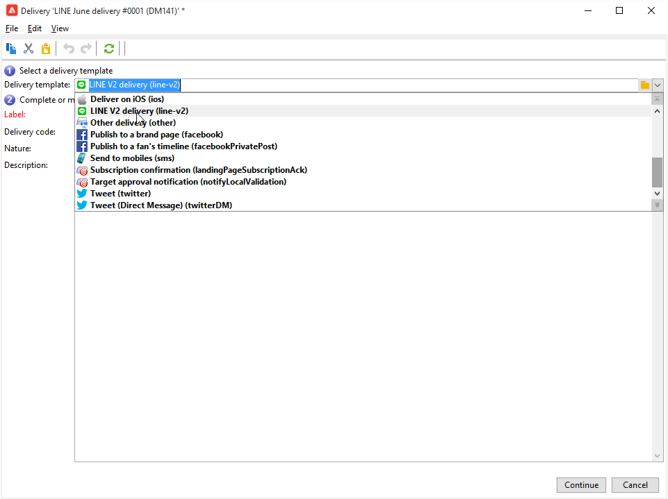

# 建立LINE傳遞

LINE 是免費應用程式，可傳送即時訊息、進行語音與視訊通話，適用所有行動裝置與個人電腦。您可以使用Adobe Campaign傳送LINE訊息。

[!DNL LINE]也可以與交易式訊息模組結合，以在消費者行動裝置上安裝的[!DNL LINE]應用程式上傳送即時訊息。 如需詳細資訊，請參閱Campaign Classic v7檔案中的此[頁面](https://experienceleague.adobe.com/zh-hant/docs/campaign-classic/using/transactional-messaging/configure-transactional-messaging/transactional-messaging-architecture#transactional-messaging-and-line)。

使用[!DNL LINE]管道的步驟如下：

1. [設定LINE頻道](#setting-up-line-channel)
1. [建立傳遞](#creating-the-delivery)
1. [設定內容型別](#defining-the-content)
1. [監控傳送（追蹤、隔離、報告等）](#accessing-reports)

## 設定LINE頻道 {#setting-up-line-channel}

在建立[!DNL LINE]帳戶和外部帳戶之前，需要在您的執行個體上安裝LINE套件。 請聯絡您的Adobe代表。

您必須先建立[!DNL LINE]帳戶，才能將其連結至Adobe Campaign。 接著，您可以傳送[!DNL LINE]訊息給在行動應用程式中新增您的[!DNL LINE]帳戶的使用者。 外部帳戶和[!DNL LINE]帳戶只能由平台的功能管理員管理。

若要建立及設定[!DNL LINE]帳戶，請參閱[LINE開發人員檔案](https://developers.line.me/)。

### 建立和設定LINE服務 {#configure-line-service}

若要建立您的[!DNL LINE]服務：

1. 從Adobe Campaign Classic首頁選取「**[!UICONTROL Profiles and Targets]**」標籤。

1. 在左側功能表中，選取&#x200B;**[!UICONTROL Services and Subscriptions]**&#x200B;並按一下&#x200B;**[!UICONTROL Create]**。

   

1. 新增&#x200B;**[!UICONTROL Label]**&#x200B;和&#x200B;**[!UICONTROL Internal name]**&#x200B;至您的新服務。

1. 從&#x200B;**[!UICONTROL LINE]**&#x200B;下拉式清單中選取&#x200B;**[!UICONTROL Type]**。

   

1. 按一下 **[!UICONTROL Save]**。

如需訂閱與服務的詳細資訊，請參閱[管理訂閱](../../start/subscriptions.md)。

### 設定LINE外部帳戶 {#configure-line-external}

建立[!DNL LINE]服務後，您需要在Adobe Campaign上設定[!DNL LINE]外部帳戶：

1. 在&#x200B;**[!UICONTROL Administration]** > **[!UICONTROL Platform]**&#x200B;樹狀結構中，按一下&#x200B;**[!UICONTROL External Accounts]**&#x200B;索引標籤。

1. 選取內建&#x200B;**[!UICONTROL LINE V2 routing]**&#x200B;外部帳戶。

   

1. 按一下外部帳戶中的&#x200B;**[!UICONTROL LINE]**&#x200B;索引標籤，開始設定外部帳戶。 填寫下列欄位：

   

   * **[!UICONTROL Channel Alias]**：已透過您在[!DNL LINE] > **[!UICONTROL Channels]**&#x200B;索引標籤中的&#x200B;**[!UICONTROL Technical configuration]**&#x200B;帳戶提供。
   * **[!UICONTROL Channel ID]**：已透過您在[!DNL LINE] > **[!UICONTROL Channels]**&#x200B;索引標籤中的&#x200B;**[!UICONTROL Basic Information panel]**&#x200B;帳戶提供。
   * **[!UICONTROL Channel secret key]**：已透過您在[!DNL LINE] > **[!UICONTROL Channels]**&#x200B;索引標籤中的&#x200B;**[!UICONTROL Basic Information panel]**&#x200B;帳戶提供。
   * **[!UICONTROL Access token]**：是透過開發人員入口網站中您的[!DNL LINE]帳戶或按一下&#x200B;**[!UICONTROL Get access token]**&#x200B;按鈕所提供。
   * **[!UICONTROL Access token expiration date]**：可讓您指定存取Token的到期日。
   * **[!UICONTROL LINE subscription service]**：可讓您指定訂閱使用者的服務。

1. 完成設定後，按一下 **[!UICONTROL Save]**。

1. 從&#x200B;**[!UICONTROL Explorer]**&#x200B;中，選取&#x200B;**[!UICONTROL Administration]** > **[!UICONTROL Production]** > **[!UICONTROL Technical workflows]** > **[!UICONTROL LINE workflows]**&#x200B;以檢查&#x200B;**[!UICONTROL LINE V2 access token update (updateLineAccessToken)]**&#x200B;和&#x200B;**[!UICONTROL Delete blocked LINE users (deleteBlockedLineUsers)]**&#x200B;工作流程是否已開始。

[!DNL LINE]現在已在Adobe Campaign中設定，您可以開始建立LINE傳遞並傳送給訂閱者。

## 建立LINE傳遞 {#creating-the-delivery}

>[!NOTE]
>
>第一次傳送[!DNL LINE]傳遞給新收件者時，您必須將有關使用條款和同意的官方LINE訊息新增至傳遞中。 在[下列連結](https://terms.line.me/OA_privacy/)上有正式的訊息。

若要建立[!DNL LINE]傳遞，您必須遵循下列步驟：

1. 從&#x200B;**[!UICONTROL Campaigns]**&#x200B;索引標籤中，選取&#x200B;**[!UICONTROL Deliveries]**，然後按一下&#x200B;**[!UICONTROL Create]**&#x200B;按鈕。

   

1. 選取&#x200B;**[!UICONTROL LINE V2 delivery]**&#x200B;傳遞範本。

   

1. 使用&#x200B;**[!UICONTROL Label]**、**[!UICONTROL Delivery code]**&#x200B;和&#x200B;**[!UICONTROL Description]**&#x200B;識別您的傳遞。 如需詳細資訊，請參閱[本章節](../../start/create-message.md#create-the-delivery)。

1. 按一下&#x200B;**[!UICONTROL Continue]**&#x200B;以建立您的傳遞。

1. 在傳遞編輯器中，選取&#x200B;**[!UICONTROL To]**&#x200B;以定位[!DNL LINE]傳遞的收件者。 在&#x200B;**[!UICONTROL Visitor subscriptions (nms:visitorSub)]**&#x200B;上執行目標定位。

   如需詳細資訊，請參閱[本頁面](../../audiences/target-mappings.md)。

   

1. 按一下&#x200B;**[!UICONTROL Add]**&#x200B;以選取您的&#x200B;**[!UICONTROL Delivery target population]**。

   

1. 選擇您要直接鎖定[!DNL LINE]位訂閱者，或根據其[!DNL LINE]訂閱鎖定使用者，然後按一下&#x200B;**[!UICONTROL Next]**。 在此範例中，我們選取&#x200B;**[!UICONTROL By LINE V2 subscription]**。

1. 在&#x200B;**[!UICONTROL Line-V2]**&#x200B;下拉式清單中選取&#x200B;**[!UICONTROL Folder]**，然後選取您的[!DNL LINE]服務。 按一下&#x200B;**[!UICONTROL Finish]**，然後按&#x200B;**[!UICONTROL Ok]**，開始個人化您的傳遞。

   

1. 從您的傳遞編輯器中，按一下&#x200B;**[!UICONTROL Add]**&#x200B;以新增一或多個訊息並選取&#x200B;**[!UICONTROL Content type]**。

   如需其他可用&#x200B;**[!UICONTROL Content type]**&#x200B;的詳細資訊，請參閱[定義內容型別](#defining-the-content)。

   

1. 正確建立與設定您的傳遞後，您可以將其傳送至先前定義的目標。

   如需傳送傳遞的詳細資訊，請參閱[傳送訊息](../configure-and-send.md)。

1. 傳送訊息後，存取報表以評估傳送的成效。

   如需[!DNL LINE]報告的詳細資訊，請參閱[存取報告](#accessing-reports)。

## 定義內容型別 {#defining-the-content}

若要定義[!DNL LINE]傳遞的內容，您必須先將訊息型別新增至傳遞。 每個[!DNL LINE]傳遞最多可包含5則訊息。

您可以在三種訊息型別之間進行選擇：

* [文字訊息](#configuring-a-text-message-delivery)
* [影像和連結](#configuring-an-image-and-link-delivery)
* [影片訊息](#configuring-a-video-message-delivery)

### 設定文字訊息傳送 {#configuring-a-text-message-delivery}

>[!NOTE]
>
>`<%@ include option='NmsServer_URL' %>/webApp/APP3?id=<%=escapeUrl(cryptString(visitor.id))%>`語法可讓您在LINE訊息中包含網頁應用程式的連結。

**[!UICONTROL Text message]** [!DNL LINE]傳遞是以文字形式傳送給收件者的訊息。

此型別訊息的組態與電子郵件中&#x200B;**[!UICONTROL Text]**&#x200B;的組態類似。 如需詳細資訊，請參閱此[頁面](../defining-the-email-content.md#message-content)。

### 設定影像和連結傳送 {#configuring-an-image-and-link-delivery}

**[!UICONTROL Image and link]** [!DNL LINE]傳遞是以影像形式傳送給收件者的郵件，其中可能包含一或多個URL。

您可以使用：

* a **[!UICONTROL Personalized image]**，

  >[!NOTE]
  >
  >您可以使用&#x200B;**%SIZE%**&#x200B;變數，根據收件者行動裝置的熒幕大小最佳化影像顯示。

  

* 每個裝置熒幕大小為&#x200B;**[!UICONTROL Image URL]**，

  

  **[!UICONTROL Define images per device screen size]**&#x200B;選項可讓您使用不同的影像解析度，以最佳化行動裝置上的傳遞可見度。 僅支援具有相同高度和寬度的影像。

  您可以根據熒幕大小定義影像：

   * 1040畫素
   * 700畫素
   * 460畫素
   * 300畫素
   * 240畫素

  >[!CAUTION]
  >
  >每個具有連結的LINE影像都必須有1040x1040畫素大小。

  之後，您必須新增會出現在收件者行動裝置上的替代文字。

* 和&#x200B;**[!UICONTROL Links]**。

  **[!UICONTROL Links]**&#x200B;區段可讓您選擇將影像分割成多個可點選區域的不同版面配置。 然後，您可以為每個人指派專用的&#x200B;**[!UICONTROL Link URL]**。

  

### 設定視訊訊息傳送 {#configuring-a-video-message-delivery}

**[!UICONTROL Video message]** [!DNL LINE]傳遞是以可包含URL的視訊形式傳送給收件者的訊息。

**[!UICONTROL Preview Image URL]**&#x200B;欄位可讓您新增字元限製為1000的預覽影像URL。 支援JPEG和PNG，檔案大小限製為1 MB。

**[!UICONTROL Video Image URL]**&#x200B;欄位可讓您新增字元限製為1000的視訊檔案URL。 只有200 MB的檔案大小限制才支援mp4格式。

請注意，在某些裝置上播放寬視訊或高視訊時，可能會遭到裁剪。

## 存取報告 {#accessing-reports}

傳送傳遞後，您可以從[!DNL LINE]透過功能表&#x200B;**[!UICONTROL Campaign Management]** > **[!UICONTROL Deliveries]**&#x200B;檢視您的&#x200B;**[!UICONTROL Explorer]**&#x200B;報告。

>[!NOTE]
>
>追蹤報表會指出點進率。 [!DNL LINE]未將未結匯率納入考量。

若為[!DNL LINE]服務報告，請從&#x200B;**[!UICONTROL Profiles and Targets]**&#x200B;索引標籤存取功能表&#x200B;**[!UICONTROL Services and Subscriptions]** > **[!UICONTROL LINE-V2]** > **[!UICONTROL Explorer]**。 然後按一下&#x200B;**[!UICONTROL Reports]**&#x200B;服務中的[!DNL LINE]圖示。

## 範例：建立並傳送個人化LINE訊息 {#example--create-and-send-a-personalized-line-message}

在此範例中，我們將建立和設定文字訊息和影像，其中包含將根據收件者進行個人化的資料。

1. 從[!DNL LINE]索引標籤按一下&#x200B;**[!UICONTROL Create]**&#x200B;按鈕，以建立您的&#x200B;**[!UICONTROL Campaign]**&#x200B;傳遞。

   

1. 選取&#x200B;**[!UICONTROL LINE V2 delivery]**&#x200B;傳遞範本並命名您的傳遞。

   

1. 在傳送的設定視窗中，選取目標母體。

   如需詳細資訊，請參閱[識別目標母體](../../start/create-message.md#target-population)。

   

1. 按一下&#x200B;**[!UICONTROL Add]**&#x200B;建立您的訊息並選取&#x200B;**[!UICONTROL Content type]**。

   首先，我們要建立&#x200B;**[!UICONTROL Text message]**。

   

1. 將游標放在您要插入個人化文字的位置，然後按一下下拉式圖示，然後選取&#x200B;**[!UICONTROL Visitor]** > **[!UICONTROL First name]**。

   

1. 依照相同的程式新增影像，在&#x200B;**[!UICONTROL Image and links]**&#x200B;下拉式清單中選取&#x200B;**[!UICONTROL Message type]**。

   新增您的&#x200B;**[!UICONTROL Image URL]**。

   

1. 在&#x200B;**[!UICONTROL Links]**&#x200B;區段中，選取將影像分割成多個可點選區域的版面。

1. 將URL指派給影像的每個區域。

   

1. 儲存您的傳遞，然後按一下&#x200B;**[!UICONTROL Send]**&#x200B;以分析並傳送給目標。

   傳送至目標。

   

