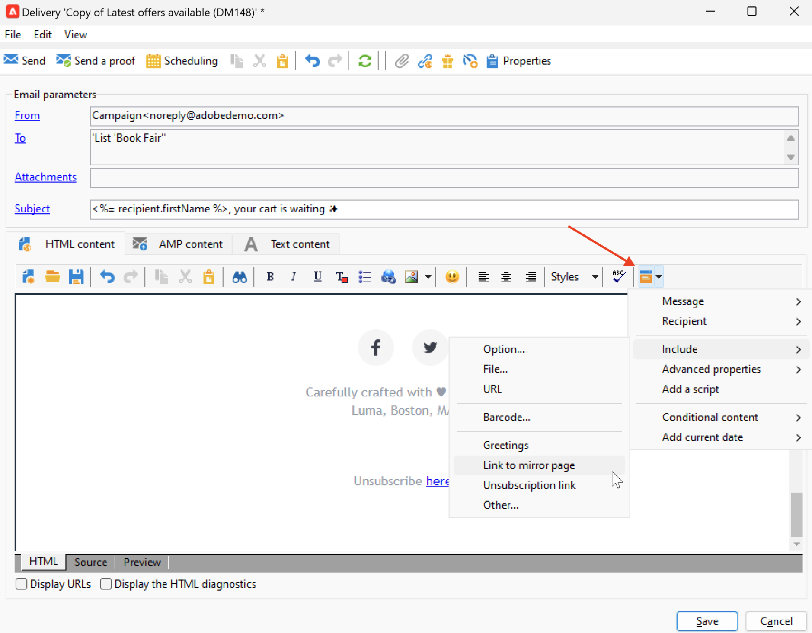

# 連結至鏡像頁面 {#mirror-page}

## 關於映象頁面 {#about-mirror-page}

鏡像頁面是您電子郵件的線上版本。

雖然大部分電子郵件用戶端可以正確轉譯影像，但是某些預設集可以基於安全原因避免顯示影像。使用者可以瀏覽到電子郵件的鏡像頁面，例如他們在嘗試在收件匣中檢視郵件時遇到轉譯問題或影像毀損。我們建議基於存取性原因或鼓勵社交共享，提供線上版本。

Adobe Campaign 產生的鏡像頁面包含所有個人化資料。

{width="600" align="left"}

## 新增鏡像頁面連結 {#link-to-mirror-page}

插入鏡像頁面連結是很好的做法。例如，此連結可以是「在瀏覽器中檢視此電子郵件」或「線上閱讀」。它通常位於電子郵件的頁首或頁尾。

在 Adobe Campaign 中，您可以使用專屬 **個人化區塊**，將鏡像頁面連結插入電子郵件中。內建的&#x200B;**鏡像頁面連結**&#x200B;個人化區塊會將以下程式碼插入電子郵件內容中：`<%@ include view='MirrorPage' %>`。

{width="800" align="left"}

如需插入個人化內容區塊的詳細資訊，請參閱 [個人化區塊](personalization-blocks.md).

## 管理映象頁面的產生 {#mirror-page-generation}

依預設，如果電子郵件內容不是空的且包含鏡像頁面連結 (也稱為鏡像連結)，Adobe Campaign 會自動產生鏡像頁面。

您可以控制電子郵件鏡像頁面的產生模式。傳遞屬性中有提供相關選項。若要存取這些選項：

1. 瀏覽至 **[!UICONTROL Validity]** 電子郵件屬性的索引標籤。
1. 在 **映象頁面管理** 區段，核取 **[!UICONTROL Mode]** 下拉式清單。

{width="800" align="left"}

除了預設模式外，還提供下列選項：

* **[!UICONTROL Force the generation of the mirror page]**：使用此模式可產生映象頁面，即使傳送中未插入映象頁面的連結亦然。
* **[!UICONTROL Do not generate the mirror page]**：使用此模式可避免產生映象頁面，即使連結存在於傳送中亦然。
* **[!UICONTROL Generates a mirror page accessible using only the message identifier]**：當電子郵件內容中不存在映象頁面連結時，請使用此選項在傳送記錄視窗中啟用映象頁面內容的存取，如下所述。

## 檢查收件者的映象頁面 {#mirror-page-access}

您可以存取傳送之特定收件者的映象頁面內容，其中包含個人化資料。

若要存取此映象頁面：

1. 傳送傳遞後，請開啟並瀏覽至其 **[!UICONTROL Delivery]** 標籤。

1. 選取收件者並按一下 **[!UICONTROL Display the mirror page for this message...]** 連結。

   {width="800" align="left"}

   映象頁面會顯示在專用畫面中，其中包含所選收件者的個人化資料。
