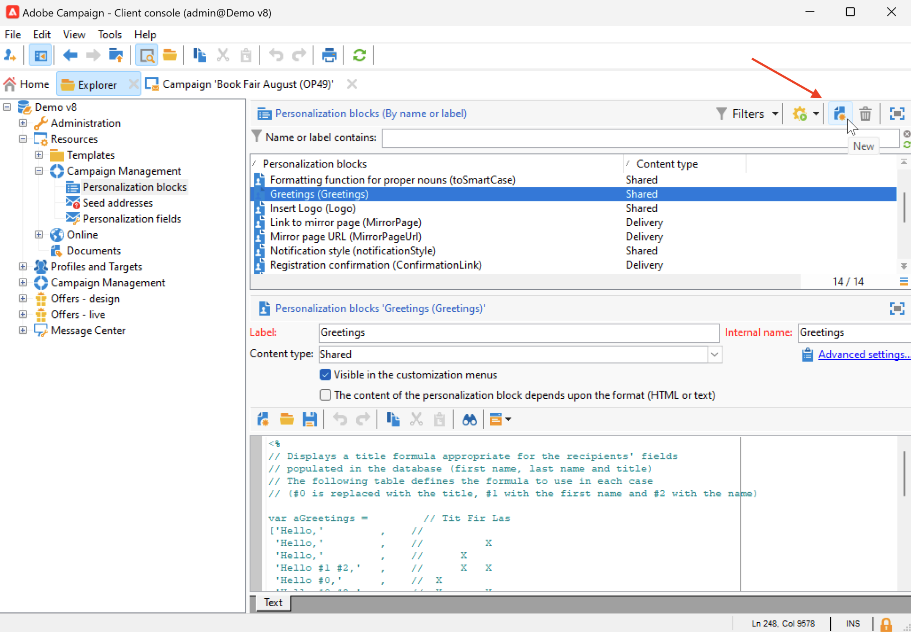

# 使用個人化區塊{#personalization-blocks}

個性化塊是包含特定呈現的動態內容，您可以將其插入到交付件中。 例如，可以添加徽標、問候語消息或鏡像頁的連結。

要訪問個性化內容塊，請瀏覽到 **[!UICONTROL Resources > Campaign Management > Personalization blocks]** 的子菜單。 內置個性化塊列在 [此部分](#ootb-personalization-blocks)。

您還可以定義新塊以優化交付個性化。 [了解更多](#create-custom-personalization-blocks)。

## 插入個性化塊 {#insert-personalization-blocks}

要在消息中插入個性化塊，請執行以下步驟：

1. 在傳遞嚮導的內容編輯器中，按一下個性化表徵圖並選擇 **[!UICONTROL Include]** 的子菜單。
1. 從清單中選擇個性化塊，或按一下 **[!UICONTROL Other...]** 的子菜單。

   

1. 然後將個性化塊作為指令碼插入。 當產生個性化時，它自動適應於接收者簡檔。
1. 瀏覽到 **[!UICONTROL Preview]** 頁籤，然後選擇收件人以查看特定收件人的此塊內容。

您可以將個性化塊的原始碼包括在傳遞內容中。 要執行此操作，請選擇 **[!UICONTROL Include the HTML source code of the block]** 的子菜單。

## 內置個性化塊 {#ootb-personalization-blocks}

內置個性化塊包括：

* **[!UICONTROL Enabled by Adobe Campaign]**:插入「Enabled byAdobe Campaign」徽標。
* **[!UICONTROL Formatting function for proper nouns]**:生成 **[!UICONTROL toSmartCase]** Javascript函式，它將每個單詞的第一個字母更改為大寫。
* **[!UICONTROL Greetings]**:插入帶收件人全名的問候語，後跟逗號。 範例：「你好 John Doe，」。
* **[!UICONTROL Insert logo]**:插入在實例設定中定義的徽標。
* **[!UICONTROL Link to mirror page]**:插入指向 [鏡像頁](mirror-page.md)。 預設格式：「如果您無法正確檢視此訊息，請按一下此處」。
* **[!UICONTROL Mirror page URL]**:插入鏡像頁面URL，使「傳遞設計器」能夠檢查連結。
* **[!UICONTROL Offer acceptance URL in unitary mode]**:插入URL，該URL可將聘用設定為 **[!UICONTROL Accepted]**。 (如果啟用互動模組，則此區塊可用)
* **[!UICONTROL Registration confirmation]**:插入啟用確認訂閱的連結。
* **[!UICONTROL Registration link]**:插入訂閱連結。 此連結在執行個體設定中定義。預設內容：「若要註冊，請按一下這裡。」
* **[!UICONTROL Registration link (with referrer)]**:插入訂閱連結，用於標識訪問者和傳遞。 此連結在執行個體設定中定義。
* **[!UICONTROL Registration page URL]**:插入訂閱URL
* **[!UICONTROL Style of content emails]** 和 **[!UICONTROL Notification style]**:生成用預定義HTML樣式格式化電子郵件的代碼。
* **[!UICONTROL Unsubscription link]**:插入一個連結，該連結允許取消訂閱所有交貨(denylist)。 預設關聯內容：「您收到此訊息因為您曾聯絡&#x200B;***您的組織名稱***&#x200B;或附屬機構。若不要再收到來自&#x200B;***您的組織名稱***&#x200B;的訊息，請按一下這裡。」

## 建立自定義個性化塊 {#create-custom-personalization-blocks}

您可以定義要從個性化表徵圖插入的新個性化內容塊。

要建立個性化塊，請執行以下步驟：

1. 瀏覽到 **[!UICONTROL Resources > Campaign Management > Personalization blocks]** 市場活動瀏覽器的資料夾。
1. 在內置塊清單的上方，按一下 **[!UICONTROL New]**。

   

1. 填寫個性化設定塊的設定：

   

   * 輸入塊的標籤。 此標籤顯示在個性化欄位插入窗口中。
   * 選擇 **交貨** 內容類型。
   * 啟用 **[!UICONTROL Visible in the customization menus]** 按鈕，將選定控制項在Tab鍵次序中上移一個位置。
   * 如有必要，請啟用 **[!UICONTROL The content of the personalization block depends upon the format]** 選項，為HTML和文本電子郵件定義兩個不同的塊。
   * 輸入內容(在HTML、文本、JavaScript等中) ，然後按一下 **[!UICONTROL Save]**。

保存後，新個性化塊在傳遞編輯器中可用。

## 教程視頻 {#personalization-blocks-video}

瞭解如何建立動態內容塊以及如何使用這些塊對以下視頻中的電子郵件傳遞內容進行個性化設定。

>[!VIDEO](https://video.tv.adobe.com/v/342088?quality=12)
