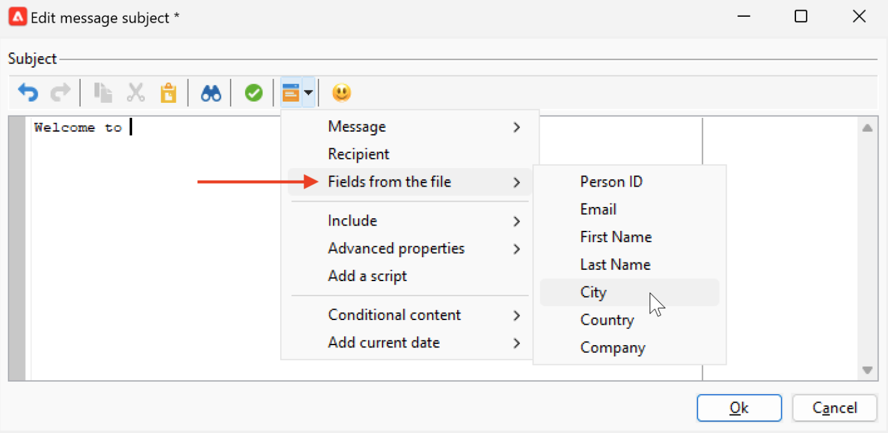

# 個人化資料來源{#personalization-data}

個人化資料可從各種型別的來源擷取：Campaign資料庫資料來源、外部檔案資料來源或外部資料庫資料來源。

## Campaign資料庫資料來源

在最常見的情況下，個人化資料會儲存在資料庫中。 例如，「收件者個人化欄位」是所有在收件者表格中定義的欄位、標準欄位（通常是：姓氏、名字、地址、城市、出生日期等） 或自訂欄位。

## 外部檔案資料來源

您可以使用包含欄中定義的所有欄位的外部檔案。 此檔案在訊息傳遞定義期間用作輸入。 您可以選擇是否在資料庫中插入這些設定檔。

若要選取要作為資料來源使用的檔案，請瀏覽至訊息建立視窗中的「至」連結，然後選取 **在外部檔案中定義** 選項。 載入檔案後，請從存取個人化選項中的收件者資料 **來自檔案的欄位** 登入點。

## FDA資料來源

個人化資料可從外部表格中提取，透過 [同盟資料存取](../connect/fda.md).  如果您想使用外部資料庫中的資料在傳遞中執行個人化，請收集要在工作流程中使用的資料，以便在臨時表格中提供。

若要執行此動作，請新增 **查詢** 目標工作流程中的活動並使用 **新增資料……** 選取外部資料庫的連結。 詳細程式可在以下位置找到： [本節](../../automation/workflow/query.md#adding-data).

然後，使用臨時表格中的資料來個人化您的傳遞。 設定查詢活動後，請從存取個人化選項中的外部資料 **目標延伸功能** 登入點。

在FDA中存取外部資料時，建議使用在專用工作流程中預先處理訊息個人化 **使用工作流程準備個人化資料** 選項，如下所述。

### 最佳化個人化 {#optimize-personalization}

您可以使用專用選項來最佳化個人化： **[!UICONTROL Prepare the personalization data with a workflow]**，可在 **[!UICONTROL Analysis]** 傳遞屬性的索引標籤。

在傳遞分析期間，此選項會自動建立並執行工作流程，將所有連結至目標的資料儲存在臨時表格中，包括來自FDA連結表格的資料。

勾選此選項可大幅改善處理大量資料時的傳遞分析效能，尤其是當個人化資料來自透過FDA的外部表格時。 [了解更多](../connect/fda.md)。

若要使用此選項，請遵循下列步驟：

1. 建立促銷活動.
1. 在 **[!UICONTROL Targeting and workflows]** 索引標籤中，新增 **查詢** 活動至您的工作流程。
1. 新增 **[!UICONTROL Email delivery]** 活動以開啟工作流程。
1. 前往 **[!UICONTROL Analysis]** 的標籤 **[!UICONTROL Delivery properties]** 並選取 **[!UICONTROL Prepare the personalization data with a workflow]** 選項。
1. 設定傳送並啟動工作流程以啟動分析。

分析完成後，個人化資料會透過分析期間即時建立的臨時技術工作流程，儲存在臨時表格中。

Adobe Campaign介面中看不到此工作流程。 其目的僅在於成為快速儲存和處理個人化資料的技術方法。

分析完成後，前往工作流程 **[!UICONTROL Properties]** 並選取 **[!UICONTROL Variables]** 標籤。 您可以在此看到可用來進行SQL呼叫以顯示其包含之ID的暫存表格名稱。

## 工作流程中的個人化資料

在工作流程內容中建立傳遞時，您可以使用暫時工作流程表格中的資料。 儲存在工作流程臨時工作表中的資料可用於個人化任務。 資料可用於個人化欄位。

此資料會分組到 **[!UICONTROL Target extension]** 功能表。 如需詳細資訊，請參閱[本章節](../../automation/workflow/use-workflow-data.md#target-data)。
