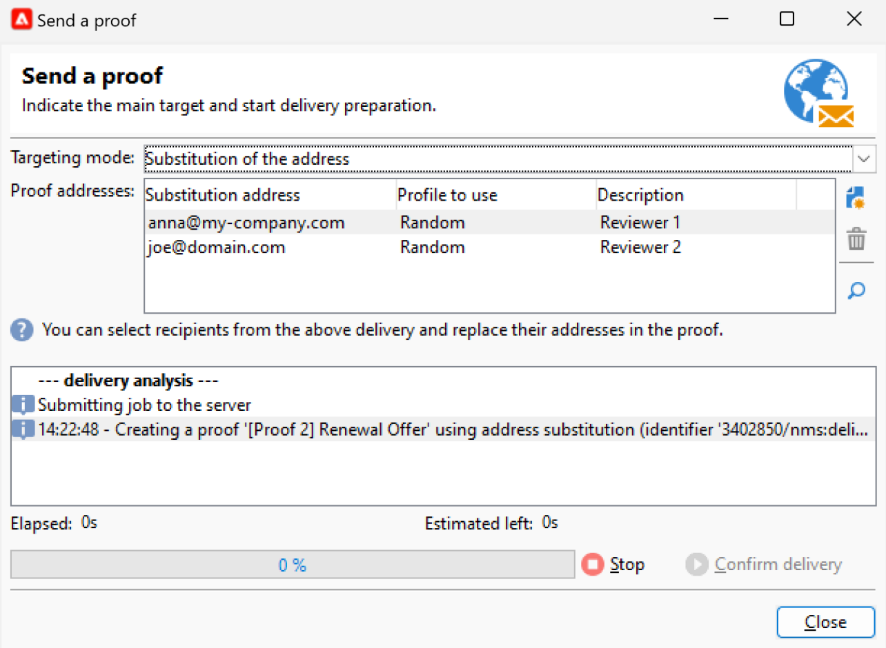
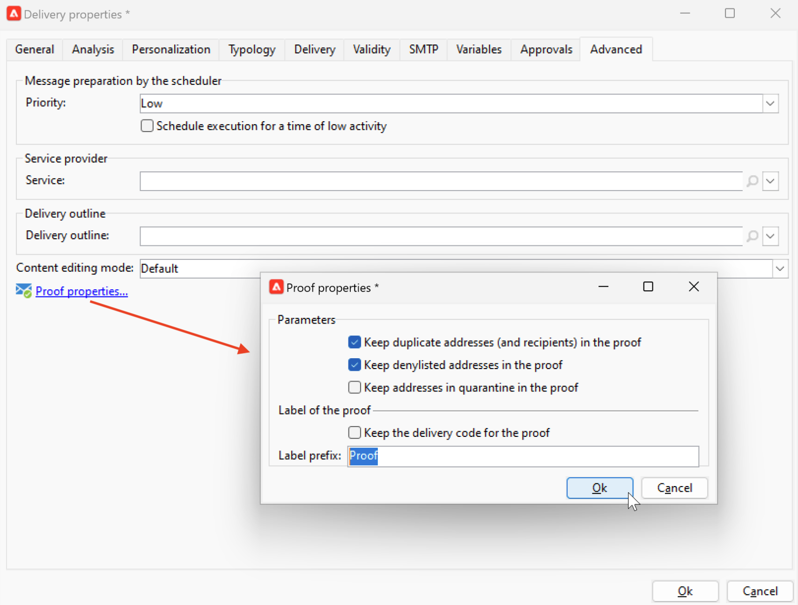

# 預覽和測試您的電子郵件 {#preview-test}

定義訊息內容後，您就可以使用測試設定檔來預覽及測試。 如果您已插入 [個人化內容](personalize.md)，您可使用測試設定檔資料檢查此內容在訊息中的顯示方式。 此外，若要偵測訊息內容或個人化設定中可能出現的錯誤，請將校樣傳送至測試設定檔。 每次進行變更時都應傳送校樣，以驗證最新內容。

## 內容預覽{#preview-content}

在傳送校樣之前，最佳實務是在傳送視窗的預覽區段中檢查訊息內容。

若要預覽訊息內容，請遵循下列步驟：

1. 瀏覽至 **預覽** 傳遞的索引標籤。
1. 按一下 **[!UICONTROL Test personalization]** 按鈕以選取要填入個人化資料的設定檔。 您可以在資料庫中選擇特定的收件者、種子地址，或從目標母體中選取設定檔（如果已經定義）。 您也可以檢查內容而不進行個人化。

   

1. 會產生預覽，讓您可檢查訊息呈現。 在訊息預覽中，個人化元素會由選取的測試設定檔資料取代。

   

1. 選取其他測試設定檔，以預覽訊息每個變體的電子郵件呈現。

## 傳送校樣 {#send-proofs}

針對電子郵件傳遞，您可以傳送校樣以驗證訊息內容。 傳送校樣可讓您檢查選擇退出連結、映象頁面和任何其他連結、驗證訊息、驗證影像是否已顯示、偵測可能的錯誤等。 您可能也會想要檢查您在不同裝置上的設計和演算。

校樣是一種特定訊息，可讓您在將訊息傳送給主要對象之前先測試訊息。 校樣的收件者負責核准訊息：轉譯、內容、個人化設定、設定。

### 校訂收件者 {#proofs-recipients}

校樣目標可以在傳遞範本中定義，或專用於傳遞。 在這兩種情況下，請從瀏覽至目標定義畫面 **[!UICONTROL To]** 連結，然後選取 **[!UICONTROL Target of the proofs]** 標籤。

校樣目標的型別是從 **[!UICONTROL Targeting mode]** 下拉式清單。

* 使用 **[!UICONTROL Definition of a specific proof target]** 在資料庫中選取收件者作為校訂目標的選項。
* 使用 **[!UICONTROL Substitution of the address]** 用於輸入電子郵件地址並使用目標收件者資料來驗證內容的選項。 您可以手動輸入替代地址，或從下拉式清單中選取替代地址。 關聯的列舉是替代地址(rcpAddress)。
預設會隨機執行替代，但您可以透過  **[!UICONTROL Detail]** 圖示。

  {width="800" align="left"}

  選擇 **[!UICONTROL Select a profile (must be included in the target)]** 選項並選取收件者。

  {width="800" align="left"}

* 使用 **[!UICONTROL Seed addresses]**  使用種子地址作為證明目標的選項。 這些位址可從檔案匯入或手動輸入。

  >[!NOTE]
  >
  >種子地址不屬於預設收件者表格(nms：recipient)，這些地址是在單獨的表格中建立的。 如果您使用新資料擴充收件者表格，則必須使用相同資料擴充種子地址表格。

  進一步瞭解中的種子地址 [本節](../audiences/test-profiles.md).

* 使用 **[!UICONTROL Specific target and Seed addresses]** 結合種子地址和特定電子郵件地址的選項。 相關設定隨後會在兩個單獨的子標籤中定義。

### 傳送證明{#proofs-send}

若要傳送訊息校樣，請遵循下列步驟：

1. 在訊息定義畫面中，按一下 **[!UICONTROL Send a proof]** 按鈕。
1. 從 **[!UICONTROL Send a proof]** 視窗，檢查校樣收件者。
1. 按一下 **[!UICONTROL Analyze]** 以開始準備校樣訊息。

   {width="800" align="left"}

1. 傳送準備完成後，請使用 **[!UICONTROL Confirm delivery]** 以開始傳送校樣訊息。

瀏覽至 **[!UICONTROL Audit]** 傳遞的索引標籤，以檢查證明副本的傳遞。

建議在每次修改訊息內容後傳送校樣。

>[!NOTE]
>
>在傳送的校樣中，指向映象頁面的連結未啟用。 它僅在最終訊息中啟用。

### 校訂屬性{#proofs-properties}

校訂屬性設定在 **[!UICONTROL Advanced]** 傳遞屬性視窗的索引標籤。 瀏覽至 **[!UICONTROL Proof properties...]** 定義引數和校樣標籤的連結。 您可以選擇保留：

* 證明中的重複地址
* 校訂中的已加入封鎖清單的地址
* 證明中的隔離地址

依預設，校樣訊息由 `Proof #N` 在主題中提及，其中 `N` 是校訂號碼。 此數字會隨著每個證明傳遞分析而增加。 您可以變更 `proof` 前置詞（視需要）。

{width="800" align="left"}

## 操作說明影片 {#video-proof}

瞭解如何傳送及驗證電子郵件傳遞的校樣。

>[!VIDEO](https://video.tv.adobe.com/v/333404)
