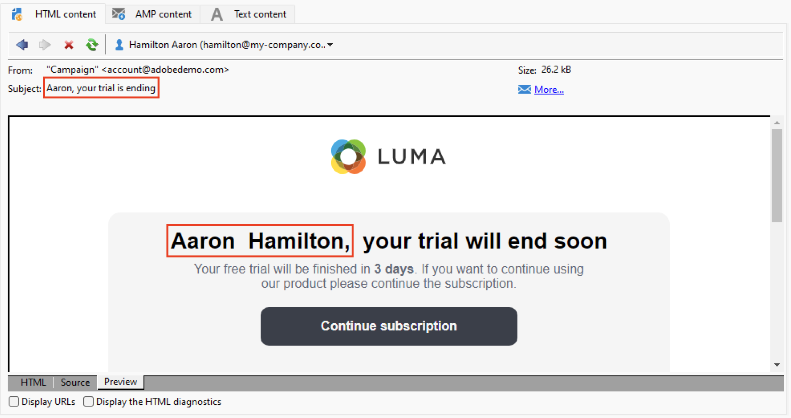

# 預覽和測試您的電子郵件 {#preview-test}

定義訊息內容後，您就可以使用測試設定檔進行預覽及測試。 如果插入 [個性化內容](personalize.md)，您可以使用test配置檔案資料檢查此內容在消息中的顯示方式。 此外，要檢測消息內容或個性化設定中的可能錯誤，請將校樣發送到test配置檔案。 每次更改時都應發送證明，以驗證最新內容。

## 內容預覽{#preview-content}

在發送校樣之前，最佳做法是在傳遞窗口的預覽部分檢查消息內容。

要預覽消息內容，請執行以下步驟：

1. 瀏覽到 **預覽** 的子菜單。
1. 按一下 **[!UICONTROL Test personalization]** 按鈕，來填充個性化資料。 您可以在資料庫中選擇特定的收件人、種子地址，或從目標填充中選擇配置檔案（如果已定義）。 您還可以檢查內容而不進行個性化。

   

1. 將生成預覽，以便您可以檢查消息呈現。 在消息預覽中，個性化元素被所選test配置檔案資料替換。

   

1. 選擇其他test配置檔案，以預覽郵件的每個變體的電子郵件呈現。

## 傳送校樣 {#send-proofs}

對於電子郵件遞送，您可以發送校樣以驗證郵件內容。 通過發送校樣，您可以檢查選擇退出連結、鏡像頁和任何其他連結、驗證消息、驗證影像是否顯示、檢測可能的錯誤等。 您可能還希望檢查不同設備上的設計和呈現。

證明是一條特定的消息，允許您在將消息發送到主受眾之前test該消息。 證明的接收者負責批准郵件：呈現、內容、個性化設定、配置。

### 證明收件人 {#proofs-recipients}

證明目標可以在傳遞模板中定義，也可以特定於傳遞。 在這兩種情況下，從 **[!UICONTROL To]** 連結，然後選擇 **[!UICONTROL Target of the proofs]** 頁籤。

校樣目標的類型是從 **[!UICONTROL Targeting mode]** 的子菜單。

* 使用 **[!UICONTROL Definition of a specific proof target]** 選項，選擇資料庫中的收件人作為校樣目標。
* 使用 **[!UICONTROL Substitution of the address]** 選項，輸入電子郵件地址並使用目標收件人資料驗證內容。 可以手動輸入替代地址，也可以從下拉清單中選擇替代地址。 關聯的枚舉為替代地址(rcpAddress)。
預設情況下，系統會隨機執行替換，但您可以通過  **[!UICONTROL Detail]** 表徵圖

   {width="800" align="left"}

   選擇 **[!UICONTROL Select a profile (must be included in the target)]** 的子菜單。

   {width="800" align="left"}

* 使用 **[!UICONTROL Seed addresses]**  選項，將種子地址用作證明目標。 這些地址可以從檔案中導入或手動輸入。

   >[!NOTE]
   >
   >種子地址不屬於預設收件人表(nms:recipient)，它們是在單獨的表中建立的。 如果用新資料擴展收件人表，則必須同時擴展種子地址表，並使用相同的資料。

   瞭解有關中的種子地址的詳細資訊 [Campaign Classicv7文檔](https://experienceleague.adobe.com/docs/campaign-classic/using/sending-messages/using-seed-addresses/about-seed-addresses.html){target="_blank"}。

* 使用 **[!UICONTROL Specific target and Seed addresses]** 選項，將種子地址和特定電子郵件地址組合。 然後在兩個單獨的子頁籤中定義相關配置。

### 傳送證明{#proofs-send}

要發送消息校樣，請執行以下步驟：

1. 在消息定義螢幕中，按一下 **[!UICONTROL Send a proof]** 按鈕
1. 從 **[!UICONTROL Send a proof]** 的子菜單。
1. 按一下 **[!UICONTROL Analyze]** 開始準備校樣消息。

   {width="800" align="left"}

1. 交付準備完成後，使用 **[!UICONTROL Confirm delivery]** 開始發送證據資訊。

瀏覽到 **[!UICONTROL Audit]** 的子菜單。

建議在每次修改消息內容後發送校樣。

>[!NOTE]
>
>在發送的證明中，指向鏡像頁面的連結未處於活動狀態。 它僅在最終訊息中啟用。

### 校樣屬性{#proofs-properties}

校樣屬性設定在 **[!UICONTROL Advanced]** 頁籤。 瀏覽到 **[!UICONTROL Proof properties...]** 連結，以定義校樣的參數和標籤。 您可以選擇保留：

* 證明中的地址重複
* 證明中的拒絕列出地址
* 校樣中的隔離地址

預設情況下，校樣消息由 `Proof #N` 在這個主題里 `N` 就是證明號。 此數字隨每個證明傳遞分析而遞增。 您可以更改 `proof` 前置詞，根據需要。

{width="800" align="left"}

## How-to視頻 {#video-proof}

瞭解如何傳送及驗證電子郵件傳遞的校樣。

>[!VIDEO](https://video.tv.adobe.com/v/333404)
