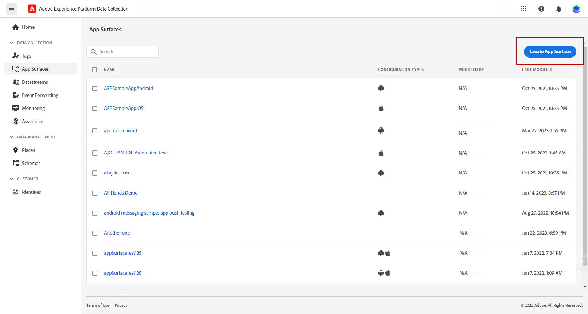

# 已修訂推播通知設定 {#push-notifications-config}

Campaign v8.5推出我們最新的推播通知服務，並以現代尖端技術為基礎，提供強大的架構。 此服務旨在解鎖全新等級的擴充能力，確保您的通知能夠以順暢的效率觸及更廣泛的對象。 透過我們增強的基礎架構和最佳化程式，您可以期待更大規模且更可靠的服務，讓您以前所未有的方式與行動應用程式使用者互動和交流。

>[!AVAILABILITY]
>
> 從Campaign v8.5開始，新客戶可獨家存取此功能，並逐步向一組選定客戶推出。 如果您的環境是在2023年6月之前布建，此頁面不適用於您，您必須遵循詳細說明的程式 [在此頁面中](push-settings.md).

關於此更新的實作，若要在Adobe Campaign中傳送推播通知，請遵循下列步驟：

1. [在Adobe Experience Platform資料彙集中建立應用程式表面](#create-app-surface)

1. [在Adobe Campaign中設定您的應用程式設定](#push-config-campaign)

1. [在Adobe Experience Platform Data Collection中建立及設定行動屬性](#create-mobile-property)

1. [新增Adobe Adobe Experience Platform保證擴充功能](https://developer.adobe.com/client-sdks/documentation/platform-assurance-sdk/){target="_blank"}（建議）

1. [新增Campaign Classic至您的行動應用程式](#campaign-mobile-ap)

1. [建立iOS和Android的傳遞](##push-create)

>[!NOTE]
>
> 資料收集不支援舊版FCM和APNS p12。

## 在Adobe Experience Platform資料彙集中建立應用程式表面 {#create-app-surface}

您需要將行動應用程式推送認證新增至 [!DNL Adobe Experience Platform Data Collection].

行動應用程式推播認證註冊為必填，才能授權Adobe代表您傳送推播通知。 請參閱以下詳細步驟：

1. 從 [!DNL Adobe Experience Platform Data Collection]，選取 **[!UICONTROL App Surfaces]** 標籤。

1. 按一下 **[!UICONTROL Create App Surface]** 以建立新的組態。

   

1. 輸入 **[!UICONTROL Name]** 用於設定。

1. 從 **[!UICONTROL Mobile Application Configuration]**，選取作業系統：

   * **適用於iOS**

     

      1. 輸入行動應用程式 **套件組合ID** 在 **[!UICONTROL App ID (iOS Bundle ID)]** 欄位。

         此應用程式套件組合ID可在以下網址找到： **一般** 中主要目標的索引標籤 **XCode** 您的Apple開發人員帳戶。

      1. 開啟 **[!UICONTROL Push Credentials]** 以新增您的認證。

      1. 拖放您的.p8 Apple推播通知驗證金鑰檔案。

         此金鑰可取自 **憑證**， **識別碼** 和 **設定檔** Apple開發人員帳戶頁面。

      1. 提供 **金鑰ID**. 這是在p8驗證金鑰建立期間指派的10字元字串。

         此區域位於 **金鑰** 定位於 **憑證**， **識別碼** 和 **設定檔** Apple開發人員帳戶頁面。

      1. 提供 **團隊ID**. 此為字串值，可在 **會籍** 標籤。

   * **適用於Android**

     

      1. 提供 **[!UICONTROL App ID (Android package name)]**. 套件名稱通常是中的應用程式ID， `build.gradle` 檔案。

      1. 切換 **[!UICONTROL Push Credentials]** 以新增您的認證。

      1. 拖放FCM推送認證。 如需如何取得推送認證的詳細資訊，請參閱 [Google檔案](https://firebase.google.com/docs/admin/setup#initialize-sdk){target="_blank"}.

1. 按一下 **[!UICONTROL Save]** 以建立您的應用程式設定。

## 在Adobe Campaign中設定您的應用程式設定{#push-config-campaign}

### 建立服務 {#create-service}

在傳送推播通知之前，您必須在Adobe Campaign中定義iOS和Android應用程式設定。

推播通知會透過專用服務傳送給您的應用程式使用者。 使用者安裝您的應用程式時，會訂閱此服務： Adobe Campaign仰賴此服務，僅鎖定您應用程式的訂閱者。 在此服務中，您需要新增iOS和Android應用程式，才能在iOS和Android裝置上傳送。

若要建立服務以傳送推播通知，請遵循下列步驟：

1. 瀏覽至 **[!UICONTROL Profiles and Targets > Services and Subscriptions]** 標籤，然後按一下 **[!UICONTROL Create]**.

   {width="800" align="left"}

1. 輸入 **[!UICONTROL Label]** 和 **[!UICONTROL Internal name]**，然後選取 **[!UICONTROL Mobile application]** 型別。

   >[!NOTE]
   >
   >預設 **[!UICONTROL Subscriber applications (nms:appSubscriptionRcp)]** 目標對應會連結至收件者表格。 如果您想使用不同的目標對應，則需要建立新的目標對應，並在 **[!UICONTROL Target mapping]** 服務的欄位。 進一步瞭解中的目標對應 [此頁面](../audiences/target-mappings.md).

1. 然後使用 **[!UICONTROL Add]** 圖示來定義使用此服務的行動應用程式。

   

### 建立行動應用程式 {#create-sapp}

建立服務後，您現在需要定義將使用此服務的行動應用程式。

>[!BEGINTABS]

>[!TAB iOS]

若要為iOS裝置建立應用程式，請遵循下列步驟：

1. 在服務中，按一下 **[!UICONTROL Add]** 然後選取 **[!UICONTROL Create an iOS application]**. 按一下&#x200B;**[!UICONTROL Next]**。

   

1. 從 **[!UICONTROL Launch app configurations list]** 視窗中，選取先前在此區段中建立的應用程式表面。 按一下&#x200B;**[!UICONTROL Next]**。

   

1. （選用）您可以使用一些擴充推送訊息內容 **[!UICONTROL Application variables]**. 這些都是可完全自訂的專案，而且是傳送至行動裝置的訊息裝載的一部分。

   在以下範例中， **mediaURl** 和 **mediaExt** 會新增變數來建立豐富推送通知，然後為應用程式提供要在通知內顯示的影像。

   

1. 瀏覽至 **[!UICONTROL Subscription parameters]** 標籤以定義副檔名為的對應 **[!UICONTROL Subscriber applications (nms:appsubscriptionRcp)]** 綱要。

1. 瀏覽至 **[!UICONTROL Sounds]** 索引標籤以定義要播放的聲音。 按一下 **[!UICONTROL Add]** 並填滿 **[!UICONTROL Internal name]** 欄位，其中必須包含內嵌於應用程式中的檔案名稱或系統聲音名稱。

1. 按一下 **[!UICONTROL Next]** 以開始設定開發應用程式。

1. 此 **[!UICONTROL Integration key]** 特定於每個應用程式。 此維度會將行動應用程式連結至Adobe Campaign，並將在設定Campaign擴充功能時使用。

   請確定相同 **[!UICONTROL Integration key]** 是透過SDK在Adobe Campaign和應用程式程式碼中定義的。

   進一步瞭解 [開發人員檔案](https://developer.adobe.com/client-sdks/documentation/adobe-campaign-classic/#configuration-keys){target="_blank"}

   >[!NOTE]
   >
   > 此 **[!UICONTROL Integration key]** 可使用字串值完全自訂，但需與SDK中指定的值完全相同。
   >
   > 您不能對應用程式的開發版本（沙箱）和生產版本使用相同的憑證。

   

1. 選取圖示，從 **[!UICONTROL Application icon]** 欄位來個人化您服務中的行動應用程式。

1. 按一下 **[!UICONTROL Next]** 以開始設定生產應用程式，並依照上述步驟進行。 請注意，您不能使用相同的 **[!UICONTROL Integration key]** 適用於應用程式的開發版本（沙箱）和生產版本。

1. 按一下&#x200B;**[!UICONTROL Finish]**。

您的iOS應用程式現在已準備好在Campaign中使用。

>[!TAB Android]

若要為Android裝置建立應用程式，請執行下列步驟：

1. 在服務中，按一下 **[!UICONTROL Add]** 然後選取 **[!UICONTROL Create an Android application]**. 按一下&#x200B;**[!UICONTROL Next]**。

   

1. 從 **[!UICONTROL Launch app configurations list]** 視窗，選取在此區段中建立的應用程式表面，然後按一下 **[!UICONTROL Next]**.

   

1. 整合金鑰是每個應用程式專屬的。 此維度會將行動應用程式連結至Adobe Campaign，並將在設定Campaign擴充功能時使用。

   請確定相同 **[!UICONTROL Integration key]** 是透過SDK在Adobe Campaign和應用程式程式碼中定義的。

   進一步瞭解 [開發人員檔案](https://developer.adobe.com/client-sdks/documentation/adobe-campaign-classic/#configuration-keys){target="_blank"}

   >[!NOTE]
   >
   > 此 **[!UICONTROL Integration key]** 可使用字串值完全自訂，但需與SDK中指定的值完全相同。

   

1. 選取圖示，從 **[!UICONTROL Application icon]** 欄位來個人化您服務中的行動應用程式。

1. （選用）您可以使用一些擴充推送訊息內容 **[!UICONTROL Application variables]** 如有需要。 這些都是可完全自訂的專案，而且是傳送至行動裝置的訊息裝載的一部分。

1. 瀏覽至 **[!UICONTROL Subscription parameters]** 標籤以定義副檔名為的對應 **[!UICONTROL Subscriber applications (nms:appsubscriptionRcp)]** 綱要。

1. 按一下 **[!UICONTROL Finish]**，之後 **[!UICONTROL Save]**。

您的Android應用程式現在已準備好在Campaign中使用。

>[!ENDTABS]

以下是FCM裝載名稱，可進一步個人化您的推播通知：

| 訊息類型 | 可設定的訊息元素（FCM裝載名稱） | 可設定的選項（FCM裝載名稱） |
|:-:|:-:|:-:|
| 資料訊息 | N/A | validate_only |
| 通知訊息 | 標題，內文， android_channel_id，圖示，聲音，標籤，顏色，點選動作，影像，提示，粘性，可見度，通知優先順序，通知計數   | validate_only |

## 在Adobe Experience Platform資料彙集中設定行動屬性 {#create-mobile-property}

1. 從資料收集首頁，存取標籤功能表。

1. 按一下&#x200B;**[!UICONTROL New Property]**。

   

1. 輸入屬性的名稱並選取 **[!UICONTROL Mobile]** 作為平台。

   

1. 按一下 **[!UICONTROL Save]** 以建立行動屬性。

1. 存取您新建立的行動屬性。

1. 從您的行動屬性控制面板，存取 **[!UICONTROL Extensions]** 功能表，然後 **[!UICONTROL Catalog]** 標籤。

   

1. 安裝 **[!DNL Adobe Campaign Classic]** 副檔名。 [進一步瞭解Campaign擴充功能](https://developer.adobe.com/client-sdks/documentation/adobe-campaign-classic/#configure-campaign-classic-extension)

   

1. 填寫執行個體的詳細資訊：

   * **[!UICONTROL Registration endpoint]** 或 **[!UICONTROL Tracking endpoint]** URL可在以下網址找到： **[!UICONTROL Tools]** > **[!UICONTROL Advanced]** > **[!UICONTROL Deployment wizard]** Campaign中的功能表。
   * **[!UICONTROL Integration keys]** 可以在的行動應用程式中找到，該應用程式設定於 [本節](#create-app).

   

1. 按一下&#x200B;**[!UICONTROL Save]**。

1. 您現在需要從發佈設定 **[!UICONTROL Publishing flow]** 功能表。 [了解更多](https://developer.adobe.com/client-sdks/documentation/getting-started/create-a-mobile-property/#publish-the-configuration)

您的行動屬性現在將自動與 **[!UICONTROL Adobe Experience Platform Data Collection]** 技術工作流程。 [了解更多](../../automation/workflow/technical-workflows.md#list-technical-workflows)

## 新增Campaign Classic至您的行動應用程式 {#campaign-mobile-app}

Adobe Experience Platform Mobile SDK有助於在行動應用程式中強化Adobe的Experience Cloud解決方案和服務。 SDK的設定可透過資料收集UI進行管理，以進行靈活設定和可擴充的規則型整合。

[在Adobe Developer檔案中進一步瞭解](https://developer.adobe.com/client-sdks/documentation/adobe-campaign-classic/#add-campaign-classic-to-your-app){target="_blank"}.

## 建立推播通知{#push-create}

在資料收集中成功設定行動應用程式後，您現在可以在Adobe Campaign中建立和傳送推播通知。

請參閱 [此頁面](push.md#push-create) 以取得特定於iOS和Android通知傳送的詳細元素。
