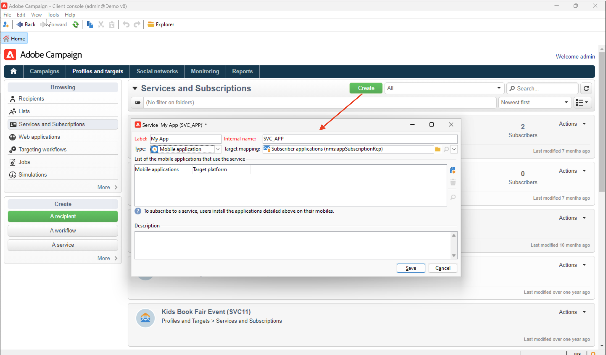

# 設定推播通知頻道 {#push-notification-configuration}

若要使用Adobe Campaign傳送推播通知，您必須先設定環境和應用程式，如本頁面所述。 在Adobe Campaign中，傳送推播通知的頻道是行動應用程式頻道。

>[!CAUTION]
>
>Android Firebase Cloud Messaging (FCM) 服務的一些重要變更將於 2024 年發行，並可能影響 Adobe Campaign 實施。Android 推播訊息訂閱服務設定可能需要更新，才能支援此變更。您已經可以檢查並採取行動。 [了解更多](../../technotes/upgrades/push-technote.md)。

開始使用Adobe Campaign傳送推播通知之前，您需要確保行動應用程式上和Adobe Experience Platform中的標籤已具備設定和整合。 Adobe Experience Platform Mobile SDK透過Android與iOS相容的SDK，為您的行動裝置提供使用者端整合API。

若要使用Adobe Experience Platform Mobile SDK設定您的應用程式，請遵循下列步驟：

1. 檢查 [必備條件](#before-starting).
1. 設定 [行動標籤屬性](#launch-property) 在Adobe Experience Platform資料彙集中建立。
1. 取得詳細的Adobe Experience Platform Mobile SDK [在此頁面中](https://developer.adobe.com/client-sdks/documentation/getting-started/get-the-sdk/){target="_blank"}.
1. （選用）啟用記錄和生命週期量度（如詳細） [在此頁面中](https://developer.adobe.com/client-sdks/documentation/getting-started/enable-debug-logging/){target="_blank"}.
1. （選用）新增 [應用程式的Adobe Experience Platform保證](https://developer.adobe.com/client-sdks/documentation/getting-started/validate/){target="_blank"} to validate your implementation. Learn how to implement Adobe Experience Platform Assurance extension [in this page](https://developer.adobe.com/client-sdks/documentation/platform-assurance-sdk/){target="_blank"}.
1. 在Adobe Campaign中設定iOS和Android Mobile Services的詳細資訊 [在此頁面中](#push-service).
1. 安裝與設定 [Adobe Campaign擴充功能](#configure-extension) 在您的行動屬性中。
1. 追隨 [Adobe Experience Platform Mobile SDK檔案](https://developer.adobe.com/client-sdks/documentation/getting-started/){target="_blank"} 以使用應用程式中的Adobe Experience Platform Mobile SDK進行設定。

## 先決條件 {#before-starting}

### 設定許可權 {#setup-permissions}

建立行動應用程式之前，您必須先確定您擁有或指派適用於Adobe Experience Platform標籤的正確使用者許可權。 Adobe Experience Platform中標籤的使用者許可權會透過Adobe Admin Console指派給使用者。 進一步瞭解 [標籤檔案](https://experienceleague.adobe.com/docs/experience-platform/tags/admin/user-permissions.html){target="_blank"}.

>[!CAUTION]
>
>推播設定必須由專家使用者執行。 根據您的實施模式以及此實施中涉及的角色，您可能需要將完整許可權集指派給單一產品設定檔，或應用程式開發人員與 **Adobe Campaign** 管理員。

要指派 **屬性** 和 **公司** 權利，請遵循下列步驟：

1. 存取 **[!DNL Admin Console]**.
1. 從 **[!UICONTROL Products]** 索引標籤中，選取 **[!UICONTROL Adobe Experience Platform Data Collection]** 卡片。
1. 選取現有 **[!UICONTROL Product Profile]** 或建立新的URL，使用 **[!UICONTROL New profile]** 按鈕。 瞭解如何建立新的 **[!UICONTROL New profile]** 在 [Admin Console檔案](https://experienceleague.adobe.com/docs/experience-platform/access-control/ui/create-profile.html#ui){target="_blank"}.
1. 在&#x200B;**[!UICONTROL Permissions]**&#x200B;索引標籤中，選取&#x200B;**[!UICONTROL Property Rights]**。
1. 按一下 **[!UICONTROL Add all]**。這會將以下許可權新增至您的產品設定檔：
   * **[!UICONTROL Approve]**
   * **[!UICONTROL Develop]**
   * **[!UICONTROL Edit Property]**
   * **[!UICONTROL Manage Environments]**
   * **[!UICONTROL Manage Extensions]**
   * **[!UICONTROL Publish]**

   您必須具備這些許可權，才能安裝和發佈Adobe Campaign擴充功能，以及在中發佈應用程式屬性 **Adobe Experience Platform Mobile SDK**.

1. 然後，選取 **[!UICONTROL Company rights]** 在左側功能表中。
1. 新增下列許可權：

   * **[!UICONTROL Manage App Configurations]**
   * **[!UICONTROL Manage Properties]**

   行動應用程式開發人員需要這些許可權才能在中設定推送認證 **Adobe Experience Platform資料彙集**.

1. 按一下&#x200B;**[!UICONTROL Save]**。

若要指派此專案 **[!UICONTROL Product profile]** 請依照下列步驟傳送給使用者：

1. 存取 **[!DNL Admin Console]**.
1. 從 **[!UICONTROL Products]** 索引標籤中，選取 **[!UICONTROL Adobe Experience Platform Data Collection]** 卡片。
1. 選取您先前設定的&#x200B;**[!UICONTROL Product profile]**。
1. 在 **[!UICONTROL Users]** 索引標籤中，按一下 **[!UICONTROL Add user]**。
1. 輸入使用者的名稱或電子郵件地址，然後選取使用者。 然後，按一下 **[!UICONTROL Save]**.

   >[!NOTE]
   >
   >如果使用者先前未在Admin Console中建立，請參閱 [新增使用者檔案](https://helpx.adobe.com/enterprise/using/manage-users-individually.html#add-users){target="_blank"}.

### 設定您的應用程式 {#configure-app}

技術設定涉及應用程式開發人員與企業管理員之間的密切合作。 開始使用傳送推播通知之前 [!DNL Adobe Campaign]，您必須定義中的設定 [!DNL Adobe Experience Platform Data Collection] 並將您的行動應用程式與Adobe Experience Platform Mobile SDK整合。

請依照下列連結中詳述的實作步驟操作：

* 的 **Apple iOS**：瞭解如何透過中的APN註冊您的應用程式 [Apple檔案](https://developer.apple.com/documentation/usernotifications/registering_your_app_with_apns){target="_blank"}
* 的 **Google Android**：瞭解如何在Android上設定Firebase Cloud Messaging使用者端應用程式 [Google檔案](https://firebase.google.com/docs/cloud-messaging/android/client){target="_blank"}

<!--
## Add your app push credentials in Adobe Experience Platform Data Collection {#push-credentials}

After granting the correct user permissions, you now need to add your mobile application push credentials in Adobe Experience Platform Data Collection. 

The mobile app push credential registration is required to authorize Adobe to send push notifications on your behalf. Refer to the steps detailed below:

1. From [!DNL Adobe Experience Platform Data Collection], browse to **[!UICONTROL App Surfaces]** in the left rail.

1. Click **[!UICONTROL Create App Surface]** to create a new configuration.

1. Enter a **[!UICONTROL Name]** for the configuration.

1. From **[!UICONTROL Mobile Application Configuration]**, select the system and enter settings.

    * **For iOS**

        1. Enter the mobile app **Bundle Id** in the **[!UICONTROL App ID (iOS Bundle ID)]** field. The app Bundle ID can be found in the **General** tab of the primary target in **XCode**.
        
        1. Switched on the **[!UICONTROL Push Credentials]** button to add your credentials.
        
        1. Drag and drop your .p8 Apple Push Notification Authentication Key file. This key can be acquired from the **Certificates**, **Identifiers** and **Profiles** page.

        1. Provide the **Key ID**. This is a 10 character string assigned during the creation of p8 auth key. It can be found under **Keys** tab in **Certificates**, **Identifiers** and **Profiles** page.
        
        1. Provide the **Team ID**. This is a string value which can be found under the Membership tab.

    * **For Android**

        1. Provide the **[!UICONTROL App ID (Android package name)]**: usually the package name is the app id in your `build.gradle` file.

        1. Switched on the **[!UICONTROL Push Credentials]** button to add your credentials.

        1. Drag and drop the FCM push credentials. For more details on how to get the push credentials refer to [Google Documentation](https://firebase.google.com/docs/admin/setup#initialize-sdk){target="_blank"}.
    

1. Click **[!UICONTROL Save]** to create your app configuration.
-->

## 在Adobe Experience Platform資料彙集中設定行動標籤屬性 {#launch-property}

設定行動屬性可讓行動應用程式開發人員或行銷人員設定行動SDK。 您通常會為想要管理的每個行動應用程式建立行動屬性。 瞭解如何在中建立和設定行動屬性 [Adobe Experience Platform Mobile SDK檔案](https://developer.adobe.com/client-sdks/documentation/getting-started/create-a-mobile-property/){target="_blank"}.
<!--
To get the SDKs needed for push notification to work you will need the following SDK extensions, for both Android and iOS:

* **[!UICONTROL Mobile Core]** (installed automatically)
* **[!UICONTROL Profile]** (installed automatically)
* **[!UICONTROL Adobe Experience Platform Edge]**
* **[!UICONTROL Adobe Experience Platform Assurance]**, optional but recommended to debug the mobile implementation.
-->

進一步瞭解 [!DNL Adobe Experience Platform Data Collection] 中的標籤 [Adobe Experience Platform檔案](https://experienceleague.adobe.com/docs/platform-learn/implement-mobile-sdk/initial-configuration/configure-tags.html){target="_blank"}.

建立後，請開啟新標籤屬性並建立程式庫。 操作步驟：

1. 瀏覽至 **發佈流程** 在左側導覽中並選取 **新增程式庫**.
1. 輸入程式庫名稱並選取環境。
1. 選取 **新增所有變更的資源**、和 **儲存並建置到開發環境**.
1. 最後，請從將此程式庫設定為您的工作程式庫 **選取工作程式庫** 按鈕。

## 在Campaign中設定行動服務 {#push-service}

一旦您的行動應用程式在中設定後 [!DNL Adobe Experience Platform Data Collection]，您必須建立兩個服務(一個用於iOS裝置，一個用於Android裝置)才能從傳送推播通知 **[!DNL Adobe Campaign]**.

推播通知會透過專用服務傳送給您的應用程式使用者。 使用者安裝您的應用程式時，會訂閱此服務： Adobe Campaign仰賴此服務，僅鎖定您應用程式的訂閱者。 在此服務中，您需要新增iOS和Android應用程式，才能在iOS和Android裝置上傳送。

若要建立服務以傳送推播通知，請遵循下列步驟：

1. 瀏覽至 **[!UICONTROL Profiles and Targets > Services and Subscriptions]** 標籤，然後按一下 **[!UICONTROL Create]**.

   {width="800" align="left"}

1. 輸入 **[!UICONTROL Label]** 和 **[!UICONTROL Internal name]**，然後選取 **[!UICONTROL Mobile application]** 型別。

   >[!NOTE]
   >
   >預設 **[!UICONTROL Subscriber applications (nms:appSubscriptionRcp)]** 目標對應會連結至收件者表格。 如果您想使用不同的目標對應，則需要建立新的目標對應，並在 **[!UICONTROL Target mapping]** 服務的欄位。 進一步瞭解中的目標對應 [此頁面](../audiences/target-mappings.md).

1. 然後使用 **[!UICONTROL Add]** 圖示來定義使用此服務的行動應用程式。

>[!BEGINTABS]

>[!TAB iOS]

若要為iOS裝置建立應用程式，請遵循下列步驟：

1. 選取 **[!UICONTROL Create an iOS application]** 並按一下 **[!UICONTROL Next]**。

   {width="600" align="left"}

1. 在「 」中輸入應用程式的名稱 **[!UICONTROL Label]** 欄位。
1. （選用）您可以使用一些擴充推送訊息內容 **[!UICONTROL Application variables]**. 這些都是可完全自訂的專案，而且是傳送至行動裝置的訊息裝載的一部分。

   在以下範例中， **mediaURl** 和 **mediaExt** 會新增變數來建立豐富推送通知，然後為應用程式提供要在通知內顯示的影像。

   {width="600" align="left"}

1. 瀏覽至 **[!UICONTROL Subscription parameters]** 標籤以定義副檔名為的對應 **[!UICONTROL Subscriber applications (nms:appsubscriptionRcp)]** 綱要。

1. 瀏覽至 **[!UICONTROL Sounds]** 索引標籤以定義要播放的聲音。 按一下 **[!UICONTROL Add]** 並填滿 **[!UICONTROL Internal name]** 欄位，其中必須包含內嵌於應用程式中的檔案名稱或系統聲音名稱。

1. 按一下 **[!UICONTROL Next]** 以開始設定開發應用程式。

1. 整合金鑰是每個應用程式專屬的。 這會將行動應用程式連結至Adobe Campaign。

   請確定相同 **[!UICONTROL Integration key]** 是透過SDK在Adobe Campaign和應用程式程式碼中定義的。

   進一步瞭解 [開發人員檔案](https://developer.adobe.com/client-sdks/documentation/adobe-campaign-classic/#configuration-keys){target="_blank"}

   >[!NOTE]
   >
   > 此 **[!UICONTROL Integration key]** 可使用字串值完全自訂，但需與SDK中指定的值完全相同。
   >
   > 您不能對應用程式的開發版本（沙箱）和生產版本使用相同的憑證。

1. 選取圖示，從 **[!UICONTROL Application icon]** 欄位來個人化您服務中的行動應用程式。

1. 選取 **[!UICONTROL Authentication mode]**。提供兩種模式：

   * （建議） **[!UICONTROL Token-based authentication]**：填入APNs連線設定 **[!UICONTROL Key Id]**， **[!UICONTROL Team Id]** 和 **[!UICONTROL Bundle Id]** 然後按一下「 」以選取您的p8憑證 **[!UICONTROL Enter the private key...]**. 有關詳細資訊 **[!UICONTROL Token-based authentication]**，請參閱 [Apple檔案](https://developer.apple.com/documentation/usernotifications/setting_up_a_remote_notification_server/establishing_a_token-based_connection_to_apns){target="_blank"}.

   * **[!UICONTROL Certificate-based authentication]**：按一下 **[!UICONTROL Enter the certificate...]**  接著，選取您的p12金鑰並輸入行動應用程式開發人員提供的密碼。 請注意，此憑證有到期日，必須每年更新。 為避免使用者的服務中斷，請在憑證過期前更新憑證。 憑證的有效期為一年，您必須更新憑證才能繼續與APN通訊。

1. 使用 **[!UICONTROL Test the connection]** 按鈕以驗證您的設定。

1. 按一下 **[!UICONTROL Next]** 以開始設定生產應用程式，並依照上述步驟進行。

1. 按一下&#x200B;**[!UICONTROL Finish]**。

您的iOS應用程式現在已準備好在Campaign中使用。

>[!TAB Android]

若要為Android裝置建立應用程式，請執行下列步驟：

1. 選取 **[!UICONTROL Create an Android application]** 並按一下 **[!UICONTROL Next]**。

   {width="600" align="left"}

1. 在「 」中輸入應用程式的名稱 **[!UICONTROL Label]** 欄位。
1. 整合金鑰是每個應用程式專屬的。 這會將行動應用程式連結至Adobe Campaign。

   請確定相同 **[!UICONTROL Integration key]** 是透過SDK在Adobe Campaign和應用程式程式碼中定義的。

   進一步瞭解 [開發人員檔案](https://developer.adobe.com/client-sdks/documentation/adobe-campaign-classic/#configuration-keys){target="_blank"}

   >[!NOTE]
   >
   > 此 **[!UICONTROL Integration key]** 可使用字串值完全自訂，但需與SDK中指定的值完全相同。
   >

1. 選取圖示，從 **[!UICONTROL Application icon]** 欄位來個人化您服務中的行動應用程式。
1. 選取 **HTTP v1** 在  **[!UICONTROL API version]** 下拉式清單。
1. 按一下 **[!UICONTROL Load project json file to extract project details...]** 載入您的JSON金鑰檔案的連結。 有關如何解壓縮JSON檔案的詳細資訊，請參閱 [Google Firebase檔案](https://firebase.google.com/docs/admin/setup#initialize-sdk){target="_blank"}.

   您也可以手動輸入下列明細：
   * **[!UICONTROL Project Id]**
   * **[!UICONTROL Private Key]**
   * **[!UICONTROL Client Email]**

1. 使用 **[!UICONTROL Test the connection]** 按鈕以驗證您的設定。

   >[!CAUTION]
   >
   >此 **[!UICONTROL Test connection]** 按鈕不會檢查MID伺服器是否可存取FCM伺服器。

1. （選用）您可以使用一些擴充推送訊息內容 **[!UICONTROL Application variables]** 如有需要。 這些都是可完全自訂的專案，而且是傳送至行動裝置的訊息裝載的一部分。

1. 按一下 **[!UICONTROL Finish]** 則 **[!UICONTROL Save]**. 您的Android應用程式現在已準備好在Campaign中使用。

以下是FCM裝載名稱，可進一步個人化您的推播通知：

| 訊息類型 | 可設定的訊息元素（FCM裝載名稱） | 可設定的選項（FCM裝載名稱） |
|:-:|:-:|:-:|
| 資料訊息 | N/A | validate_only |
| 通知訊息 | 標題，內文， android_channel_id，圖示，聲音，標籤，顏色，點選動作，影像，提示，粘性，可見度，通知優先順序，通知計數   | validate_only |

>[!ENDTABS]

## 在您的行動屬性中設定Adobe Campaign擴充功能 {#configure-extension}

此 **Adobe Campaign Classic擴充功能** 適用於Adobe Experience Platform的Mobile SDK可支援行動應用程式的推播通知，協助您收集使用者推播權杖，並管理與Adobe Experience Platform服務的互動測量。

此擴充功能適用於Campaign Classic v7和Campaign v8，已預先安裝在您的環境中，且必須加以設定。 若要設定行動標籤屬性的擴充功能，請遵循下列步驟：

1. 開啟您之前建立的標籤屬性。
1. 從左側導覽瀏覽 **擴充功能**，然後開啟 **目錄** 標籤。 使用搜尋欄位來尋找 **Adobe Campaign Classic** 副檔名。
1. 在Campaign Classic卡中，按一下 **安裝** 按鈕。
1. 輸入設定，如所述 [Adobe Experience Platform Mobile SDK檔案](https://developer.adobe.com/client-sdks/documentation/adobe-campaign-classic/){target="_blank"}.

您現在可以將Campaign新增至您的應用程式，如中所述  [Adobe Experience Platform Mobile SDK檔案](https://developer.adobe.com/client-sdks/documentation/adobe-campaign-classic/#add-campaign-classic-to-your-app){target="_blank"}.
