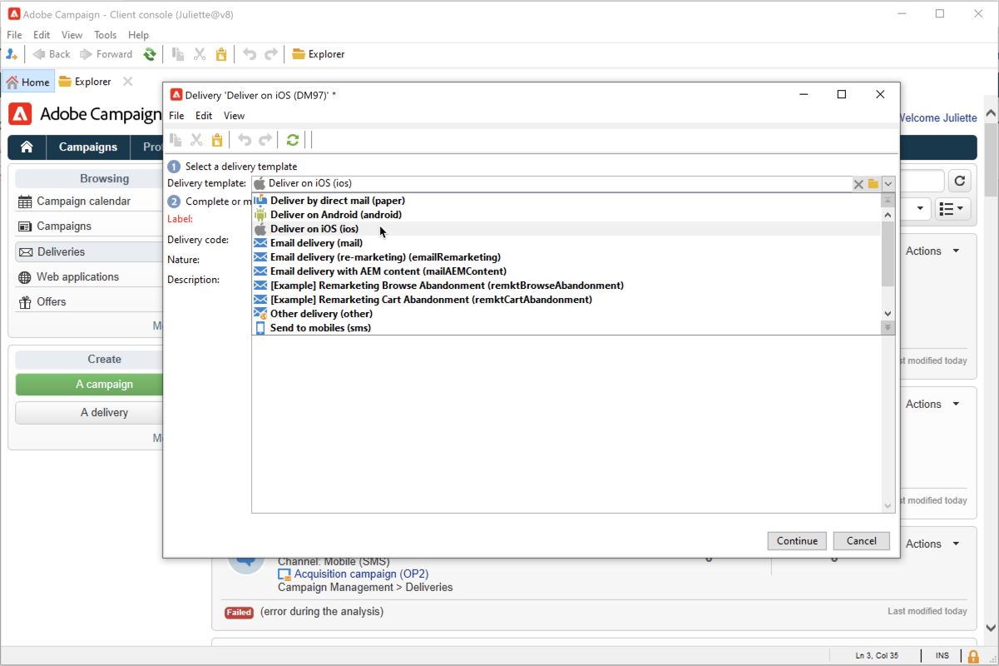
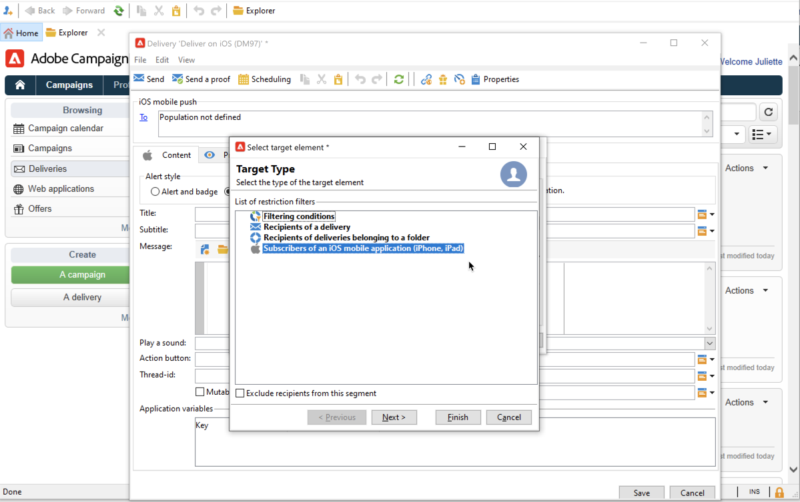
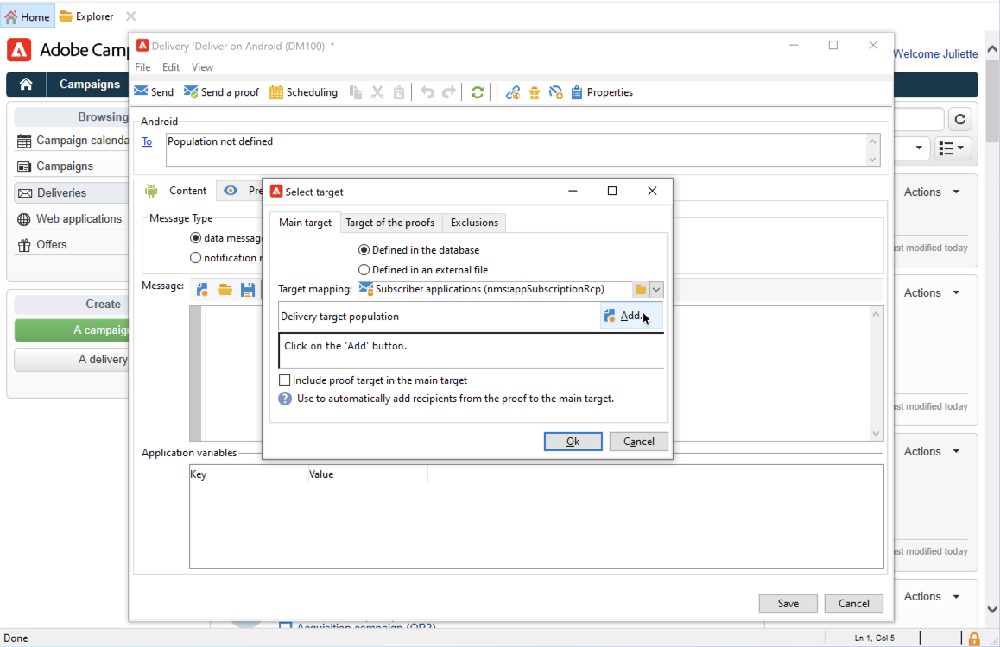
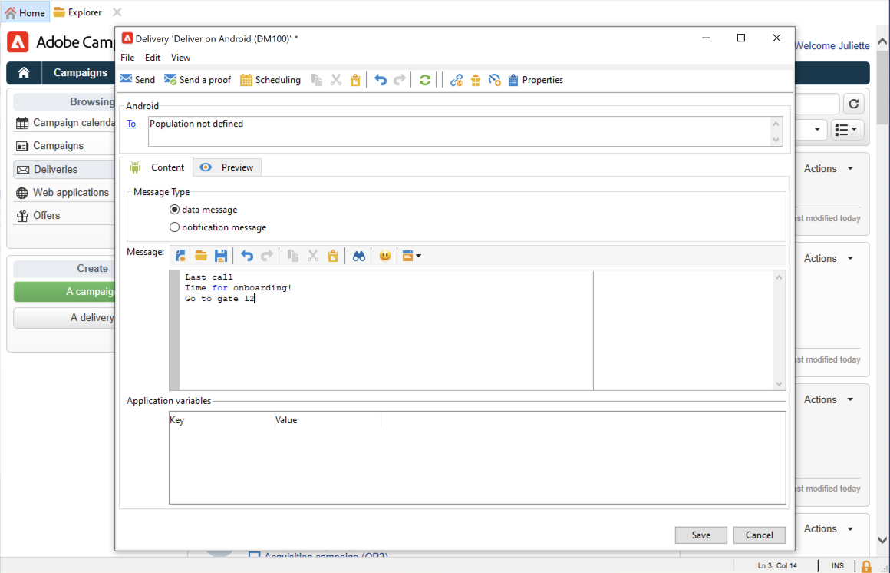

# 建立和傳送推播通知

行動應用程式傳送可讓您傳送通知至iOS和Android系統。

若要在Adobe Campaign中傳送推播通知，您必須：

1. 設定您的Campaign環境
1. 為行動應用程式建立行動應用程式類型的資訊服務。
1. 將應用程式的iOS和Android版本新增至此服務。
1. 建立iOS和Android的傳送。

[!DNL :arrow_upper_right:] 在Campaign Classicv7檔案中了解如 [何開始使用行動應用程式](https://experienceleague.adobe.com/docs/campaign-classic/using/sending-messages/sending-push-notifications/about-mobile-app-channel.html){target=&quot;_blank&quot;}

## 與AdobeSDK整合

### 整合Campaign SDK

Campaign SDK可促進行動應用程式與Adobe Campaign平台的整合。

相容的SDK版本列在[Campaign相容性矩陣](../start/compatibility-matrix.md#MobileSDK)中。

[!DNL :bulb:] 在本小節中了解如何整合Campaign Android和iOS SDK與您的應 [用程式](../config/push-config.md)

### 在Launch中設定Campaign擴充功能

您可以善用Campaign Classic擴充功能，將Adobe Experience Platform Launch SDK與Campaign整合。

[!DNL :arrow_upper_right:] 進一步了 [解Adobe行動SDK檔案](https://aep-sdks.gitbook.io/docs/using-mobile-extensions/adobe-campaignclassic){target=&quot;_blank&quot;}

## 在Campaign中配置您的應用程式設定

您必須在Adobe Campaign中定義iOS和Android應用程式設定。

[!DNL :arrow_upper_right:] iOS的設定准則在 [Campaign Classicv7檔案](https://experienceleague.adobe.com/docs/campaign-classic/using/sending-messages/sending-push-notifications/configure-the-mobile-app/configuring-the-mobile-application.html?lang=en#sending-messages){target=&quot;_blank&quot;}中有詳細說明

[!DNL :arrow_upper_right:] Campaign Classicv7檔案 [{target=&quot;_blank&quot;}中會詳](https://experienceleague.adobe.com/docs/campaign-classic/using/sending-messages/sending-push-notifications/configure-the-mobile-app/configuring-the-mobile-application-android.html?lang=en#sending-messages)細說明Anddroid的設定准則

## 建立您的第一個推播通知

本節詳細說明iOS和Android通知傳送的特定元素。

>[!CAUTION]
>
>若使用Campaign v8，行動註冊現在為&#x200B;**asynchronous**。 [深入瞭解](../dev/staging.md)

若要建立新傳送，請瀏覽至&#x200B;**[!UICONTROL Campaigns]**&#x200B;標籤，按一下&#x200B;**[!UICONTROL Deliveries]**，然後按一下現有傳送清單上方的&#x200B;**[!UICONTROL Create]**&#x200B;按鈕。

[!DNL :arrow_upper_right:] 如需如何建立傳送的全域資訊，請參閱 [Campaign Classicv7檔案](https://experienceleague.adobe.com/docs/campaign-classic/using/sending-messages/key-steps-when-creating-a-delivery/steps-about-delivery-creation-steps.html?lang=en#sending-messages){target=&quot;_blank&quot;}

### 在iOS {#send-notifications-on-ios}上傳送通知

1. 選取&#x200B;**[!UICONTROL Deliver on iOS]**&#x200B;傳遞範本，然後按一下&#x200B;**[!UICONTROL Continue]**。

   

1. 若要定義通知的目標，請按一下&#x200B;**[!UICONTROL To]**&#x200B;連結，然後按一下&#x200B;**[!UICONTROL Add]**。

   

1. 選取&#x200B;**[!UICONTROL Subscribers of an iOS mobile application (iPhone, iPad)]**，選取與行動應用程式相關的服務，然後選取應用程式的iOS版本。

   

1. 選擇通知類型：**[!UICONTROL Alert]**、**[!UICONTROL Badge]**、**[!UICONTROL Alert and badge]**&#x200B;或&#x200B;**[!UICONTROL Silent Push]**。

   

1. 在&#x200B;**[!UICONTROL Title]**&#x200B;欄位中，輸入要在通知上顯示的標題標籤。

1. 根據所選通知類型輸入&#x200B;**[!UICONTROL Message]**&#x200B;和&#x200B;**[!UICONTROL Value of the badge]**。

1. 您也可以定義下列元素：

   * **[!UICONTROL Action button]**&#x200B;可讓您為出現在警報通知（**action_loc_key**&#x200B;有效負載欄位）上的動作按鈕定義標籤。

   * 在&#x200B;**[!UICONTROL Play a sound]**&#x200B;欄位中，選取接收通知時由行動終端播放的音效。

   * 在&#x200B;**[!UICONTROL Application variables]**&#x200B;欄位中，輸入每個變數的值。 例如，您可以設定特定應用程式畫面，以在使用者啟動通知時顯示。

1. 設定通知後，按一下&#x200B;**[!UICONTROL Preview]**&#x200B;標籤以預覽通知。

   

### 在Android {#send-notifications-on-android}上傳送通知

1. 選取&#x200B;**[!UICONTROL Deliver on Android (android)]**&#x200B;傳遞範本。

   

1. 若要定義通知的目標，請按一下&#x200B;**[!UICONTROL To]**&#x200B;連結，然後按一下&#x200B;**[!UICONTROL Add]**。

   

1. 選取&#x200B;**[!UICONTROL Subscribers of an Android mobile application]**，選擇與行動應用程式相關的服務（在此例中為Neotrips），然後選取應用程式的Android版本。

   

1. 然後輸入通知的內容。

   

1. 按一下&#x200B;**[!UICONTROL Insert emoticon]**&#x200B;圖示，將表情符號插入推播通知。

1. 在&#x200B;**[!UICONTROL Application variables]**&#x200B;欄位中，輸入每個變數的值。 例如，您可以設定特定應用程式畫面，以在使用者啟動通知時顯示。

1. 設定通知後，按一下&#x200B;**[!UICONTROL Preview]**&#x200B;標籤以預覽通知。

   <!---->

## 測試、傳送及監視您的推播通知

若要傳送校樣並傳送最終傳送，請使用與電子郵件傳送相同的程式。 在 Campaign Classic v7 文件深入瞭解：

* 驗證傳遞並傳送校樣
   [!DNL :arrow_upper_right:] [了解驗證傳送](https://experienceleague.adobe.com/docs/campaign-classic/using/sending-messages/key-steps-when-creating-a-delivery/steps-validating-the-delivery.html){target=&quot;_blank&quot;}的關鍵步驟

* 確認並傳送傳送
   [!DNL :arrow_upper_right:] [了解傳送傳送](https://experienceleague.adobe.com/docs/campaign-classic/using/sending-messages/key-steps-when-creating-a-delivery/steps-sending-the-delivery.html?lang=en){target=&quot;_blank&quot;}的關鍵步驟

傳送訊息後，您可以監控及追蹤您的傳送。 在 Campaign Classic v7 文件深入瞭解：

* 推播通知隔離
   [!DNL :arrow_upper_right:] [深入了解推播通知隔離](https://experienceleague.adobe.com/docs/campaign-classic/using/sending-messages/monitoring-deliveries/understanding-quarantine-management.html?lang=en#push-notification-quarantines){target=&quot;_blank&quot;}

* 疑難排解
   [!DNL :arrow_upper_right:] [了解如何疑難排解推播通知](https://experienceleague.adobe.com/docs/campaign-classic/using/sending-messages/sending-push-notifications/troubleshooting.html?lang=en){target=&quot;_blank&quot;}