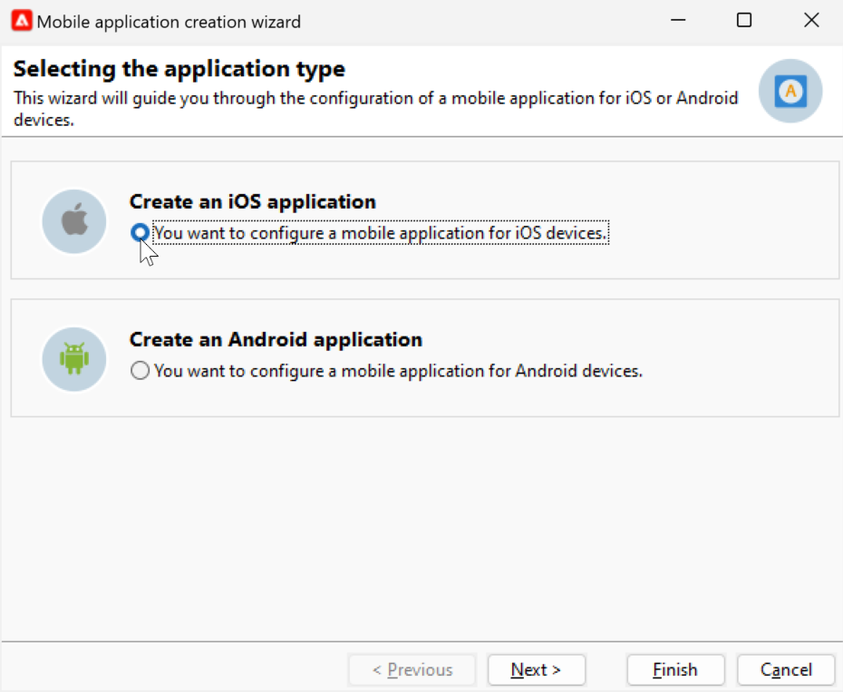
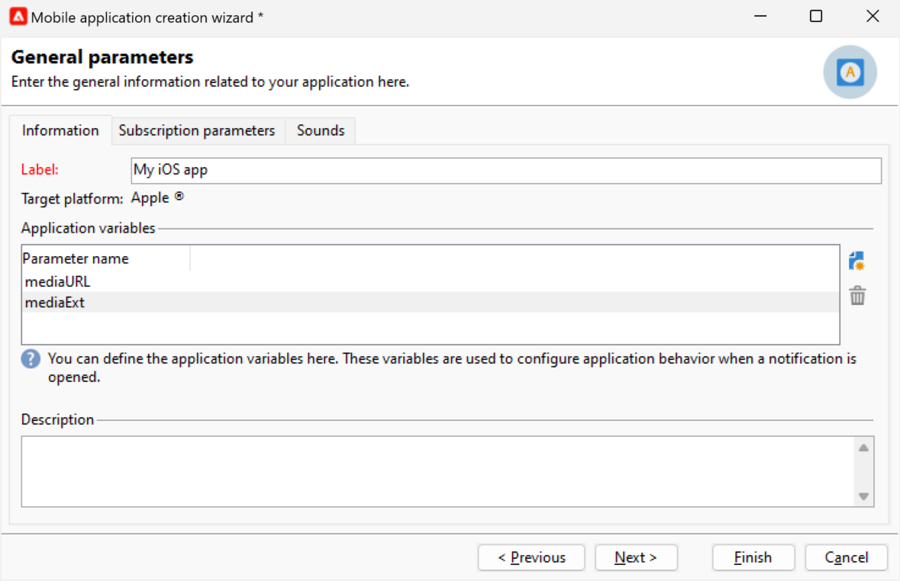
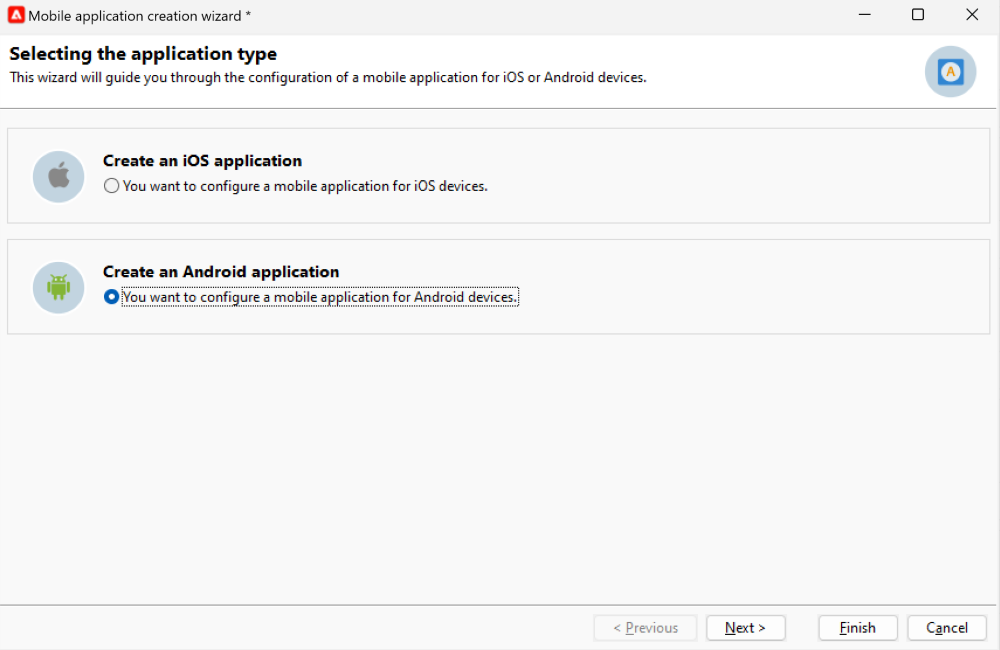

# 建立和傳送推播通知{#push-notifications-create}

行動應用程式傳送可讓您傳送通知至iOS和Android裝置。

若要在Adobe Campaign中傳送推播通知，您必須：

1. 將SDK與您的應用程式整合。 [了解更多](#push-sdk)
1. 為行動應用程式建立行動應用程式類型的資訊服務，並將應用程式的iOS和Android版本新增至該服務。 [了解更多](#push-config)
1. 建立iOS和Android的傳送。 [了解更多](#push-create)

## 整合SDK {#push-sdk}

您可以在資料收集UI中設定Adobe Experience Platform擴充功能，以使用Adobe Campaign Mobile SDK。 Adobe Experience Platform Mobile SDK可協助您在行動應用程式中支援Adobe的Experience Cloud解決方案和服務。 SDK設定可透過資料收集UI管理，以進行彈性的設定和可擴充的規則型整合。 [進一步了解Adobe Developer檔案](https://developer.adobe.com/client-sdks/documentation/adobe-campaign-classic){target="_blank"}.

您也可以整合Campaign SDK，以促進行動應用程式與Adobe Campaign平台的整合。 相容的SDK版本列於 [Campaign相容性矩陣](../start/compatibility-matrix.md#MobileSDK).

了解如何在中，將Campaign Android和iOS SDK與您的應用程式整合 [本頁](../config/push-config.md)

## 在Campaign中配置您的應用程式設定{#push-config}

傳送推播通知前，您必須先在Adobe Campaign中定義iOS和Android應用程式設定。

推播通知會透過專用服務傳送給您的應用程式使用者。 當使用者安裝您的應用程式時，即會訂閱此服務：Adobe Campaign仰賴此服務，只將目標鎖定於應用程式的訂閱者。 在此服務中，您需要新增iOS和Android應用程式，以在iOS和Android裝置上傳送。

若要建立傳送推播通知的服務，請遵循下列步驟：

1. 瀏覽至 **[!UICONTROL Profiles and Targets > Services and Subscriptions]** ，然後按一下 **[!UICONTROL Create]**.

   {width="800" align="left"}

1. 輸入 **[!UICONTROL Label]** 和 **[!UICONTROL Internal name]**，然後選取 **[!UICONTROL Mobile application]** 類型。

   >[!NOTE]
   >
   >預設 **[!UICONTROL Subscriber applications (nms:appSubscriptionRcp)]** 目標對應連結至收件者表格。 如果您想使用不同的目標對應，則需要建立新的目標對應，然後在 **[!UICONTROL Target mapping]** 服務欄位。 進一步了解中的目標對應 [本頁](../audiences/target-mappings.md).

1. 然後使用 **[!UICONTROL Add]** 圖示來定義使用此服務的行動應用程式。

>[!BEGINTABS]

>[!TAB iOS]

若要建立iOS裝置的應用程式，請遵循下列步驟：

1. 選取 **[!UICONTROL Create an iOS application]** 並按一下 **[!UICONTROL Next]**。

   {width="600" align="left"}

1. 在 **[!UICONTROL Label]** 欄位。
1. （選用）您可以透過 **[!UICONTROL Application variables]**. 這些功能可完全自訂，且是傳送至行動裝置之訊息裝載的一部分。

   在以下範例中， **mediaURl** 和 **mediaExt** 變數可新增以建立豐富推送通知，然後提供應用程式要在通知內顯示的影像。

   {width="600" align="left"}

1. 瀏覽至 **[!UICONTROL Subscription parameters]** 標籤來定義具有 **[!UICONTROL Subscriber applications (nms:appsubscriptionRcp)]** 綱要。

1. 瀏覽至 **[!UICONTROL Sounds]** 標籤來定義要播放的音效。 按一下 **[!UICONTROL Add]** 填 **[!UICONTROL Internal name]** 欄位，必須包含應用程式中嵌入的檔案的名稱或系統聲音的名稱。

1. 按一下 **[!UICONTROL Next]** 以開始設定開發應用程式。

1. 整合金鑰是每個應用程式專屬的。 它會將行動應用程式連結至Adobe Campaign。

   確保相同 **[!UICONTROL Integration key]** 是在Adobe Campaign中定義，並透過SDK在應用程式程式碼中定義。

   如果您使用Campaign SDK，請前往[本頁](../config/push-config.md).

   如果您使用Adobe Experience Platform SDK（資料收集），請前往 [本頁](https://developer.adobe.com/client-sdks/documentation/adobe-campaign-classic/#configuration-keys){target="_blank"}

   >[!NOTE]
   >
   > 此 **[!UICONTROL Integration key]** 可以使用字串值完全自訂，但必須與SDK中指定的值完全相同。
   >
   > 您無法對開發版本（沙箱）和應用程式的生產版本使用相同的憑證。

1. 從 **[!UICONTROL Application icon]** 欄位來個人化您服務中的行動應用程式。

1. 選取 **[!UICONTROL Authentication mode]**。提供兩種模式：

   * （建議） **[!UICONTROL Token-based authentication]**:填寫APN連接設定 **[!UICONTROL Key Id]**, **[!UICONTROL Team Id]** 和 **[!UICONTROL Bundle Id]** 然後按一下 **[!UICONTROL Enter the private key...]**. 如需詳細資訊 **[!UICONTROL Token-based authentication]**，請參閱 [Apple檔案](https://developer.apple.com/documentation/usernotifications/setting_up_a_remote_notification_server/establishing_a_token-based_connection_to_apns){target="_blank"}.

   * **[!UICONTROL Certificate-based authentication]**:按一下 **[!UICONTROL Enter the certificate...]**  然後選取您的p12金鑰，並輸入行動應用程式開發人員提供的密碼。
   您稍後可以在 **[!UICONTROL Certificate]** 標籤。

1. 使用 **[!UICONTROL Test the connection]** 按鈕來驗證您的設定。

1. 按一下 **[!UICONTROL Next]** 若要開始設定生產應用程式，請依照上述步驟操作。

1. 按一下&#x200B;**[!UICONTROL Finish]**。

您的iOS應用程式現在已準備好在Campaign中使用。

>[!TAB Android]

若要建立Android裝置的應用程式，請遵循下列步驟：

1. 選取 **[!UICONTROL Create an Android application]** 並按一下 **[!UICONTROL Next]**。

   {width="600" align="left"}

1. 在 **[!UICONTROL Label]** 欄位。
1. 整合金鑰是每個應用程式專屬的。 它會將行動應用程式連結至Adobe Campaign。

   確保相同 **[!UICONTROL Integration key]** 是在Adobe Campaign中定義，並透過SDK在應用程式程式碼中定義。

   如果您使用Campaign SDK，請前往 [本頁](../config/push-config.md).

   如果您使用Adobe Experience Platform SDK（資料收集），請前往 [本頁](https://developer.adobe.com/client-sdks/documentation/adobe-campaign-classic/#configuration-keys){target="_blank"}

   >[!NOTE]
   >
   > 此 **[!UICONTROL Integration key]** 可以使用字串值完全自訂，但必須與SDK中指定的值完全相同。

1. 從 **[!UICONTROL Application icon]** 欄位來個人化您服務中的行動應用程式。
1. 選擇 **HTTP v1** in  **[!UICONTROL API version]** 下拉式清單。
1. 按一下 **[!UICONTROL Load project json file to extract project details...]** 連結以載入您的JSON索引鍵檔案。 如需如何擷取JSON檔案的詳細資訊，請參閱 [Google Firebase檔案](https://firebase.google.com/docs/admin/setup#initialize-sdk){target="_blank"}.

   您也可以手動輸入下列詳細資訊：
   * **[!UICONTROL Project Id]**
   * **[!UICONTROL Private Key]**
   * **[!UICONTROL Client Email]**

1. 使用 **[!UICONTROL Test the connection]** 按鈕來驗證您的設定。

   >[!CAUTION]
   >
   >此 **[!UICONTROL Test connection]** 按鈕不會檢查MID伺服器是否可存取FCM伺服器。

1. （選用）您可以透過 **[!UICONTROL Application variables]** 如有需要。 這些功能可完全自訂，且是傳送至行動裝置之訊息裝載的一部分。

1. 按一下 **[!UICONTROL Finish]**，之後 **[!UICONTROL Save]**。您的Android應用程式現在已準備好在Campaign中使用。

以下是FCM裝載名稱，以進一步個人化您的推播通知：

| 訊息類型 | 可設定的訊息元素（FCM裝載名稱） | 可設定選項（FCM裝載名稱） |
|:-:|:-:|:-:|
| 資料訊息 | N/A | validate_only |
| 通知訊息 | title, body, android_channelid，圖示， sound, tag, color, click_action，影像， ticker，黏著， visibility, notification_priority, notification_count   | validate_only |

>[!ENDTABS]

## 建立您的第一個推播通知{#push-create}

本節詳細說明傳送iOS和Android通知的特定元素。

>[!CAUTION]
>
>在 [企業(FFDA)部署](../architecture/enterprise-deployment.md)，行動註冊現在 **非同步**. [了解更多](../architecture/staging.md)

若要建立新傳送，請瀏覽至 **[!UICONTROL Campaigns]** 按一下 **[!UICONTROL Deliveries]** 並按一下 **[!UICONTROL Create]** 按鈕。

>[!BEGINTABS]

>[!TAB iOS]

若要在iOS裝置上傳送通知，請遵循下列步驟：

1. 選取 **[!UICONTROL Deliver on iOS]** 傳遞範本。

   

1. 若要定義通知的目標，請按一下 **[!UICONTROL To]** 連結，然後按一下 **[!UICONTROL Add]**.

   

1. 選擇 **[!UICONTROL Subscribers of an iOS mobile application (iPhone, iPad)]**，請選取與行動應用程式相關的服務，然後選取應用程式的iOS版本。

   

1. 選擇您的 **[!UICONTROL Notification type]** 介於 **[!UICONTROL General notification (Alert, Sound, Badge)]** 或 **[!UICONTROL Silent notification]**.

   

   >[!NOTE]
   >
   >此 **靜默推** 模式可將「靜默」通知傳送至行動應用程式。 使用者未得知通知的到達。 會直接轉送至應用程式。

1. 在 **[!UICONTROL Title]** 欄位中，輸入要在通知中心可用通知清單中顯示的標題標籤。

   此欄位可讓您定義 **標題** iOS通知裝載的參數。

1. 您可以新增 **[!UICONTROL Subtitle]**，值 **字幕** iOS通知裝載的參數。

1. 在 **[!UICONTROL Message content]** 的子句。

1. 從 **[!UICONTROL Sound and Badge]** 頁簽，您可以編輯下列選項：

   * **[!UICONTROL Clean Badge]**:啟用此選項可刷新徽章值。

   * **[!UICONTROL Value]**:設定一個數字，該數字將用於直接在應用程式表徵圖上顯示新未讀資訊的數量。

   * **[!UICONTROL Critical alert mode]**:啟用此選項，即使使用者的手機設定為焦點模式或iPhone已靜音，仍可將音效新增至通知。

   * **[!UICONTROL Name]**:在收到通知時，選擇要由移動終端播放的聲音。

   * **[!UICONTROL Volume]**:音量從0到100。

      >[!NOTE]
      > 
      >應用程式中必須包含聲音，並在建立服務時定義聲音。
   

1. 從 **[!UICONTROL Application variables]** 標籤 **[!UICONTROL Application variables]** 會自動新增。 它們可讓您定義通知行為，例如，您可以設定當使用者啟動通知時顯示的特定應用程式畫面。

1. 從 **[!UICONTROL Advanced]** 頁簽中，可以編輯以下常規選項：

   * **[!UICONTROL Mutable content]**:啟用此選項可允許行動應用程式下載媒體內容。

   * **[!UICONTROL Thread-id]**:用於將相關通知分組的標識符。

   * **[!UICONTROL Category]**:將顯示動作按鈕的類別ID名稱。 這些通知可讓使用者以更快的方式回應通知，執行不同的工作，而不需在應用程式中開啟或導覽。

   

1. 對於時間敏感通知，您可以指定下列選項：

   * **[!UICONTROL Target content ID]**:用於定位在開啟通知時要前進的應用程式視窗的識別碼。

   * **[!UICONTROL Launch image]**:要顯示的launch影像檔案名稱。 如果使用者選擇啟動您的應用程式，則會顯示選取的影像，而非您應用程式的啟動畫面。

   * **[!UICONTROL Interruption level]**:

      * **[!UICONTROL Active]**:預設設定後，系統會立即顯示通知、點亮螢幕並播放聲音。 通知不會中斷焦點模式。

      * **[!UICONTROL Passive]**:系統將通知添加到通知清單中，而不用點亮螢幕或播放聲音。 通知不會中斷焦點模式。

      * **[!UICONTROL Time sensitive]** 系統會立即顯示通知，將螢幕燈亮起，可以播放聲音並突破焦點模式。 此層級不需要Apple的特殊許可。

      * **[!UICONTROL Critical]** 系統會立即顯示通知、點亮螢幕，並繞過靜音開關或聚焦模式。 請注意，此層級需要Apple的特殊權限。
   * **[!UICONTROL Relevance score]**:將關聯分數從0設定為100。 系統會使用此功能來排序通知摘要中的通知。

   

1. 設定通知後，按一下 **[!UICONTROL Preview]** 標籤來預覽通知。

   

>[!TAB Android]

若要在Android裝置上傳送通知，請遵循下列步驟：

1. 選取 **[!UICONTROL Deliver on Android (android)]** 傳遞範本。

   

1. 若要定義通知的目標，請按一下 **[!UICONTROL To]** 連結，然後按一下 **[!UICONTROL Add]**.

   

1. 選擇 **[!UICONTROL Subscribers of an Android mobile application]**，選擇與行動應用程式相關的服務（在此例中為Neotrips），然後選取應用程式的Android版本。

   

1. 然後輸入通知的內容。

   

1. 按一下 **[!UICONTROL Insert emoticon]** 圖示將表情符號插入推播通知。

1. 在 **[!UICONTROL Application variables]** 欄位，輸入每個變數的值。 例如，您可以設定特定應用程式畫面，以在使用者啟動通知時顯示。

1. 設定通知後，按一下 **[!UICONTROL Preview]** 標籤來預覽通知。

   <!---->

>[!ENDTABS]

## 測試、傳送及監視您的推播通知

若要傳送校樣並傳送最終傳送，請使用與其他傳送相同的程式。

了解如何驗證 [本頁](preview-and-proof.md).

了解如何確認和傳送 [本頁](send.md)

傳送訊息後，您可以監控及追蹤您的傳送。 進一步了解推播通知傳送失敗的原因，位於 [本頁](delivery-failures.md#push-error-types).

