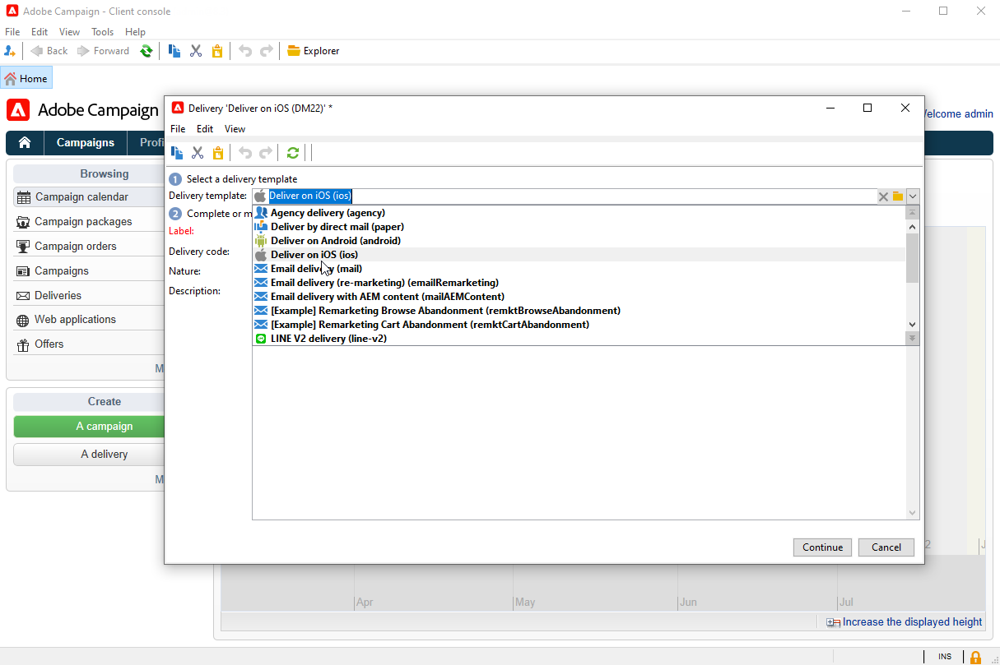

# 建立和傳送推播通知{#push-notifications-create}

行動應用程式傳送可讓您傳送通知至iOS和Android裝置。

開始使用Adobe Campaign傳送推播通知之前，您需要確保行動應用程式上和Adobe Experience Platform中的標籤的設定和整合已就緒。 [進一步瞭解推播設定。](push-settings.md)

## 建立您的第一個推播通知{#push-create}

本節詳細說明特定於iOS和Android通知傳送的元素。

>[!CAUTION]
>
>在的內容中 [企業(FFDA)部署](../architecture/enterprise-deployment.md)，行動註冊現在為 **非同步**. [了解更多](../architecture/staging.md)

若要建立新傳送，請瀏覽至 **[!UICONTROL Campaigns]** 標籤，按一下 **[!UICONTROL Deliveries]** 並按一下 **[!UICONTROL Create]** 按鈕來標籤現有傳遞清單。

>[!BEGINTABS]

>[!TAB iOS]

若要在iOS裝置上傳送通知，請遵循下列步驟：

1. 選取 **[!UICONTROL Deliver on iOS]** 傳遞範本。

   

1. 若要定義通知的目標，請按一下 **[!UICONTROL To]** 連結，然後按一下 **[!UICONTROL Add]**.

   

1. 選取 **[!UICONTROL Subscribers of an iOS mobile application (iPhone, iPad)]**，選取與您的行動應用程式相關的服務，然後選取應用程式的iOS版本。

   

1. 選擇您的 **[!UICONTROL Notification type]** 介於 **[!UICONTROL General notification (Alert, Sound, Badge)]** 或 **[!UICONTROL Silent notification]**.

   

   >[!NOTE]
   >
   >此 **靜音推播** 模式允許將「無訊息」通知傳送至行動應用程式。 使用者未意識到通知的到達。 它會直接傳輸到應用程式。

1. 在 **[!UICONTROL Title]** 欄位，輸入您要在通知中心可用通知清單中顯示的標題標籤。

   此欄位可讓您定義 **標題** iOS通知裝載的引數。

1. 您可以新增 **[!UICONTROL Subtitle]**，的值 **子標題** iOS通知裝載的引數。

1. 在「 」中輸入訊息的內容 **[!UICONTROL Message content]** 區段。

1. 從 **[!UICONTROL Sound and Badge]** 標籤中，您可以編輯下列選項：

   * **[!UICONTROL Clean Badge]**：啟用此選項以重新整理徽章值。

   * **[!UICONTROL Value]**：設定將用於直接在應用程式圖示上顯示的新未讀取資訊數量。

   * **[!UICONTROL Critical alert mode]**：啟用此選項，即使使用者的手機設定為焦點模式或iPhone設為靜音，也可以將聲音新增到您的通知中。

   * **[!UICONTROL Name]**：選取在收到通知時由行動終端機播放的聲音。

   * **[!UICONTROL Volume]**：音量從0到100。

     >[!NOTE]
     > 
     >聲音必須包含在應用程式中，並在建立服務時定義。
     >

   

1. 從 **[!UICONTROL Application variables]** 標籤，您的 **[!UICONTROL Application variables]** 會自動新增。 它們可讓您定義通知行為，例如，您可以設定當使用者啟動通知時顯示的特定應用程式畫面。

1. 從 **[!UICONTROL Advanced]** 標籤中，您可以編輯下列一般選項：

   * **[!UICONTROL Mutable content]**：啟用此選項可允許行動應用程式下載媒體內容。

   * **[!UICONTROL Thread-id]**：用於將相關通知分組在一起的識別碼。

   * **[!UICONTROL Category]**：將顯示動作按鈕的類別ID名稱。 這些通知可讓使用者以更快的方式回應通知，執行不同的工作，而不需在應用程式中開啟或導覽。

   

1. 對於時效性通知，您可以指定下列選項：

   * **[!UICONTROL Target content ID]**：用來在通知開啟時鎖定要轉送的應用程式視窗的識別碼。

   * **[!UICONTROL Launch image]**：要顯示的啟動影像檔名稱。 如果使用者選擇啟動您的應用程式，則會顯示選取的影像，而非您的應用程式啟動畫面。

   * **[!UICONTROL Interruption level]**：

      * **[!UICONTROL Active]**：根據預設，系統會立即顯示通知、在畫面上點亮，並可播放音效。 通知不會突破焦點模式。

      * **[!UICONTROL Passive]**：系統會將通知新增至通知清單，而不會點亮熒幕或播放音效。 通知不會突破焦點模式。

      * **[!UICONTROL Time sensitive]** 系統會立即顯示通知、讓熒幕亮起、播放聲音並突破焦點模式。 此層級不需要Apple的特殊許可權。

      * **[!UICONTROL Critical]** 系統會立即顯示通知、讓熒幕亮起，並略過靜音開關或聚焦模式。 請注意，此層級需要Apple的特殊許可權。

   * **[!UICONTROL Relevance score]**：將關聯性分數設定為0到100。 系統會使用此選項來排序通知摘要中的通知。

   

1. 設定通知後，按一下 **[!UICONTROL Preview]** 標籤以預覽通知。

   

>[!TAB Android]

若要在Android裝置上傳送通知，請執行下列步驟：

1. 選取 **[!UICONTROL Deliver on Android (android)]** 傳遞範本。

   

1. 若要定義通知的目標，請按一下 **[!UICONTROL To]** 連結，然後按一下 **[!UICONTROL Add]**.

   

1. 選取 **[!UICONTROL Subscribers of an Android mobile application]**，選擇與您的行動應用程式相關的服務（在此案例中為Neotrips），然後選取應用程式的Android版本。

   

1. 然後輸入通知的內容。

   

1. 按一下 **[!UICONTROL Insert emoticon]** 圖示來插入表情符號至推播通知。

1. 在 **[!UICONTROL Application variables]** 欄位中，輸入每個變數的值。 例如，您可以設定當使用者啟動通知時顯示的特定應用程式畫面。

1. 設定通知後，按一下 **[!UICONTROL Preview]** 標籤以預覽通知。

   <!---->

>[!ENDTABS]

## 測試、傳送及監控您的推播通知

若要傳送證明並傳送最終傳遞，請使用與其他傳遞相同的程式。

瞭解如何在中驗證傳遞 [此頁面](preview-and-proof.md).

瞭解如何確認並傳入傳遞 [此頁面](send.md)

傳送訊息後，您可以監視和追蹤您的傳遞。 若要深入瞭解推播通知傳送失敗的原因，請參閱 [此頁面](delivery-failures.md#push-error-types).

