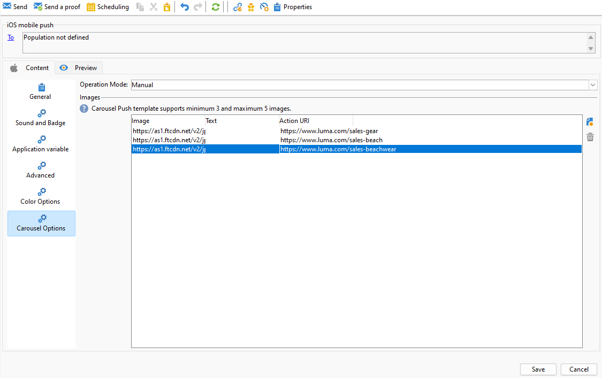
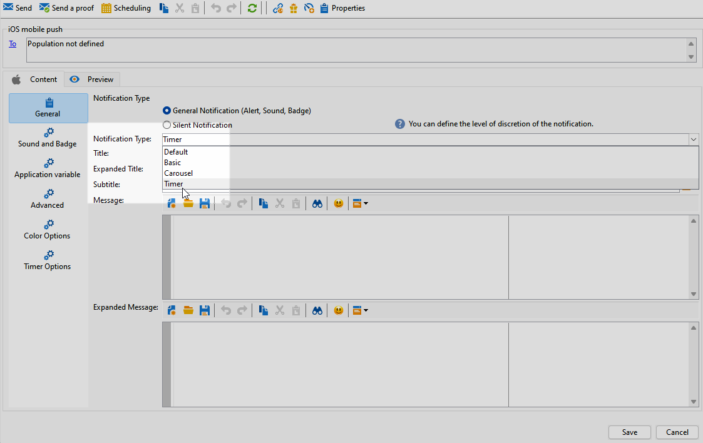

# 設計 iOS 豐富的推播傳遞 {#rich-push}

>[!IMPORTANT]
>
>在設計豐富推送通知之前，您必須先設定V2聯結器。 如需詳細程式，請參閱[此頁面](https://experienceleague.adobe.com/zh-hant/docs/campaign-classic/using/sending-messages/sending-push-notifications/configure-the-mobile-app/configuring-the-mobile-application)。

## 定義iOS通知的內容 {#push-message}

建立推播傳送後，您可以使用下列其中一個範本來定義其內容：

* **預設**&#x200B;可讓您傳送包含簡單圖示和隨附影像的通知。

* **基本**&#x200B;可以在您的通知中包含文字、影像和按鈕。

* **輪播**&#x200B;可讓您傳送包含文字和多個影像的通知，讓使用者可以滑動瀏覽。

瀏覽以下標籤，進一步瞭解如何個人化這些範本。

>[!BEGINTABS]

>[!TAB 預設]

1. 選擇&#x200B;**[!UICONTROL General notification (Alert, Sound, Badge)]**&#x200B;作為您的&#x200B;**[!UICONTROL Notification type]**。

1. 從&#x200B;**[!UICONTROL Notification Type]**&#x200B;下拉式清單中選取&#x200B;**[!UICONTROL Default]**。

   

1. 在&#x200B;**[!UICONTROL Title]**&#x200B;欄位中，輸入您要顯示在通知中心可用通知清單中的標題標籤。

   此欄位可讓您定義iOS通知承載的&#x200B;**title**&#x200B;引數值。

1. 選擇性地新增與iOS通知承載之&#x200B;**subtitle**&#x200B;引數相對應的&#x200B;**[!UICONTROL Subtitle]**。

1. 在精靈的&#x200B;**[!UICONTROL Message content]**&#x200B;區段中輸入訊息的內容。

   

1. 導覽至&#x200B;**[!UICONTROL Sound and Badge]**&#x200B;標籤以自訂其他設定，例如通知的聲音和徽章選項。 [了解更多](#sound-badge)

   

1. 從&#x200B;**[!UICONTROL Application variables]**&#x200B;索引標籤，會自動新增您的&#x200B;**[!UICONTROL Application variables]**。 它們可讓您定義通知行為，例如，您可以設定當使用者啟動通知時顯示的特定應用程式畫面。

1. 如需進一步自訂，請探索可用於推播通知的&#x200B;**[!UICONTROL Advanced options]**。 [了解更多](#push-advanced)

   

1. 設定通知後，按一下&#x200B;**[!UICONTROL Preview]**&#x200B;標籤以預覽通知。

>[!TAB 基本]

1. 選擇&#x200B;**[!UICONTROL General notification (Alert, Sound, Badge)]**&#x200B;作為您的&#x200B;**[!UICONTROL Notification type]**。

1. 從&#x200B;**[!UICONTROL Notification Type]**&#x200B;下拉式清單中選取&#x200B;**[!UICONTROL Basic]**。

   

1. 若要撰寫訊息，請在&#x200B;**[!UICONTROL Title]**、**[!UICONTROL Expanded message]**、**[!UICONTROL Message]**&#x200B;和&#x200B;**[!UICONTROL Expanded message]**&#x200B;欄位中輸入文字。

   展開通知時顯示&#x200B;**[!UICONTROL Expanded message]**&#x200B;時，**[!UICONTROL Message]**&#x200B;文字會顯示在收合的檢視中。

   

1. 選擇性地新增與iOS通知承載之&#x200B;**subtitle**&#x200B;引數相對應的&#x200B;**[!UICONTROL Subtitle]**。

1. 導覽至&#x200B;**[!UICONTROL Sound and Badge]**&#x200B;標籤以自訂其他設定，例如通知的聲音和徽章選項。 [了解更多](#sound-badge)

1. 從&#x200B;**[!UICONTROL Application variables]**&#x200B;索引標籤，會自動新增您的&#x200B;**[!UICONTROL Application variables]**。 它們可讓您定義通知行為，例如，您可以設定當使用者啟動通知時顯示的特定應用程式畫面。

1. 如需進一步自訂，請探索可用於推播通知的&#x200B;**[!UICONTROL Advanced options]**。 [了解更多](#push-advanced)

   

1. 在&#x200B;**[!UICONTROL Color options]**&#x200B;功能表中，輸入&#x200B;**[!UICONTROL Title]**、**[!UICONTROL Message]**&#x200B;和&#x200B;**[!UICONTROL Background]**&#x200B;的十六進位色彩代碼。

   

定義訊息內容後，您可以使用測試訂閱者來預覽及測試訊息。

>[!TAB 輪播]

1. 選擇&#x200B;**[!UICONTROL General notification (Alert, Sound, Badge)]**&#x200B;作為您的&#x200B;**[!UICONTROL Notification type]**。

1. 從&#x200B;**[!UICONTROL Notification Type]**&#x200B;下拉式清單中選取&#x200B;**[!UICONTROL Carousel]**。

   

1. 若要撰寫訊息，請在&#x200B;**[!UICONTROL Title]**、**[!UICONTROL Expanded Title]**&#x200B;和&#x200B;**[!UICONTROL Message]**&#x200B;欄位中輸入文字。

   

1. 導覽至&#x200B;**[!UICONTROL Sound and Badge]**&#x200B;標籤以自訂其他設定，例如通知的聲音和徽章選項。 [了解更多](#sound-badge)

1. 從&#x200B;**[!UICONTROL Application variables]**&#x200B;索引標籤，會自動新增您的&#x200B;**[!UICONTROL Application variables]**。 它們可讓您定義通知行為，例如，您可以設定當使用者啟動通知時顯示的特定應用程式畫面。

   

1. 如需進一步自訂，請探索可用於推播通知的&#x200B;**[!UICONTROL Advanced options]**。 [了解更多](#push-advanced)

1. 在&#x200B;**[!UICONTROL Color options]**&#x200B;功能表中，輸入&#x200B;**[!UICONTROL Title]**、**[!UICONTROL Message]**&#x200B;和&#x200B;**[!UICONTROL Background]**&#x200B;的十六進位色彩代碼。

1. 選擇&#x200B;**[!UICONTROL Carousel]**&#x200B;在&#x200B;**[!UICONTROL Carousel options]**&#x200B;索引標籤中的運作方式：

   * **[!UICONTROL Auto]**：以投影片形式自動循環瀏覽影像，以預先定義的間隔轉換。
   * **[!UICONTROL Manual]**：可讓使用者在幻燈片之間手動撥動，以瀏覽影像。

1. 按一下&#x200B;**[!UICONTROL Add image]**&#x200B;並輸入您的&#x200B;**[!UICONTROL Image URL]**、**[!UICONTROL Text]**&#x200B;和&#x200B;**[!UICONTROL Action URL]**。

   請確定您至少包含三個影像，最多包含五個影像。

   

定義訊息內容後，您可以使用測試訂閱者來預覽及測試訊息。

>[!TAB 計時器]

1. 選擇&#x200B;**[!UICONTROL General notification (Alert, Sound, Badge)]**&#x200B;作為您的&#x200B;**[!UICONTROL Notification type]**。

1. 從&#x200B;**[!UICONTROL Notification Type]**&#x200B;下拉式清單中選取&#x200B;**[!UICONTROL Timer]**。

   

1. 若要撰寫訊息，請在&#x200B;**[!UICONTROL Title]**、**[!UICONTROL Expanded title]**、**[!UICONTROL Message]**&#x200B;和&#x200B;**[!UICONTROL Expanded message]**&#x200B;欄位中輸入文字。

   展開通知時顯示&#x200B;**[!UICONTROL Expanded message]**&#x200B;時，**[!UICONTROL Message]**&#x200B;文字會顯示在收合的檢視中。

   

1. 選擇性地新增與iOS通知承載之&#x200B;**subtitle**&#x200B;引數相對應的&#x200B;**[!UICONTROL Subtitle]**。

1. 導覽至&#x200B;**[!UICONTROL Sound and Badge]**&#x200B;標籤以自訂其他設定，例如通知的聲音和徽章選項。 [了解更多](#sound-badge)

1. 從&#x200B;**[!UICONTROL Application variables]**&#x200B;索引標籤，會自動新增您的&#x200B;**[!UICONTROL Application variables]**。 它們可讓您定義通知行為，例如，您可以設定當使用者啟動通知時顯示的特定應用程式畫面。

1. 如需進一步自訂，請探索可用於推播通知的&#x200B;**[!UICONTROL Advanced options]**。 [了解更多](#push-advanced)

1. 在&#x200B;**[!UICONTROL Color options]**&#x200B;功能表中，輸入&#x200B;**[!UICONTROL Title]**、**[!UICONTROL Message]**&#x200B;和&#x200B;**[!UICONTROL Background]**&#x200B;的十六進位色彩代碼。

   

1. 從&#x200B;**[!UICONTROL Timer]**&#x200B;索引標籤，將您的&#x200B;**[!UICONTROL Timer duration]**&#x200B;設為秒數，或將&#x200B;**[!UICONTROL Timer end timestamp]**&#x200B;設為特定紀元時間戳記。

1. 在&#x200B;**[!UICONTROL Alternate title]**、**[!UICONTROL Alternate message]**&#x200B;和&#x200B;**[!UICONTROL Alternate image]**&#x200B;欄位中輸入計時器過期後顯示的文字和影像。

   

定義訊息內容後，您可以使用測試訂閱者來預覽及測試訊息。

>[!ENDTABS]

## 推播通知進階設定 {#push-advanced}

### 聲音和徽章選項 {#sound-badge}

| 參數 | 說明 |
|---------|---------|
| **[!UICONTROL Clean Badge]** | 啟用此選項以重新整理徽章值。 |
| **[!UICONTROL Value]** | 設定用於直接在應用程式圖示上顯示新未讀取資訊的數字。 |
| **[!UICONTROL Critical alert mode]** | 啟用此選項可將聲音新增至您的通知，即使使用者的電話已設定為焦點模式或iPhone已靜音。 |
| **[!UICONTROL Name]** | 選取在收到通知時由行動終端機播放的音效。 |
| **[!UICONTROL Volume]** | 將音量從0設定為100。 聲音必須包含在應用程式中，並在建立服務時定義。 |

### 進階選項 {#notification-options}

| 參數 | 說明 |
|---------|---------|
| **[!UICONTROL Mutable content]** | 啟用此選項可允許行動應用程式下載媒體內容。 |
| **[!UICONTROL Thread-id]** | 設定用來將相關通知分組在一起的識別碼。 |
| **[!UICONTROL Category]** | 設定將顯示動作按鈕的類別ID名稱。 這些通知可讓使用者以更快的方式回應通知，執行不同的工作，而不需在應用程式中開啟或導覽。 |
| **[!UICONTROL Target content ID]** | 設定識別碼，用來在開啟通知時鎖定要轉送的應用程式視窗。 |
| **[!UICONTROL Launch image]** | 設定要顯示的啟動影像檔名稱。 如果使用者選擇啟動您的應用程式，則會顯示選取的影像，而非您應用程式的啟動畫面。 |
| **[!UICONTROL Click action]** | 設定與使用者點按您的通知相關聯的動作。 |
| **[!UICONTROL Interruption level]** | <ul><li>作用中：依預設設定，系統會立即顯示通知、開啟熒幕，並可播放音效。 通知不會突破焦點模式。</li><li>被動：系統會將通知新增至通知清單，而不需開啟熒幕或播放音效。 通知不會突破焦點模式。</li><li> 有時效性：系統立即顯示通知、讓熒幕亮起、播放聲音並突破焦點模式。 此層級不需要Apple的特殊許可權。</li><li>嚴重：系統會立即顯示通知、讓熒幕亮起，並略過靜音切換或聚焦模式。 請注意，此層級需要Apple的特殊許可權。</li></ul> |
| **[!UICONTROL Relevance score]** | 將關聯性分數從0設定為100。 系統會使用此選項來排序通知摘要中的通知。 |

