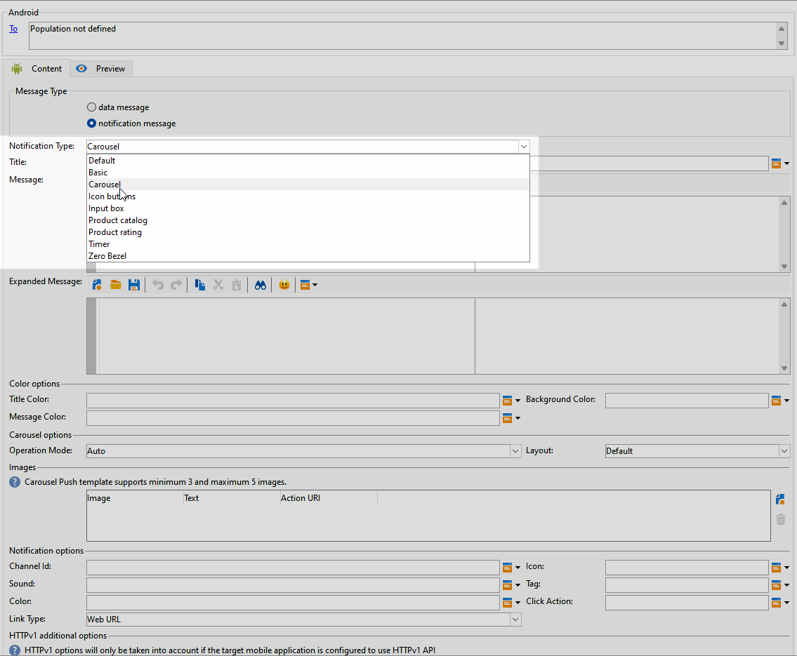

# 設計 Android 豐富的推播傳遞 {#rich-push}

>[!AVAILABILITY]
>
>此功能位於&#x200B;**有限可用性** (LA)。

使用Firebase Cloud Messaging時，您可以選擇兩種型別的訊息：

* **[!UICONTROL Data message]**&#x200B;由使用者端應用程式處理。 這些訊息會直接傳送至行動應用程式，在裝置上產生和顯示Android通知。 資料訊息僅包含您的自訂應用程式變數。

* **[!UICONTROL Notification message]**，由FCM SDK自動處理。 FCM會自動代表使用者端應用程式在使用者裝置上顯示訊息。 通知訊息包含預先定義的一組引數和選項，但仍可使用自訂應用程式變數進一步個人化。

## 定義通知的內容 {#push-message}

>[!IMPORTANT]
>
>在設計豐富推送通知之前，您必須先設定聯結器。 如需詳細程式，請參閱[此頁面](https://experienceleague.adobe.com/en/docs/campaign-classic/using/sending-messages/sending-push-notifications/configure-the-mobile-app/configuring-the-mobile-application-android#configuring-external-account-android)。

建立推播傳送後，您就可以定義其內容。 有三個範本可供使用：

* **預設範本**&#x200B;可讓您傳送包含簡單圖示和隨附影像的通知。

* **基本範本**&#x200B;可以在您的通知中包含文字、影像和按鈕。

* **轉盤範本**&#x200B;可讓您傳送包含文字和多個影像的通知，讓使用者可以滑動瀏覽。

瀏覽下列標籤，瞭解如何為每個範本撰寫訊息。

>[!BEGINTABS]

>[!TAB 預設範本]

1. 從&#x200B;**[!UICONTROL Notification type]**&#x200B;下拉式清單中選取&#x200B;**[!UICONTROL Default]**。

   

1. 若要撰寫訊息，請在&#x200B;**[!UICONTROL Title]**&#x200B;和&#x200B;**[!UICONTROL Message]**&#x200B;欄位中輸入文字。

   

1. 使用動態個人化欄位來定義內容、個人化資料並新增動態內容。 [了解更多](../send/personalize.md)

1. 若要進一步個人化您的推播通知，請設定推播通知的&#x200B;**[!UICONTROL Notification options]**&#x200B;和&#x200B;**[!UICONTROL HTTPv1 additional options]**。 [了解更多](#push-advanced)

   

定義訊息內容後，您可以使用測試訂閱者來預覽及測試訊息。

>[!TAB 基本範本]

1. 從&#x200B;**[!UICONTROL Notification Type]**&#x200B;下拉式清單中選取&#x200B;**[!UICONTROL Basic]**。

   

1. 若要撰寫訊息，請在&#x200B;**[!UICONTROL Title]**、**[!UICONTROL Message]**&#x200B;和&#x200B;**[!UICONTROL Expanded message]**&#x200B;欄位中輸入文字。

   展開通知時顯示&#x200B;**[!UICONTROL Expanded message]**&#x200B;時，**[!UICONTROL Message]**&#x200B;文字會顯示在收合的檢視中。

   

1. 使用動態個人化欄位來定義內容、個人化資料並新增動態內容。 [了解更多](../send/personalize.md)

1. 在&#x200B;**[!UICONTROL Color options]**&#x200B;功能表下，輸入您&#x200B;**[!UICONTROL Title]**、**[!UICONTROL Message]**&#x200B;和&#x200B;**[!UICONTROL Background]**&#x200B;的十六進位色彩代碼。

1. 視需要新增&#x200B;**[!UICONTROL Remind later button]**。 在對應欄位中輸入您的&#x200B;**[!UICONTROL Reminder Text]**&#x200B;和&#x200B;**日期**。

   **[!UICONTROL Reminder Date]**&#x200B;欄位需要代表紀元的值（以秒為單位）。

1. 按一下&#x200B;**[!UICONTROL Add button]**&#x200B;並填寫下列欄位：

   * **[!UICONTROL Label]**：按鈕上顯示的文字。
   * **[!UICONTROL Link URI]**：指定按一下按鈕時要執行的URI。

   您可以選擇在推播通知中包含最多三個按鈕。 如果您選擇&#x200B;**[!UICONTROL Remind later button]**，則最多只能包含兩個按鈕。

1. 選取按鈕連結URL的&#x200B;**[!UICONTROL Link type]**：

   * **[!UICONTROL Web URL]**：網頁URL會將使用者導向至線上內容。 按一下後，它們會提示裝置的預設網頁瀏覽器開啟並導覽至指定的URL。

   * **[!UICONTROL Deeplink]**：深層連結是指引導使用者至應用程式內特定區段的URL，即使應用程式已關閉。 按一下即可顯示對話方塊，讓使用者從能夠處理連結的各種應用程式中進行選擇。

   * **[!UICONTROL Open App]**：開啟應用程式URL可讓您直接連線到應用程式內的內容。 它可讓您的應用程式繞過消除歧義對話方塊，將其自身建立為特定連結型別的預設處理常式。

   如需如何處理Android應用程式連結的詳細資訊，請參閱[Android開發人員檔案](https://developer.android.com/training/app-links)。

   

1. 若要進一步個人化您的推播通知，請設定推播通知的&#x200B;**[!UICONTROL Notification options]**&#x200B;和&#x200B;**[!UICONTROL HTTPv1 additional options]**。 [了解更多](#push-advanced)

   

定義訊息內容後，您可以使用測試訂閱者來預覽及測試訊息。

>[!TAB 轉盤範本]

1. 從&#x200B;**[!UICONTROL Notification Type]**&#x200B;下拉式清單中選取&#x200B;**[!UICONTROL Carousel]**。

   

1. 若要撰寫訊息，請在&#x200B;**[!UICONTROL Title]**、**[!UICONTROL Message]**&#x200B;和&#x200B;**[!UICONTROL Expanded message]**&#x200B;欄位中輸入文字。

   展開通知時顯示&#x200B;**[!UICONTROL Expanded message]**&#x200B;時，**[!UICONTROL Message]**&#x200B;文字會顯示在收合的檢視中。

   

1. 使用運算式編輯器來定義內容、個人化資料及新增動態內容。 [了解更多](../send/personalize.md)

1. 在&#x200B;**[!UICONTROL Color options]**&#x200B;功能表下，輸入您&#x200B;**[!UICONTROL Title]**、**[!UICONTROL Message]**&#x200B;和&#x200B;**[!UICONTROL Background]**&#x200B;的十六進位色彩代碼。

1. 選擇&#x200B;**[!UICONTROL Carousel]**&#x200B;的運作方式：

   * **[!UICONTROL Auto]**：以投影片形式自動循環瀏覽影像，以預先定義的間隔轉換。
   * **[!UICONTROL Manual]**：可讓使用者在幻燈片之間手動撥動，以瀏覽影像。

1. 從&#x200B;**[!UICONTROL Layout]**&#x200B;下拉式清單中選取&#x200B;**[!UICONTROL Filmstrip]**&#x200B;選項，在主投影片旁加入上一個和下一個影像的預覽。

1. 按一下&#x200B;**[!UICONTROL Add image]**&#x200B;並輸入影像URL、文字和動作URL。

   請確定您至少包含三個影像，最多包含五個影像。

   

1. 若要進一步個人化您的推播通知，請設定推播通知的&#x200B;**[!UICONTROL Notification options]**&#x200B;和&#x200B;**[!UICONTROL HTTPv1 additional options]**。 [了解更多](#push-advanced)

   

定義訊息內容後，您可以使用測試訂閱者來預覽及測試訊息。

>[!ENDTABS]

## 推播通知進階設定 {#push-advanced}

### 通知選項 {#notification-options}

| 參數 | 說明 |
|---------|---------|
| **[!UICONTROL Channel ID]** | 設定通知的頻道ID。 在收到具有此管道ID的任何通知之前，應用程式必須建立具有此管道ID的管道。 |
| **[!UICONTROL Icon]** | 設定要在設定檔裝置上顯示的通知圖示。 |
| **[!UICONTROL Sound]** | 設定裝置收到通知時播放的音效。 |
| **[!UICONTROL Tag]** | 設定用來取代通知抽屜中現有通知的識別碼。 這有助於防止累積多個通知，並確保只顯示最新的相關通知。 |
| **[!UICONTROL Color]** | 以十六進位色彩代碼設定通知的圖示色彩。 |
| **[!UICONTROL Click action]** | 設定與使用者點按您的通知相關聯的動作。 |
| **[!UICONTROL Notification background color]** | 使用十六進位色彩代碼設定通知背景的色彩。 |
| **[!UICONTROL Link type]** | <ul><li>網頁URL：網頁URL會將使用者導向至線上內容。 按一下後，它們會提示裝置的預設網頁瀏覽器開啟並導覽至指定的URL。</li><li>深層連結：深層連結是指即使應用程式已關閉，仍可指引使用者前往應用程式內的特定區段的URL。 按一下即可顯示對話方塊，讓使用者從能夠處理連結的各種應用程式中進行選擇。</li><li> 開啟應用程式：開啟應用程式URL可讓您直接連線至應用程式內的內容。 它可讓您的應用程式繞過消除歧義對話方塊，將其自身建立為特定連結型別的預設處理常式。</li></ul> |

### HTTPv1其他選項 {#additional-options}

| 參數 | 說明 |
|---------|---------|
| **[!UICONTROL Ticker]** | 設定通知的提示文字。 僅適用於設為Android 5.0 Lollipop的裝置。 |
| **[!UICONTROL Sticky]** | 啟動後，通知仍可見，即使使用者按一下它。  如果停用，當使用者與通知互動時，通知會自動解除。 粘性行為可讓重要通知在熒幕上持續較長時間。 |
| **[!UICONTROL Image]** | 設定要在通知中顯示的影像URL。 |
| **[!UICONTROL Notification Priority]** | 設定通知的優先順序層級，可以是預設、最低、低或高。 優先順序層級會決定通知的重要性和急迫性，影響其顯示方式以及是否可以略過某些系統設定。 如需詳細資訊，請參閱[FCM檔案](https://firebase.google.com/docs/reference/fcm/rest/v1/projects.messages#notificationpriority)。 |
| **[!UICONTROL Notification Count]** | 設定直接在應用程式圖示上顯示的新未讀取資訊數目。 此讓使用者迅速查看待處理的通知數量。 |
| **[!UICONTROL Visibility]** | 設定通知的可見度等級，可為公開、私人或秘密。 可見度等級會決定通知內容在鎖定畫面和其他敏感區域上顯示的程度。 如需詳細資訊，請參閱[FCM檔案](https://firebase.google.com/docs/reference/fcm/rest/v1/projects.messages#visibility)。 |
| **[!UICONTROL Application variables]** | 允許您定義通知行為。 這些變數完全可自訂，且可納入傳送到行動裝置的部分訊息承載。 |
