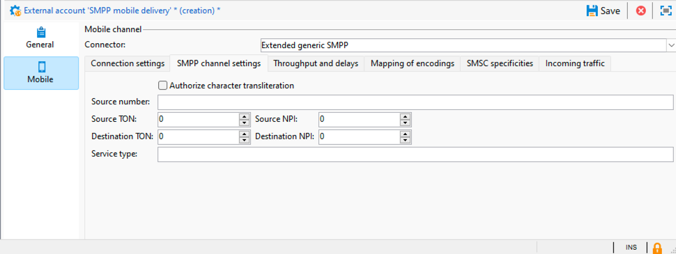

# SMPP外部帳戶設定 {#smpp-external-account}

Adobe Campaign使用SMPP通訊協定傳送SMS給服務提供者。

Adobe Campaign中的SMS聯結器提供了許多選項來調整其行為，以便與大多數SMPP提供者相容，這些SMPP提供者傾向於與官方規格稍有偏差。

>[!IMPORTANT]
>
>* Adobe Campaign支援SMPP通訊協定版本3.4。
>
>* 設定與新提供者的連線可能需要一些技術技能、TCP知識、二進位、十六進位表示和文字編碼。 它還需要與提供者進行積極的合作。

SMS服務提供者端的網路裝置通常稱為SMSC。

## 連線設定 {#smpp-connection-settings}

{zoomable="yes"}

以下是設定連線所需的引數及其角色：

* **SMSC實作名稱**：設定SMSC實作的名稱。 應將其設定為您的提供者的名稱。 此欄位的角色在SMPP錯誤管理一節中有說明。
* **伺服器**：要連線的伺服器DNS名稱或IP位址。
* **連線埠**：要連線的TCP連線埠。
* **帳戶**：連線的登入。 在BIND PDU的system_id欄位中傳遞。
* **密碼**： SMPP連線的密碼。 在BIND PDU的密碼欄位中傳遞。
* **系統型別**：在BIND PDU的system_type欄位中傳遞的值。 有些提供者需要在此指定特定值。
* **MTA子連線的數目**：這定義每個傳送執行緒開啟的連線數目。
可使用此公式計算連線總數：
  *連線總數= SMS處理序數目*傳送執行緒數目* MTA子連線數目*

   * SMS程式數通常為1。 在某些非常高效能的執行個體上，多個SMS流程可能會並行啟動。
   * 在serverConf （sendingThreads設定）中設定傳送執行緒的數量。 其預設值為1。
   * MTA子連線的數量是外部帳戶中的這個設定。

  使用預設值，此設定會直接設定連線數目。

在&#x200B;**收發器模式**&#x200B;中，這是連線總數。

在&#x200B;**傳送器+接收器模式**&#x200B;中，這會定義傳送器+接收器配對（一組=一個傳送器+一個接收器）的數量。
無法變更傳送器及接收器之間的平衡。

* **透過專用處理序傳送訊息**：
若是Adobe Campaign v8.7.2和更新版本，應一律啟用此選項。 它對於訊息的處理方式有許多影響。
* **SMPP連線模式**：
以收發器模式或分開的傳送器+接收器模式設定連線。
   * 傳送器+接收器（或TX+RX）：兩個獨立的TCP連線用於傳送和接收訊息。
   * 收發器（或TRX）：單一TCP連線用於傳送及接收訊息。
* **對接收方使用不同的引數**：
僅在傳送器+接收器模式中可用。
取消核取此方塊時，傳送器與接收器會使用相同的設定。 核取此方塊時，標準設定將僅套用至傳送器，而接收器設定將僅套用至接收器。
* **接收者伺服器、連線埠、帳戶、密碼、系統型別**
這些設定適用於處於傳送器+接收器模式的接收器。 它們的工作方式與傳送器部分類似，請參閱上面的[更多詳細資料](#smpp-connection-settings)。
* **在記錄檔中啟用詳細的SMPP追蹤**
啟用時，會將額外的記錄檔輸出至記錄檔。 這對於疑難排解非常有用，但如果不需要疑難排解，則應該在高輸送量執行個體上將其停用。

## SMPP 管道設定 {#smpp-channel-settings}

{zoomable="yes"}

### 授權字元音譯 {#smpp-transliteration}

音譯是尋找與遺失字元相當的字元的程式。 例如，GSM編碼中缺少法文「e」（帶有抑揚符號）字元，但可將其取代為「e」，而不會太影響可讀性。

取消核取此方塊時，如果文字編碼無法完全依照原樣編碼字串，則會失敗。

核取此方塊時，文字編碼會嘗試將字串轉換為近似版本，而非失敗。 如果部分字元在目標編碼中沒有對應的字元，文字編碼將會失敗。

請參閱[定義編碼設定的特定對應](#mapping-encodings)，以取得編碼程式的一般說明。

### 來源編號

定義訊息的預設來源位址。 此設定僅適用於傳送中來源號碼保持空白的情況。 依預設，來源編號欄位不會傳遞，因此提供者會將其取代為短程式碼。

這會啟用寄件者地址/ADC覆寫功能。

### Source TON/NPI、目的地TON/NPI

TON （編號型別）和NPI （編號計畫指示器） （在SMPP 3.4規格的第5.2.5節中說明）。 這些值應該設定為提供者所需的任何值。

它們會依原樣在SUBMIT_SM PDU的source_addr_ton、source_addr_npi、dest_addr_ton和dest_addr_npi欄位中傳輸。

### 服務類型

此欄位會依原樣在SUBMIT_SM PDU的service_type欄位中傳輸。 將此專案設定為提供者所需的任何專案。

## 輸送量和延遲 {#smpp-delays}

{zoomable="yes"}

這些設定控制SMPP頻道的所有計時方面。 某些提供者需要非常精確的訊息速率、視窗和重試時間控制，因此這些設定應該設定為符合提供者容量與其合約中指示之條件的值。

### 傳送時段

視窗是不需要等待相符的SUBMIT_SM_RESP即可傳送的SUBMIT_SM PDU數量。

最大視窗為4的傳輸範例：

{zoomable="yes"}

當網路連結具有高延遲時，此視窗有助於增加輸送量。 視窗的值必須至少是SMS/s數乘以連結的延遲（以秒為單位），這樣聯結器就不會在傳送下一個訊息之前等待SUBMIT_SM_RESP。

如果視窗太大，您可以傳送更多重複的訊息，以防連線發生問題（極少數情況）。 此外，大多數提供者對視窗有非常嚴格的限制，並拒絕超過限制的訊息。

如何計算最佳傳送時間公式：

測量SUBMIT_SM和SUBMIT_SM_RESP之間的最大延遲。
將此值（以秒為單位）乘以最大MT輸送量：這會提供最佳傳送視窗值。
範例：如果您在最大MT輸送量中設定300個SMS/s，而SUBMIT_SM和SUBMIT_SM_RESP之間平均延遲100毫秒，則最佳值將是300×0.1 = 30。

如有疑問，請選取較大的視窗以避免效能問題。

### 最大 MT 輸送量

每秒和每個連線的最大MT數目。 此設定會嚴格執行，MTA絕不會以快於此限制的速度推送訊息。 對於需要精確節流功能的提供者來說，這個變數非常有用。

若要知道總輸送量限制，請將此數字乘以連線總數（請參閱上述公式）。

0表示沒有限制，MTA會儘快傳送MT。

通常建議將此設定保持在1000以下，因為無法保證超過此數量的精確輸送量，除非在最終架構上正確設定基準並特別要求SMPP提供者。 將連線數目增加到1000 MT/s以上可能會更好。

### 重新連線前的時間

當TCP連線中斷時，聯結器會先等候這個秒數，再嘗試建立連線。

### MT 的有效期限

這是SUBMIT_SM與其相符的SUBMIT_SM_RESP之間的逾時。 如果未及時收到RESP，則訊息會被視為失敗，並套用MTA的全域重試原則。

### 繫結逾時

TCP連線嘗試和BIND_*_RESP回覆之間的逾時。 逾時時，Campaign聯結器會關閉連線，而且會等待一段時間再重新連線，然後重試。

### enquire_link 時段

inquire_link是一種特殊型別的PDU，傳送後會讓連線保持連線。 此期間以秒為單位。 行銷活動聯結器只會在連線閒置時傳送inquire_link以節省頻寬。 如果在此期間後兩次未收到任何RESP，則會將連線視為無法使用，並觸發重新連線程式。

## 編碼的對應 {#mapping-encodings}

如需文字編碼的詳細資訊，請參閱[SMS文字編碼區段](sms-channel.md#sms-text-encoding)。

此設定允許定義與規格不同的自訂編碼對應。 您將能夠宣告編碼清單及其data_coding值。 MTA會嘗試使用清單中的第一個編碼進行編碼；如果失敗，會嘗試使用清單中的下一個編碼等。如果無法使用編碼來編碼訊息，則會發生錯誤。 找到編碼後，MTA將使用編碼文字建立SUBMIT_SM PDU，並使用表中指定的值設定data_coding欄位。

表格中的專案順序很重要：會從上到下嘗試編碼。 您應該將最便宜或最建議的編碼放在清單的最前面，然後是越來越貴（或不太理想）的編碼。

請注意，UCS-2絕不會失敗，因為它可編碼Campaign支援的所有字元。 請注意，UCS-2 SMS的長度上限會小很多（僅限70個字元）。

您也可以使用此設定，透過在對應表中僅宣告1行來強制一律使用特定編碼。

未核取核取方塊時使用的預設對應等於下表：

| data_coding | 編碼 |
|:-:|:-:|
| 0 | GSM |
| 8 | UCS-2 |

這表示MTA將嘗試在GSM中編碼訊息，如果成功，則會在data_coding設為0的情況下傳送訊息。

如果訊息無法以GSM編碼，則會以UCS-2編碼，並將data_coding設為8。

## SMSC 特異性 {#smsc-specificities}

{zoomable="yes"}

### 啟用 message_payload

取消勾選時，MTA會分割長簡訊，並使用UDH在多個SUBMIT_SM PDU中傳送。 此訊息將由行動電話根據UDH資料重新構成。

一旦勾選，長簡訊會在一個SUBMIT_SM PDU中傳送，並將文字放入message_payload選用欄位中（如需詳細資訊，請參閱SMPP規格）。

若啟用此功能，Campaign將無法個別計算SMS部分：所有訊息都會計為單部分傳送。

### 傳送完整的電話號碼

若未核取此核取方塊，則只會傳送電話號碼的位數給提供者（SUBMIT_SM欄位的destination_addr欄位）。 這是預設行為，因為國際數字指標（通常是+前置詞）會由SMPP中的TON和NPI欄位取代。

核取核取方塊時，電話號碼會依原樣傳送，不會預先處理（以及可能的空格、+前置詞或井號/雜湊/星號）。

此功能也會影響自動回覆隔離功能的行為：未核取核取方塊時，將向插入隔離表格的電話號碼新增+首碼，以補償SMPP通訊協定本身從電話號碼移除的+首碼。

### 繫結TON/NPI

TON （編號型別）和NPI （編號計畫指示器） （在SMPP 3.4規格的第5.2.5節中說明）。 這些值應該設定為提供者所需的任何值。

它們會依原樣在BIND PDU的addr_ton和addr_npi欄位中傳輸。

### 地址範圍

在BIND PDU的address_range欄位中依原樣傳送。 此值應設定為提供者所需的任何值。

### 無效 ID 確認計數

限制可為單一SR傳送的「訊息ID無效」 DELIVER_SM_RESP數量。 **這只能作為疑難排解之用，作為因應措施**&#x200B;並在正常情況下設為0。

詳細說明：假設您將此設定設為2：

* 提供者傳送ID為「1234」的SR (DELIVER_SM)
* 在資料庫中找不到識別碼「1234」
* 聯結器會針對該ID計算1個「無效ID」錯誤，因此它會傳送DELIVER_SM_RESP並產生「訊息ID無效」錯誤代碼（正常行為）。
* 提供者會重試ID為「1234」的同一SR
* 在資料庫中仍找不到ID &quot;1234&quot;
* 聯結器會為該ID計入2個「無效ID」錯誤，因此即使未正確處理，也會傳送DELIVER_SM_RESP「正常」。

此功能旨在當無效的SR封鎖無法處理的合法訊息時，清除提供者端的SR緩衝區。

將此欄位設為0會停用機制，所以一律會傳回「訊息ID無效」，這是正常行為。

將此欄位設為1，即使ID無效，聯結器一律會回應「確定」。 這應設為1，僅在監督下用於疑難排解和最短時間，例如從提供者端的問題復原。

### SR 中 ID 的擷取規則運算式

SMPP通訊協定規格並未嚴格執行SR格式。 這只是規格附錄B中說明的建議。 因此，有些SMPP實作者對此欄位的格式不同，因此Campaign需要一種方法來擷取正確欄位。

依預設，它會在「id：」之後擷取最多10個英數字元。

規則運算式只能有一個擷取群組（包含在括弧內的部分）。 括弧必須括住對應於ID的零件。 規則運算式格式為PCRE。

調整此設定時，請務必加入儘可能多的內容，以避免誤觸發。 如果有特定的首碼（例如標準中的「id：」），請在規則運算式中加入這些首碼。 請儘量使用文字分隔符號(\b)，避免擷取文字中間的文字。

在規則運算式中加入不夠的上下文可能會產生安全性小漏洞：訊息的實際內容可包含在SR中，因此如果您只比對不含上下文的特定ID格式（例如UUID），則它可能會剖析實際文字內容（例如，內嵌在文字欄位中的UUID）而非ID。

### SR 中狀態的擷取規則運算式

此規則運算式會從SR訊息的文字欄位擷取狀態。

依預設，它會在「stat：」之後擷取5到15個字元。

規則運算式必須有&#x200B;**剛好一個擷取群組** （包含在括弧中的部分）。 括弧必須括住與狀態相對應的零件。 規則運算式格式為PCRE。

### 用於確定成功狀態所套用的規則運算式

此規則運算式會套用至先前規則運算式（「狀態的擷取規則運算式」）的結果。 如果規則運算式相符，則訊息視為成功。

依預設，這會比對以「DELIV」開頭的所有專案。 它符合標準值「DELIVRD」。

### 用於確定錯誤狀態所套用的規則運算式

此規則運算式會套用至先前規則運算式（「狀態的擷取規則運算式」）的結果。 如果規則運算式相符，則訊息會被視為錯誤。

依預設，它符合規格中描述的所有各種錯誤狀態。

### SR 中錯誤代碼的擷取規則運算式

此規則運算式會從SR訊息的文字欄位擷取錯誤代碼。

錯誤碼可在傳遞記錄檔資格中限定。

依預設，它會擷取「err：」之後的3個字元。

### MT確認中的ID格式

這表示SUBMIT_SM_RESP PDU message_id欄位中傳回的ID格式。

* **請勿修改**：識別碼會依原樣儲存在資料庫中，以ASCII編碼文字儲存。 不會進行前置處理或篩選。
* **十進位數字**：ID應該是ASCII格式的十進位數字。 使用此設定時，會移除前導和尾隨空格以及前導零。
* **十六進位數字**：ID應該是ASCII格式的十六進位數字，沒有前導為0x且結尾為h。ID接著會先轉換為十進位數字，再儲存在資料庫中。
* **十六進位字串**：識別碼應該是ASCII編碼的文字，其本身就是以十六進位編碼的位元組字串。 例如，在PDU中，您會找到0x34 0x31 0x34 0x32 0x34 0x33，其會轉譯為ASCII「414243」；然後此字串會解碼為位元組的十六進位字串，而您會因此取得「ABC」：您會在資料庫中儲存ID「ABC」。

### SR 中的 ID 格式

這表示SR中ID的擷取規則運算式擷取的ID格式。 值與上述MT格式具有相同的含義和相同的行為。

### 選擇性欄位中的 SR ID 或錯誤代碼

如果勾選，選用欄位的內容將會附加至上述規則運算式處理的文字中。 文字的格式為&quot; 0xTAG：VALUE&quot;，0xTAG是標籤的4位十六進位值，以大寫表示（例如0x002E）。

例如，您可能想要擷取received_message_id欄位中的ID。 為此，啟用此核取方塊，並將以下文字新增到狀態：

0x001E：05e3299e-8d37-49d0-97c6-8e4fe60c7739

在此範例中，0x001E是選用欄位的標籤，而UUID是欄位的值。

為了擷取此值，您現在可以在SR欄位中ID的擷取規則運算式中設定下列規則運算式：

\b0x001E：([0-9a-f]{8}-[0-9a-f]{4}-[0-9a-f]{4}-[0-9a-f]{4}-[0-9a-f]{12})\b

>[!IMPORTANT]
>
>您只能擷取具有8位元文字(ASCII/UTF-8)值的選用欄位。 具體來說，目前的規則運算式系統無法可靠地擷取二進位欄位。

### 文字欄位中的 SR ID 或錯誤代碼

如果勾選，在SR的狀態文書處理期間將保留「文字：」欄位。 如果提供者將重要資料（例如ID或狀態）放置在此欄位中，這個功能會很有用。 此欄位通常可以安全地捨棄，因為它可能包含具有非ASCII編碼的文字，並中斷規則運算式處理。

如果SR欄位中ID的擷取規則運算式不夠具體，則啟用此選項可能會引入非常小的安全性缺陷：文字欄位的內容可能會剖析為ID，而攻擊者可能會使用它來插入偽造的ID，這可能會導致部分拒絕服務的情況。

### 服務識別碼

允許新增自訂TLV。 此欄位設定以十六進位值傳遞的標籤，格式為&#x200B;**0x1234**。

自訂TLV的值必須在傳送之進階引數的「服務或方案ID」欄位中的傳送中設定。 此值會以UTF-8編碼文字傳送。

此設定僅允許每則訊息新增一個TLV選項。

>[!NOTE]
>
>此選項已由傳遞引數中功能更強大的&#x200B;**選用SMPP引數(TLV)**&#x200B;設定取代。 這些特徵是互斥的，不能同時使用。

### 透過 SMPP 啟用 TLS

如果啟用，所有與SMSC的連線將使用TLS加密。

### 憑證驗證

* **完整憑證驗證**：連線時請檢查TLS憑證與遠端主機名稱。 此值提供最高層級的安全性。
* **略過主機名稱驗證**：檢查遠端TLS憑證，但不檢查遠端主機名稱是否相符。 稍微降低安全性。
* **略過憑證驗證**：完全不檢查TLS憑證。 連線仍然加密，但容易受到中間人攻擊。 大幅降低安全性。

## 傳入流量 {#incoming-traffic}

{zoomable="yes"}

### MO中的選用SMPP引數(TLV)

Campaign允許在MO中接收3個額外的欄位（nms：inSms表格）：連結的SMS、別名和大型帳戶。 透過SMPP聯結器，這些欄位可以填入來自任何可選SMPP引數(TLV)的資料，並具有任何通用格式。

對於每個欄位，您可以設定關聯的標籤及其格式。 要求SMPP服務提供者提供此資訊。

* 標籤：標籤值，以十進位格式(例如12345)或具有0x首碼的十六進位（例如0x12ab）。 標籤可介於0到65535之間。
* 格式：用於值的格式。 二進位值都是大端有符號的二進位值。 對於文字欄位，選擇SMPP提供者使用的編碼。

### 傳送至 MO 的自動回覆

此功能可讓您快速回覆MO文字並處理每個短程式碼的黑名單。

*關鍵字*&#x200B;和&#x200B;*短代碼*&#x200B;欄定義條件以觸發自動回覆：如果兩個欄位相符，就會傳送MO並觸發其他動作。 若要指定萬用字元，只需將欄位留空即可。 關鍵字會與MO文字中的第一個英數字元單字相符，忽略標點符號和前置空格。 這表示「關鍵字」欄位不能包含空格，且必須是單一單字。

此外，*關鍵字*&#x200B;設定是前置詞。 例如，若您指定「AD」，則會符合「AD」、「ADAPT」和「ADOBE」。 如果您有多個具有相同首碼的關鍵字，請留意順序，系統會由上到下處理關鍵字。

*回覆*&#x200B;資料行是要回覆的文字。 此欄位中沒有可用的個人化，回覆文字一律相同。 如果您將此欄位留空，將不會回覆任何訊息，但反正也會觸發其他動作。

*額外*&#x200B;動作資料行提供了當關鍵字和短程式碼都相符時（空白短程式碼符合所有短程式碼）要執行的額外動作。 目前，您可以傳送到隔離區或從隔離區中移除。 如果您指定其他動作但讓回覆欄位留空，則會執行動作但不會傳送回覆。 隔離僅適用於指定的短程式碼，或如果欄位留空則所有短程式碼。

表格中的所有專案會依指定順序處理，直到符合一個規則為止。 如果有多個規則符合一個MO，則只會套用最上層的規則。

>[!NOTE]
>
>**傳送完整電話號碼**&#x200B;設定會影響自動回覆隔離機制的行為：如果未核取傳送完整電話號碼，則加入隔離的電話號碼將會加上加號(「+」)，使其與國際電話號碼格式相容。

>[!NOTE]
>
>在中間來源架構中，對延伸SMPP聯結器套用自動回覆需要為外部帳戶資料夾上的中間運運算元新增寫入許可權。

>[!IMPORTANT]
>
>在自動回覆中謹慎使用編碼，尤其是在複製貼上時。 文書處理軟體傾向於新增額外的格式設定，例如新增不間斷的空格或變更單引號至單引號。
