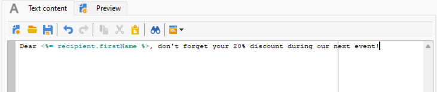
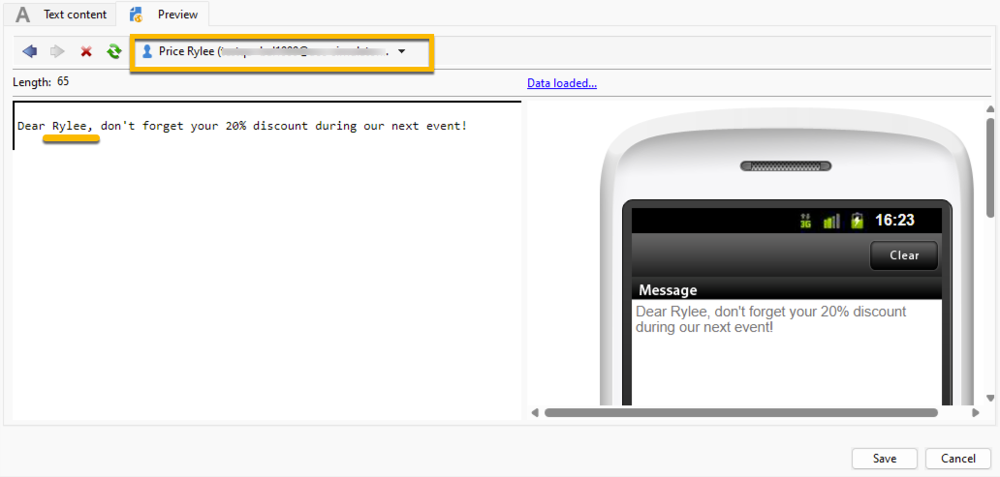

# 簡訊內容 {#sms-content}

若要設定SMS傳送的內容：

1. 在&#x200B;**[!UICONTROL Text content]**&#x200B;精靈中輸入訊息的內容

   {zoomable="yes"}

1. 您可以插入個人化欄位（例如新增名字）或插入預先定義的個人化區塊（例如新增問候語），以個人化您的訊息。 您可以按一下個人化按鈕以新增下列專案：

   {zoomable="yes"}

   按一下「**[!UICONTROL Recipient]** > **[!UICONTROL First name]**」後，您的個人化設定如下：

   {zoomable="yes"}

1. 您可以前往&#x200B;**[!UICONTROL Preview]**&#x200B;標籤，按一下&#x200B;**[!UICONTROL Test personalization]**&#x200B;下拉式清單，並在&#x200B;**[!UICONTROL Recipient]**&#x200B;表格中選擇收件者，以預覽您的傳遞。

   {zoomable="yes"}

   您將擁有包含個人化的SMS預覽：

   {zoomable="yes"}

>[!NOTE]
>
>* 若使用Latin-1 (ISO-8859-1)字碼頁，SMS訊息的長度上限為160個字元。 如果訊息是以Unicode撰寫，則不可超過70個字元。 某些特殊字元可能會影響訊息長度。 如需訊息長度的詳細資訊，請參閱[簡訊字母音譯](smpp-external-account.md#smpp-channel-settings)區段。
>
>* 當出現個人化欄位或條件內容欄位時，訊息的大小會因收件者而異。 進行個人化時，必須評估訊息的長度。
>
>*當您啟動分析時，會檢查訊息的長度，並在溢位事件中顯示警告。

建立傳遞內容後，您可以[選取對象](sms-audience.md)。