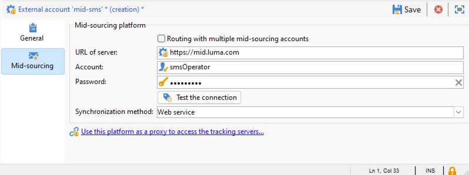

# 中間來源基礎結構中的SMS {#sms-mid}

>[!IMPORTANT]
>
>本檔案適用於Adobe Campaign v8.7.2和更新版本。
>
>若為舊版，請閱讀[Campaign Classicv7檔案](https://experienceleague.adobe.com/zh-hant/docs/campaign-classic/using/sending-messages/sending-messages-on-mobiles/sms-set-up/sms-set-up)。

使用中間來源基礎結構傳送SMS傳遞需要：

1. 中間伺服器上的SMS運運算元。 [在這裡瞭解如何建立它](#sms-operator-mid)
1. 行銷伺服器上的SMS外部帳戶，將使用之前建立的運運算元。 [在這裡瞭解如何建立它](#sms-external-account)
1. 中間伺服器上的SMPP外部帳戶，指定頻道和中間來源傳遞模式。 [在這裡瞭解如何建立它](#smpp-external-account-mid)
1. 參照外部帳戶的傳遞範本以簡化傳送流程。 [在這裡瞭解如何建立它](#sms-delivery-template)

## 在中間伺服器上建立SMS運運算元 {#sms-operator-mid}

首先，您必須在中間伺服器上建立SMS運運算元，由Marketing伺服器上的SMS外部帳戶使用。

若要建立簡訊運運算元，請遵循下列步驟：

1. 在&#x200B;**[!UICONTROL Administration]** > **[!UICONTROL Access management]** > **[!UICONTROL Operators]**&#x200B;中，按一下&#x200B;**[!UICONTROL New]**&#x200B;並在開啟的新視窗中填寫表單。

   * **[!UICONTROL Name (login)]**&#x200B;和&#x200B;**[!UICONTROL Label]**&#x200B;為必要專案。
   * 密碼不是強制性的，但為了安全起見，強烈建議使用。

   請注意，名稱（登入）稍後將用於命名中間伺服器中的SMPP外部帳戶。

   {zoomable="yes"}

1. 在&#x200B;**[!UICONTROL Groups and named rights]**&#x200B;部分中，按一下&#x200B;**[!UICONTROL Add]**&#x200B;按鈕。
在開啟的新視窗上，從&#x200B;**[!UICONTROL Folder]**&#x200B;清單中選擇&#x200B;**[!UICONTROL Named rights]**，然後在右側清單中選擇&#x200B;**[!UICONTROL ADMINISTRATION]**。

1. 按一下&#x200B;**[!UICONTROL Ok]**&#x200B;按鈕。

   {zoomable="yes"}

1. 按一下&#x200B;**[!UICONTROL Save]**&#x200B;按鈕，完成簡訊運運算元的建立。

   {zoomable="yes"}

您現在可以在運運算元清單中看到它。

{zoomable="yes"}

## 在行銷伺服器上建立簡訊外部帳戶 {#sms-external-account}

在中間基礎結構中，您需要在行銷伺服器上建立簡訊外部帳戶，如下所示

>[!IMPORTANT]
>
>對多個外部SMS帳戶使用相同的帳戶和密碼可能會導致帳戶之間的衝突和重疊。 深入瞭解[簡訊疑難排解頁面](smpp-connection.md#sms-troubleshooting)。

1. 在&#x200B;**[!UICONTROL Administration]** > **[!UICONTROL Platform]** > **[!UICONTROL External Accounts]**&#x200B;中，按一下&#x200B;**[!UICONTROL New]**&#x200B;圖示

   {zoomable="yes"}

1. 設定外部帳戶的&#x200B;**[!UICONTROL Label]**&#x200B;和&#x200B;**[!UICONTROL Internal name]**。 將帳戶型別定義為&#x200B;**[!UICONTROL Routing]**，核取&#x200B;**[!UICONTROL Enabled]**&#x200B;方塊，為通道選取&#x200B;**[!UICONTROL Mobile (SMS)]**，為傳遞模式選取&#x200B;**[!UICONTROL Mid-sourcing]**。

   {zoomable="yes"}

1. 在&#x200B;**[!UICONTROL Mid-sourcing]**&#x200B;索引標籤中，使用中間來源伺服器URL和先前在中間伺服器上建立的SMS運運算元填寫表單。

   按一下&#x200B;**[!UICONTROL Test the connection]**&#x200B;按鈕以確認連線。

   {zoomable="yes"}

1. 按一下&#x200B;**[!UICONTROL Save]**。

## 在中間伺服器上建立SMPP外部帳戶 {#smpp-external-account-mid}

>[!IMPORTANT]
>
>對多個外部SMS帳戶使用相同的帳戶和密碼可能會導致帳戶之間的衝突和重疊。 請參閱[簡訊疑難排解頁面](smpp-connection.md#sms-troubleshooting)。

目標現在是在中間伺服器上建立您的SMPP外部帳戶。

要執行此操作，請遵循下列步驟：

1. 在中間伺服器的&#x200B;**[!UICONTROL Administration]** > **[!UICONTROL Platform]** > **[!UICONTROL External Accounts]**&#x200B;中，按一下&#x200B;**[!UICONTROL New]**&#x200B;圖示

1. 設定外部帳戶的&#x200B;**[!UICONTROL Label]**&#x200B;和&#x200B;**[!UICONTROL Internal name]**。

   >[!WARNING]
   >
   >指派內部名稱時，請務必遵循指定的命名慣例： `SMS Operator Name_Internal Name of the Marketing SMS external account`。
   >

   將帳戶型別定義為&#x200B;**[!UICONTROL Routing]**，核取&#x200B;**[!UICONTROL Enabled]**&#x200B;方塊，為通道選取&#x200B;**[!UICONTROL Mobile (SMS)]**，為傳遞模式選取&#x200B;**[!UICONTROL Bulk delivery]**。
   {zoomable="yes"}

1. 在&#x200B;**[!UICONTROL Mobile]**&#x200B;索引標籤中，將&#x200B;**[!UICONTROL Extended generic SMPP]**&#x200B;保留在&#x200B;**[!UICONTROL Connector]**&#x200B;下拉式清單中。

   預設會勾選&#x200B;**[!UICONTROL Send messages through a dedicated process]**&#x200B;方塊。

   {zoomable="yes"}

   若要設定連線，您必須填寫此表單的索引標籤。 如需詳細資訊，[進一步瞭解SMPP外部帳戶](smpp-external-account.md#smpp-connection-settings)。

## 設定傳遞範本 {#sms-delivery-template}

為了協助建立SMS傳遞，請建立SMS傳遞範本，其中會參考您的所有設定。

在行銷伺服器上的&#x200B;**[!UICONTROL Resources]** > **[!UICONTROL Templates]** > **[!UICONTROL Delivery templates]**&#x200B;中，以滑鼠右鍵按一下現有的行動傳遞範本，然後選擇&#x200B;**[!UICONTROL Duplicate]**。

{zoomable="yes"}

變更範本的&#x200B;**[!UICONTROL Label]**&#x200B;和&#x200B;**[!UICONTROL Internal name]**&#x200B;以輕鬆辨識它，然後按一下&#x200B;**[!UICONTROL Properties]**&#x200B;按鈕。

{zoomable="yes"}

在&#x200B;**[!UICONTROL General]**&#x200B;索引標籤的&#x200B;**[!UICONTROL Routing]**&#x200B;中，選取您的SMPP外部帳戶。

{zoomable="yes"}

在&#x200B;**[!UICONTROL SMS]**&#x200B;索引標籤中，您可以將選用引數新增至範本。

{zoomable="yes"}

[進一步瞭解此簡訊標籤設定](sms-delivery-settings.md)。