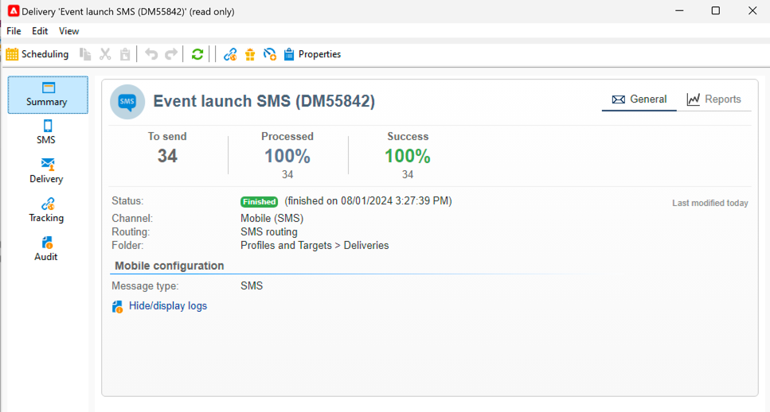

# 監視和追蹤簡訊

請務必監視您的SMS傳送，以確保您的行銷活動有效率。

在這裡，您可能需要知道傳送傳遞後會發生什麼情況

## 瞭解SMS傳送控制面板

傳送控制面板會提供您許多簡訊的相關資訊。

若要存取儀表板，請連按兩下傳送清單中的傳送。

在&#x200B;**[!UICONTROL Summary]**&#x200B;索引標籤中，您有主要資料，例如已處理的訊息數和成功數。

{zoomable="yes"}

傳送SMS後，無法再存取與傳送內容有關的&#x200B;**[!UICONTROL SMS]**&#x200B;標籤以進行變更。

在&#x200B;**[!UICONTROL Delivery]**&#x200B;標籤中，您擁有傳遞記錄的資訊。 對於每個聯絡的地址，您可以檢視簡訊是否已傳送

{zoomable="yes"}

您可以在&#x200B;**[!UICONTROL Exclusions]**&#x200B;索引標籤中檢視有關為何將某些地址從目標中排除的詳細資料。

{zoomable="yes"}

**[!UICONTROL Tracking]**&#x200B;索引標籤與追蹤有關。 以下是在SMS內容中追蹤的URL範例。

{zoomable="yes"}

最後，在傳遞啟動期間包含所有詳細資料的&#x200B;**[!UICONTROL Audit]**&#x200B;標籤：

{zoomable="yes"}

## 瞭解簡訊失敗

簡訊的失敗型別和失敗原因與電子郵件的相同。

深入瞭解[傳送失敗](../delivery-failures.md)，尤其是關於[SMS隔離](../delivery-failures.md#sms-quarantines)。

