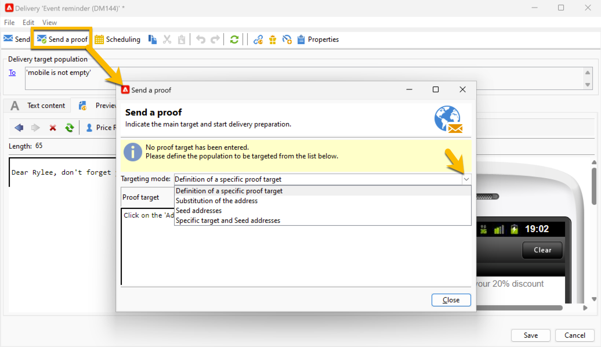

# 傳送簡訊傳遞的證明 {#sms-proof}

Adobe強烈建議您設定傳遞驗證週期。 將內容傳送給對象之前，請確定內容已核准。

您可以傳送簡訊傳遞的證明以進行驗證：

1. 按一下&#x200B;**[!UICONTROL Send a proof]**&#x200B;按鈕，將會開啟一個視窗

   {zoomable="yes"}

   您有多個模式可傳送證明：

   * **[!UICONTROL Definition of a specific proof target]**：可讓您以篩選條件查詢資料庫中作為證明目標的地址
   * **[!UICONTROL Substitution of the address]**：可讓您輸入測試地址，並使用目標收件者資料來驗證內容。 您可以手動輸入替代地址，或從下拉式清單中選取替代地址。 關聯的[分項清單](../../config/enumerations.md)是&#x200B;**[!UICONTROL Substitution address (rcpAddress)]**。
     預設會隨機執行替代，但您可以透過**[!UICONTROL Detail]**&#x200B;圖示從主要目標中選取特定收件者。
   * **[!UICONTROL Seed addresses]**：可讓您存取種子地址以作為證明目標。 這些位址可從檔案匯入或手動輸入。
   * **[!UICONTROL Specific target and Seed addresses]**：可讓您合併來自收件者的種子地址和地址。

1. 選擇您的&#x200B;**[!UICONTROL Targeting mode]**&#x200B;後，根據它新增您的證明地址

   在下列範例中，我們選擇&#x200B;**[!UICONTROL Definition of a specific proof target]**，並新增收件者：

   {zoomable="yes"}

1. 按一下 **[!UICONTROL Analyze]** 按鈕。
Adobe Campaign會在驗證證明傳送之前執行所有控制。 分析結束時，**[!UICONTROL Confirm delivery]**&#x200B;按鈕將可供點按。

   {zoomable="yes"}

1. 若要傳送簡訊傳遞的證明，請按一下&#x200B;**[!UICONTROL Confirm delivery]**&#x200B;按鈕。

如果這個階段一切正常，您可以繼續並[傳送您的SMS傳送給對象](sms-audience.md)。
