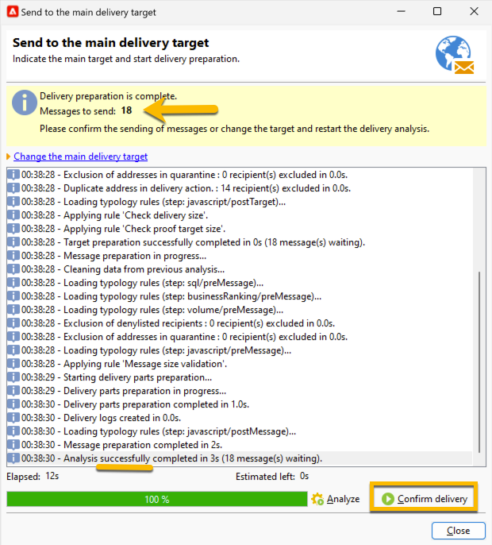

# 傳送簡訊給對象 {#sms-send-audience}

您的SMS通過驗證後，您現在可以將其傳送給對象。

1. 按一下 **[!UICONTROL Send]** 按鈕。
在開啟的視窗中，選擇適合您的正確動作。

   在以下範例中，我們選擇&#x200B;**[!UICONTROL Deliver it as soon as possible]**，**[!UICONTROL Analyze]**&#x200B;按鈕出現。 我們按一下該&#x200B;**[!UICONTROL Analyze]**&#x200B;按鈕。

   {zoomable="yes"}

   Adobe Campaign會在驗證證明傳送之前執行所有控制。 您會看到實際對象數量。 分析結束時，**[!UICONTROL Confirm delivery]**&#x200B;按鈕將可供點按。

   {zoomable="yes"}

1. 若要將您的SMS傳送傳送傳送傳送給其對象，請按一下&#x200B;**[!UICONTROL Confirm delivery]**&#x200B;按鈕。
