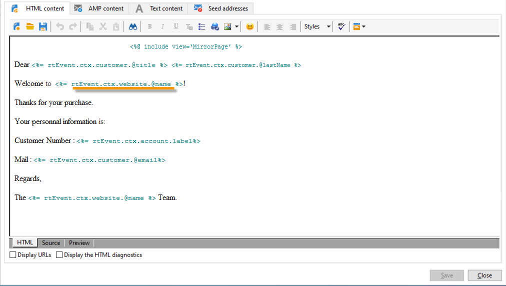
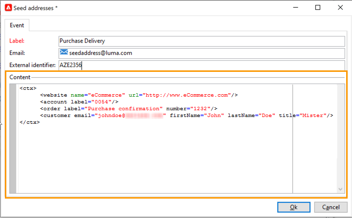
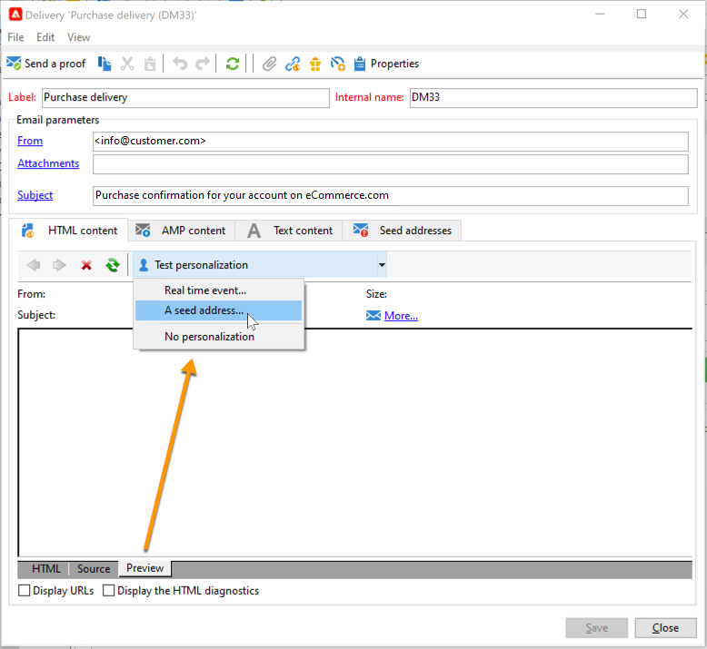
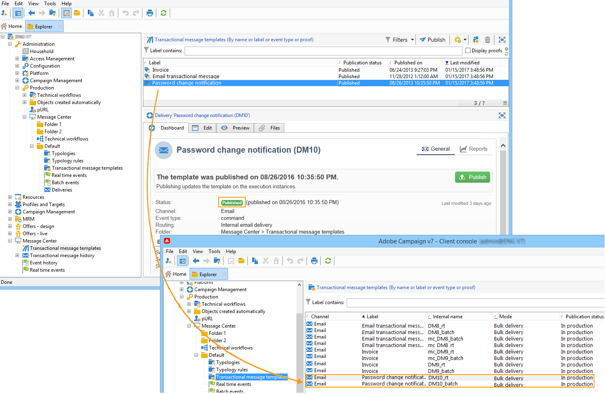

# 開始使用異動訊息{#send-transactional-messages}

交易式訊息（訊息中心）是專為管理觸發訊息而設計的Campaign模組。 這些訊息是從資訊系統觸發的事件產生，可以是：例如，發票、訂單確認、發運確認、密碼更改、產品不可用通知、帳戶對帳單或網站帳戶建立。

  作為托管Cloud Services用戶， [連絡Adobe](../start/campaign-faq.md#support) 若要在您的環境中安裝及設定Campaign交易式訊息。

交易式訊息用於傳送：

* 通知，例如訂單確認或密碼重設
* 客戶動作的個別即時回應
* 非促銷內容

 交易式訊息設定在 [本節](../config/transactional-msg-settings.md).

 了解 [本頁](../dev/architecture.md).

>[!CAUTION]
>
>交易式訊息需要特定授權。 請檢查您的授權合約。

## 定義交易式訊息範本

每個事件都可觸發個人化訊息。 為了讓此情況發生，您需要建立訊息範本以符合每個事件類型。 範本包含個人化交易式訊息的必要資訊。 您也可以使用範本來測試訊息預覽，並在傳送至最終目標之前使用種子地址傳送校樣。

### 建立範本

若要建立訊息範本，請遵循下列步驟：

1. 前往 **[!UICONTROL Message Center >Transactional message templates]** 檔案夾中。
1. 在交易式訊息範本清單中，按一下滑鼠右鍵並選取 **[!UICONTROL New]** 或按一下 **[!UICONTROL New]** 按鈕。

   

1. 在傳送視窗中，選取適合您要使用之通道的傳送範本。

   

1. 視需要變更其標籤。
1. 選取符合您要傳送之訊息的事件類型。

   

   Adobe Campaign必須依Adobe在控制例項上建立要處理的事件類型。

   >[!NOTE]
   >
   >事件類型絕不應連結至多個範本。

1. 輸入性質和說明，然後按一下 **[!UICONTROL Continue]** 以建立訊息內文。 請參閱 [建立訊息內容](#create-message-content).

### 建立內容{#create-message-content}

交易式訊息內容的定義與Adobe Campaign中所有傳送的定義相同。 例如，對於電子郵件傳送，您可以建立HTML或文字格式的內容、新增附件或個人化傳送物件。 如需詳細資訊，請參閱[本章節](../start/create-message.md)。

>[!CAUTION]
>
>訊息中包含的影像必須可公開存取。 Adobe Campaign不提供任何交易式訊息的影像上傳機制。\
>與JSSP或webApp不同， `<%=` 沒有任何預設逸出。
>
>您必須正確逸出來自事件的每個資料。 此逸出取決於此欄位的使用方式。 例如，在URL中，請使用encodeURIComponent。 要在HTML中顯示，可以使用escapeXMLString。

定義訊息內容後，您可以將事件資訊整合至訊息內文，並加以個人化。 由於個人化標籤，事件資訊會插入文字內文。

* 所有個人化欄位皆來自有效負載。
* 可以在交易式訊息中參考一或多個個人化區塊。 在發佈至執行例項期間，區塊內容會新增至傳送內容。

若要將個人化標籤插入電子郵件訊息的內文，請套用下列步驟：

1. 在訊息範本中，按一下符合電子郵件格式(HTML或文字)的索引標籤。
1. 輸入訊息的內文。
1. 在文字內文中，使用 **[!UICONTROL Real time events>Event XML]** 功能表。

   

1. 使用下列語法填入標籤： **元素名稱**.@**屬性名稱** 如下所示。

   

### 新增種子地址{#add-seeds}

種子地址可讓您顯示訊息的預覽、傳送校樣，以及在傳送訊息之前測試訊息個人化。 種子地址連結至傳送，無法用於其他傳送。

1. 在交易式訊息範本中，按一下 **[!UICONTROL Seed addresses]** ，然後按一下 **[!UICONTROL Add]** 按鈕。

   

1. 為標籤指派標籤以方便日後選取，然後輸入種子地址（根據通訊通道，電子郵件或行動電話）。

1. 輸入外部標識符：此選用欄位可讓您輸入商業金鑰（唯一ID、名稱+電子郵件等） 網站上所有應用程式都通用的識別碼，用於識別您的設定檔。 如果此欄位也存在於Adobe Campaign行銷資料庫中，您就可以使用資料庫中的設定檔調解事件。

   

1. 插入測試資料。 請參閱[本節](#personalization-data)。

   

1. 按一下 **[!UICONTROL Ok]** 確認種子地址的建立。

1. 重複此過程以建立所需的地址數。

   

建立地址後，您就可以存取其預覽和個人化。

### 新增個人化資料{#personalization-data}

您可以在訊息範本中新增資料，以測試交易式訊息個人化。 這可讓您產生預覽或傳送校樣。 如果您安裝 **傳遞能力** 模組，此資料可讓您顯示各種案頭、網頁或行動用戶端的訊息轉譯。

此資料的用途是在訊息最終傳送前先測試訊息。 這些訊息與要由訊息中心處理的實際資料不符。 但是，XML結構必須與儲存在執行實例中的事件結構相同，如下所示。

此資訊可讓您使用個人化標籤來個人化訊息內容。

1. 在訊息範本中，按一下 **[!UICONTROL Seed addresses]** 標籤。
1. 在事件內容中，以XML格式輸入測試資訊。

   

### 預覽交易式訊息{#transactional-message-preview}

建立一或多個種子地址和訊息內文後，您可以預覽訊息並檢查其個人化。

1. 在訊息範本中，按一下 **[!UICONTROL Preview]** ，然後選取 **[!UICONTROL A seed address]** 中。

   

1. 選取先前建立的種子地址以顯示個人化訊息。

   

### 傳送證明

您可以傳送校樣至先前建立的種子地址，以測試訊息傳送。

傳送校樣的程式與任何傳送的程式相同。

 進一步了解校樣，於 [Campaign Classicv7檔案](https://experienceleague.adobe.com/docs/campaign-classic/using/sending-messages/key-steps-when-creating-a-delivery/steps-validating-the-delivery.html?lang=zh-Hant){target=&quot;_blank&quot;}

不過，若要傳送交易式訊息的證明，您必須執行下列操作：

* 建立一或多個 [種子地址](#add-seeds) 使用個人化測試資料
* 建立訊息內容

若要傳送校樣：

1. 按一下 **[!UICONTROL Send a proof]** 按鈕。
1. 分析傳送。
1. 更正任何錯誤並確認傳送。

   

1. 檢查訊息是否已傳送至種子地址，且其內容是否符合您的設定。

   

校樣可透過 **[!UICONTROL Audit]** 標籤。

### 發佈範本

在控制執行個體上建立的訊息範本完成時，您可以發佈它。 此程式也會在所有執行執行個體上發佈。

>[!NOTE]
>
>發佈交易式訊息範本時，類型規則也會自動發佈在執行例項上。

發佈功能可讓您在執行實例上自動建立兩個郵件模板，以便您發送連結到即時和批處理事件的郵件。

>[!CAUTION]
>
>每當您對範本進行任何變更時，請務必再次發佈，讓這些變更在交易式訊息傳送期間生效。

1. 在控制執行個體上，前往 **[!UICONTROL Message Center > Transactional message templates]** 樹的資料夾。
1. 選取要在執行執行個體上發佈的範本。
1. 按一下&#x200B;**[!UICONTROL Publish]**。

   

發佈完成後，將應用於批處理和即時類型事件的兩個消息模板都將在生產實例的樹中建立，該樹位於 **[!UICONTROL Administration > Production > Message Center Execution> Default > Transactional message templates]** 檔案夾。

發佈範本後，如果觸發對應的事件，執行例項將會收到事件，將其連結至交易範本，並傳送對應的交易式訊息給每個收件者。

>[!NOTE]
>
>如果您將交易式訊息範本的現有欄位（例如寄件者地址）取代為空值，交易式訊息重新發佈後，執行例項上的對應欄位將不會更新。 它仍會包含先前的值。
>
>不過，如果您新增非空白值，則對應欄位在下次發佈後會照常更新。

### 取消發佈範本

在執行例項上發佈訊息範本後，即可取消發佈。

* 事實上，如果觸發對應事件，仍可呼叫已發佈的範本：如果您不再使用訊息範本，建議取消發佈訊息範本。 這是為了避免錯誤傳送不需要的交易式訊息。

   例如，您發佈了訊息範本，而您只能用於聖誕促銷活動。 在聖誕節期間結束後，您可能會想要取消發佈，並在明年再次發佈。

* 此外，您無法刪除具有 **[!UICONTROL Published]** 狀態。 您必須先取消發佈。

若要取消發佈交易式訊息範本，請遵循下列步驟。

1. 在控制執行個體上，瀏覽至 **[!UICONTROL Message Center > Transactional message templates]** 檔案夾。
1. 選取要取消發佈的範本。
1. 按一下&#x200B;**[!UICONTROL Unpublish]**。
1. 按一下&#x200B;**[!UICONTROL Start]**。

交易式訊息範本狀態會從 **[!UICONTROL Published]** to **[!UICONTROL Being edited]**.

完成取消發佈後：

* 會從每個執行例項中刪除兩個訊息範本（套用至批次和即時類型事件）。

   它們不再出現在 **[!UICONTROL Administration > Production > Message Center Execution > Default > Transactional message templates]** 檔案夾。

* 取消發佈範本後，您就可以從控制執行個體刪除該範本。

   若要這麼做，請從清單中選取它，然後按一下 **[!UICONTROL Delete]** 按鈕。
