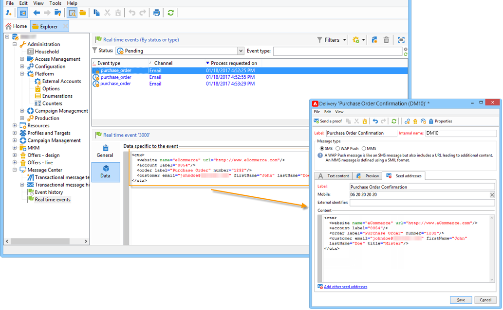

# 開始使用異動訊息{#send-transactional-messages}

異動訊息（訊息中心）是專為管理觸發訊息而設計的Campaign模組。 這些通知是從資訊系統觸發的事件產生，可以是：發票、訂單確認、出貨確認、密碼變更、產品無法使用通知、帳戶對帳單、網站帳戶建立等。

  身為Managed Cloud Services使用者， [連絡人Adobe](../start/campaign-faq.md#support){target="_blank"} 在您的環境中設定Campaign異動訊息。

交易式訊息用於傳送：

* 通知，例如訂單確認或密碼重設
* 個人對客戶動作的即時回應
* 非促銷內容

交易式訊息設定詳見 [本節](../config/transactional-msg-settings.md).

瞭解上的交易式傳訊架構 [此頁面](../architecture/architecture.md#transac-msg-archi).

## 交易式訊息傳遞操作原則 {#transactional-messaging-operating-principle}

Adobe Campaign異動訊息模組整合至資訊系統，可傳回要變更為個人化異動訊息的事件。 這些訊息可以個別傳送，或透過電子郵件、簡訊或推播通知分批傳送。

例如，假設您有一家公司，其網站可供客戶購買產品。

Adobe Campaign可讓您傳送通知電子郵件給已將產品新增至購物車的客戶。 當其中一人離開您的網站而未完成購買（觸發促銷活動事件的外部事件）時，就會自動傳送購物車放棄電子郵件給他們（交易式訊息傳送）。

要落實這項功能的主要步驟詳述如下：

1. [建立事件型別](#create-event-types).
1. [建立及設計訊息範本](#create-message-template). 您必須在此步驟中將事件連結至訊息。
1. [測試訊息](#test-message-template).
1. [發佈訊息範本](#publish-message-template).

設計和發佈交易式訊息範本後，如果觸發了對應的事件，則會透過PushEvent和PushEvents將相關資料傳送至Campaign [SOAP方法](../send/event-description.md)，則會傳送給目標收件者。

## 建立事件類型 {#create-event-types}

若要確保每個事件都可以變更為個人化訊息，您首先需要建立 **事件型別**.

時間 [建立訊息範本](#create-message-template)，則會選取符合您要傳送之訊息的事件型別。

>[!CAUTION]
>
>您必須先建立事件型別，才能在訊息範本中使用它們。

若要建立將由Adobe Campaign處理的事件型別，請遵循下列步驟：

1. 瀏覽至 **[!UICONTROL Administration > Platform > Enumerations]** Campaign檔案總管的資料夾。
1. 選取 **[!UICONTROL Event type]** 清單中的分項清單。
1. 按一下 **[!UICONTROL Add]** 以建立分項清單。 這可以是訂單確認、密碼變更、訂單傳遞變更等。

   

   >[!CAUTION]
   >
   >每個事件型別都必須符合 **[!UICONTROL Event type]** 分項清單。

1. 建立分項清單值後，請先登出再登入執行個體，才能使建立生效。

>[!NOTE]
>
>進一步瞭解中的分項清單 [此頁面](../../v8/config/ui-settings.md#enumerations).

## 定義異動訊息範本 {#create-message-template}

每個事件都可以觸發個人化訊息。 為了做到這一點，您需要建立一個訊息範本以符合每個事件型別。 範本包含個人化交易式訊息的必要資訊。 您也可以使用範本來測試訊息預覽，並在傳送至最終目標之前使用種子地址傳送校樣。

### 建立範本

若要建立訊息範本，請遵循下列步驟：

1. 前往 **[!UICONTROL Message Center >Transactional message templates]** Adobe Campaign樹狀結構中的資料夾。
1. 在交易式訊息範本清單中，按一下滑鼠右鍵並選取 **[!UICONTROL New]** 在下拉式功能表中，或按一下 **[!UICONTROL New]** 按鈕（異動訊息範本清單上方）。

   

1. 在傳遞視窗中，選取適用於您要使用之管道的傳遞範本。

   

1. 視需要變更其標籤。
1. 選取符合您要傳送之訊息的事件型別。 必須預先建立預定由Adobe Campaign處理的事件型別。 [了解更多](#create-event-types)

   

   >[!CAUTION]
   >
   >事件型別絕不可連結至多個範本。

1. 輸入性質和說明，然後按一下 **[!UICONTROL Continue]** 以建立訊息內文。

### 建立內容{#create-message-content}

交易式訊息內容的定義與Adobe Campaign中所有傳送的定義相同。 例如，對於電子郵件傳遞，您可以建立HTML或文字格式的內容、新增附件或個人化傳遞物件。 [了解更多](../start/create-message.md)。

>[!CAUTION]
>
>訊息中包含的影像必須可公開存取。 Adobe Campaign不提供任何異動訊息的影像上傳機制。\
>不同於JSSP或webApp， `<%=` 沒有任何預設逸出。
>
>您必須正確逸出來自事件的每個資料。 此逸出取決於此欄位的使用方式。 例如，在URL中，請使用encodeURIComponent。 若要顯示在HTML中，您可以使用escapeXMLString。

定義訊息內容後，您可以將事件資訊整合至訊息內文並加以個人化。 由於個人化標籤，事件資訊會插入文字內文中。

* 所有個人化欄位都來自裝載。
* 可以在交易式訊息中參考一或多個個人化區塊。 <!--The block content will be added to the delivery content during the publication to the execution instance.-->

若要將個人化標籤插入電子郵件內文中，請套用下列步驟：

1. 在訊息範本中，按一下符合電子郵件格式(HTML或文字)的索引標籤。
1. 輸入訊息內文。
1. 在文字內文中，使用 **[!UICONTROL Real time events>Event XML]** 功能表。

   

1. 使用下列語法填入標籤： **元素名稱**.@**屬性名稱** 如下所示。

   

## 測試異動訊息範本 {#test-message-template}

### 新增種子地址{#add-seeds}

種子地址可讓您在傳送訊息之前顯示訊息預覽、傳送校樣並測試訊息個人化。 種子地址會連結至傳遞，且無法用於其他傳遞。

1. 在交易式訊息範本中，按一下 **[!UICONTROL Seed addresses]** 標籤，然後按一下 **[!UICONTROL Add]** 按鈕。

   

1. 為其指派標籤以便稍後輕鬆選取，然後輸入種子地址（電子郵件或行動電話，視通訊通道而定）。

1. 輸入外部識別碼：此選擇性欄位可讓您輸入商業金鑰（唯一ID、名稱+電子郵件等） 這是網站上所有應用程式通用的功能，用來識別您的設定檔。 如果此欄位也出現在Adobe Campaign行銷資料庫中，您可以協調事件與資料庫中的設定檔。

   

1. 插入測試資料。 請參閱[本節](#personalization-data)。

   

1. 按一下 **[!UICONTROL Ok]** 以確認建立種子地址。

1. 重複此程式，視需要建立多個位址。

   

地址建立後，您就可以存取其預覽和個人化。

<!--

### Add personalization data{#personalization-data}

You can add data in the message template to test transactional message personalization. This will allow you to generate a preview or send a proof. If you install the **Deliverability** module, this data allows you to display a rendering of the messages for various desktop, web or mobile clients.

The purpose of this data is to test your messages before their final delivery. These messages do not coincide with actual data to be processed by Message Center.

However, the XML structure must be identical to that of the event stored in the execution instance, as shown below. 

This information enables you to personalize message content using personalization tags.

1. In the message template, click the **[!UICONTROL Seed addresses]** tab.
1. In the event content, enter the test information in XML format.

   
-->

### 預覽交易式訊息{#transactional-message-preview}

建立一或多個種子地址和訊息內文後，您可以預覽訊息並檢查其個人化。

1. 在訊息範本中，按一下 **[!UICONTROL Preview]** 索引標籤，然後選取 **[!UICONTROL A seed address]** 下拉式清單中的。

   

1. 選取先前建立的種子地址，以顯示個人化訊息。

   

### 傳送證明

您可以傳送證明至先前建立的種子地址，以測試訊息傳送。

傳送證明的過程與傳送任何證明的過程相同。 進一步瞭解中的校訂 [本節](../send/preview-and-proof.md).

不過，若要傳送交易式訊息的證明，您必須執行下列操作：

* 建立一或多個 [種子地址](#add-seeds) 使用個人化測試資料
* 建立訊息內容

若要傳送證明：

1. 按一下 **[!UICONTROL Send a proof]** 按鈕。
1. 分析傳遞。
1. 更正任何錯誤並確認傳遞。

   

1. 檢查訊息是否已送達種子地址，其內容是否符合您的設定。

   

校樣可在每個範本中透過 **[!UICONTROL Audit]** 標籤。

## 發佈範本 {#publish-message-template}

訊息範本建立時<!-- on the control instance--> 完成後，您可以發佈它，這可讓您傳送連結至即時和批次事件的訊息。

<!--This process will also publish it on all execution instances.

NOTE: When publishing transactional message templates, typology rules are also automatically published on the execution instances.

Publication lets you automatically create two message templates on the execution instances, which will allow you to send messages linked to real-time and batch events.-->

>[!CAUTION]
>
>每當您對範本進行任何變更時，請務必再次發佈，使這些變更在交易式訊息傳遞期間生效。

1. 前往 **[!UICONTROL Message Center > Transactional message templates]** 樹狀結構的資料夾。
1. 選取您要發佈的範本<!--on your execution instances-->.
1. 按一下&#x200B;**[!UICONTROL Publish]**。

   

發佈完成後，要套用至批次和即時型別事件的訊息範本都會建立在 **[!UICONTROL Administration > Production > Message Center Execution> Default > Transactional message templates]** 資料夾。

發佈範本後，如果觸發了對應的事件，Adobe Campaign<!--execution instance--> 將會收到事件、將其連結至交易式範本，並將對應的交易式訊息傳送給每個收件者。

<!--
>[!NOTE]
>
>If you replace an existing field of the transactional message template, such as the sender address, with an empty value, the corresponding field on the execution instance(s) will not be updated once the transactional message is published again. It will still contain the previous value.
>
>However, if you add a non-empty value, the corresponding field will be updated as usual after the next publication.
-->

## 取消發佈範本

訊息範本發佈後 <!--on the execution instances-->，可取消發佈。

* 事實上，如果觸發對應的事件，仍可呼叫已發佈的範本：如果您不再使用訊息範本，建議將其取消發佈。 這是為了避免誤傳不必要的交易式訊息。

   例如，您發佈了一個訊息範本，但只用於聖誕節行銷活動。 您可能會想要在聖誕節結束後取消發佈，並在明年再次發佈。

* 此外，您無法刪除具有 **[!UICONTROL Published]** 狀態。 您必須先取消發佈。

若要取消發佈交易式訊息範本，請遵循下列步驟。

1. 瀏覽至 **[!UICONTROL Message Center > Transactional message templates]** 資料夾。
1. 選取要取消發佈的範本。
1. 按一下&#x200B;**[!UICONTROL Unpublish]**。
1. 按一下&#x200B;**[!UICONTROL Start]**。

異動訊息範本狀態會從變更 **[!UICONTROL Published]** 至 **[!UICONTROL Being edited]**.

取消發佈完成後：

* 兩個訊息範本（套用至批次和即時型別事件）都會被刪除<!-- from each execution instance-->.

   它們不再出現在 **[!UICONTROL Administration > Production > Message Center Execution > Default > Transactional message templates]** 資料夾。

* 取消發佈範本後，您可以將其刪除<!-- from the control instance-->.

   若要這麼做，請從清單中選取它，然後按一下 **[!UICONTROL Delete]** 按鈕。
