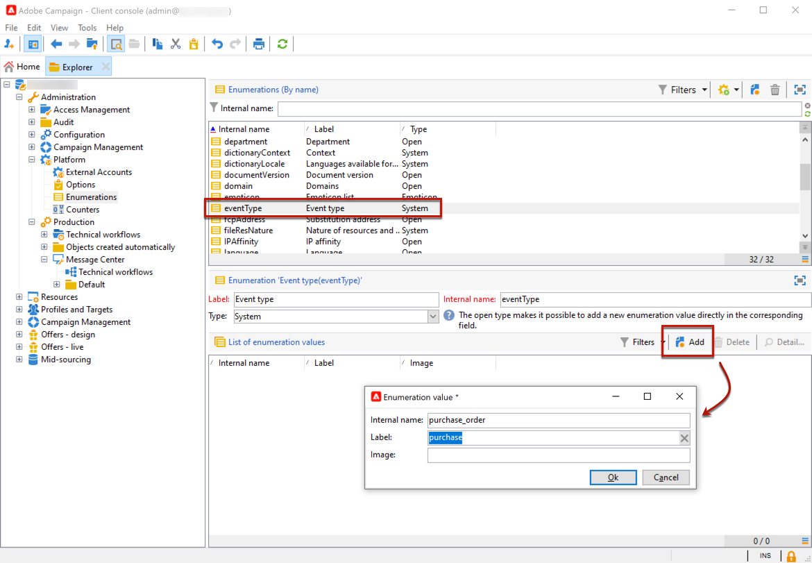

# 開始使用異動訊息{#send-transactional-messages}

異動訊息（訊息中心）是專為管理觸發訊息而設計的Campaign模組。 這些通知是從資訊系統觸發的事件產生，可以是：發票、訂單確認、出貨確認、密碼變更、產品無法使用通知、帳戶對帳單、網站帳戶建立等。

>[!NOTE]
>
>作為Managed Cloud Services使用者，[請聯絡Adobe](../start/campaign-faq.md#support){target="_blank"}以在您的環境中設定Campaign異動訊息。

交易式訊息用於傳送：

* 通知，例如訂單確認或密碼重設
* 個人對客戶動作的即時回應
* 非促銷內容

交易式訊息設定在[本節](../config/transactional-msg-settings.md)中有詳細說明。

瞭解[此頁面](../architecture/architecture.md#transac-msg-archi)上的交易式傳訊架構。

## 異動訊息傳遞操作原則 {#transactional-messaging-operating-principle}

Adobe Campaign異動訊息模組整合至資訊系統，可傳回要變更為個人化異動訊息的事件。 這些訊息可透過電子郵件、簡訊或推播通知個別或批次傳送。

例如，假設您是一間擁有網站的公司，客戶可以在其中購買產品。

Adobe Campaign可讓您傳送通知電子郵件給已將產品新增至購物車的客戶。 當其中一人離開您的網站而未完成購買（觸發促銷活動事件的外部事件）時，就會自動傳送購物車放棄電子郵件給他們（交易式訊息傳送）。

設定此專案的主要步驟如下：

1. [建立事件型別](#create-event-types)。
1. [建立並設計訊息範本](transactional-template.md#create-message-template)。 您必須在此步驟將事件連結至訊息。
1. [測試訊息](transactional-template.md#test-message-template)。
1. [發佈訊息範本](transactional-template.md#publish-message-template)。

設計和發佈異動訊息範本後，如果觸發了對應的事件，則會透過PushEvent和PushEvents [SOAP方法](../send/event-description.md)將相關資料傳送至Campaign，並將傳遞傳送至目標收件者。

## 建立事件類型 {#create-event-types}

為了確保每個事件都可以變更為個人化訊息，您必須先建立&#x200B;**事件型別**。

當[建立訊息範本](#create-message-template)時，您將選取符合您要傳送之訊息的事件型別。

>[!CAUTION]
>
>您必須先建立事件型別，才能在訊息範本中使用它們。

若要建立Adobe Campaign將處理的事件型別，請遵循下列步驟：

1. 瀏覽至Campaign檔案總管的&#x200B;**[!UICONTROL Administration > Platform > Enumerations]**&#x200B;資料夾。
1. 從清單中選取&#x200B;**[!UICONTROL Event type]**&#x200B;分項清單。
1. 按一下&#x200B;**[!UICONTROL Add]**&#x200B;以建立分項清單。 這可以是訂單確認、密碼變更、訂單傳遞變更等。

   

   >[!CAUTION]
   >
   >每個事件型別都必須符合&#x200B;**[!UICONTROL Event type]**&#x200B;列舉中的一個值。

1. 建立分項清單值後，請先登出再登入執行個體，才能讓建立生效。

>[!NOTE]
>
>在[此頁面](../../v8/config/ui-settings.md#enumerations)中進一步瞭解列舉。

在下一個步驟中，瞭解如何[建立和發佈異動訊息的範本](transactional-template.md)。
