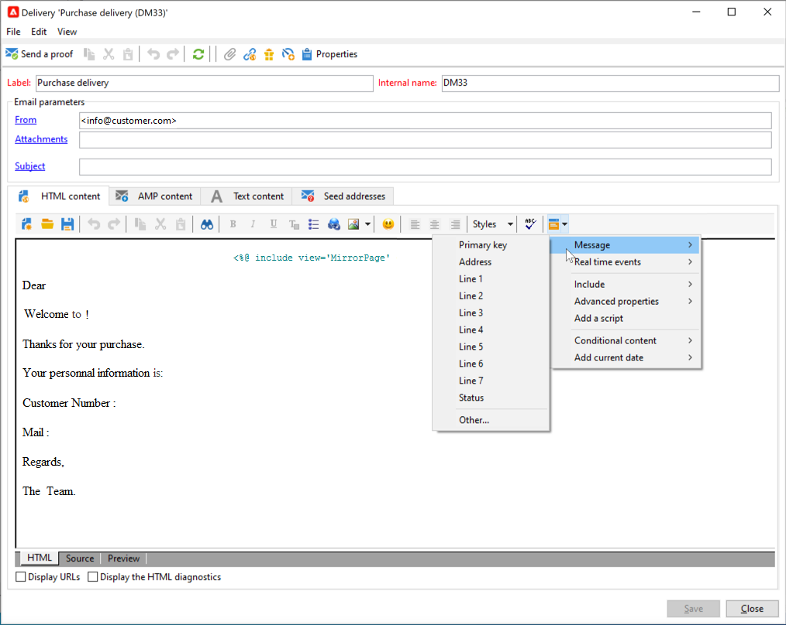
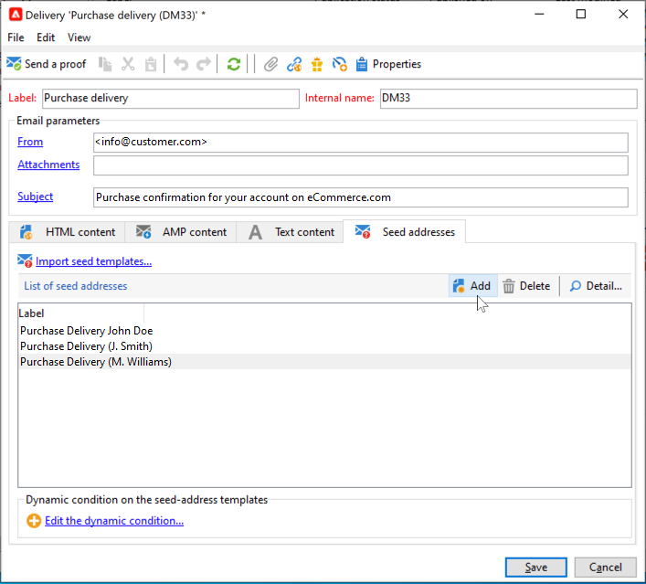

# 開始使用事務性消息傳遞{#send-transactional-messages}

交易式訊息（訊息中心）是專為管理觸發訊息而設計的促銷活動模組。 這些訊息是由資訊系統觸發的事件產生，可以：例如，發票、訂單確認、發運確認、密碼更改、產品不可用通知、帳戶聲明或網站帳戶建立。

:speech_balloon:作為受管理Cloud Services用戶， [與Adobe](../start/support.md#support)聯繫，以在您的環境中安裝和配置促銷活動事務性消息。

事務性消息用於發送：

* 通知，例如訂單確認或密碼重設，例如
* 對客戶行為的個別即時回應
* 非促銷內容

：球：事務性消息傳遞設定在[本節](../config/transactional-msg-settings.md)中有詳細說明。

：球：瞭解[本頁](../dev/architecture.md)中的事務性消息傳遞體系結構。

>[!CAUTION]
>
>交易式傳訊需要特定的授權。 請檢查您的授權合約。

## 定義事務性消息模板

每個事件都可觸發個人化訊息。 為了達到此目的，您需要建立一個訊息範本，以符合每個事件類型。 範本包含個人化交易訊息的必要資訊。 您也可以使用範本來測試訊息預覽，並在傳送至最終目標之前，使用種子位址傳送校樣。

### 建立範本

要建立消息模板，請執行以下步驟：

1. 轉到Adobe Campaign樹中的&#x200B;**[!UICONTROL Message Center >Transactional message templates]**&#x200B;資料夾。
1. 在事務性消息模板清單中，按一下右鍵並選擇下拉菜單中的&#x200B;**[!UICONTROL New]** ，或按一下事務性消息模板清單上方的&#x200B;**[!UICONTROL New]**&#x200B;按鈕。

   

1. 在傳送視窗中，選取適合您要使用之渠道的傳送範本。

   

1. 視需要變更其標籤。
1. 選取符合您要傳送之訊息的事件類型。

   

   必須在控制實例中按Adobe建立目標為Adobe Campaign處理的事件類型。

   >[!NOTE]
   >
   >事件類型永遠不應連結至多個範本。

1. 輸入性質和說明，然後按一下&#x200B;**[!UICONTROL Continue]**&#x200B;建立消息正文。 請參閱[建立消息內容](#create-message-content)。

   

### 建立內容{#create-message-content}

事務性消息內容的定義與Adobe Campaign所有遞送的定義相同。 例如，對於電子郵件傳送，您可以建立HTML或文字格式的內容、新增附件或個人化傳送物件。 如需詳細資訊，請參閱[本章節](../start/create-message.md)。

>[!CAUTION]
>
>訊息中包含的影像必須可公開存取。 Adobe Campaign不提供任何交易訊息的影像上傳機制。\
>與JSSP或webApp不同，`<%=`沒有任何預設逸出字元。
>
>您必須正確地逸出事件中的每個資料。 此逸出取決於此欄位的使用方式。 例如，在URL中，請使用encodeURIComponent。 若要顯示在HTML中，您可以使用escapeXMLString。

在定義了消息內容後，您可以將事件資訊整合到消息正文中並對其進行個性化。 由於個人化標籤，事件資訊會插入文字正文中。

* 所有個人化欄位都來自負載。
* 在事務性消息中可以引用一個或多個個性化塊。 在發佈到執行實例期間，塊內容將添加到傳送內容。

若要將個人化標籤插入電子郵件內文，請套用下列步驟：

1. 在訊息範本中，按一下符合電子郵件格式（HTML或文字）的標籤。
1. 輸入消息的正文。
1. 在文本正文中，使用&#x200B;**[!UICONTROL Real time events>Event XML]**&#x200B;菜單插入標籤。

   

1. 使用下列語法填入標籤：**元素名稱**。@**屬性名稱**，如下所示。

   

### 新增種子地址{#add-seeds}

種子位址可讓您在傳送訊息之前，先顯示訊息的預覽、傳送證明，並測試訊息個人化。 種子地址與傳送相連結，不能用於其他傳送。

1. 在事務性消息模板中，按一下&#x200B;**[!UICONTROL Seed addresses]**&#x200B;頁籤。

   

1. 指派標籤給標籤，以方便日後選取。

   

1. 輸入種子地址（電子郵件或行動電話，視通訊頻道而定）。

   

1. 輸入外部標識符：此可選欄位可讓您輸入商業金鑰（唯一ID、名稱+電子郵件等） 網站上所有應用程式的通用識別碼，用來識別您的個人檔案。 如果此欄位也存在於Adobe Campaign行銷資料庫中，則您可以協調事件與資料庫中的描述檔。

   

1. 插入測試資料。 請參閱[本節](#personalization-data)。

   

1. 按一下&#x200B;**[!UICONTROL Add other seed addresses]**&#x200B;連結，然後按一下&#x200B;**[!UICONTROL Add]**&#x200B;按鈕。

   

1. 重複此過程，建立所需的地址數。

   

建立地址後，您就可以存取其預覽和個人化。

### 新增個人化資料{#personalization-data}

您可以在訊息範本中新增資料，以測試交易性訊息個人化。 這可讓您產生預覽或傳送校樣。 如果您安裝&#x200B;**Deliverability**&#x200B;模組，此資料可讓您顯示各種案頭、網頁或行動用戶端的訊息轉譯。

此資料的目的是在訊息最終傳遞之前先進行測試。 這些消息與要由消息中心處理的實際資料不一致。 但是，XML結構必須與儲存在執行實例中的事件結構相同，如下所示。

這項資訊可讓您使用個人化標籤個人化訊息內容。

1. 在消息模板中，按一下&#x200B;**[!UICONTROL Seed addresses]**&#x200B;頁籤。
1. 在事件內容中，以XML格式輸入測試資訊。

   

### 查看事務性消息{#transactional-message-preview}

在您建立一或多個種子位址和訊息內文後，您就可以預覽訊息並檢查其個人化。

1. 在消息模板中，按一下&#x200B;**[!UICONTROL Preview]**&#x200B;頁籤。

   

1. 在下拉式清單中選取&#x200B;**[!UICONTROL A seed address]**。

   

1. 選擇先前建立的種子地址以顯示個人化訊息。

   

### 傳送證明

您可以傳送證明至先前建立的種子位址，以測試訊息傳送。

傳送證明的程式與傳送的程式相同。

:arrow_upper_right:進一步瞭解[Campaign Classic檔案]((https://experienceleague.adobe.com/docs/campaign-classic/using/sending-messages/key-steps-when-creating-a-delivery/steps-validating-the-delivery.html))中的校樣

但是，要發送事務性消息的證明，您需要執行以下操作：

* 使用個人化測試資料建立一或多個[種子位址](#add-seeds)
* 建立訊息內容

若要傳送證明：

1. 在傳送視窗中按一下&#x200B;**[!UICONTROL Send a proof]**&#x200B;按鈕。
1. 分析傳送。
1. 更正任何錯誤並確認傳送。

   

1. 檢查訊息是否已傳送至種子位址，且其內容符合您的設定。

   

校樣可透過&#x200B;**[!UICONTROL Audit]**&#x200B;標籤在每個範本中存取。

### 發佈範本

當在控制實例上建立的消息模板完成時，可以發佈該消息模板。 此程式也會在所有執行例項上發佈。

>[!NOTE]
>
>發佈交易式訊息範本時，排版規則也會自動發佈在執行例項上。

Publication可讓您在執行例項上自動建立兩個訊息範本，讓您傳送連結至即時和批次事件的訊息。

>[!CAUTION]
>
>每當您對範本進行任何變更時，請務必再次發佈範本，讓這些變更在交易訊息傳送期間生效。

1. 在控制實例上，轉至樹的&#x200B;**[!UICONTROL Message Center > Transactional message templates]**&#x200B;資料夾。
1. 選擇要在執行例項上發佈的範本。
1. 按一下 **[!UICONTROL Publish]**。

   

發佈完成後，將在&#x200B;**[!UICONTROL Administration > Production > Message Center Execution> Default > Transactional message templates]**&#x200B;資料夾的生產實例樹中建立要應用於批處理和即時類型事件的消息模板。

一旦發佈模板，如果觸發了相應事件，執行實例將接收該事件，將其連結到事務模板，並向每個接收者發送相應的事務消息。

>[!NOTE]
>
>如果用空值替換事務性消息模板的現有欄位（如發件人地址），則在事務性消息再次發佈後，將不更新執行實例上的相應欄位。 它仍會包含上一個值。
>
>不過，如果您新增非空值，則對應欄位會如常在下次發佈後更新。

### 取消發佈範本

在執行例項上發佈訊息範本後，就可以解除發佈。

* 事實上，如果觸發對應事件，仍可呼叫已發佈的範本：如果您不再使用訊息範本，建議取消發佈訊息範本。 這是為了避免錯誤地發送不想要的事務性消息。

   例如，您發佈了僅用於聖誕促銷活動的訊息範本。 您可能想在聖誕節結束後將其解除發佈，並於明年再次發佈。

* 此外，您也無法刪除狀態為&#x200B;**[!UICONTROL Published]**&#x200B;的事務性消息模板。 您必須先解除發佈。

要取消發佈事務性消息模板，請執行以下步驟。

1. 在控制實例上，轉至樹的&#x200B;**[!UICONTROL Message Center > Transactional message templates]**&#x200B;資料夾。
1. 選取您要取消發佈的範本。
1. 按一下 **[!UICONTROL Unpublish]**。
1. 按一下 **[!UICONTROL Start]**。

事務性消息模板狀態從&#x200B;**[!UICONTROL Published]**&#x200B;改回&#x200B;**[!UICONTROL Being edited]**。

一旦取消發佈完成：

* 兩個消息模板（應用於批處理和即時類型事件）都從每個執行實例中刪除。

   它們不再出現在&#x200B;**[!UICONTROL Administration > Production > Message Center Execution > Default > Transactional message templates]**&#x200B;資料夾中。

* 一旦取消發佈範本後，您就可以從控制例項中刪除它。

   若要這麼做，請從清單中選取它，然後按一下畫面右上方的&#x200B;**[!UICONTROL Delete]**&#x200B;按鈕。
