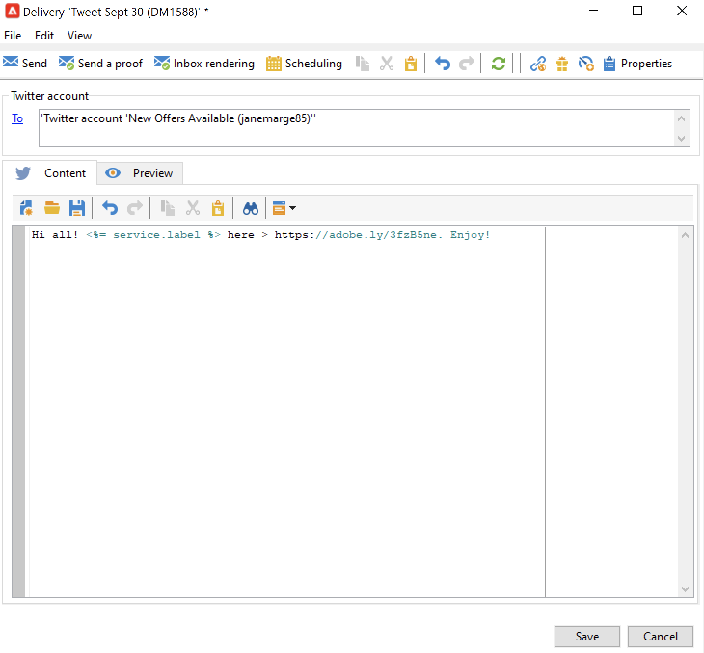

# 透過Adobe Campaign在X (Twitter)上發佈訊息 {#post-tw-messages}

Adobe Campaign隨附&#x200B;**社交行銷**&#x200B;模組，可讓您透過X （先前稱為Twitter）與客戶和潛在客戶互動。

設定整合後，您可以：

* 傳送直接訊息給您的追隨者
* 在您的X帳戶上發佈
* 透過恢復設定檔資料來收集新聯絡人，這可讓您執行目標定位行銷活動，並在可能時實施跨管道策略。 此動作需要使用者同意。

整合您的X帳戶與Adobe Campaign的設定步驟在[此頁面](../connect/ac-tw.md)中說明。

## 建立並發佈X貼文 {#publish-on-tw}

請依照下列步驟，在您的X帳戶上張貼訊息：

1. 建立X傳遞

   根據&#x200B;**[!UICONTROL Tweet (twitter)]**&#x200B;傳遞範本建立新的傳遞。

   

1. 選取主要目標

   選取您要傳送貼文的帳戶。

   

   1. 按一下&#x200B;**[!UICONTROL To]**&#x200B;連結。
   1. 按一下 **[!UICONTROL Add]** 按鈕。
   1. 選取 **[!UICONTROL A Twitter account]**。
   1. 在&#x200B;**[!UICONTROL Folder]**&#x200B;欄位中，選取包含X帳戶的服務資料夾。 然後選取您要傳送推文的X帳戶。

1. 選取校訂目標

   **[!UICONTROL Target of the proofs]**&#x200B;索引標籤可讓您定義要在最終傳遞之前用於測試傳遞的X帳戶。

   如[設定步驟](../connect/ac-tw.md#tw-test-account)所詳述，您必須建立專用於傳送校樣的私人測試X帳戶。

   >[!NOTE]
   >
   >如果您對所有傳遞使用相同的X測試帳戶，您可以將證明目標儲存在&#x200B;**[!UICONTROL Tweet]**&#x200B;傳遞範本中（透過&#x200B;**[!UICONTROL Resources > Templates > Delivery templates]**&#x200B;節點存取）。 之後，依預設會針對每個新傳遞輸入校樣目標。

1. 定義貼文的內容

   在&#x200B;**[!UICONTROL Content]**&#x200B;索引標籤中輸入您貼文的內容。

   

   >[!CAUTION]
   >
   >在X上張貼時，會有下列限制：
   >
   >* 訊息不能超過140個字元。
   >* 不支援HTML格式。
   >

1. 預覽您的貼文

   瀏覽&#x200B;**[!UICONTROL Preview]**&#x200B;索引標籤以檢查文章的轉譯。

   

   1. 按一下「**[!UICONTROL Preview]**」標籤。
   1. 按一下&#x200B;**[!UICONTROL Test personalization]**&#x200B;下拉式功能表並選取&#x200B;**[!UICONTROL Service]**。
   1. 在&#x200B;**[!UICONTROL Folder]**&#x200B;欄位中，選取包含您X帳戶的服務資料夾。

1. 傳送校樣

   在張貼推文之前，請務必傳送出版物的證明來驗證推文：您可以在私人X測試頁面上取得出版物的精確轉譯。

1. 張貼訊息

   1. 內容核准後，按一下&#x200B;**[!UICONTROL Send]**&#x200B;按鈕。
   1. 選取&#x200B;**[!UICONTROL Deliver as soon as possible]**&#x200B;並按一下&#x200B;**[!UICONTROL Analyze]**&#x200B;按鈕。
   1. 分析完成後，檢查結果。
   1. 按一下&#x200B;**[!UICONTROL Confirm delivery]**，然後按一下&#x200B;**[!UICONTROL Yes]**。

## 傳送直接訊息給追隨者 {#direct-tw-messages}

**[!UICONTROL Synchronize Twitter accounts]**&#x200B;技術工作流程會復原X位追隨者的清單，因此您可以傳送直接訊息給他們。 [了解更多](../connect/ac-tw.md#synchro-tw-accounts)

若要傳送直接訊息給您的追隨者，請遵循下列步驟：

1. 根據&#x200B;**[!UICONTROL Tweet (Direct Message)]**&#x200B;內建傳遞範本建立X傳遞。

1. 選取主要目標

   

   1. 選取&#x200B;**[!UICONTROL To]**&#x200B;連結和&#x200B;**[!UICONTROL Add]**&#x200B;按鈕。

   1. 選擇目標定位型別

      * 選取&#x200B;**[!UICONTROL Twitter subscribers]**&#x200B;以傳送直接訊息給所有追隨者。

      * 選取&#x200B;**[!UICONTROL Filter conditions]**&#x200B;以定義查詢並檢視其結果。 瞭解如何在[本節](../audiences/create-filters.md#advanced-filters)中建立篩選器。

1. 從&#x200B;**[!UICONTROL Target of the proofs]**&#x200B;索引標籤選取校訂目標：此帳戶將收到您直接郵件的校訂。

   如[設定步驟](../connect/ac-tw.md#tw-test-account)所詳述，您必須建立專用於傳送校樣的私人測試X帳戶。

   >[!NOTE]
   >
   >如果您想要將所有直接訊息校樣傳送至相同的X帳戶，您可以將校樣目標儲存在&#x200B;**[!UICONTROL Tweet (Direct Message)]**&#x200B;傳遞範本中（透過&#x200B;**[!UICONTROL Resources > Templates > Delivery templates]**&#x200B;節點存取）。

1. 在&#x200B;**[!UICONTROL Content]**&#x200B;索引標籤中輸入訊息的內容。

   

   個人化欄位的使用方式與電子郵件傳遞相同，例如，在訊息本文中新增追隨者的名稱。 若要了解更多資訊，請參閱[此區段](../send/personalize.md)。

1. 預覽您的訊息

   瀏覽&#x200B;**[!UICONTROL Preview]**&#x200B;索引標籤以檢查文章的轉譯。

   

   1. 按一下「**[!UICONTROL Preview]**」標籤。
   1. 按一下&#x200B;**[!UICONTROL Test personalization]**&#x200B;下拉式功能表並選取&#x200B;**[!UICONTROL Visitor Subscription]**。
   1. 選擇您要用來測試預覽的X帳戶。

1. 傳送校樣

   在傳送郵件之前，請確定先以[傳送證明給測試帳戶](../send/preview-and-proof.md)來驗證郵件：您之後可以在私人X帳戶上取得郵件的精確轉譯，並檢查內容與個人化。

1. 傳送直接訊息

   1. 內容核准後，按一下&#x200B;**[!UICONTROL Send]**&#x200B;按鈕。
   1. 選取&#x200B;**[!UICONTROL Deliver as soon as possible]**&#x200B;並按一下&#x200B;**[!UICONTROL Analyze]**&#x200B;按鈕。
   1. 分析完成後，檢查結果。
   1. 按一下&#x200B;**[!UICONTROL Confirm delivery]**，然後按一下&#x200B;**[!UICONTROL Yes]**。

>[!CAUTION]
>
>您無法每天傳送超過250則直接訊息。 為避免超過此臨界值，您可以分階段傳送。 如需詳細資訊，請參閱[Campaign Classic v7 文件](https://experienceleague.adobe.com/docs/campaign-classic/using/sending-messages/key-steps-when-creating-a-delivery/steps-sending-the-delivery.html#sending-using-multiple-waves){target="_blank"}。

## 存取追蹤資料 {#tw-tracking}

在內建&#x200B;**[!UICONTROL Tweet]**&#x200B;傳遞範本中，預設會啟用追蹤。

可在傳遞報告及傳遞與服務的&#x200B;**[!UICONTROL Edit > Tracking]**&#x200B;標籤中檢視追蹤資料。

追蹤設定與電子郵件傳遞的設定相同。 在 [Campaign Classic v7 文件](https://experienceleague.adobe.com/docs/campaign-classic/using/sending-messages/monitoring-deliveries/about-delivery-monitoring.html?lang=zh-Hant){target="_blank"}中進一步瞭解。

