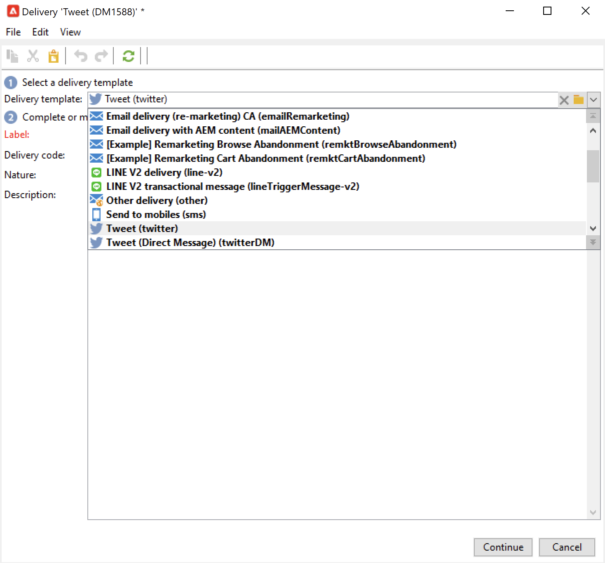
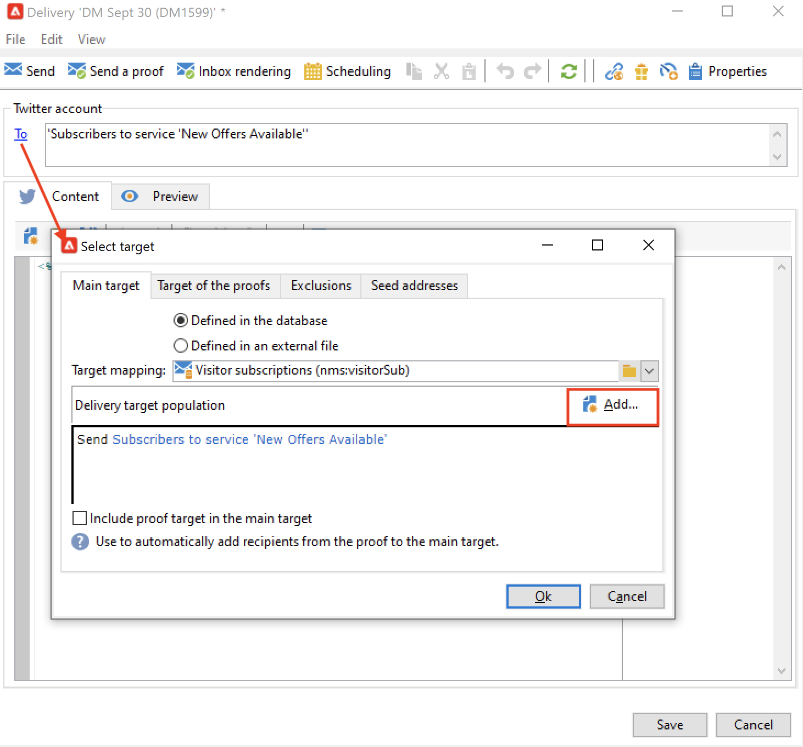

# 使用Adobe Campaign在Twitter上發佈訊息 {#post-tw-messages}

Adobe Campaign隨附 **社交行銷** 模組，可讓您透過Twitter與客戶和潛在客戶互動。

設定整合後，您可以：

* 傳送直接訊息給您的追隨者
* 在您的Twitter帳戶上張貼推文
* 透過恢復設定檔資料來收集新的聯絡人，這可讓您執行定位促銷活動，並在可能時實施跨通道策略。 此動作需要使用者同意。

如需整合Twitter帳戶與Adobe Campaign的設定步驟，請參閱 [本頁](../connect/ac-tw.md).

## 建立及發佈Twitter貼文 {#publish-on-tw}

請依照下列步驟，在您的Twitter帳戶上張貼訊息：

1. 建立Twitter傳送

   根據 **[!UICONTROL Tweet (twitter)]** 傳遞範本。

   

1. 選取主要目標

   選取您要傳送推文的帳戶。

   

   1. 按一下&#x200B;**[!UICONTROL To]**&#x200B;連結。
   1. 按一下 **[!UICONTROL Add]** 按鈕。
   1. 選取 **[!UICONTROL A Twitter account]**。
   1. 在 **[!UICONTROL Folder]** 欄位，選取包含Twitter帳戶的服務資料夾。 然後選取您要將推文傳送至的Twitter帳戶。

1. 選取校樣目標

   此 **[!UICONTROL Target of the proofs]** 標籤可讓您定義Twitter帳戶，以在最終傳送之前測試傳送。

   如 [配置步驟](../connect/ac-tw.md#tw-test-account)，您必須建立專用於傳送校樣的私人測試Twitter帳戶。

   >[!NOTE]
   >
   >如果您的所有傳送都使用相同的Twitter測試帳戶，您可以在 **[!UICONTROL Tweet]** 傳遞範本，透過 **[!UICONTROL Resources > Templates > Delivery templates]** 節點。 之後，系統會預設為每個新傳送輸入校樣目標。

1. 定義貼文的內容

   在 **[!UICONTROL Content]** 標籤。

   

   >[!CAUTION]
   >
   >在Twitter上張貼時，會套用限制：
   >
   >* 訊息不能超過140個字元。
   >* 不支援HTML格式。

1. 預覽您的貼文

   瀏覽 **[!UICONTROL Preview]** 標籤來檢查貼文的呈現。

   

   1. 按一下 **[!UICONTROL Preview]** 標籤。
   1. 按一下 **[!UICONTROL Test personalization]** 下拉式功能表，然後選取 **[!UICONTROL Service]**.
   1. 在 **[!UICONTROL Folder]** 欄位，選取包含您Twitter帳戶的服務資料夾。

1. 傳送證明

   張貼推文之前，請務必傳送發佈證明以驗證推文：然後，您就可以在私人Twitter測試頁面上取得出版物的完全轉譯。

1. 張貼訊息

   1. 內容核准後，按一下 **[!UICONTROL Send]** 按鈕。
   1. 選擇 **[!UICONTROL Deliver as soon as possible]** 並按一下 **[!UICONTROL Analyze]** 按鈕。
   1. 分析完成後，檢查結果。
   1. 按一下 **[!UICONTROL Confirm delivery]**，然後按一下 **[!UICONTROL Yes]**.

## 傳送直接訊息給追隨者 {#direct-tw-messages}

此 **[!UICONTROL Synchronize Twitter accounts]** 技術工作流程會復原Twitter追隨者的清單，以便您傳送直接訊息。 [了解更多](../connect/ac-tw.md#synchro-tw-accounts)

若要傳送直接訊息給您的追隨者，請遵循下列步驟：

1. 根據以下項目建立Twitter傳送： **[!UICONTROL Tweet (Direct Message)]** 內建的傳遞範本。

1. 選取主要目標

   

   1. 選取 **[!UICONTROL To]** 連結和 **[!UICONTROL Add]** 按鈕。

   1. 選擇目標類型

      * 選擇 **[!UICONTROL Twitter subscribers]** 向所有追隨者發送直接消息。

      * 選擇 **[!UICONTROL Filter conditions]** 定義查詢並查看其結果。 了解如何在 [本節](../audiences/create-filters.md#advanced-filters).

1. 從 **[!UICONTROL Target of the proofs]** 標籤：此帳戶會收到您直接訊息的證明。

   如 [配置步驟](../connect/ac-tw.md#tw-test-account)，您必須建立專用於傳送校樣的私人測試Twitter帳戶。

   >[!NOTE]
   >
   >如果您想要將所有直接訊息校樣傳送至相同的Twitter帳戶，可以在 **[!UICONTROL Tweet (Direct Message)]** 傳遞範本，透過 **[!UICONTROL Resources > Templates > Delivery templates]** 節點。

1. 在 **[!UICONTROL Content]** 標籤。

   

   個人化欄位的使用方式與電子郵件傳送相同，例如在訊息內文中新增追隨者的名稱。 深入了解 [本節](../start/create-message.md#personalization).

1. 預覽訊息

   瀏覽 **[!UICONTROL Preview]** 標籤來檢查貼文的呈現。

   

   1. 按一下 **[!UICONTROL Preview]** 標籤。
   1. 按一下 **[!UICONTROL Test personalization]** 下拉式功能表，然後選取 **[!UICONTROL Visitor Subscription]**.
   1. 選擇您要用來測試預覽的Twitter帳戶。

1. 傳送證明

   傳送訊息之前，請務必透過傳送校樣至測試帳戶來驗證訊息：然後，您就可以在私人Twitter帳戶上取得完全轉譯的訊息，並檢查內容和個人化。

    [了解驗證傳送的關鍵步驟](https://experienceleague.adobe.com/docs/campaign-classic/using/sending-messages/key-steps-when-creating-a-delivery/steps-validating-the-delivery.html?lang=zh-Hant){target=&quot;_blank&quot;}

1. 傳送直接訊息

   1. 內容核准後，按一下 **[!UICONTROL Send]** 按鈕。
   1. 選擇 **[!UICONTROL Deliver as soon as possible]** 並按一下 **[!UICONTROL Analyze]** 按鈕。
   1. 分析完成後，檢查結果。
   1. 按一下 **[!UICONTROL Confirm delivery]**，然後按一下 **[!UICONTROL Yes]**.

>[!CAUTION]
>
>您每天不能傳送超過250個直接訊息。 為避免超過此臨界值，您可以分批傳送。 如需詳細資訊，請參閱 [Campaign Classic v7 文件](https://experienceleague.adobe.com/docs/campaign-classic/using/sending-messages/key-steps-when-creating-a-delivery/steps-sending-the-delivery.html?lang=en#sending-using-multiple-waves){target=&quot;_blank&quot;}。

## 存取追蹤資料 {#tw-tracking}

內建 **[!UICONTROL Tweet]** 傳送範本，預設會啟用追蹤。

追蹤資料可在傳送報表和 **[!UICONTROL Edit > Tracking]** 標籤。

追蹤設定與電子郵件傳送的相同。 在 [Campaign Classic v7 文件](https://experienceleague.adobe.com/docs/campaign-classic/using/sending-messages/monitoring-deliveries/about-delivery-monitoring.html?lang=zh-Hant){target=&quot;_blank&quot;} 深入瞭解。

