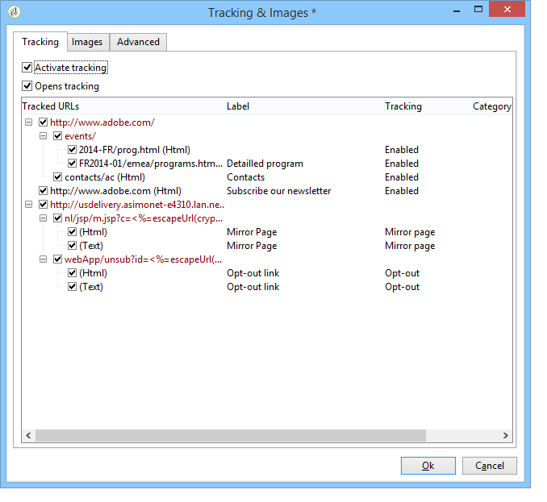
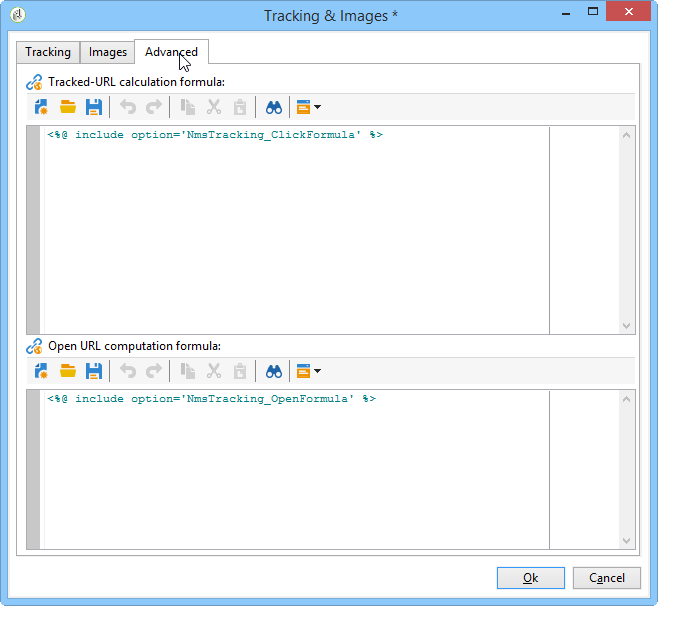

# 設定 URL 追蹤選項 {#personalizing-url-tracking}

進階郵件追蹤設定可透過傳遞助理工具列中的&#x200B;**[!UICONTROL Tracking & Images]**&#x200B;圖示存取。

>[!NOTE]
>
>電子郵件中的影像管理也在此視窗中設定。 請參閱[新增影像](defining-the-email-content.md#adding-images)。

您可以設定追蹤選項：

* 為所有訊息啟用/停用URL追蹤。

  >[!CAUTION]
  >
  >未在傳遞上啟用追蹤（亦即未選取&#x200B;**[!UICONTROL Activate tracking]**&#x200B;選項）時，與追蹤相關的報表和資料無法使用：開啟、快速點選和追蹤的URL報表不會顯示任何資料，且不會為此傳遞顯示&#x200B;**[!UICONTROL Tracking logs]**&#x200B;個標籤。

* 啟用/停用訊息開啟的追蹤。

追蹤的URL會以樹狀形式列在中央視窗中。

您可以個別針對每個訊息URL啟用或停用追蹤。 如需詳細資訊，請參閱[本章節](tracked-links.md)。

**[!UICONTROL Advanced]**&#x200B;索引標籤可讓您個人化追蹤的URL與開頭URL的計算公式。

>[!CAUTION]
>
>此標籤中的設定只能由專家使用者修改。

