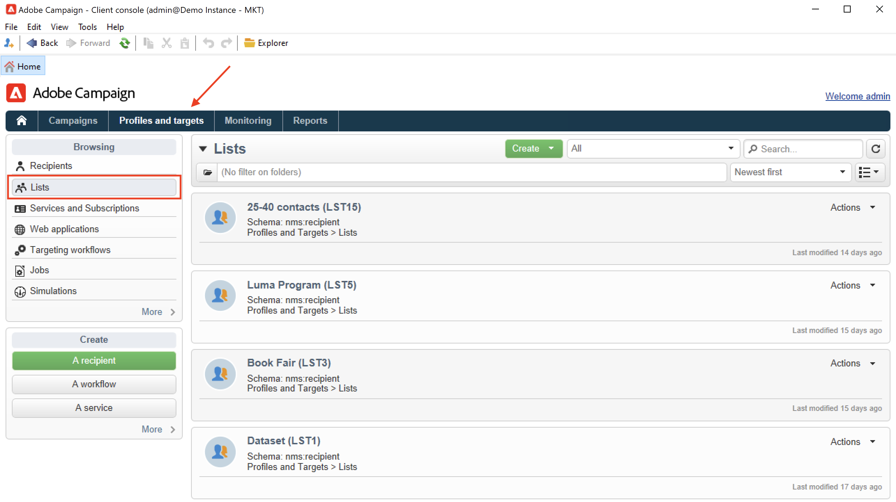

# 探索使用者介面 {#ui-client-console}

您可以透過其使用者端主控台或網頁使用者介面存取Adobe Campaign。 您也可以使用API來管理資料，並在Campaign平台中執行工作。

>[!CAUTION]
>
>本檔案著重於Campaign使用者端主控台使用情形。 如果您使用Campaign網頁使用者介面，請參閱[本檔案](https://experienceleague.adobe.com/docs/campaign-web/v8/campaign-web-home.html?lang=zh-Hant){target="_blank"}。

* **使用者端主控台** - Campaign使用者端主控台是原生應用程式，會透過標準網際網路通訊協定(例如SOAP和HTTP)與Adobe Campaign應用程式伺服器通訊。 Campaign使用者端主控台會集中所有功能和設定，且需要最少的頻寬，因為它依賴本機快取。 Campaign使用者端主控台專為輕鬆部署而設計，可從網際網路瀏覽器部署、自動更新，且不需要任何特定網路設定，因為它只會產生HTTP(S)流量。 [了解更多](#ui-access)

  在[本節](../start/connect.md)中瞭解如何安裝和設定Campaign使用者端主控台。

* **網頁使用者介面** — 作為Campaign v8使用者，自v8.6.1發行版本開始，您現在可以透過中央Adobe Experience Cloud使用者介面存取網頁環境。 接著，您就可以從網頁瀏覽器連線至Adobe Campaign。 此新介面可讓您建立、管理及執行重要的行銷動作。 不過，並非所有Campaign功能都可使用。 [了解更多](#ac-web-ui)。

  >[!AVAILABILITY]
  >
  >Campaign Web使用者介面僅適用於使用Adobe ID連線至Adobe Campaign的使用者。 深入瞭解[AdobeIdentity Management系統(IMS)](https://helpx.adobe.com/tw/enterprise/using/identity.html){target="_blank"}。
  >

* **網頁存取** - Adobe Campaign網頁存取功能可讓您使用HTML使用者介面，透過網頁瀏覽器存取Campaign功能的子集。 使用此Web介面存取報告、控制和驗證訊息、存取監控儀表板等。  在本節](../start/connect.md#web-access)中進一步瞭解Campaign網頁存取[。

* **API** — 若要解決更多使用案例，可以使用透過SOAP通訊協定公開的網站服務API，從外部應用程式呼叫系統。 在此頁面](../dev/api.md)中進一步瞭解Campaign API [。

## 使用使用者端主控台 {#ui-access}

Campaign使用者端主控台是原生應用程式，可透過標準網際網路通訊協定(例如SOAP和HTTP)與Adobe Campaign應用程式伺服器通訊。 Campaign使用者端主控台會集中所有功能和設定，且需要最少的頻寬，因為它依賴本機快取。 Campaign使用者端主控台專為輕鬆部署而設計，可從網際網路瀏覽器部署、自動更新，且不需要任何特定網路設定，因為它只會產生HTTP(S)流量。  [進一步瞭解Campaign使用者端主控台](../start/connect.md)。 您可以從使用者端主控台首頁的專用卡片切換至Campaign Web使用者介面。

>[!NOTE]
>
>如果未顯示新的存取卡，請確定在您的Adobe Experience Cloud外部帳戶中，下列欄位不是空的： **伺服器**、**租使用者**、**回撥伺服器**&#x200B;以及&#x200B;**關聯標籤**。

您也可以使用網頁瀏覽器來存取Campaign。 在這種情況下，僅可使用Campaign功能的子集。 [了解更多](#web-browser)

### 瀏覽介面 {#ui-browse}

連線至Campaign使用者端主控台後，即可存取首頁。 瀏覽連結以存取功能。 介面中可用的功能集取決於您的選項和許可權。

從首頁的中央區段，使用連結來存取Campaign說明教材、社群和支援網站。 使用中央卡片來瀏覽新的Campaign Web使用者介面和Campaign控制面板。

瀏覽上方區段中的標籤，以存取Campaign主要功能：

>[!NOTE]
>
>您可存取的核心功能清單取決於您的許可權和實施。

對於每個功能，您都可以存取「**[!UICONTROL Browsing]**」區段中的一組主要功能。 **[!UICONTROL More]**&#x200B;連結可讓您存取所有其他元件。

例如，瀏覽至&#x200B;**[!UICONTROL Profiles and targets]**&#x200B;標籤時，您可以存取收件者清單、訂閱服務、現有的鎖定目標工作流程，以及建立所有這些元件的捷徑。

當您在畫面中選取元素時，該元素會載入新的索引標籤中，以便您輕鬆瀏覽內容。

### 建立元素 {#create-an-element}

使用畫面左側&#x200B;**[!UICONTROL Create]**&#x200B;區段中的捷徑來新增元素。 您也可以使用清單上方的&#x200B;**[!UICONTROL Create]**&#x200B;按鈕，將新元素新增至目前清單。

例如，在傳遞頁面上，使用&#x200B;**[!UICONTROL Create]**&#x200B;按鈕來建立新傳遞。

<!--
## Use a web browser {#web-browser}

You can also access a subset of Campaign capabilities through the a web browser.

The web access interface is similar to the console interface. From a browser, you can use the same navigation and display features as in the console, but you can perform only a reduced set of actions on campaigns. For example, you can view and cancel campaigns, but you cannot modify campaigns. 

[Learn more about Campaign web access](../start/connect.md#web-access).-->

### 存取Campaign總管 {#ac-explorer-ui}

瀏覽Campaign Explorer以存取所有Adobe Campaign功能和設定。

此工作區可讓您存取瀏覽器樹狀結構以瀏覽所有功能和選項。

* 左側區段顯示Campaign Explorer樹狀結構，並讓您根據許可權瀏覽執行個體的所有元件和設定。 您可以新增和自訂資料夾，如[此頁面](../audiences/folders-and-views.md)中所述。

* 上半部分顯示目前資料夾中的記錄清單。 這些清單皆可完全自訂。 [了解更多](../config/ui-settings.md)

* 下方區段會顯示所選記錄的詳細資訊。

## Campaign Web使用者介面 {#ac-web-ui}

自8.6.1版開始，身為Campaign v8使用者端主控台使用者，您現在可以透過Adobe Experience Cloud中央使用者介面存取網頁環境。 Experience Cloud 是 Adobe 的整合式數位行銷應用程式、產品和服務系列。您可以從其直覺式介面，快速存取雲端應用程式、產品功能和服務。

>[!AVAILABILITY]
>
>Campaign Web使用者介面僅適用於使用Adobe ID連線至Adobe Campaign的使用者。 深入瞭解[AdobeIdentity Management系統(IMS)](https://helpx.adobe.com/tw/enterprise/using/identity.html){target="_blank"}。
>

在[本檔案](https://experienceleague.adobe.com/docs/campaign-web/v8/campaign-web-home.html?lang=zh-Hant){target="_blank"}中進一步瞭解新的Campaign網頁使用者介面。 您也可以瀏覽Campaign Web使用者介面檔案中的專屬[常見問題頁面](https://experienceleague.adobe.com/en/docs/campaign-web/v8/start/faq){target="_blank"}。

其他和進階功能、組態和設定只能在使用者端主控台中使用。 在Campaign Web使用者介面檔案](https://experienceleague.adobe.com/docs/campaign-web/v8/start/capability-matrix.html?lang=zh-Hant){target="_blank"}中進一步瞭解兩種使用者介面[中可用的功能。

## 支援的語言 {#languages}

支援的語言取決於使用者介面。

* 對於Campaign v8使用者端主控台介面，支援的語言為：

   * 英文 (英國)
   * 英文 (美國)
   * 法文
   * 德文
   * 日文

  >[!CAUTION]
  >
  >語言是在安裝過程中選取的，之後無法變更。

* 若為Campaign Web使用者介面支援的語言，[請參考此頁面](https://experienceleague.adobe.com/docs/campaign-web/v8/start/connect-to-campaign.html#language-pref){target="_blank"}。

語言會影響日期和時間格式。

英文 (US) 和英文 (EN) 的主要差異如下：

<table> 
 <thead> 
  <tr> 
   <th> 格式  </th> 
   <th> 英文（美國）  </th> 
   <th> 英文(EN)  </th> 
  </tr> 
 </thead> 
 <tbody> 
  <tr> 
   <td> 日期  </td> 
   <td> 星期從星期日開始  </td> 
   <td> 星期從星期一 開始 </td> 
  </tr> 
  <tr> 
   <td> 簡短日期  </td> 
   <td> 
%2M/%2D/%4Y

<strong>範例：09/25/2018</strong>
 </td> 
   <td> 
%2D/%2M/%4Y

<strong>範例：25/09/2018</strong>
 </td> 
  </tr> 
  <tr> 
   <td> 具有時間 的簡短日期 </td> 
   <td> 
%2M/%2D/%4Y %I:%2N:%2S %P

<strong>例如： 2018年9月25日10:47:25下午</strong>
 </td> 
   <td> 
%2D/%2M/%4Y %2H:%2N:%2S

<strong>例如： 2018年9月25日22:47:25</strong>
 </td> 
  </tr> 
 </tbody> 
</table>
