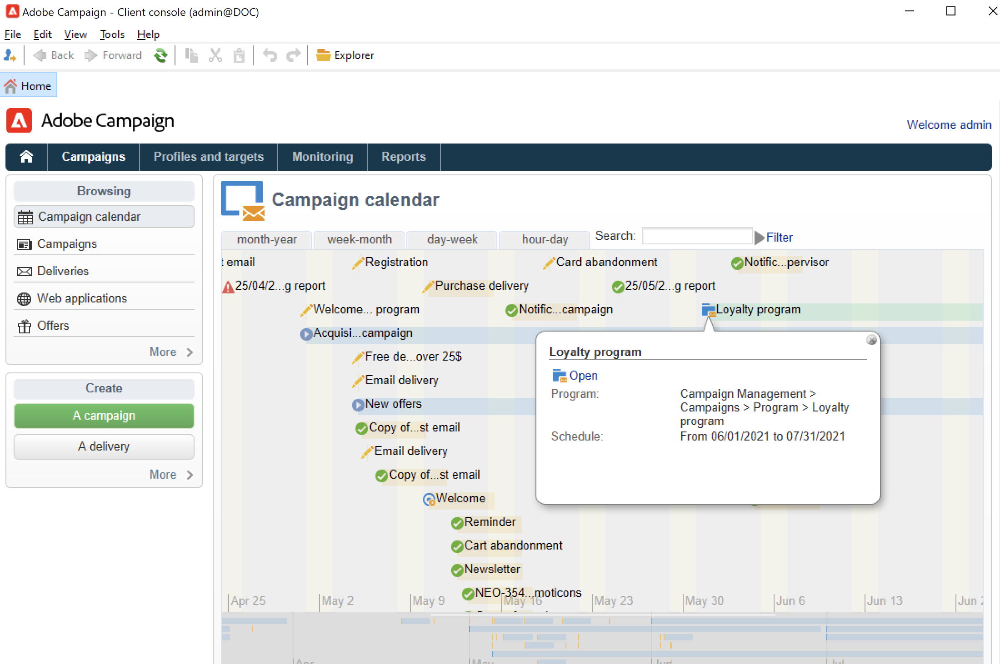

# 開始使用行銷活動{#gs-ac-campaigns}

Adobe Campaign 提供一套解決方案，幫助您跨所有線上及離線頻道個人化並傳遞行銷活動。 您可以建立、設定、執行及分析行銷活動。 所有行銷活動都可從統一的控制中心進行管理。 在此章節中探索如何瀏覽及建立行銷活動。

行銷活動包括動作 (傳送) 和流程 (匯入或擷取檔案)，以及資源 (行銷文件、傳遞大綱)。 它們會用於行銷活動。 行銷活動是方案的一部分，而方案則包含在行銷活動計畫中。

## 跨頻道行銷活動策劃{#cross-channel-orchestration}

Adobe Campaign 可讓您在多個頻道上設計及編排有針對性的個人化行銷活動：電子郵件、直接行銷郵件、SMS、推播通知等。單一介面可為您提供排程、編排、設定、個人化、自動化、執行和評估所有行銷活動和通訊所需的所有功能。

### 核心概念{#ac-core-concepts}

在開始實施行銷活動之前，您必須熟悉下列概念：

* **行銷活動**：行銷活動會集中與行銷活動相關的所有元素：傳送、目標定位規則、成本、匯出檔案、相關檔案等。每個行銷活動都會附加至一個方案。

* **方案**：方案可讓您定義日曆期間的行銷動作：啟動、遊說、忠誠度等。每個方案都包含連結至日曆的行銷活動，提供整體檢視。

* **計劃**：行銷計劃可包含多個方案。它連結至日曆期間、已分配預算，也可連結至文件和目標。

* **行銷活動工作流程**：行銷活動工作流程包含建立行銷活動邏輯的活動。使用行銷活動工作流程來定義對象並為所有可用頻道建立傳送。

* **循環行銷活動**：循環行銷活動是從定義要執行的工作流程範本和執行排程的特定範本建立。

* **週期性行銷活動**：週期性行銷活動是根據其範本的執行排程自動建立的行銷活動。

## 行銷活動工作區{#ac-workspace}

Adobe Campaign 可讓您從統一的控制中心建立、設定、執行和分析所有行銷活動。

在[此章節](https://experienceleague.adobe.com/docs/campaign/automation/campaign-orchestration/set-up-campaigns.html?lang=zh-Hant)探索如何存取及實施行銷活動。

## 開始的關鍵步驟{#gs-ac-start}

建立跨頻道行銷活動的主要步驟為：

1. **規劃及設計行銷方案與行銷活動**

   定義層次結構和計畫、設定預算、加入資源、選擇運算子。

    在[此頁面](https://experienceleague.adobe.com/docs/campaign/automation/campaign-orchestration/marketing-campaign-create.html?lang=zh-Hant)瞭解如何建立行銷計劃並設定行銷活動。

   所有行銷活動都以儲存主要設定和功能的範本為基礎。 提供內建範本，以建立尚未定義特定設定的行銷活動。 您可以建立和設定行銷活動範本，然後從這些範本建立行銷活動。

   在[本頁面](https://experienceleague.adobe.com/docs/campaign/automation/campaign-orchestration/marketing-campaign-templates.html?lang=zh-Hant)瞭解如何使用行銷活動範本。

   在[本頁面](https://experienceleague.adobe.com/docs/campaign/automation/campaign-orchestration/recurring-periodic-campaigns.html?lang=zh-Hant)瞭解週期性行銷活動以及如何進行設定。

1. **定義對象**

   您可以在工作流程中建立對象，或選取現有群組，例如收件者清單、電子報訂閱者、先前傳遞的收件者或任何篩選條件。

   

   在[此頁面](https://experienceleague.adobe.com/docs/campaign/automation/campaign-orchestration/marketing-campaign-target.html?lang=zh-Hant)瞭解如何定義訊息的對象。

1. **建立傳遞**

   選取頻道、定義訊息內容並開始傳遞。

   

   在[此頁面](https://experienceleague.adobe.com/docs/campaign/automation/campaign-orchestration/marketing-campaign-deliveries.html?lang=zh-Hant)瞭解如何建立及開始行銷活動傳遞。

   您可以為行銷活動跟各種檔案建立關聯：報告、照片、網頁、圖表等。

   在[此頁面](https://experienceleague.adobe.com/docs/campaign/automation/campaign-orchestration/marketing-campaign-assets.html?lang=zh-Hant)深入瞭解相關文件。

1. **設定核准流程**

   Adobe Campaign 可讓您針對行銷活動的主要階段設定協作核准流程。 您可以針對每個行銷活動，核准傳遞目標、內容和成本。可以透過電子郵件形式通知負責核准的 Adobe Campaign 操作者，然後他們可透過主控台或網路連線核准或拒絕核准。

   在[此頁面](https://experienceleague.adobe.com/docs/campaign/automation/campaign-orchestration/marketing-campaign-approval.html?html?lang=zh-Hant#campaign-orchestration)瞭解如何設定及管理核准。

## 分散式行銷附加內容{#distributed-marketing-add-on}

Adobe Campaign 提供&#x200B;**分散式行銷**，為中心實體之間 (總部、行銷部門等) 實施合作活動的附加內容 和地方實體 (商店、地區機構等)。 此協作基於共用工作區，稱為&#x200B;**[!UICONTROL List of campaign packages]**，由中心實體設計行銷活動範本給本地實體。

>[!NOTE]
>
>此功能可從 Campaign v8.3 開始使用。若要檢查您的版本，請參閱[此章節](compatibility-matrix.md#how-to-check-your-campaign-version-and-buildversion)

在[此頁面](https://experienceleague.adobe.com/docs/campaign/automation/distributed-marketing/about-distributed-marketing.html?lang=zh-Hant)瞭解如何設定並利用 Campaign 分散式行銷功能。

## 回應管理附加內容{#response-manager-add-on}

Adobe Campaign 提供 **回應管理**&#x200B;附加功能，讓您可以衡量行銷活動的成功和盈利能力，或為跨通訊頻道 (例如：電子郵件、行動裝置、直接郵件等) 提供建議。

>[!NOTE]
>
>此功能可從 Campaign v8.3 開始使用。若要檢查您的版本，請參閱[此章節](compatibility-matrix.md#how-to-check-your-campaign-version-and-buildversion)

瞭解如何在 [Campaign Classic v7 文件](https://experienceleague.adobe.com/docs/campaign-classic/using/response-manager/about-response-manager.html?lang=zh-Hant){target=&quot;_blank&quot;} 中設定和使用行銷活動回應管理員

